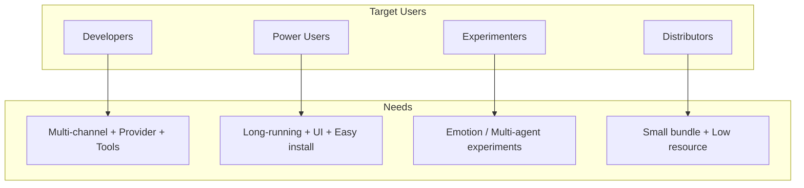
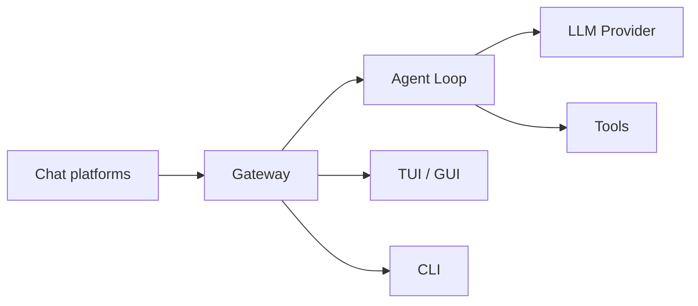

# Agent Diva


QQ GROUP:788599177
### The name "agent-diva"

Inspired by [Vivy: Fluorite Eye's Song](https://en.wikipedia.org/wiki/Vivy:_Fluorite_Eye%27s_Song): **Agent** — the executor/tool before self-awareness; **Diva** — the diva at the center of the stage. Agent Diva is the foundational piece of Project Vivy, an experimental platform toward an AI operating system.

A lightweight, extensible personal AI assistant framework written in Rust.
This repository contains a multi-crate workspace that powers the agent core,
provider integrations, channel adapters, built-in tools, and the CLI.

[](https://opensource.org/licenses/MIT)

Read this in other languages: [简体中文](README.zh-CN.md)

## What is Agent Diva?

Agent Diva is a **self-hosted gateway** that connects your favorite chat apps (Telegram, Discord, Slack, WhatsApp, Feishu, DingTalk, etc.) to AI assistants. Run a Gateway process on your machine or server, and it becomes the bridge between chat platforms and LLMs.

If you know [nanobot](https://github.com/HKUDS/nanobot), think of Agent Diva as **nanobot's core philosophy + Rust rewrite + full Pro treatment** — the same minimal agent-loop idea, but with production-grade engineering, complete UI (CLI, TUI, GUI), and a focus on easy install, run, and maintain.

## Who is Agent Diva for?

| Role | Typical needs |
|------|---------------|
| **Developers** | Multi-channel + multi-Provider + tool system for daily assistant use, without building from scratch |
| **Power users** | Familiar with nanobot/openclaw; want long-running, UI-ready, install-and-go |
| **Experimenters** | Interested in emotion systems, multi-agent coordination; want a ready platform to experiment |
| **Distributors** | Care about bundle size, resource usage, and teammate experience after sharing |



## How it works



Gateway is the single source of truth for sessions, routing, and channel connections. Messages flow from channels into the message bus, through the Agent Loop (which calls LLMs and tools), and back to the appropriate channel.

## Why Agent Diva

- Fast startup and low resource usage.
- Modular architecture (swap channels, providers, tools).
- First-class CLI for local workflows and automation.
- Durable memory and session management.
- Skills system for adding capabilities via Markdown.

## Workspace layout

```
agent-diva/
|-- agent-diva-core/       # Shared config, memory/session, cron, heartbeat, event bus
|-- agent-diva-agent/      # Agent loop, context assembly, skill/subagent flow
|-- agent-diva-providers/  # LLM/transcription provider abstractions and implementations
|-- agent-diva-channels/   # Channel adapters (Slack, Discord, Telegram, Email, QQ, Matrix, etc.)
|-- agent-diva-tools/      # Built-in tools (filesystem, shell, web, cron, spawn)
|-- agent-diva-cli/        # User-facing CLI entrypoint
|-- agent-diva-migration/  # Migration utility from earlier versions
|-- agent-diva-gui/        # Optional GUI (if enabled in your build)
`-- agent-diva-manager/    # API server for remote management
```

## Requirements

- Rust 1.70+ (install via rustup)
- Optional: `just` for convenient workspace commands

## Quick start

**macOS / Linux (from source)**

```bash
git clone https://github.com/ProjectViVy/agent-diva.git
cd agent-diva
just build
just install
```

Or with cargo directly:

```bash
cargo build --all
cargo install --path agent-diva-cli
```

**Initialize configuration**

```bash
agent-diva onboard
```

Onboarding configures base settings, creates the workspace, and optionally sets up Provider and Channel. Add at least one Provider `apiKey` in `~/.agent-diva/config.json`, then start chatting:

```bash
agent-diva tui
```

No Channel configuration is required for local TUI or GUI chat.

## Configuration

Default config file: `~/.agent-diva/config.json`

**Minimal config** (one Provider is enough for TUI/CLI chat):

```json
{
  "providers": {
    "openrouter": {
      "apiKey": "sk-or-v1-xxxx"
    }
  },
  "agents": {
    "defaults": {
      "provider": "openrouter",
      "model": "anthropic/claude-sonnet-4"
    }
  }
}
```

When connecting to native endpoints (e.g. DeepSeek), use raw model IDs like `deepseek-chat` — do not add `provider/model` prefixes.

**Primary CLI entrypoints:**

```bash
# Initialize or refresh config + workspace templates
agent-diva onboard
agent-diva config refresh

# Inspect resolved instance paths
agent-diva config path

# Validate or diagnose a specific instance
agent-diva --config ~/.agent-diva/config.json config validate
agent-diva --config ~/.agent-diva/config.json config doctor
```

Environment variable overrides are supported (both structured and aliases). For
example:

```
AGENT_DIVA__AGENTS__DEFAULTS__MODEL=...
OPENAI_API_KEY=...
ANTHROPIC_API_KEY=...
```

### Channel Configuration

**DingTalk**:
Configure `client_id` and `client_secret` in `config.json` or via environment variables.
Ensure Stream Mode is enabled in DingTalk Developer Console.

**Discord**:
Configure `token`, `gateway_url` (optional), and `intents`.
Ensure the bot is invited to the server and has appropriate permissions.

## Usage

```bash
# Start the gateway (agents + enabled channels)
agent-diva gateway run

# Target an explicit config file / instance
agent-diva --config ~/.agent-diva/config.json status --json
agent-diva --config ~/.agent-diva/config.json agent --message "Hello from this instance"

# Send a single message
agent-diva agent --message "Hello, Agent Diva!"

# Launch interactive TUI
agent-diva tui

# Check status
agent-diva status

# Channel status / readiness
agent-diva channels status
```

### Skills

- Workspace skills: `~/.agent-diva/workspace/skills/<skill-name>/SKILL.md`
- Built-in skills: `agent-diva/skills/<skill-name>/SKILL.md`
- Priority: workspace skills override built-in skills with the same name.

### Scheduled tasks (cron)

`agent-diva gateway run` now runs scheduled jobs automatically. The legacy `agent-diva gateway` form is still accepted as a compatibility alias. You can manage and run jobs from CLI:

```bash
# Add a recurring job
agent-diva cron add --name "daily" --message "standup reminder" --cron-expr "0 9 * * 1-5" --timezone "America/New_York" --deliver --channel telegram --to 123456

# List jobs
agent-diva cron list

# Manually trigger a job
agent-diva cron run <job_id> --force
```

## GUI

Agent Diva includes an optional desktop GUI built with Tauri + Vue 3.

### Prerequisites

- Node.js v18+
- Rust (latest stable)
- pnpm (recommended) or npm

### Run the GUI

```bash
cd agent-diva-gui
pnpm install
pnpm tauri dev
```

### Build for production

```bash
cd agent-diva-gui
pnpm tauri build
```

The built binary will be in `agent-diva-gui/src-tauri/target/release/`.

### Features

- Real-time streaming chat with the agent
- Tool call visualization (input args + results)
- Provider management (API keys, base URLs, model selection)
- Channel configuration (Telegram, Discord, DingTalk, Feishu, WhatsApp, Email, Slack, QQ, Matrix, Neuro-Link)
- Language switching (English / Chinese)

### External Hook

The GUI listens on port `3000` after startup. Send messages from external tools:

```bash
curl -X POST http://localhost:3000/api/hook/message \
  -H "Content-Type: application/json" \
  -d '{"content": "Hello from external tool!"}'
```

## Development

Common commands (prefer `just` when available):

```bash
# List available recipes
just

# Format, lint, and test
just ci

# Run all tests
just test
```

Without `just`:

```bash
cargo fmt --all
cargo clippy --all -- -D warnings
cargo test --all
```

## Documentation

- **Full docs** (Fumadocs): run `pnpm dev` in `.workspace/agent-diva-docs` for local docs, or see the [docs content](.workspace/agent-diva-docs/content/docs/) for getting started, channels, providers, tools, FAQ, and more
- User Guide: `docs/userguide.md`
- Architecture: `docs/dev/architecture.md`
- Development: `docs/dev/development.md`
- Migration: `docs/dev/migration.md`

## Contributing

See `CONTRIBUTING.md` for guidelines. Please keep PRs focused and run `just ci`
before submitting.

## License

MIT. See `LICENSE`.

## Acknowledgements

This Rust workspace is a reimplementation of the original Agent Diva project.


