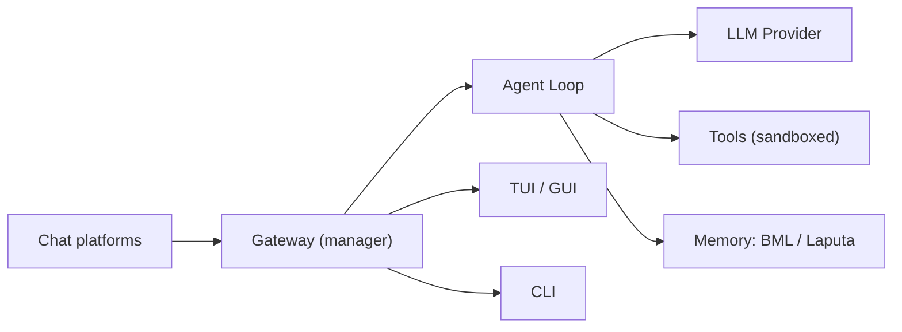

# Agent Diva


QQ GROUP: 788599177

### The name "agent-diva"

Inspired by [Vivy: Fluorite Eye's Song](https://en.wikipedia.org/wiki/Vivy:_Fluorite_Eye%27s_Song): **Agent** — the executor/tool before self-awareness; **Diva** — the diva at the center of the stage. Agent Diva is the foundational piece of Project Vivy, an experimental platform toward an AI operating system.

A lightweight, extensible personal AI assistant framework written in Rust.
This repository contains a multi-crate workspace covering the agent core,
provider integrations, channel adapters, built-in tools, memory and persona
governance, sandboxed execution, the CLI, and a Tauri desktop GUI.

[](https://opensource.org/licenses/MIT)

Read this in other languages: [简体中文](README.zh-CN.md)

## What is Agent Diva?

Agent Diva is a **self-hosted personal AI gateway** that connects your
favorite chat apps (Telegram, Discord, QQ, DingTalk, Feishu, Email, and more)
to AI assistants. Run the Gateway process on your machine or server, and it
becomes the bridge between chat platforms and LLMs — with durable memory,
governed persona evolution, skills, scheduled jobs, and human-in-the-loop
approval built in.

If you know [nanobot](https://github.com/HKUDS/nanobot), think of Agent Diva
as **nanobot's core philosophy + Rust rewrite + full Pro treatment** — the
same minimal agent-loop idea, but with production-grade engineering, complete
UI (CLI, TUI, GUI), and a focus on easy install, run, and maintain.

## Who is Agent Diva for?

| Role | Typical needs |
|------|---------------|
| **Developers** | Multi-channel + multi-Provider + tool system for daily assistant use, without building from scratch |
| **Power users** | Familiar with nanobot/openclaw; want long-running, UI-ready, install-and-go |
| **Experimenters** | Interested in persona/memory governance, multi-agent coordination; want a ready platform to experiment |
| **Distributors** | Care about bundle size, resource usage, and teammate experience after sharing |

## How it works


```mermaid
flowchart LR
  A["Chat platforms"] --> B["Gateway (manager)"]
  B --> C["Agent Loop"]
  C --> D["LLM Provider"]
  C --> E["Tools (sandboxed)"]
  C --> M["Memory: BML / Laputa"]
  B --> F["TUI / GUI"]
  B --> G["CLI"]
```

The Gateway is the single source of truth for sessions, routing, and channel
connections. Messages flow from channels into the message bus, through the
Agent Loop (which calls LLMs and tools), and back to the appropriate channel.

## Feature highlights

- **Multi-channel gateway** — Telegram, Discord, QQ, DingTalk, Feishu, and
  Email are enabled by default; retired adapters (Slack, WhatsApp, Matrix,
  IRC, Mattermost, Nextcloud Talk) remain available behind opt-in Cargo
  features.
- **45+ built-in provider presets** — OpenRouter, DeepSeek, OpenAI,
  Anthropic, Gemini, Zhipu, Moonshot, StepFun, Doubao, SiliconFlow, Groq,
  Ollama (local), and many more, plus fully custom OpenAI-compatible
  endpoints and speech transcription.
- **Layered memory (BML + Laputa)** — a profile-local typed SQLite + FTS5
  store is the single memory authority; the Laputa governance layer sits on
  top with proposals, governed apply, rollback, audit, and a Frozen Core
  persona baseline.
- **Persona & evolution** — Persona workspace with Markdown authority;
  AutoDream runs as a proposal generator (never writes persona directly),
  and the Evolution surface in the GUI reviews and applies governed changes.
- **Skills** — load capabilities from Markdown (`SKILL.md`), with a GUI
  marketplace backed by the skills.sh directory.
- **Sandbox + HITL approvals** — sandbox policy, guardian approvals, and a
  durable approval center you can review from CLI (`agent-diva approvals`)
  or the GUI.
- **Scheduling & automation** — cron jobs run inside the gateway with
  channel delivery; external HTTP hook for message injection.
- **Complete UI trio** — CLI for automation, TUI for terminal chat, Tauri
  desktop GUI for everything else.

## Workspace layout

```
agent-diva/
|-- agent-diva-core/       # Shared config, memory/session, cron, heartbeat, event bus
|-- agent-diva-agent/      # Agent loop, context assembly, skill/subagent flow
|-- agent-diva-providers/  # LLM/transcription provider abstractions and presets
|-- agent-diva-channels/   # Channel adapters (Telegram, Discord, QQ, DingTalk, Feishu, Email, ...)
|-- agent-diva-tools/      # Built-in tools (filesystem, shell, web, cron, spawn)
|-- agent-diva-files/      # File indexing and file-management helpers
|-- agent-diva-tooling/    # Shared tooling abstractions and utilities
|-- agent-diva-neuron/     # Supporting types/helpers used by the desktop GUI
|-- agent-diva-manager/    # Local gateway and HTTP control plane
|-- agent-diva-laputa/     # BML memory storage + Laputa persona governance
|-- agent-diva-autodream/  # AutoDream proposal lifecycle (manual run, input, output)
|-- agent-diva-sandbox/    # Sandbox policy, execution, approval/guardian support
|-- agent-diva-cli/        # User-facing CLI entrypoint (`agent-diva` binary)
|-- agent-diva-service/    # Windows service wrapper
|-- agent-diva-gui/        # Tauri + Vue 3 desktop app
|-- agent-diva-migration/  # Migration utility from earlier versions
`-- agent-diva-e2e/        # End-to-end test harness
```

## Requirements

- Rust **1.80+** (MSRV; install via rustup)
- Optional: `just` for convenient workspace commands
- GUI only: Node.js v18+ and pnpm 10.34.5

## Quick start

**macOS / Linux / Windows (from source)**

```bash
git clone https://github.com/ProjectViVy/agent-diva.git
cd agent-diva
just build
just install
```

Or with cargo directly:

```bash
cargo build --all
cargo install --path agent-diva-cli
```

**Initialize configuration**

```bash
agent-diva onboard
```

Onboarding configures base settings, creates the workspace, and optionally
sets up Provider and Channel. Add at least one Provider `apiKey` in
`~/.agent-diva/config.json`, then start chatting:

```bash
agent-diva tui
```

No Channel configuration is required for local TUI or GUI chat.

## Configuration

Default config file: `~/.agent-diva/config.json`

**Minimal config** (one Provider is enough for TUI/CLI chat):

```json
{
  "providers": {
    "openrouter": {
      "apiKey": "sk-or-v1-xxxx"
    }
  },
  "agents": {
    "defaults": {
      "provider": "openrouter",
      "model": "anthropic/claude-sonnet-4"
    }
  }
}
```

When connecting to native endpoints (e.g. DeepSeek), use raw model IDs like
`deepseek-chat` — do not add `provider/model` prefixes. Prefix rewriting only
applies when routing through gateways/aggregators such as OpenRouter.

**Primary CLI entrypoints:**

```bash
# Initialize or refresh config + workspace templates
agent-diva onboard
agent-diva config refresh

# Inspect resolved instance paths
agent-diva config path

# Validate or diagnose a specific instance
agent-diva --config ~/.agent-diva/config.json config validate
agent-diva --config ~/.agent-diva/config.json config doctor
```

Environment variable overrides are supported (both structured and aliases).
For example:

```
AGENT_DIVA__AGENTS__DEFAULTS__MODEL=...
OPENAI_API_KEY=...
ANTHROPIC_API_KEY=...
```

### Channel configuration

**DingTalk**: Configure `client_id` and `client_secret` in `config.json` or
via environment variables. Ensure Stream Mode is enabled in the DingTalk
Developer Console.

**Discord**: Configure `token`, `gateway_url` (optional), and `intents`.
Ensure the bot is invited to the server and has appropriate permissions.

Retired channels (Slack, WhatsApp, Matrix, IRC, Mattermost, Nextcloud Talk)
are compiled only under opt-in features, e.g.
`cargo build -p agent-diva-channels --features channel-slack`.

## Usage

```bash
# Start the gateway (agents + enabled channels + cron)
agent-diva gateway run

# Target an explicit config file / instance
agent-diva --config ~/.agent-diva/config.json status --json
agent-diva --config ~/.agent-diva/config.json agent --message "Hello from this instance"

# Send a single message
agent-diva agent --message "Hello, Agent Diva!"

# Interactive chat (lightweight or full TUI)
agent-diva chat
agent-diva tui

# Check status / channels / providers
agent-diva status
agent-diva channels status
agent-diva provider list

# Review durable approvals (HITL)
agent-diva approvals

# Manage workspaces, todos, masks
agent-diva workspace list
agent-diva todo list
agent-diva mask list
```

On Windows, `agent-diva service` manages the gateway as a Windows service.

### Skills

- User skills: `~/.agent-diva/skills/<skill-name>/SKILL.md` (config-dir
  skills home; the workspace directory is not scanned for skills)
- Built-in skills: an optional repository `skills/` directory serves as the
  compile-time fallback home; new skills are typically installed from the
  marketplace into the config-dir skills home
- GUI: browse, install, and delete skills from the skills.sh marketplace in
  Settings → Skills; the Evolution view manages evolution-controlled skills.

### Scheduled tasks (cron)

`agent-diva gateway run` runs scheduled jobs automatically. Manage and run
jobs from CLI:

```bash
# Add a recurring job
agent-diva cron add --name "daily" --message "standup reminder" --cron-expr "0 9 * * 1-5" --timezone "Asia/Shanghai" --deliver --channel telegram --to 123456

# List jobs
agent-diva cron list

# Manually trigger a job
agent-diva cron run <job_id> --force
```

## Memory and persona (BML / Laputa / AutoDream)

- **BML (Basic Memory Layer)** — the memory storage layer: a profile-local
  typed SQLite + FTS5 database (`.laputa/memory.sqlite3`) is the sole
  production memory authority. Legacy memory files are offline import
  sources only.
- **Laputa** — the persona governance layer on top of BML: proposals,
  governed apply, rollback, audit, and a Frozen Core persona baseline that
  anchors every session.
- **AutoDream** — a scheduled distillation process that generates Laputa
  proposals; it never writes persona state directly. Proposals are reviewed
  and applied through governed paths only.
- **Persona / Evolution** — the GUI exposes persona status, proposal review,
  memory approval, and the Evolution surface for governed change management.

## GUI

Agent Diva includes a desktop GUI built with Tauri + Vue 3.

### Prerequisites

- Node.js v18+
- Rust (latest stable)
- pnpm 10.34.5

### Run the GUI

```bash
cd agent-diva-gui
pnpm install --frozen-lockfile
pnpm tauri dev
```

开发模式默认由 Tauri 启动并管理内嵌 Gateway，因此工作区可以执行原子切换，不需要另开
Gateway 进程。仅在调试独立 Gateway 时，先设置 `AGENT_DIVA_EXTERNAL_GATEWAY=1` 再启动
Tauri；该兼容模式不支持应用内原子切换工作区。

### Build for production

```bash
cd agent-diva-gui
pnpm tauri build
```

The built binary will be in `agent-diva-gui/src-tauri/target/release/`.
On Windows, `scripts/package-windows-gui.ps1` produces NSIS and MSI
installers; Linux packaging is available via `just package-linux` /
`just build-deb`.

### Features

- Real-time streaming chat with the agent (normal and clean display modes)
- Tool call visualization (input args + results)
- Approval center and plan-approval flow (human-in-the-loop)
- Provider management (API keys, base URLs, model catalogs)
- Channel configuration (Telegram, Discord, DingTalk, Feishu, Email, QQ, ...)
- Skills marketplace (search/install from skills.sh) and Evolution view
- Memory/persona governance: proposals, approvals, AutoDream progress
- Masks, notebook, cron task management, gateway control panel
- Language switching (English / Chinese)

### External hook

The gateway HTTP API listens on port `3000` by default. Send messages from
external tools:

```bash
curl -X POST http://localhost:3000/api/hook/message \
  -H "Content-Type: application/json" \
  -d '{"content": "Hello from external tool!"}'
```

## Development

Common commands (prefer `just` when available):

```bash
# List available recipes
just

# Format, lint, test, and run all workspace gates
just ci

# Run all tests
just test

# Focused gates
just memory-provider-check      # provider assembly and failure regressions
just laputa-clean-break-check   # legacy runtime dependencies stay out
just bml-boundary-check         # governance must not call BML write APIs
just gui-automated-check        # GUI vitest + type checks
```

Without `just`:

```bash
cargo fmt --all
cargo clippy --all -- -D warnings
cargo test --all
```

## Documentation

- **Docs entry point**: [`docs/README.md`](docs/README.md) — reading order
  for current architecture, decisions, research, and iteration logs
- Current architecture: [`docs/architecture/`](docs/architecture/)
  (cognitive workspace boundaries, context runtime, prompt contract,
  approval boundary)
- Laputa architecture: [`docs/architecture/laputa/`](docs/architecture/laputa/)
- Engineering reference (contributing, changelog, project context):
  [`docs/engineering/`](docs/engineering/)
- Repository rules and process guide: [`AGENTS.md`](AGENTS.md) and
  architecture reference [`AGENTS-ARCH.MD`](AGENTS-ARCH.MD)
- Iteration logs live under [`docs/logs/`](docs/logs/); the backlog is
  [`TODOLIST.md`](TODOLIST.md)

## Contributing

See [`docs/engineering/CONTRIBUTING.md`](docs/engineering/CONTRIBUTING.md)
for guidelines. Please keep PRs focused on a single concern and run
`just ci` before submitting.

## License

MIT. See `LICENSE`.

## Acknowledgements

This Rust workspace is a reimplementation of the original Agent Diva project.
