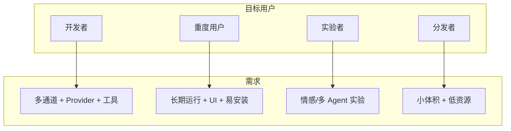
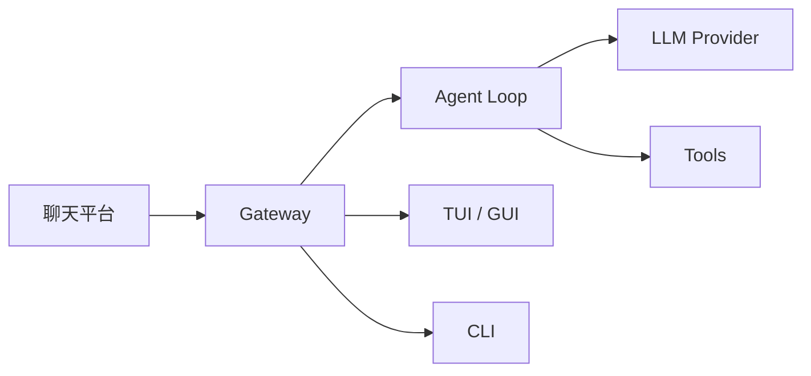

# Agent Diva


### agent-diva 的含义

源自《薇薇 -萤石眼之歌-》（Vivy: Fluorite Eye's Song）中「薇薇」的身份演变历程。**Agent** — 未觉醒自我意识前的代理者/执行者；**Diva** — 歌姬、舞台中心。Agent Diva 是 Project Vivy 的奠基性存在，面向 AI 操作系统的实验平台。


一个轻量、可扩展的个人 AI 助手框架，使用 Rust 构建。
本仓库包含多 crate 工作区，覆盖核心能力、提供商集成、渠道适配、内置工具与 CLI。

[](https://opensource.org/licenses/MIT)

其他语言：[English](README.md)

## Agent Diva 是什么？

Agent Diva 是一个**自托管网关**，将你常用的聊天 App（Telegram、Discord、Slack、WhatsApp、飞书、钉钉等）连接到 AI 助手。在本机或服务器上运行 Gateway 进程，它就成为聊天平台与 AI 之间的桥梁。

若你了解 [nanobot](https://github.com/HKUDS/nanobot)，可将 Agent Diva 理解为 **nanobot 核心理念 + Rust 重写 + 全面 Pro 化** —— 保留极简 agent-loop 思路，但在工程层面做到生产级、完整 UI（CLI、TUI、GUI），重点是好装、好跑、好维护。

## 谁适合用 Agent Diva？

| 角色 | 典型需求 |
|------|----------|
| **开发者** | 多通道 + 多 Provider + 工具系统的日常助手，不想从零搭架构 |
| **重度用户** | 已知 nanobot/openclaw，想要长期跑、带 UI、装完即用的版本 |
| **实验者** | 情感系统、多 Agent 协同，在现成平台上做实验 |
| **分发者** | 在乎安装包体积、资源占用、发给队友后的体验 |



## 工作原理



Gateway 是会话、路由与通道连接的唯一真相来源。消息从 Channel 进入后，经消息总线到达 Agent Loop，调用 LLM 与工具，再通过总线返回对应 Channel。

## 为什么是 Agent Diva

- 启动快、资源占用低
- 模块化架构（渠道 / 提供商 / 工具可替换）
- 一流 CLI 体验，适合本地工作流与自动化
- 持久化会话与记忆管理
- 通过 Markdown 加载技能，扩展能力简单

## 工作区结构

```
agent-diva/
|-- agent-diva-core/       # 共享配置、记忆/会话、定时任务、心跳、事件总线
|-- agent-diva-agent/      # 代理循环、上下文组装、技能/子代理流程
|-- agent-diva-providers/  # 大模型/转写提供商抽象与实现
|-- agent-diva-channels/   # 渠道适配（Slack/Discord/Telegram/Email/QQ/Matrix 等）
|-- agent-diva-tools/      # 内置工具（文件/命令行/网页/定时/进程）
|-- agent-diva-cli/        # CLI 入口
|-- agent-diva-migration/  # 旧版本迁移工具
|-- agent-diva-gui/        # 可选 GUI（视构建配置）
`-- agent-diva-manager/    # 远程管理 API
```

## 依赖

- Rust 1.70+（通过 rustup 安装）
- 可选：`just`（工作区命令入口）

## 快速开始

**macOS / Linux（从源码）**

```bash
git clone https://github.com/ProjectViVy/agent-diva.git
cd agent-diva
just build
just install
```

或使用 cargo 直接安装：

```bash
cargo build --all
cargo install --path agent-diva-cli
```

**初始化配置**

```bash
agent-diva onboard
```

onboard 会配置基础设置、创建 workspace，并可选配置 Provider 与 Channel。在 `~/.agent-diva/config.json` 中填入至少一个 Provider 的 `apiKey` 后即可开始聊天：

```bash
agent-diva tui
```

无需配置 Channel 即可使用 TUI 或 GUI 进行本地对话。

## 配置

默认配置文件：`~/.agent-diva/config.json`

**最小配置**（仅需一个 Provider 即可在 TUI/CLI 中对话）：

```json
{
  "providers": {
    "openrouter": {
      "apiKey": "sk-or-v1-xxxx"
    }
  },
  "agents": {
    "defaults": {
      "provider": "openrouter",
      "model": "anthropic/claude-sonnet-4"
    }
  }
}
```

直连 DeepSeek / OpenAI 等原生接口时，使用原始模型 ID（如 `deepseek-chat`），不要加 `provider/model` 前缀。

**主要 CLI 入口：**

```bash
# 初始化或刷新配置与 workspace 模板
agent-diva onboard
agent-diva config refresh

# 查看解析后的实例路径
agent-diva config path

# 验证或诊断指定实例
agent-diva --config ~/.agent-diva/config.json config validate
agent-diva --config ~/.agent-diva/config.json config doctor
```

支持环境变量覆盖（结构化与别名同时可用），例如：

```
AGENT_DIVA__AGENTS__DEFAULTS__MODEL=...
OPENAI_API_KEY=...
ANTHROPIC_API_KEY=...
```

### 渠道配置

**钉钉**：在 `config.json` 或环境变量中配置 `client_id` 和 `client_secret`，并在钉钉开发者控制台启用 Stream Mode。

**Discord**：配置 `token`、`gateway_url`（可选）和 `intents`，确保机器人已邀请到服务器并具备相应权限。

## 使用

```bash
# 启动网关（代理 + 已启用的渠道）
agent-diva gateway run

# 指定配置文件
agent-diva --config ~/.agent-diva/config.json status --json
agent-diva --config ~/.agent-diva/config.json agent --message "Hello from this instance"

# 发送单条消息
agent-diva agent --message "Hello, Agent Diva!"

# 启动交互式 TUI
agent-diva tui

# 查看状态
agent-diva status

# 渠道状态
agent-diva channels status
```

### 技能

- 工作区技能：`~/.agent-diva/workspace/skills/<skill-name>/SKILL.md`
- 内置技能：`agent-diva/skills/<skill-name>/SKILL.md`
- 同名时工作区技能覆盖内置技能

### 定时任务（cron）

`agent-diva gateway run` 会自动执行已到期的定时任务。`agent-diva gateway` 仍可继续使用。可通过 CLI 管理和手动触发：

```bash
# 添加循环任务
agent-diva cron add --name "daily" --message "standup reminder" --cron-expr "0 9 * * 1-5" --timezone "Asia/Shanghai" --deliver --channel qq --to 123456

# 查看任务
agent-diva cron list

# 手动触发任务
agent-diva cron run <job_id> --force
```

## GUI 桌面客户端

Agent Diva 提供基于 Tauri + Vue 3 的可选桌面 GUI。

### 前置要求

- Node.js v18+
- Rust（最新稳定版）
- pnpm（推荐）或 npm

### 启动 GUI

```bash
cd agent-diva-gui
pnpm install
pnpm tauri dev
```

### 构建发布版本

```bash
cd agent-diva-gui
pnpm tauri build
```

构建产物位于 `agent-diva-gui/src-tauri/target/release/`。

### 功能

- 实时流式对话
- 工具调用可视化（输入参数 + 执行结果）
- 供应商管理（API Key、Base URL、模型选择）
- 渠道配置（Telegram、Discord、钉钉、飞书、WhatsApp、Email、Slack、QQ、Matrix、Neuro-Link）
- 中英文切换

### 外部 Hook

GUI 启动后在 `3000` 端口监听，可通过 HTTP 从外部发送消息：

```bash
curl -X POST http://localhost:3000/api/hook/message \
  -H "Content-Type: application/json" \
  -d '{"content": "来自外部工具的消息"}'
```

## 开发

常用命令（优先使用 `just`）：

```bash
# 查看可用命令
just

# 一键格式化 + lint + 测试
just ci

# 运行全部测试
just test
```

不使用 `just` 时：

```bash
cargo fmt --all
cargo clippy --all -- -D warnings
cargo test --all
```

## 文档

- **完整文档**（Fumadocs）：在 `.workspace/agent-diva-docs` 中运行 `pnpm dev` 可本地查看，或参阅 [docs 内容](.workspace/agent-diva-docs/content/docs/) 获取快速开始、通道、Provider、工具、FAQ 等
- 用户指南：`docs/userguide.md`
- 架构：`docs/dev/architecture.md`
- 开发：`docs/dev/development.md`
- 迁移：`docs/dev/migration.md`

## 贡献

贡献指南见 `CONTRIBUTING.md`。提交前请运行 `just ci`，并保持 PR 聚焦单一主题。

## 许可证

MIT，详见 `LICENSE`。

## 致谢

本 Rust 工作区是对原 Agent Diva 项目的重写实现。

