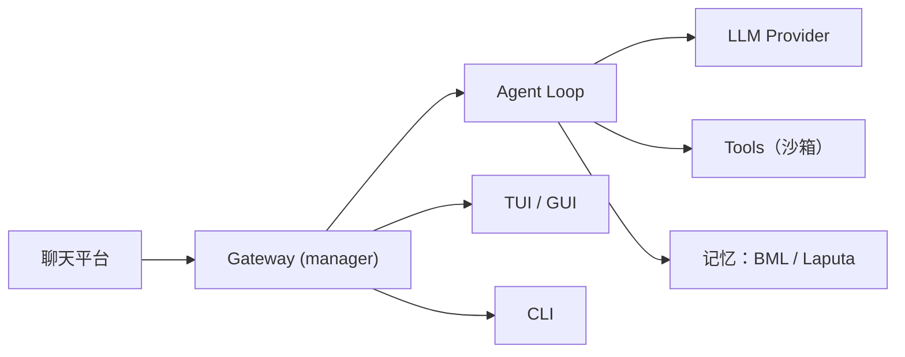

# Agent Diva


QQ 群：788599177

### agent-diva 的含义

源自《薇薇 -萤石眼之歌-》（Vivy: Fluorite Eye's Song）中「薇薇」的身份演变历程。**Agent** — 未觉醒自我意识前的代理者/执行者；**Diva** — 歌姬、舞台中心。Agent Diva 是 Project Vivy 的奠基性存在，面向 AI 操作系统的实验平台。

一个轻量、可扩展的个人 AI 助手框架，使用 Rust 构建。
本仓库包含多 crate 工作区，覆盖代理核心、提供商集成、渠道适配、内置工具、
记忆与人格治理、沙箱执行、CLI 以及 Tauri 桌面 GUI。

[](https://opensource.org/licenses/MIT)

其他语言：[English](README.md)

## Agent Diva 是什么？

Agent Diva 是一个**自托管的个人 AI 网关**，将你常用的聊天 App（Telegram、
Discord、QQ、钉钉、飞书、Email 等）连接到 AI 助手。在本机或服务器上运行
Gateway 进程，它就成为聊天平台与 AI 之间的桥梁——并内置持久记忆、受治理的
人格演化、技能、定时任务与人在回路（HITL）审批。

若你了解 [nanobot](https://github.com/HKUDS/nanobot)，可将 Agent Diva 理解为
**nanobot 核心理念 + Rust 重写 + 全面 Pro 化** —— 保留极简 agent-loop 思路，
但在工程层面做到生产级、完整 UI（CLI、TUI、GUI），重点是好装、好跑、好维护。

## 谁适合用 Agent Diva？

| 角色 | 典型需求 |
|------|----------|
| **开发者** | 多通道 + 多 Provider + 工具系统的日常助手，不想从零搭架构 |
| **重度用户** | 已知 nanobot/openclaw，想要长期跑、带 UI、装完即用的版本 |
| **实验者** | 人格/记忆治理、多 Agent 协同，在现成平台上做实验 |
| **分发者** | 在乎安装包体积、资源占用、发给队友后的体验 |

## 工作原理


```mermaid
flowchart LR
  A["聊天平台"] --> B["Gateway (manager)"]
  B --> C["Agent Loop"]
  C --> D["LLM Provider"]
  C --> E["Tools（沙箱）"]
  C --> M["记忆：BML / Laputa"]
  B --> F["TUI / GUI"]
  B --> G["CLI"]
```

Gateway 是会话、路由与通道连接的唯一真相来源。消息从 Channel 进入后，经消息
总线到达 Agent Loop，调用 LLM 与工具，再通过总线返回对应 Channel。

## 核心特性

- **多渠道网关** —— Telegram、Discord、QQ、钉钉、飞书、Email 默认启用；
  退役适配器（Slack、WhatsApp、Matrix、IRC、Mattermost、Nextcloud Talk）
  保留在可选 Cargo feature 之后，按需编译。
- **45+ 内置 Provider 预设** —— OpenRouter、DeepSeek、OpenAI、Anthropic、
  Gemini、智谱、Moonshot、阶跃、豆包、硅基流动、Groq、Ollama（本地）等，
  并支持任意自定义 OpenAI 兼容端点与语音转写。
- **分层记忆（BML + Laputa）** —— profile 本地的类型化 SQLite + FTS5 库是
  唯一记忆权威；Laputa 治理层在其上提供提案、受治理写入、回滚、审计与
  Frozen Core 人格基线。
- **人格与演化** —— Persona 工作区以 Markdown 为权威；AutoDream 作为提案
  生成器运行（从不直接写人格），GUI 的 Evolution 界面负责审阅与应用受治理
  变更。
- **技能（Skills）** —— 通过 Markdown（`SKILL.md`）加载能力，GUI 内置由
  skills.sh 目录支撑的技能市场。
- **沙箱 + HITL 审批** —— 沙箱策略、Guardian 审批，以及可在 CLI
  （`agent-diva approvals`）或 GUI 中审阅的持久审批中心。
- **调度与自动化** —— 定时任务在网关内运行并可投递到渠道；提供外部 HTTP
  Hook 注入消息。
- **完整 UI 三件套** —— CLI 负责自动化，TUI 负责终端对话，Tauri 桌面 GUI
  覆盖其余一切。

## 工作区结构

```
agent-diva/
|-- agent-diva-core/       # 共享配置、记忆/会话、定时任务、心跳、事件总线
|-- agent-diva-agent/      # 代理循环、上下文组装、技能/子代理流程
|-- agent-diva-providers/  # 大模型/转写提供商抽象与内置预设
|-- agent-diva-channels/   # 渠道适配（Telegram/Discord/QQ/钉钉/飞书/Email 等）
|-- agent-diva-tools/      # 内置工具（文件/命令行/网页/定时/进程）
|-- agent-diva-files/      # 文件索引与文件管理辅助
|-- agent-diva-tooling/    # 共享工具抽象与实用工具
|-- agent-diva-neuron/     # 桌面 GUI 使用的支撑类型/辅助
|-- agent-diva-manager/    # 本地网关与 HTTP 控制面
|-- agent-diva-laputa/     # BML 记忆存储 + Laputa 人格治理
|-- agent-diva-autodream/  # AutoDream 提案生命周期（手动运行/输入/输出）
|-- agent-diva-sandbox/    # 沙箱策略、执行、审批/Guardian 支持
|-- agent-diva-cli/        # CLI 入口（`agent-diva` 二进制）
|-- agent-diva-service/    # Windows 服务封装
|-- agent-diva-gui/        # Tauri + Vue 3 桌面应用
|-- agent-diva-migration/  # 旧版本迁移工具
`-- agent-diva-e2e/        # 端到端测试套件
```

## 依赖

- Rust **1.80+**（MSRV，通过 rustup 安装）
- 可选：`just`（工作区命令入口）
- 仅 GUI：Node.js v18+ 与 npm/pnpm

## 快速开始

**macOS / Linux / Windows（从源码）**

```bash
git clone https://github.com/ProjectViVy/agent-diva.git
cd agent-diva
just build
just install
```

或使用 cargo 直接安装：

```bash
cargo build --all
cargo install --path agent-diva-cli
```

**初始化配置**

```bash
agent-diva onboard
```

onboard 会配置基础设置、创建 workspace，并可选配置 Provider 与 Channel。
在 `~/.agent-diva/config.json` 中填入至少一个 Provider 的 `apiKey` 后即可
开始聊天：

```bash
agent-diva tui
```

无需配置 Channel 即可使用 TUI 或 GUI 进行本地对话。

## 配置

默认配置文件：`~/.agent-diva/config.json`

**最小配置**（仅需一个 Provider 即可在 TUI/CLI 中对话）：

```json
{
  "providers": {
    "openrouter": {
      "apiKey": "sk-or-v1-xxxx"
    }
  },
  "agents": {
    "defaults": {
      "provider": "openrouter",
      "model": "anthropic/claude-sonnet-4"
    }
  }
}
```

直连 DeepSeek / OpenAI 等原生接口时，使用原始模型 ID（如 `deepseek-chat`），
不要加 `provider/model` 前缀；前缀改写仅适用于经由 OpenRouter 等网关/聚合器
路由的场景。

**主要 CLI 入口：**

```bash
# 初始化或刷新配置与 workspace 模板
agent-diva onboard
agent-diva config refresh

# 查看解析后的实例路径
agent-diva config path

# 验证或诊断指定实例
agent-diva --config ~/.agent-diva/config.json config validate
agent-diva --config ~/.agent-diva/config.json config doctor
```

支持环境变量覆盖（结构化与别名同时可用），例如：

```
AGENT_DIVA__AGENTS__DEFAULTS__MODEL=...
OPENAI_API_KEY=...
ANTHROPIC_API_KEY=...
```

### 渠道配置

**钉钉**：在 `config.json` 或环境变量中配置 `client_id` 和 `client_secret`，
并在钉钉开发者控制台启用 Stream Mode。

**Discord**：配置 `token`、`gateway_url`（可选）和 `intents`，确保机器人已
邀请到服务器并具备相应权限。

退役渠道（Slack、WhatsApp、Matrix、IRC、Mattermost、Nextcloud Talk）仅在
可选 feature 下编译，例如
`cargo build -p agent-diva-channels --features channel-slack`。

## 使用

```bash
# 启动网关（代理 + 已启用的渠道 + 定时任务）
agent-diva gateway run

# 指定配置文件
agent-diva --config ~/.agent-diva/config.json status --json
agent-diva --config ~/.agent-diva/config.json agent --message "Hello from this instance"

# 发送单条消息
agent-diva agent --message "Hello, Agent Diva!"

# 交互式对话（轻量 chat 或完整 TUI）
agent-diva chat
agent-diva tui

# 查看状态 / 渠道 / 提供商
agent-diva status
agent-diva channels status
agent-diva provider list

# 审阅持久审批（HITL）
agent-diva approvals

# 管理工作区、待办、面具
agent-diva workspace list
agent-diva todo list
agent-diva mask list
```

在 Windows 上，`agent-diva service` 可将网关作为 Windows 服务管理。

### 技能

- 用户技能：`~/.agent-diva/skills/<skill-name>/SKILL.md`（config-dir 技能
  目录；workspace 目录不参与技能扫描）
- 内置技能：仓库 `skills/` 目录作为编译期后备技能目录（可为空）；新技能
  通常从市场安装到 config-dir 技能目录
- GUI：在「设置 → 技能」中从 skills.sh 市场搜索/安装/删除技能；
  Evolution 视图管理演化受控技能

### 定时任务（cron）

`agent-diva gateway run` 会自动执行已到期的定时任务。可通过 CLI 管理和手动
触发：

```bash
# 添加循环任务
agent-diva cron add --name "daily" --message "standup reminder" --cron-expr "0 9 * * 1-5" --timezone "Asia/Shanghai" --deliver --channel qq --to 123456

# 查看任务
agent-diva cron list

# 手动触发任务
agent-diva cron run <job_id> --force
```

## 记忆与人格（BML / Laputa / AutoDream）

- **BML（Basic Memory Layer）** —— 记忆存储层：profile 本地的类型化
  SQLite + FTS5 数据库（`.laputa/memory.sqlite3`）是唯一生产记忆权威；
  旧版记忆文件仅作为离线导入来源。
- **Laputa** —— BML 之上的人格治理层：提案、受治理写入、回滚、审计，以及
  为每个会话锚定基线的 Frozen Core 人格冻结核。
- **AutoDream** —— 周期性蒸馏流程，只生成 Laputa 提案，从不直接写人格
  状态；提案仅经受治理路径审阅与应用。
- **Persona / Evolution** —— GUI 提供人格状态、提案审阅、记忆审批与
  Evolution 受治理变更管理界面。

## GUI 桌面客户端

Agent Diva 提供基于 Tauri + Vue 3 的桌面 GUI。

### 前置要求

- Node.js v18+
- Rust（最新稳定版）
- pnpm（推荐）或 npm

### 启动 GUI

```bash
cd agent-diva-gui
pnpm install
pnpm tauri dev
```

### 构建发布版本

```bash
cd agent-diva-gui
pnpm tauri build
```

构建产物位于 `agent-diva-gui/src-tauri/target/release/`。
Windows 上可用 `scripts/package-windows-gui.ps1` 生成 NSIS 与 MSI 安装包；
Linux 打包可用 `just package-linux` / `just build-deb`。

### 功能

- 实时流式对话（普通与简洁两种展示模式）
- 工具调用可视化（输入参数 + 执行结果）
- 审批中心与计划审批流程（人在回路）
- 供应商管理（API Key、Base URL、模型目录）
- 渠道配置（Telegram、Discord、钉钉、飞书、Email、QQ 等）
- 技能市场（搜索/安装 skills.sh）与 Evolution 视图
- 记忆/人格治理：提案、审批、AutoDream 进度
- 面具（Mask）、笔记本、定时任务管理、网关控制面板
- 中英文切换

### 外部 Hook

网关 HTTP API 默认监听 `3000` 端口，可通过 HTTP 从外部发送消息：

```bash
curl -X POST http://localhost:3000/api/hook/message \
  -H "Content-Type: application/json" \
  -d '{"content": "来自外部工具的消息"}'
```

## 开发

常用命令（优先使用 `just`）：

```bash
# 查看可用命令
just

# 一键格式化 + lint + 测试 + 全部工作区门禁
just ci

# 运行全部测试
just test

# 专项门禁
just memory-provider-check      # Provider 装配与失败回归
just laputa-clean-break-check   # 阻止旧运行时依赖回流
just bml-boundary-check         # 治理层不得直接调用 BML 写 API
just gui-automated-check        # GUI vitest + 类型检查
```

不使用 `just` 时：

```bash
cargo fmt --all
cargo clippy --all -- -D warnings
cargo test --all
```

## 文档

- **文档总入口**：[`docs/README.md`](docs/README.md) —— 当前架构、决策、
  研究与迭代日志的阅读顺序
- 当前架构：[`docs/architecture/`](docs/architecture/)（认知工作区边界、
  上下文运行时、Prompt 合同、审批边界）
- Laputa 架构：[`docs/architecture/laputa/`](docs/architecture/laputa/)
- 工程参考（贡献指南、变更日志、项目上下文）：
  [`docs/engineering/`](docs/engineering/)
- 仓库规则与流程指南：[`AGENTS.md`](AGENTS.md) 与架构参考
  [`AGENTS-ARCH.MD`](AGENTS-ARCH.MD)
- 迭代日志位于 [`docs/logs/`](docs/logs/)；待办清单见
  [`TODOLIST.md`](TODOLIST.md)

## 贡献

贡献指南见
[`docs/engineering/CONTRIBUTING.md`](docs/engineering/CONTRIBUTING.md)。
提交前请运行 `just ci`，并保持 PR 聚焦单一主题。

## 许可证

MIT，详见 `LICENSE`。

## 致谢

本 Rust 工作区是对原 Agent Diva 项目的重写实现。
