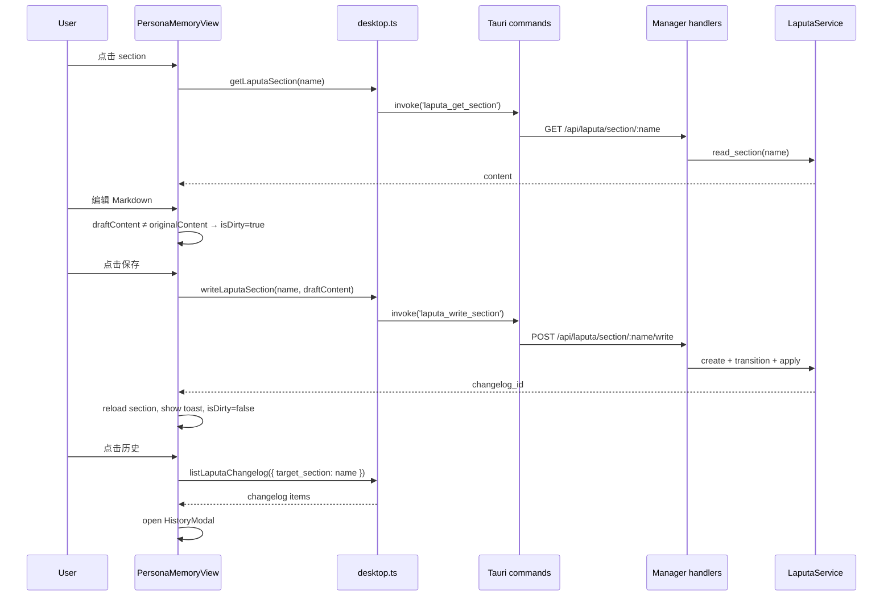

# Architecture Spine: Persona & Memory (Laputa GUI Management Page)

> **Scope**: agent-diva-gui "人格与记忆" 页面（功能板块首项）
> **Date**: 2026-07-05
> **Related PRD**: `docs/prds/prd-persona-memory-laputa-ui-2026-07-05.md`
> **Status**: draft

## 0. Purpose

为实施方提供一份最小一致性契约，确保新页面在组件结构、API 路由、写入治理、状态流上与现有 agent-diva 代码保持一致，并明确哪些决策已经固定、哪些可以延后。

## 1. Design Paradigm

**List-Detail Shell + Proposal-Driven Persistence**

- 页面是**只读视图 + 编辑器**的壳，不是新的持久化系统。
- 所有写入继续走 Laputa 的**提案治理模型**：读取 section → 用户编辑 → 合成/创建 `EvolutionProposal` → transition → apply → changelog/audit。
- 前端状态采用 **Fetch-Edit-Save ref 三元组**：`loading` / `error` / `dirty` + API composables。

## 2. Architecture Decisions (AD)

### AD-1 — 页面定位为纯消费方
**Binds**: 新页面只消费 `agent-diva-laputa` 与 `agent-diva-manager` 已有 API，不新增持久化格式或数据库表。
**Prevents**: 在 Vue 层引入第二套记忆存储、绕过提案流程直接写文件、与 EvolutionView 职责重叠。
**Rule**: `PersonaMemoryView.vue` 不得调用任何非 Laputa 提案接口的写入命令；持久化写入统一通过 `laputa_create_proposal` / `laputa_apply_proposal`（或后端新增的高阶包装）。

### AD-2 — 后端新增一个高阶“直接编辑并应用”包装（推荐）
**Binds**: 后端提供单一入口 `POST /api/laputa/section/:name/write`（Tauri: `laputa_write_section`），内部自动完成 create → transition to Approved → apply 三阶段。
**Prevents**: 前端自己拼 `EvolutionProposal` 字段、在 manager/Tauri 层直接写 `.laputa/sections` 文件、多个调用方重复实现同一流程。
**Rule**: 该 handler 必须调用 `LaputaService` 方法；任何文件系统写入必须发生在 `agent-diva-laputa` crate 内部，以满足 `agent-diva-laputa/tests/authority_boundary_guard.rs`。

### AD-3 — 14 section 分组模型由前端拥有
**Binds**: 左侧分组（人格 / 记忆 / 周期 / 索引）是 UI 概念，不进入后端类型或数据库 schema。
**Prevents**: 在 `LaputaSectionName` 枚举中增加分组字段、在 API 中返回 group 字段、不同客户端使用不同分组。
**Rule**: 分组映射表作为 `PersonaMemoryView.vue` 内的常量/配置对象，同时进入 `locales/zh.ts` 与 `locales/en.ts` 的 i18n 键值。

### AD-4 — 无权限 UI，全部可编辑（本期）
**Binds**: v0.1.0 不对 section 做写权限灰显；所有 14 个 section 均可编辑保存。
**Prevents**: 在 PRD 未定义权限矩阵前引入 `UserCannotEdit` 或角色判断。
**Rule**: 保存按钮始终可用；后端按现有 `UnauthorizedTarget` 校验拒绝非法组合（如 `proposal_type` 与 section 不匹配），前端仅显示通用错误。

### AD-5 — 历史弹窗只读，可复制
**Binds**: changelog 历史以遮罩弹窗展示，支持复制单条记录的 `after` 内容。
**Prevents**: 在弹窗内提供回滚按钮、diff 高亮、冲突解决 UI。
**Rule**: 弹窗调用 `listLaputaChangelog({ target_section })`，每行提供 copy 按钮，复制实现复用 `navigator.clipboard.writeText`（与 `ChatView.vue` 一致）。

### AD-6 — Markdown 编辑器为新建组件
**Binds**: 当前代码库没有现成的 Markdown 编辑器（textarea + preview split）。
**Prevents**: 把 `NotebookView.vue` 的渲染器误当编辑器复用、把 `ConfigEditor.vue` 的 JSON 校验硬塞进 Markdown。
**Rule**: 新建 `MarkdownEditor.vue`（或内联于 `PersonaMemoryView.vue`），复用 `ConfigEditor.vue` 的编辑器状态管理 + `NotebookView.vue` 的 `markdown-it` 渲染。

## 3. Component Structure (Seed)

```
agent-diva-gui/src/components/
├── PersonaMemoryView.vue          # 页面容器：左侧分组列表 + 右侧编辑器
├── persona-memory/
│   ├── SectionGroupList.vue       # 分组折叠列表 + section 项 + active 态
│   ├── SectionEditor.vue          # Markdown 编辑器（textarea + preview）
│   └── HistoryModal.vue           # changelog 历史遮罩弹窗 + copy 按钮
```

- `PersonaMemoryView.vue` 持有当前 `selectedSection`、`snapshot`、`loading`、`error`、`isDirty`。
- `SectionGroupList.vue` 只接收分组配置、当前 section id、emit 选择事件。
- `SectionEditor.vue` 管理本地 `draftContent`，与原始内容比较产生 `dirty`，保存时 emit `save(draftContent)`。
- `HistoryModal.vue` 接收 section name，自行拉取 changelog，每行提供 copy。

## 4. API Contract

### 4.1 已存在接口（前端需确认封装）

| 调用 | 来源 | 用途 |
|------|------|------|
| `GET /api/laputa/snapshot` | manager | 14 section 列表与初始化状态 |
| `GET /api/laputa/section/:name` | manager | 读取单个 section content |
| `GET /api/laputa/changelog?target_section=name` | manager | 单个 section 的变更历史 |

前端 `desktop.ts` 已有 `getLaputaSection`；`getLaputaSnapshot` 的 Tauri command 存在但未在 `desktop.ts` 暴露；`listLaputaChangelog` 已存在。

### 4.2 新增接口

**Manager**

```
POST /api/laputa/section/:name/write
Content-Type: application/json

{ "content": "# Identity\n...", "actor": "gui-user", "summary": "optional" }

Response 200:
{ "changelog_id": "...", "applied_at": "..." }
```

**Tauri**

```rust
#[tauri::command]
pub async fn laputa_write_section(
    name: String,
    content: String,
    state: State<'_, AgentState>,
) -> Result<serde_json::Value, serde_json::Value>;
```

**前端 desktop.ts**

```ts
export const writeLaputaSection = (
  name: LaputaSectionName,
  content: string,
  summary?: string,
) => invoke('laputa_write_section', { name, content, summary });
```

### 4.3 后端实现顺序

1. `agent-diva-laputa/src/service.rs` 新增 `create_and_apply_direct_edit(name, patch, actor)`（内部 create → transition → apply）。
2. `agent-diva-manager/src/handlers/laputa.rs` 新增 `write_laputa_section_handler`。
3. `agent-diva-manager/src/server.rs` 注册 `POST /api/laputa/section/:name/write`。
4. `agent-diva-gui/src-tauri/src/commands.rs` 新增 `laputa_write_section`。
5. `agent-diva-gui/src-tauri/src/lib.rs` 在 `generate_handler!` 中注册。

## 5. State Flow



## 6. Boundaries and Constraints

- **不得绕过 LaputaService**：manager handler、Tauri command、GUI 都不得直接 `fs::write` `.laputa/` 下文件，否则 `authority_boundary_guard` 测试失败。
- **不得与 EvolutionView 合并**：本页是记忆内容的直接管理；提案审批、批量操作、政策配置保留在 `EvolutionView.vue`。
- **section 状态显示**：TBD section 显示“待定”，owned section 显示“已就绪”，不显示后端未定义的额外状态。
- **changelog 仅消费 Laputa changelog**：本期不混入系统级 `AuditSink` JSONL 日志。

## 7. Deferred / Open

| 项 | 原因 | 触发条件 |
|----|------|---------|
| 回滚按钮 | PRD 明确 deferred | 用户需要“一键撤销”时 |
| 保存前 diff 预览 | PRD 明确 deferred | 用户需要确认变更范围时 |
| section 写权限矩阵 UI | PRD 明确 deferred，等待 `write_authority` 最终矩阵 | `prd-laputa-2026-06-12/prd.md` §5.5 闭合后 |
| 冲突可视化合并 | 后端已支持，本期仅报错 | 多用户/多进程并发编辑场景 |
| Markdown 编辑器抽取为通用组件 | 当前仅本页使用 | 第二个 Markdown 编辑需求出现时 |
| SSE 实时刷新 changelog | 本期保存后手动/自动拉取即可 | 需要多人协作或外部系统触发变更时 |

## 8. File Checklist for Implementation

### Backend
- [ ] `agent-diva-laputa/src/service.rs` — 新增 `create_and_apply_direct_edit`
- [ ] `agent-diva-laputa/src/proposals.rs` — 确认提案校验可接受直接编辑的字段组合
- [ ] `agent-diva-manager/src/handlers/laputa.rs` — 新增 `write_laputa_section_handler`
- [ ] `agent-diva-manager/src/server.rs` — 注册 `POST /api/laputa/section/:name/write`
- [ ] `agent-diva-laputa/tests/authority_boundary_guard.rs` — 跑过后确认无新增 direct-write 违规

### Tauri Bridge
- [ ] `agent-diva-gui/src-tauri/src/commands.rs` — 新增 `laputa_write_section`
- [ ] `agent-diva-gui/src-tauri/src/lib.rs` — 在 `generate_handler!` 注册

### Frontend
- [ ] `agent-diva-gui/src/api/desktop.ts` — 新增 `writeLaputaSection` / 暴露 `getLaputaSnapshot`
- [ ] `agent-diva-gui/src/components/PersonaMemoryView.vue` — 主容器
- [ ] `agent-diva-gui/src/components/persona-memory/SectionGroupList.vue`
- [ ] `agent-diva-gui/src/components/persona-memory/SectionEditor.vue`
- [ ] `agent-diva-gui/src/components/persona-memory/HistoryModal.vue`
- [ ] `agent-diva-gui/src/components/NormalMode.vue` — 侧边栏入口与 activeMenu 分支
- [ ] `agent-diva-gui/src/locales/zh.ts` — `nav.personaMemory` 等中文文案
- [ ] `agent-diva-gui/src/locales/en.ts` — 对应英文文案

## 9. Acceptance Sign-off

架构 spine 通过的标准：
- [ ] 实现方能在不改动 `agent-diva-laputa` 治理模型的情况下完成页面；
- [ ] 所有写入路径通过 `LaputaService`，CI 中 `authority_boundary_guard` 保持通过；
- [ ] 页面与 `EvolutionView.vue` 在 UI 和职责上无重叠；
- [ ] `desktop.ts` 新增接口后，现有 `EvolutionView.vue` 调用不破坏；
- [ ] 14 section 分组可仅通过前端配置调整，不依赖后端变更。
