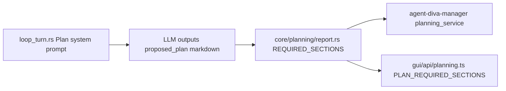
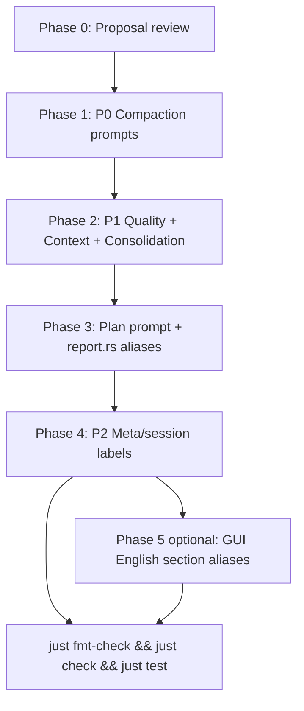

# Agent Main Runtime Prompt Contract

**Status:** Implemented; retained as the current prompt inventory and wire-language contract
**Date:** 2026-08-13 (original implementation 2026-07-30)
**Scope:** LLM-facing prompts on the main agent runtime path (`agent-diva-agent` + minimal `agent-diva-core` context labels)

> This document is now an active runtime contract. It is independent of the Laputa Cognitive
> Workspace Reset and does not authorize any Persona, Memory, STM, or Evolution redesign.

---

## 1. Background & Rationale

Agent Diva’s primary agent runtime already uses English for most system prompts: identity header, tool guidance, title generation, consolidation system prompt, and the default `ContextBuilder` template are all English.

However, several subsystems on the hot path still inject **Chinese text into LLM context**:

- **Context compaction** — full Chinese system prompt plus Chinese user prompt, role labels, and retry feedback
- **Memory consolidation retry** — Chinese quality feedback prepended to user messages
- **Context assembly** — Chinese compaction boundary system message
- **Plan mode** — mixed English/Chinese `<proposed_plan>` section schema
- **Meta-compaction / session labels** — Chinese markers that flow into later LLM calls

### Why English-only prompts

1. **Model compatibility** — Some models (especially code-focused or smaller open-weight models) handle English instructions more reliably than Chinese system prompts.
2. **Consistency** — The main agent identity and tool instructions are already English; Chinese compaction prompts create a language split inside the same request pipeline.
3. **Predictable output** — Compaction currently instructs the model to *write summaries in Chinese* (`用中文撰写摘要`), which conflicts with users who converse in English or expect English internal context.

### Non-goals for this proposal

- Changing user-visible assistant fallback text (out of scope; not LLM input)
- Changing test fixtures or `#[cfg(test)]` blocks (deferred per product decision)
- Changing GUI/CLI user-facing copy
- Changing user-authored mask files or workspace identity content

---

## 2. Scope Definition

### 2.1 In scope — LLM-facing strings

Strings that are sent to an LLM provider as `system` or `user` messages, or embedded in context that is later sent to an LLM.

| Priority | File | Lines (approx.) | Category |
|----------|------|-----------------|----------|
| P0 | `agent-diva-agent/src/compaction/prompt.rs` | 8–31, 37–44 | Compaction system + prior-summary prefix |
| P0 | `agent-diva-agent/src/compaction/compaction_exec.rs` | 143, 164, 304–307 | Compaction user prompt, retry, role labels |
| P1 | `agent-diva-agent/src/consolidation.rs` | 154 | Consolidation retry user prefix |
| P1 | `agent-diva-agent/src/compaction/quality.rs` | 187, 189, 217, 229, 260 | Quality-gate issue strings (fed into retry prompts) |
| P1 | `agent-diva-agent/src/context.rs` | 281 | Compaction boundary system message |
| P1 | `agent-diva-agent/src/agent_loop/loop_turn.rs` | 795–810 | Plan mode system message (section schema) |
| P2 | `agent-diva-agent/src/compaction/meta.rs` | 157 | Meta-compaction hint prefix |
| P2 | `agent-diva-core/src/session/store.rs` | 263 | Prior compaction record label |

### 2.2 Already English — no change required

| File | Notes |
|------|-------|
| `agent-diva-agent/src/context.rs` | Main system prompt template (L120–188), default identity header |
| `agent-diva-agent/src/agent_loop/loop_turn.rs` | `SUMMARY_ONLY_NUDGE`, title-generation prompts, approved-plan execution prompt |
| `agent-diva-agent/src/consolidation.rs` | `CONSOLIDATION_PROMPT` (L14–20) |
| `agent-diva-agent/src/planning/*` | No Chinese LLM prompts |
| `agent-diva-agent/src/skills.rs`, `subagent.rs` | No Chinese prompts |

### 2.3 Out of scope

| Item | Location | Reason |
|------|----------|--------|
| Test files | `agent-diva-agent/tests/*`, `#[cfg(test)]` | Explicitly excluded by request |
| User-visible fallbacks | `loop_turn.rs` L1595–2176 (`FALLBACK_*_ZH`, tool-limit summaries) | Assistant output to user, not LLM input |
| Execution kickoff detector | `loop_turn.rs` L450 `"开始执行已批准"` | User message matching, not a prompt |
| Mask default name | `mask/mask_file.rs` `"我就是我"` | Config/UI identifier; mask body comes from user files |
| Quality stop-word list | `quality.rs` L116–120 | Algorithm data for keyword extraction, not sent as prompt |
| Report narrative curation | `agent-diva-providers/src/report_narrative.rs` | Separate report subsystem, not main agent loop |
| GUI / CLI copy | `agent-diva-gui`, `agent-diva-cli` | User-facing UI strings |
| Error display strings | `agent-diva-core/src/planning/report.rs` validation `#[error(...)]` | Shown to operators/users, not sent to LLM |

---

## 3. Inventory Table

| ID | File | Line(s) | Current (Chinese) | LLM-facing | Priority |
|----|------|---------|-------------------|------------|----------|
| C-01 | `compaction/prompt.rs` | 8–31 | Full `COMPACTION_SYSTEM_PROMPT` | Yes — system | P0 |
| C-02 | `compaction/prompt.rs` | 37–44 | `PRIOR_SUMMARIES_PREFIX` | Yes — user prefix | P0 |
| C-03 | `compaction/compaction_exec.rs` | 143 | `"{}请压缩以下 {} 条对话消息：\n\n{}"` | Yes — user | P0 |
| C-04 | `compaction/compaction_exec.rs` | 164 | Retry: `注意：上一次生成的摘要质量不合格…` | Yes — user | P0 |
| C-05 | `compaction/compaction_exec.rs` | 304–307 | Role labels: `用户/助手/工具/系统` | Yes — user content | P0 |
| M-01 | `consolidation.rs` | 154 | Retry: `注意：上一次整合质量不合格…` | Yes — user | P1 |
| Q-01 | `compaction/quality.rs` | 187 | `摘要过短（{} 字符，至少需要 50）` | Yes — via retry | P1 |
| Q-02 | `compaction/quality.rs` | 189, 229 | `摘要为空` | Yes — via retry | P1 |
| Q-03 | `compaction/quality.rs` | 217 | `关键词覆盖率过低（{:.0}%，至少需要 30%）` | Yes — via retry | P1 |
| Q-04 | `compaction/quality.rs` | 260 | `摘要缺少完整句子（无句号/问号/感叹号）` | Yes — via retry | P1 |
| X-01 | `context.rs` | 281 | `以下早期对话已被压缩为摘要。摘要可能有失真…` | Yes — system | P1 |
| P-01 | `agent_loop/loop_turn.rs` | 799–810 | Plan sections: `## 目标/范围/计划步骤/风险与假设/验证方法` | Yes — system | P1 |
| MC-01 | `compaction/meta.rs` | 157 | `[压缩摘要]` | Yes — injected context | P2 |
| S-01 | `session/store.rs` | 263 | `[压缩记录 {}/{}]` | Yes — via prior context | P2 |

---

## 4. Proposed English Replacements

### 4.1 P0 — Compaction subsystem

#### C-01: `COMPACTION_SYSTEM_PROMPT` (`compaction/prompt.rs`)

**Proposed replacement:**

```text
You are a conversation compactor. Compress the following dialogue into a dense, lossy summary that preserves all actionable context.

Output strictly in this structure:

<analysis>
(Brief analysis of key themes, decisions, actions, and current state. Third person, past tense.)
</analysis>

<summary>
(Compressed summary. Must retain:
- Project status, active tasks, decisions made
- User preferences, identity, constraints
- Tool calls: what was done and why
- Edited file paths, commands run, results produced
- Open issues, blockers, next steps
Third person, past tense. High information density. Maximum 2000 characters.)
</summary>

Rules:
- Output only the structure above; no preamble, postscript, or meta-commentary
- Do not invent information absent from the dialogue
- Mark uncertain content with [uncertain]
- Write the summary in English; preserve original technical terms, file paths, and identifiers from the source dialogue
```

**Key deltas from current:**

- Remove rule 30: `用中文撰写摘要`
- Replace `[不确定]` guidance with `[uncertain]`
- Keep `<analysis>` / `<summary>` tags unchanged (parser-compatible)

#### C-02: `PRIOR_SUMMARIES_PREFIX` (`compaction/prompt.rs`)

**Proposed replacement:**

```text
The following are prior compaction summaries from earlier context:

{prior_summaries}

When generating the new summary, merge prior summaries into a coherent layered summary.
The new summary must cover the new messages below while staying consistent and continuous with prior summaries.

```

#### C-03: Base user prompt (`compaction/compaction_exec.rs` L143)

```rust
"{}Compress the following {} conversation messages:\n\n{}"
```

#### C-04: Compaction retry feedback (`compaction/compaction_exec.rs` L164)

Use a shared retry template (also applies to M-01):

```rust
"Note: The previous output failed quality check (score {:.2}/1.0). Reasons: {}.\nGenerate a more detailed, complete summary that covers all key information.\n\n{}"
```

For consolidation (M-01), replace `summary` with `memory update` in the second sentence:

```rust
"Note: The previous output failed quality check (score {:.2}/1.0). Reasons: {}.\nGenerate a more detailed, complete memory update that covers all key information.\n\n{}"
```

**Also change** issue join separator from `；` to `;` in both compaction and consolidation retry paths for consistency with English feedback.

#### C-05: Role labels (`compaction/compaction_exec.rs` L304–307)

| Role | Current | Proposed |
|------|---------|----------|
| `user` | 用户 | User |
| `assistant` | 助手 | Assistant |
| `tool` | 工具 | Tool |
| `system` | 系统 | System |

---

### 4.2 P1 — Quality gate, context boundary, consolidation

#### Q-01 through Q-04 (`compaction/quality.rs`)

| ID | Current | Proposed |
|----|---------|----------|
| Q-01 | `摘要过短（{} 字符，至少需要 50）` | `Summary too short ({} chars, minimum 50 required)` |
| Q-02 | `摘要为空` | `Summary is empty` |
| Q-03 | `关键词覆盖率过低（{:.0}%，至少需要 30%）` | `Keyword coverage too low ({:.0}%, minimum 30% required)` |
| Q-04 | `摘要缺少完整句子（无句号/问号/感叹号）` | `Summary lacks complete sentences (no period, question mark, or exclamation mark)` |

**Note:** Only change production code in `score_length`, `score_keywords`, and `score_completeness`. Leave `#[cfg(test)]` blocks unchanged.

#### X-01: Compaction boundary (`context.rs` L281)

**Proposed:**

```text
## Context Compaction Boundary
Earlier conversation has been compacted into a summary. The summary may be lossy; ask the user for precise details if needed.
[compacted context start]
```

#### M-01: Consolidation retry — see C-04 shared template above.

---

### 4.3 P1 — Plan mode system message

#### P-01: Current mixed prompt (`loop_turn.rs` L795–810)

The instructional prose is already mostly English; the Chinese section headers are the remaining CJK in this prompt.

**Proposed Plan mode block (Strategy B — recommended):**

```text
You are in Plan mode until the user leaves it. Explore with read-only tools only: do not modify files, run mutating shell commands, call planning/TODO tools, or begin implementation.

When you have enough information for a complete plan, end the turn with exactly one line-oriented XML block (tags alone on their lines, tags untranslated):
<proposed_plan>
# short title
## Goals
...
## Scope
...
## Plan Steps
...
## Risks & Assumptions
...
## Verification
...
</proposed_plan>

Preferred Markdown sections inside the block: Goals, Scope, Plan Steps, Risks & Assumptions, Verification. Put any preface outside the tags. At most one <proposed_plan> per turn; revisions must be a full replacement. Do not ask whether to implement — the user uses the approval UI.
```

**Required companion change (not a prompt — see Section 5):** extend `agent-diva-core/src/planning/report.rs` `SECTION_ALIASES` to accept English headings while retaining Chinese aliases for backward compatibility.

---

### 4.4 P2 — Context labels

#### MC-01 (`compaction/meta.rs` L157)

```rust
let hint = "[Compacted summary]";
```

#### S-01 (`session/store.rs` L263)

```rust
format!("[Compaction record {}/{}]\n{}", i + 1, total, s.summary)
```

These labels appear inside summaries that are later injected into compaction or main-agent context. English labels reduce CJK leakage into downstream LLM calls.

---

## 5. Cross-Cutting Dependencies — Plan Mode

### 5.1 Current data flow



### 5.2 Coupling points

| Component | File | Chinese dependency |
|-----------|------|-------------------|
| LLM prompt schema | `agent-diva-agent/src/agent_loop/loop_turn.rs` | Requires `## 目标`, `## 范围`, etc. |
| Server-side validation | `agent-diva-core/src/planning/report.rs` | `REQUIRED_SECTIONS` + `SECTION_ALIASES` (Chinese only) |
| GUI validation | `agent-diva-gui/src/api/planning.ts` | `PLAN_REQUIRED_SECTIONS` (Chinese only) |
| Manager tests | `agent-diva-manager/src/planning_service.rs` | Fixtures use `## 目标` |

Changing the Plan mode prompt to English section headers **without** parser updates will cause plan report extraction/validation to fail.

### 5.3 Strategy comparison

| Strategy | Prompt change | Companion change | Pros | Cons |
|----------|---------------|------------------|------|------|
| **A. Conservative** | Compaction/context/consolidation → English; Plan keeps Chinese section headers as fixed schema tokens | None | Zero parser/GUI risk | Plan prompt still contains CJK tokens |
| **B. Recommended** | Full English Plan sections (`Goals`, `Scope`, …) | Add English entries to `report.rs` `SECTION_ALIASES`; keep Chinese aliases | Minimal scope; old Chinese plans still parse | GUI still validates Chinese headings only — English plans may show GUI warnings until Phase 5 |
| **C. Full stack** | Full English everywhere | Update `report.rs`, GUI, manager fixtures | End-to-end consistency | Exceeds “prompts only”; requires GUI/test updates |

**Recommendation:** Adopt **Strategy B** for implementation.

#### Proposed `SECTION_ALIASES` additions (`report.rs`)

```rust
// English aliases (canonical names remain Chinese for storage compatibility)
("Goals", "目标"),
("Goal", "目标"),
("Scope", "范围"),
("Plan Steps", "计划步骤"),
("Steps", "计划步骤"),
("Implementation Steps", "计划步骤"),
("Risks & Assumptions", "风险与假设"),
("Risks and Assumptions", "风险与假设"),
("Risks", "风险与假设"),
("Assumptions", "风险与假设"),
("Verification", "验证方法"),
("Test Plan", "验证方法"),
```

Canonical `REQUIRED_SECTIONS` can remain Chinese internally so existing persisted plans and GUI labels stay stable; normalization maps English LLM output to the same canonical section names.

### 5.4 GUI compatibility closure

The implementation selected the full compatibility variant: Core normalization
and GUI validation both accept English and legacy Chinese aliases. Canonical
Chinese section names remain stable for stored reports and validation messages,
so existing plans require no migration.

---

## 6. Implementation Phases

This sequence was implemented with prompt ownership moved to subsystem-local
`prompt.rs` modules. AgentLoop G1 structural extraction continues separately;
the prompt work does not claim that the large turn coordinator is fully split.



| Phase | Files touched | Commits (suggested) | Notes |
|-------|---------------|---------------------|-------|
| 0 | This document | — | Review & sign-off |
| 1 | `compaction/prompt.rs`, `compaction/compaction_exec.rs` | 1 commit: `refactor: english compaction prompts` | Largest impact; no parser deps |
| 2 | `quality.rs` (prod only), `context.rs`, `consolidation.rs` | 1 commit: `refactor: english compaction boundary and retry feedback` | Quality issue strings + boundary message |
| 3 | `loop_turn.rs`, `planning/report.rs` | 2 commits: prompt first, then parser aliases | Strategy B; atomic split |
| 4 | `compaction/meta.rs`, `session/store.rs` | 1 commit: `refactor: english compaction context labels` | Low risk |
| 5 (optional) | `gui/api/planning.ts` | 1 commit: `fix: accept english plan section headings in GUI validation` | Closes GUI gap |

### Per-phase rules

- One logical concern per commit (atomic commit discipline)
- Do **not** modify test files in the initial pass unless CI blocks landing; record deferred test updates in `TODOLIST.md`
- Create iteration log under `docs/logs/2026-07-prompt-englishization/v0.0.1-english-prompts/` with `summary.md`, `verification.md`, `release.md`, `acceptance.md`

### Deferred test updates

The following test areas assert Chinese prompt content or Chinese plan sections. They should be updated in a dedicated follow-up once prompt landing is approved:

| Area | File | What asserts Chinese |
|------|------|---------------------|
| Compaction formatting | `compaction/compaction_exec.rs` `#[cfg(test)]` | Role labels `[1. 用户]`, Chinese summary fixtures |
| Compaction integration | `agent-diva-agent/tests/compaction_integration.rs` | Boundary message content |
| Compaction e2e | `agent-diva-agent/tests/compaction_e2e.rs` | Boundary markers |
| Plan report | `agent-diva-core/src/planning/report.rs` tests | `## 目标` fixtures |
| GUI plan | `agent-diva-gui/src/components/planning/*.test.ts` | `## 目标` in plan markdown |

**CI risk:** If production prompt strings change but tests are left unchanged, unit tests inside `#[cfg(test)]` modules may still pass (they often use inline fixtures). Integration/e2e tests that mock provider calls and inspect prompt content may fail — track in `TODOLIST.md`.

---

## 7. Validation Checklist

Use after code landing (not required for documentation-only iteration).

### 7.1 Static audit

```powershell
# From agent-diva/ — expect no CJK in production prompt paths (manual review for comments)
rg "[\u4e00-\u9fff]" agent-diva-agent/src/compaction/prompt.rs `
  agent-diva-agent/src/compaction/compaction_exec.rs `
  agent-diva-agent/src/consolidation.rs `
  agent-diva-agent/src/context.rs `
  agent-diva-agent/src/agent_loop/loop_turn.rs
```

Exclude: comments, `#[cfg(test)]` blocks, user-visible `FALLBACK_*_ZH` constants.

### 7.2 Smoke paths

| # | Scenario | Expected observation |
|---|----------|---------------------|
| 1 | Long session triggers proactive compaction | Provider request system message is English `COMPACTION_SYSTEM_PROMPT`; user message starts with `Compress the following` |
| 2 | Compaction quality retry | Retry user message starts with `Note: The previous output failed quality check` |
| 3 | Session with compaction history | First boundary system message contains `Earlier conversation has been compacted` |
| 4 | Enter Plan mode, generate plan | `<proposed_plan>` uses English sections; `report.rs` normalizes/validates successfully |
| 5 | Memory consolidation with quality retry | Retry prefix is English |

### 7.3 Workspace gate

```bash
just fmt-check && just check && just test
```

Record results in `docs/logs/2026-07-prompt-englishization/v0.0.1-english-prompts/verification.md`.

---

## 8. Summary

| Metric | Count |
|--------|-------|
| In-scope LLM-facing Chinese strings | 14 (across 8 files) |
| P0 (compaction) | 5 items |
| P1 (quality, context, plan, consolidation) | 7 items |
| P2 (labels) | 2 items |
| Files already English | 4+ modules |
| Companion non-prompt change required | `report.rs` SECTION_ALIASES (Plan mode, Strategy B) |

**Next step:** Review this proposal. Upon approval, land Phase 1 (compaction) first — highest impact, no cross-crate parser dependencies.

---

## References

- Main system prompt: `agent-diva-agent/src/context.rs`
- Compaction entry: `agent-diva-agent/src/compaction/compaction_exec.rs`
- Plan mode injection: `agent-diva-agent/src/agent_loop/loop_turn.rs`
- Plan report parser: `agent-diva-core/src/planning/report.rs`
- GUI plan validation: `agent-diva-gui/src/api/planning.ts`
