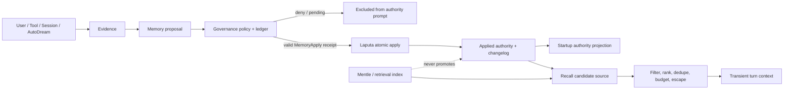

# Memory Framework Interfaces Specification

Status: GMH-20 frozen baseline
Applies to: GMH-21 through GMH-24
Runtime impact: none

## 1. Purpose

This specification freezes the current Memory boundary and the target interface
rules for Memory Framework 2.0. It is based on the existing
`agent_diva_core::memory::MemoryProvider`, `MemoryManager`,
`LaputaMemoryProvider`, `HybridMemoryProvider`, Agent memory boundary, and
AutoDream/Laputa proposal flow.

There is no `agent-diva-memory` crate in the current repository or in the
audited `origin/vrm-memory-test` source. GMH-20 does not create one, restore old
branch code, or change a Rust trait. Later stories must evolve the current
boundaries incrementally.

The governing invariant is:

> Retrieval may suggest context; evidence may support a proposal; only an
> applied change owned by the authority store may become durable authority.

## 2. Terms and authority

| Term | Meaning | May enter the default prompt? | May mutate authority? |
| --- | --- | --- | --- |
| Applied authority | Reviewed and applied Laputa section, or legacy Markdown when no Laputa workspace exists | Yes, subject to rendering and budget | Only through the owning authority path |
| Evidence | Source-bound observation from a session, user, file, report, tool, AutoDream run, or compaction | No, unless selected as explicitly labelled transient context | No |
| Proposal | Requested authority change with evidence, target, diff/content digest, risk, and lifecycle state | No while pending, rejected, expired, deferred, or failed | No |
| Temporary recall | Turn/session-scoped retrieval candidate | Only after filtering, ranking, budgeting, and trust labelling | No |
| Retrieval index | Mentle/Palace or another rebuildable search representation | Results may become temporary recall | No |
| Applied Memory/Persona | Identity, relationship, commitment, preference, long-term memory, and history authority | Yes | Laputa only in a Laputa workspace |

Memory classes retain the GMH-02 decisions:

| Class | Scope/default | Authority transition |
| --- | --- | --- |
| Session fact | Session-scoped evidence; expires unless proposed | Proposal required for durability |
| Long-term fact | Durable and source-sensitive | Proposal; review when sensitive |
| Preference | Durable and user-editable | Explicit edit or proposal |
| Commitment | Durable and high impact | Per-change approval |
| Relationship | Durable and sensitive | Per-change approval |
| Identity | Durable and highest sensitivity | Per-change approval |
| Historical summary | Bounded derived artifact | Proposal or deterministic report |
| Temporary recall | Turn/session only | Never authority |

Tombstoned, superseded, pending, rejected, expired, untrusted, or
needs-attention records are excluded from default prompt authority.

## 3. Ownership and trust boundaries

| Component | Current role | Authority status | Target rule |
| --- | --- | --- | --- |
| `MemoryManager` | Reads and writes `MEMORY.md`/`HISTORY.md` | Legacy authority only when `.laputa/` is absent | Remains compatibility owner until GMH-24 cutover |
| `LaputaMemoryProvider` | Renders applied Laputa sections | Read projection of the long-term authority | Must never render pending proposals |
| `LaputaService` | Proposal lifecycle, apply, changelog, rollback | Sole applied Memory/Persona owner in a Laputa workspace | All Memory v2 apply operations terminate here |
| `HybridMemoryProvider` | Markdown continuity plus Mentle snapshot/search/secondary diary sync | Markdown is current compatibility authority; Mentle is auxiliary | Mentle writes remain rebuildable/non-authoritative |
| Mentle/Palace | Retrieval and index maintenance | Never authority | Cannot promote search results or diary entries |
| AutoDream | Produces reports, evidence, and proposals | Never authority | Must use proposal submission |
| AgentLoop | Calls lifecycle hooks and assembles context | Orchestrator only | Cannot write authority directly |
| Manager/Tauri/GUI | Projects state and submits human decisions | Never a second truth | Hidden/visible controls are not authorization |

Workspace selection is fail-closed:

1. If `.laputa/` is absent, `MemoryManager` is the legacy compatibility owner.
2. If `.laputa/` exists and opens, Laputa applied sections are authoritative.
3. If `.laputa/` exists but fails to open, the provider is explicitly degraded.
   It must not silently fall back to Markdown and create a second authority.

## 4. Lifecycle interfaces

### 4.1 Startup injection

Current entrypoint: `MemoryProvider::system_prompt_block`.

| Contract | Requirement |
| --- | --- |
| Call timing | Synchronous system-prompt assembly at startup/rebuild |
| Input | Workspace identity only |
| Output | Typed ready/degraded status and optional rendered block |
| Allowed work | Read already loaded/cached local authority projection |
| Forbidden work | Async I/O, runtime blocking, refresh, proposal creation, index mutation |
| Idempotency | Repeated calls over the same loaded snapshot return equivalent authority |
| Failure | Return typed degraded state; do not invent or silently switch authority |
| Audit | Startup status may be observed; rendered sensitive content must not be copied to logs |

Only applied authority is eligible for this block. The current Laputa adapter
labels provenance and excludes pending proposals. The legacy manager renders
Markdown only in a workspace where it is the selected owner.

### 4.2 Prefetch and recall

Current entrypoint: `MemoryProvider::prefetch`.

| Contract | Requirement |
| --- | --- |
| Call timing | Before model deliberation for a non-empty intent |
| Input | Workspace, intent, optional room, bounded current user context |
| Output | Typed ready/skipped/failed status and optional transient prompt block |
| Allowed work | Query retrieval indexes and assemble candidates |
| Forbidden work | Durable writes, authority mutation, proposal approval, session-end work |
| Lifetime | Turn-scoped by default; session-scoped only when explicitly retained as evidence |
| Failure | Failed recall returns no block and does not fail the normal turn |
| Audit | Record source IDs and selection reasons in GMH-22; do not log raw sensitive content |

GMH-22 must split recall into candidate retrieval, permission/sensitivity
filtering, trust filtering, relevance ranking, deduplication, time decay, token
budgeting, and final escaped rendering. A search hit alone is never prompt
authority.

### 4.3 Turn synchronization

Current entrypoint: `MemoryProvider::sync_turn`.

| Contract | Requirement |
| --- | --- |
| Call timing | After a successful turn, outside model deliberation |
| Input | Workspace and optional Memory/history evidence produced by the turn |
| Current compatibility behavior | `MemoryManager` writes Markdown; Hybrid writes Markdown first and may perform best-effort Mentle diary sync |
| Target behavior | Capture normalized evidence and submit proposals; no implicit long-term promotion |
| Idempotency | GMH-23 must provide an idempotency key derived from correlation and content digest |
| Failure | Authority/evidence persistence failure is typed failed; auxiliary index failure is degraded and cannot erase a successful owner write |
| Audit | Correlate turn, session, evidence, proposal, policy decision, and eventual apply |

The current direct Markdown write is frozen as legacy compatibility behavior,
not the target Memory v2 write contract. GMH-23 replaces it only after GMH-21
record compatibility and GMH-24 shadow verification are available.

### 4.4 Session end

Current entrypoint: `MemoryProvider::on_session_end`.

| Contract | Requirement |
| --- | --- |
| Call timing | Session shutdown/close |
| Input | Workspace and optional stable session ID |
| Allowed work | Idempotent finalization, scheduling, or proposal trigger |
| Forbidden work | Reconstructing missed turns, direct authority mutation, unbounded consolidation |
| Idempotency | Duplicate session IDs return already-handled/no-op semantics |
| Failure | Typed failure with enough correlation to retry safely |
| Audit | One terminal session-memory lifecycle outcome per idempotency key |

Session end must not compensate for missed `sync_turn` calls. Any future
consolidation output remains evidence or a proposal until governed application.

### 4.5 Proposal submission

There is intentionally no proposal method on the current `MemoryProvider`.
GMH-23 introduces a separate write-side interface so read capability does not
imply authority mutation.

The target conceptual contract is:

```text
submit_memory_proposal(
  normalized_record_or_patch,
  evidence_refs,
  audit_correlation,
  idempotency_key
) -> proposal_id + governance_request_id + pending_status
```

Required flow:

1. Normalize and validate the proposed record under GMH-21.
2. Compute a canonical content digest without persisting raw sensitive content
   in the governance ledger.
3. Create `ApprovalRequest<MemoryProposalPayload>` using
   `Capability::MemoryPropose` and a Memory `ResourceScope`.
4. Evaluate GMH-11 policy and persist the GMH-12 request/state.
5. Keep the proposal outside default prompt authority.
6. Before apply, require `Capability::MemoryApply`; validate the receipt against
   request ID, digest, policy version, resource, expiry, and grant scope.
7. Apply atomically through `LaputaService`, then emit changelog/audit evidence.
8. On failure, remain pending/needs-attention or compensate; never report applied.

The proposal payload remains Memory-owned. Core must not gain a universal
cross-domain payload enum.

## 5. Data flow



Read and write ownership:

```text
startup prompt: applied owner snapshot -> renderer -> ContextBuilder
live recall:    authority/index -> candidates -> GMH-22 pipeline -> transient context
turn output:    AgentLoop -> evidence sink -> proposal submission
authority write:proposal -> policy/receipt -> Laputa apply -> changelog
```

## 6. Failure rules

Use a top-level error only when the interface contract itself cannot be
evaluated, inputs cannot be decoded, or the owning service cannot provide a
safe typed outcome. Expected operational failures use typed status:

- startup authority unavailable: `degraded`, no fabricated block;
- blank recall intent: `skipped`, no query;
- recall/index failure: `failed`, no recall block, normal turn continues;
- legacy Markdown owner write failure: `failed`, never persisted;
- auxiliary Mentle sync failure after owner write: degraded/logged, owner result
  remains authoritative;
- proposal validation/persistence failure: no pending proposal ID;
- approval denied/expired/revoked/stale: no apply;
- apply or audit/changelog failure: no success claim; enter needs-attention or
  compensation according to GMH-23.

Errors, logs, metrics, and ledger events carry correlation IDs and bounded
references, not raw Memory values, prompts, credentials, or full tool output.

## 7. Compatibility and migration sequence

### GMH-21 — normalized records and provenance

- Define stable record, provenance, sensitivity, trust, supersession,
  tombstone, tenant/session scope, and temporal fields.
- Add adapters for `MEMORY.md`, `HISTORY.md`, and Laputa JSON.
- Produce integrity reports and reversible migration artifacts; do not cut over.

### GMH-22 — recall and context budget

- Introduce the staged recall pipeline and traceable selection reasons.
- Shadow-compare old and new rendered context without changing authority.
- Fail closed on trust/sensitivity uncertainty and explicit retrieval failure.

### GMH-23 — proposal-only writes

- Route session sync, AutoDream, GUI edits, imports, and migrations through the
  independent proposal interface.
- Apply only through policy, ledger, receipt, and Laputa transaction/changelog.
- Preserve legacy writes behind a temporary compatibility flag until GMH-24.

### GMH-24 — migration and regression gate

- Run dual-read/shadow comparison and integrity/rollback fixtures.
- Measure accuracy, injection error, duplication, latency, tokens, and proposal
  acceptance.
- Cut read first, then write. Never maintain indefinite dual-write authority.

Until GMH-24 passes, current public Rust interfaces, CLI/Manager/Tauri DTOs,
`MEMORY.md`, `HISTORY.md`, Laputa JSON, and Mentle activation behavior remain
compatible.

## 8. Prohibited designs

- Restoring the obsolete branch-era AgentLoop or tool assembly.
- Creating an `agent-diva-memory` crate merely to match historical documents.
- Adding proposal mutation to a read provider and treating provider access as
  write authority.
- Rendering pending/rejected/expired/tombstoned/untrusted content as authority.
- Treating Mentle, search relevance, context compaction, or AutoDream inference
  as reviewed truth.
- Falling back from a broken Laputa workspace to Markdown without an explicit
  migration or operator decision.
- Copying raw Memory payloads into the governance ledger, logs, metrics, or
  approval digests.
- Reporting sync/apply success after owner persistence or audit failure.

## 9. Current evidence map

| Claim | Current source/evidence |
| --- | --- |
| Lifecycle method shapes | `agent-diva-core/src/memory/provider.rs` |
| Legacy Markdown startup/sync/session idempotency | `agent-diva-core/src/memory/manager.rs` tests |
| Mentle recall and best-effort secondary diary behavior | `agent-diva-core/src/memory/hybrid.rs` tests |
| Laputa applied-only rendering | `agent-diva-laputa/src/memory_provider.rs` tests |
| Laputa proposal/apply lifecycle | `agent-diva-laputa/src/proposals.rs` tests |
| Broken Laputa does not silently fall back | Static selection branch in `agent-diva-agent/src/memory_boundary.rs`; focused characterization test remains a recorded gap |
| AgentLoop lifecycle invocation | `agent-diva-agent/src/agent_loop.rs` and `loop_turn.rs` tests |
| Historical branch conclusions | `docs/logs/2026-07-vrm-memory-audit/v0.0.1-vrm-memory-test-audit/` |
| Governance request/policy/ledger | `agent-diva-core/src/governance/` |

This map characterizes the current baseline; it does not authorize production
Memory v2 cutover.
