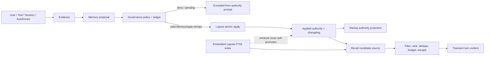

# Memory Framework Interfaces Specification

Status: GMH-20 historical baseline, amended by GMH-23A on 2026-07-30
Applies to: GMH-21 through GMH-24
Runtime impact: none

> Target architecture correction: Embedded Laputa is the only Diva-local
> Memory store and retrieval layer. Mentle/MenPalace is a removal source, not a
> target provider or fallback. See `laputa-memory-final-architecture.md`.

## 1. Purpose

This specification freezes the current Memory boundary and the target interface
rules for Memory Framework 2.0. It is based on the existing
`agent_diva_core::memory::MemoryProvider`, `MemoryManager`,
`LaputaMemoryProvider`, `HybridMemoryProvider`, Agent memory boundary, and
AutoDream/Laputa proposal flow.

There is no `agent-diva-memory` crate in the current repository or in the
audited `origin/vrm-memory-test` source. GMH-20 does not create one, restore old
branch code, or change a Rust trait. Later stories must evolve the current
boundaries incrementally.

The governing invariant is:

> Retrieval may suggest context; evidence may support a proposal; only an
> applied change owned by the authority store may become durable authority.

## 2. Terms and authority

| Term | Meaning | May enter the default prompt? | May mutate authority? |
| --- | --- | --- | --- |
| Applied authority | Reviewed and applied Laputa section, or legacy Markdown when no Laputa workspace exists | Yes, subject to rendering and budget | Only through the owning authority path |
| Evidence | Source-bound observation from a session, user, file, report, tool, AutoDream run, or compaction | No, unless selected as explicitly labelled transient context | No |
| Proposal | Requested authority change with evidence, target, diff/content digest, risk, and lifecycle state | No while pending, rejected, expired, deferred, or failed | No |
| Temporary recall | Turn/session-scoped retrieval candidate | Only after filtering, ranking, budgeting, and trust labelling | No |
| Retrieval index | Embedded Laputa SQLite FTS5, rebuildable from its typed records | Results may become temporary recall | No |
| Applied Memory/Persona | Identity, relationship, commitment, preference, long-term memory, and history authority | Yes | Laputa only in a Laputa workspace |

Memory classes retain the GMH-02 decisions:

| Class | Scope/default | Authority transition |
| --- | --- | --- |
| Session fact | Session-scoped evidence; expires unless proposed | Proposal required for durability |
| Long-term fact | Durable and source-sensitive | Proposal; review when sensitive |
| Preference | Durable and user-editable | Explicit edit or proposal |
| Commitment | Durable and high impact | Per-change approval |
| Relationship | Durable and sensitive | Per-change approval |
| Identity | Durable and highest sensitivity | Per-change approval |
| Historical summary | Bounded derived artifact | Proposal or deterministic report |
| Temporary recall | Turn/session only | Never authority |

Tombstoned, superseded, pending, rejected, expired, untrusted, or
needs-attention records are excluded from default prompt authority.

## 3. Ownership and trust boundaries

| Component | Current role | Authority status | Target rule |
| --- | --- | --- | --- |
| `MemoryManager` | Reads and writes `MEMORY.md`/`HISTORY.md` | Legacy import source only | Removed from authority after GMH-24 cutover |
| `LaputaMemoryProvider` | Renders applied Laputa sections | Read projection of the long-term authority | Must never render pending proposals |
| `LaputaService` | Proposal lifecycle, apply, changelog, rollback | Sole applied Memory/Persona owner | All Memory v2 apply operations terminate here |
| Embedded Laputa store | Typed profile-local SQLite records and FTS5 retrieval | Sole Diva-local durable Memory store | Gateway-only mutation; retrieval never self-promotes |
| `HybridMemoryProvider` | Current legacy Markdown/Mentle compatibility | Transitional only | Delete at GMH-24; must not shape the target interface |
| Mentle/Palace | Current feature-gated legacy integration | No target role | Clean-break delete dependency, feature, runtime, tools, DTOs, GUI and CI lane |
| AutoDream | Produces reports, evidence, and proposals | Never authority | Must use proposal submission |
| AgentLoop | Calls lifecycle hooks and assembles context | Orchestrator only | Cannot write authority directly |
| Manager/Tauri/GUI | Projects state and submits human decisions | Never a second truth | Hidden/visible controls are not authorization |

Workspace selection during transition is fail-closed:

1. Before cutover, existing selection behavior remains characterized, not
   endorsed as the target.
2. After cutover, the profile-local Embedded Laputa store is authoritative.
3. Store open/integrity failure is explicitly degraded and never falls back to
   Markdown or Mentle.

### 3.1 GMH-23B storage boundary

- Physical identity: `<workspace>/.laputa/memory.sqlite3`.
- Logical identity: exact tenant/workspace scope and optional session scope.
- Canonical payload: `agent_diva_core::memory::MemoryRecord`.
- Mutation: async Rust API with expected store and record revisions; it is not
  registered as a model, Manager, Tauri, or GUI capability.
- Search: bounded FTS5/BM25 candidates only; GMH-22 performs every authority,
  sensitivity, temporal, deduplication, budget, and rendering decision later.
- Compatibility: file-first authority remains untouched until GMH-24; no
  online import, dual write, Mentle reader, or fallback is permitted.

## 4. Lifecycle interfaces

### 4.1 Startup injection

Current entrypoint: `MemoryProvider::system_prompt_block`.

| Contract | Requirement |
| --- | --- |
| Call timing | Synchronous system-prompt assembly at startup/rebuild |
| Input | Workspace identity only |
| Output | Typed ready/degraded status and optional rendered block |
| Allowed work | Read already loaded/cached local authority projection |
| Forbidden work | Async I/O, runtime blocking, refresh, proposal creation, index mutation |
| Idempotency | Repeated calls over the same loaded snapshot return equivalent authority |
| Failure | Return typed degraded state; do not invent or silently switch authority |
| Audit | Startup status may be observed; rendered sensitive content must not be copied to logs |

Only applied authority is eligible for this block. The current Laputa adapter
labels provenance and excludes pending proposals. The legacy manager renders
Markdown only in a workspace where it is the selected owner.

### 4.2 Prefetch and recall

Current entrypoint: `MemoryProvider::prefetch`.

| Contract | Requirement |
| --- | --- |
| Call timing | Before model deliberation for a non-empty intent |
| Input | Workspace, intent, optional room, bounded current user context |
| Output | Typed ready/skipped/failed status and optional transient prompt block |
| Allowed work | Query retrieval indexes and assemble candidates |
| Forbidden work | Durable writes, authority mutation, proposal approval, session-end work |
| Lifetime | Turn-scoped by default; session-scoped only when explicitly retained as evidence |
| Failure | Failed recall returns no block and does not fail the normal turn |
| Audit | Record source IDs and selection reasons in GMH-22; do not log raw sensitive content |

GMH-22 must split recall into candidate retrieval, permission/sensitivity
filtering, trust filtering, relevance ranking, deduplication, time decay, token
budgeting, and final escaped rendering. A search hit alone is never prompt
authority.

### 4.3 Turn synchronization

Current entrypoint: `MemoryProvider::sync_turn`.

| Contract | Requirement |
| --- | --- |
| Call timing | After a successful turn, outside model deliberation |
| Input | Workspace and optional Memory/history evidence produced by the turn |
| Current compatibility behavior | `MemoryManager` writes Markdown; Hybrid may invoke legacy Mentle behavior |
| Target behavior | Capture normalized evidence and submit proposals; no implicit long-term promotion |
| Idempotency | GMH-23 must provide an idempotency key derived from correlation and content digest |
| Failure | Authority/evidence persistence failure is typed failed; auxiliary index failure is degraded and cannot erase a successful owner write |
| Audit | Correlate turn, session, evidence, proposal, policy decision, and eventual apply |

The current direct Markdown write is frozen only as a temporary import/cutover
source, not a target compatibility promise. GMH-23D replaces it after the
Embedded Laputa store and recall gates pass.

### 4.4 Session end

Current entrypoint: `MemoryProvider::on_session_end`.

| Contract | Requirement |
| --- | --- |
| Call timing | Session shutdown/close |
| Input | Workspace and optional stable session ID |
| Allowed work | Idempotent finalization, scheduling, or proposal trigger |
| Forbidden work | Reconstructing missed turns, direct authority mutation, unbounded consolidation |
| Idempotency | Duplicate session IDs return already-handled/no-op semantics |
| Failure | Typed failure with enough correlation to retry safely |
| Audit | One terminal session-memory lifecycle outcome per idempotency key |

Session end must not compensate for missed `sync_turn` calls. Any future
consolidation output remains evidence or a proposal until governed application.

### 4.5 Proposal submission

There is intentionally no proposal method on the current `MemoryProvider`.
GMH-23 introduces a separate write-side interface so read capability does not
imply authority mutation.

The target conceptual contract is:

```text
submit_memory_proposal(
  normalized_record_or_patch,
  evidence_refs,
  audit_correlation,
  idempotency_key
) -> proposal_id + governance_request_id + pending_status
```

Required flow:

1. Normalize and validate the proposed record under GMH-21.
2. Compute a canonical content digest without persisting raw sensitive content
   in the governance ledger.
3. Create `ApprovalRequest<MemoryProposalPayload>` using
   `Capability::MemoryPropose` and a Memory `ResourceScope`.
4. Evaluate GMH-11 policy and persist the GMH-12 request/state.
5. Keep the proposal outside default prompt authority.
6. Before apply, require `Capability::MemoryApply`; validate the receipt against
   request ID, digest, policy version, resource, expiry, and grant scope.
7. Apply atomically through `LaputaService`, then emit changelog/audit evidence.
8. On failure, remain pending/needs-attention or compensate; never report applied.

The proposal payload remains Memory-owned. Core must not gain a universal
cross-domain payload enum.

## 5. Data flow



Read and write ownership:

```text
startup prompt: applied owner snapshot -> renderer -> ContextBuilder
live recall:    authority/index -> candidates -> GMH-22 pipeline -> transient context
turn output:    AgentLoop -> evidence sink -> proposal submission
authority write:proposal -> policy/receipt -> Laputa apply -> changelog
```

## 6. Failure rules

Use a top-level error only when the interface contract itself cannot be
evaluated, inputs cannot be decoded, or the owning service cannot provide a
safe typed outcome. Expected operational failures use typed status:

- startup authority unavailable: `degraded`, no fabricated block;
- blank recall intent: `skipped`, no query;
- recall/index failure: `failed`, no recall block, normal turn continues;
- legacy Markdown owner write failure: `failed`, never persisted;
- retrieval index refresh failure after owner write: degraded/logged, owner
  transaction remains authoritative;
- proposal validation/persistence failure: no pending proposal ID;
- approval denied/expired/revoked/stale: no apply;
- apply or audit/changelog failure: no success claim; enter needs-attention or
  compensation according to GMH-23.

Errors, logs, metrics, and ledger events carry correlation IDs and bounded
references, not raw Memory values, prompts, credentials, or full tool output.

## 7. Compatibility and migration sequence

### GMH-21 — normalized records and provenance

Status: implemented without production cutover.

- `agent_diva_core::memory` owns the stable record, provenance, sensitivity,
  trust, supersession, tombstone, scope, temporal, validation, digest, and
  prompt-data escaping contracts.
- `agent_diva_laputa::memory_records` owns pure `MEMORY.md`/`HISTORY.md` and
  applied-section adapters, integrity comparison, and isolated reversible
  migration artifacts.
- Unknown classifications fail validation. AutoDream, session, tool, user, and
  compaction inputs cannot self-assign applied authority.
- Migration artifacts are written only beneath an explicit artifact root.
  They do not overwrite or register `MEMORY.md`, `HISTORY.md`, Laputa sections,
  proposals, or provider state.

### GMH-22 — recall and context budget

Status: implemented as a shadow-capable contract without production cutover.

- `agent_diva_core::memory` owns the request, candidate source, filtering,
  deterministic scoring, supersession/deduplication, token budgeting, escaped
  rendering, raw-content-free trace, and shadow comparison contracts.
- Default prompt policy accepts only applied authority and
  public/internal/private sensitivity. Restricted, unknown, untrusted, expired,
  tombstoned, cross-scope, duplicate, and superseded candidates fail closed.
- Retrieval failure is typed degraded with no prompt block or stale cache.
- Existing Mentle/Hybrid search hits remain characterized as untrusted during
  transition and are never a target source.
- GMH-23C connects this pipeline to Embedded Laputa FTS5/BM25 candidates
  through the public, shadow-only `LaputaRecallService`.

### GMH-23C — Embedded Laputa shadow recall

Status: implemented without production read cutover.

- The candidate source quotes and bounds Unicode FTS terms, reads only
  workspace-global plus exact-session rows, normalizes BM25 into basis points,
  and maps every store failure to the content-free degraded Recall contract.
- Recall scoring combines relevance with derived importance, deterministic
  effective-time decay, and query-matched identity/relationship/preference
  boosts. Importance is derived from canonical confidence, trust, and kind; no
  competing record fields or persona table exist.
- Selection takes the highest-scored record from each represented kind before
  filling remaining budget positions. Policy, scope, tombstone, supersession,
  digest deduplication, escaping, and token limits remain authoritative.
- `LaputaRecallMetrics` contains counts, reason enums, timings, IDs, digests,
  and token use only. It contains neither Memory bodies nor query text.
- `LaputaMemoryProvider::prefetch`, AgentLoop prompt assembly, Manager, Tauri,
  GUI, and legacy authority behavior remain unchanged. GMH-24 owns shadow-read
  activation and production read cutover.

### GMH-23 — proposal-only writes and storage prerequisite

- Route session sync, AutoDream, GUI edits, imports, and migrations through the
  independent proposal interface.
- Apply only through policy, ledger, receipt, and Laputa transaction/changelog.
- Completed stages 1/2 are retained. Stage 3 is paused.
- GMH-23A freezes the clean-break contract; GMH-23B ports the typed SQLite
  store; GMH-23C connects recall; GMH-23D resumes apply/HITL.

### GMH-24 — Embedded Laputa cutover and Mentle clean-break gate

- Run bounded shadow comparison and integrity/rollback fixtures.
- Measure accuracy, injection error, duplication, latency, tokens, and proposal
  acceptance.
- Cut read first, then write. Never maintain indefinite dual-write authority.
- Offline-import legacy Markdown/Laputa JSON when explicitly requested. Never
  read an old Mentle database.
- Delete `memtle`, the `mentle` feature/runtime/product surface, Mentle CI
  recipes and LLVM requirements; enforce a deletion-proof gate.

Until GMH-24 passes, current runtime behavior is a migration baseline only.
No new functionality may depend on Mentle, its DTOs, tools, database, feature,
or LLVM build lane.

## 8. Prohibited designs

- Restoring the obsolete branch-era AgentLoop or tool assembly.
- Creating an `agent-diva-memory` crate merely to match historical documents.
- Adding proposal mutation to a read provider and treating provider access as
  write authority.
- Rendering pending/rejected/expired/tombstoned/untrusted content as authority.
- Retaining Mentle as a target provider, fallback, database reader, optional
  feature, build lane, or compatibility layer.
- Treating search relevance, context compaction, or AutoDream inference as
  reviewed truth.
- Falling back from a broken Laputa workspace to Markdown without an explicit
  migration or operator decision.
- Copying raw Memory payloads into the governance ledger, logs, metrics, or
  approval digests.
- Reporting sync/apply success after owner persistence or audit failure.

## 9. Current evidence map

| Claim | Current source/evidence |
| --- | --- |
| Lifecycle method shapes | `agent-diva-core/src/memory/provider.rs` |
| Legacy Markdown startup/sync/session idempotency | `agent-diva-core/src/memory/manager.rs` tests |
| Legacy Mentle behavior to delete | `agent-diva-core/src/memory/hybrid.rs`, `agent-diva-agent/src/mentle_runtime.rs` |
| Embedded Laputa target contract | `docs/architecture/laputa-memory-final-architecture.md` |
| Port source and deletion inventory | `refactor/deep-governance`; repatriated `docs/research/laputa-diva-garden-2026-07/` |
| Laputa applied-only rendering | `agent-diva-laputa/src/memory_provider.rs` tests |
| Laputa proposal/apply lifecycle | `agent-diva-laputa/src/proposals.rs` tests |
| Broken Laputa does not silently fall back | Static selection branch in `agent-diva-agent/src/memory_boundary.rs`; focused characterization test remains a recorded gap |
| AgentLoop lifecycle invocation | `agent-diva-agent/src/agent_loop.rs` and `loop_turn.rs` tests |
| Historical branch conclusions | `docs/logs/2026-07-vrm-memory-audit/v0.0.1-vrm-memory-test-audit/` |
| Governance request/policy/ledger | `agent-diva-core/src/governance/` |

This map characterizes the current baseline; it does not authorize production
Memory v2 cutover.
