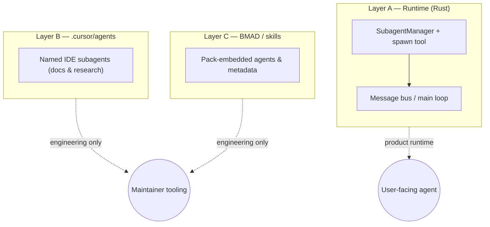

# Architecture Overview

This document provides an overview of the agent-diva architecture.

## High-Level Architecture

```
┌─────────────────────────────────────────────────────────────┐
│                        CLI (agent-diva-cli)                     │
└─────────────────────────────────────────────────────────────┘
                              │
        ┌─────────────────────┼─────────────────────┐
        ▼                     ▼                     ▼
┌──────────────┐    ┌─────────────────┐    ┌──────────────┐
│   Channels   │    │   Agent Loop    │    │    Tools     │
│              │    │                 │    │              │
│ • Telegram   │◄──►│ • Context       │◄──►│ • Filesystem │
│ • Discord    │    │ • Skills        │    │ • Shell      │
│ • Slack      │    │ • Subagents     │    │ • Web        │
│ • WhatsApp   │    │                 │    │ • Message    │
│ • Feishu     │    │                 │    │ • Spawn      │
│ • DingTalk   │    │                 │    │ • Cron       │
│ • Email      │    │                 │    │              │
│ • QQ         │    │                 │    │              │
└──────────────┘    └─────────────────┘    └──────────────┘
        │                     │                     │
        └─────────────────────┼─────────────────────┘
                              ▼
┌─────────────────────────────────────────────────────────────┐
│                     agent-diva-core                             │
│                                                              │
│  • Message Bus    • Configuration    • Session Management    │
│  • Memory System  • Error Types      • Utilities             │
└─────────────────────────────────────────────────────────────┘
                              │
                              ▼
┌─────────────────────────────────────────────────────────────┐
│                   agent-diva-providers                          │
│                                                              │
│  • OpenRouter  • Anthropic  • OpenAI  • DeepSeek  • Groq    │
│  • Gemini      • Zhipu      • DashScope  • Moonshot         │
│  • vLLM (local)  • AiHubMix                                  │
└─────────────────────────────────────────────────────────────┘
```

## Three layers of “subagent” (do not conflate)

Agent-Diva and this monorepo use the word **subagent** in three **separate** places. New contributors should treat them as different concepts; runtime behavior is **only** Layer A.

| Layer | Where it lives | Role |
|-------|----------------|------|
| **A — Runtime (Rust)** | `agent-diva-agent` (`SubagentManager`), `agent-diva-tools` (`spawn`) | Background Tokio tasks with a tool subset and their own context; results return to the main agent loop. This is the only layer that affects shipped product behavior. |
| **B — IDE named agents** | Workspace `.cursor/agents/*.md` | Research / workflow prompts for **developers** in Cursor. Not loaded by the Rust runtime; analogous to external “IDE workers,” not in-process Voices. |
| **C — BMAD / skill packs** | e.g. `.cursor/skills/**`, pack `agents/*.md` or `openai.yaml` | Workflow agents inside tooling; **Person** has no runtime dependency on them. Future GUI “capability packs” would map here conceptually, not 1:1 to prompts. |



**Canonical detail and migration notes:** [`subagent-to-swarm-migration-inventory.md`](../../../_bmad-output/planning-artifacts/subagent-to-swarm-migration-inventory.md) (SWARM-MIG-03). For swarm-specific design (SteeringLease, capabilities), see `agent-diva-swarm/docs/`.

### `spawn` (Layer A) vs FullSwarm / PRD Swarm P0

- **`spawn` tool + `SubagentManager`:** Today this is the **only** shipped path that runs an extra LLM loop in the background with a **fixed tool subset**. It is **not** the same as the in-crate **FullSwarm** orchestration path (`agent-diva-swarm`: cortex on, prelude, convergence, doctor registry wiring). Cross-process “swarm” product behavior for **v1.0.0 P0** is defined in the PRD; use that as the authority when reasoning about scope.

- **Capability alignment (SWARM-MIG-01 / Story 6.5):** Subagent tools are catalogued with stable **`tool.subagent.*` ids**, LLM `tool_name`, and **risk tier placeholders** in `agent-diva-agent::subagent_tool_capabilities`. The same catalog is echoed under **`subagent_tools`** in `SwarmCortexDoctorV1` (diagnostics / `GET /api/diagnostics/swarm-doctor`) so operators can inspect ids without reading Rust. Workspace **`capability-manifest.json`** remains the **package-level** manifest (FR10/FR11); it does not replace the built-in subagent tool table.

- **PRD cross-reference:** [`prd.md`](../../../_bmad-output/planning-artifacts/prd.md) — Swarm-class P0 items and release criteria (see also Epic 5/6 in [`epics.md`](../../../_bmad-output/planning-artifacts/epics.md)).

## Crate Responsibilities

### agent-diva-core

The foundation of the system. Provides:

- **Message Bus**: Dual-queue system for decoupled communication
- **Configuration**: Schema definitions and loading
- **Session Management**: Conversation history persistence
- **Memory System**: Long-term memory and searchable history log
- **Error Types**: Unified error handling
- **Utilities**: Common helper functions

### agent-diva-agent

The brain of the system. Provides:

- **Agent Loop**: Core processing engine
- **Context Builder**: Assembles prompts for LLM
- **Skill Loader**: Loads and manages skills
- **Subagent Manager**: Handles background tasks

### agent-diva-providers

LLM provider integrations. Provides:

- **Provider Trait**: Abstraction for LLM providers
- **LiteLLM Client**: HTTP client for LiteLLM-compatible APIs
- **Provider Registry**: Registration and lookup of providers
- **Transcription Service**: Voice-to-text via Groq Whisper

### agent-diva-channels

Chat platform integrations. Provides:

- **Channel Handler Trait**: Common interface for all channels
- **Channel Manager**: Lifecycle management of channels
- **Platform Handlers**: Telegram, Discord, Slack, etc.

### agent-diva-tools

Built-in tool implementations. Provides:

- **Tool Trait**: Interface for all tools
- **Tool Registry**: Registration and lookup
- **Tool Implementations**: Filesystem, shell, web, etc.

### agent-diva-cli

Command-line interface. Provides:

- **Commands**: onboard, gateway, agent, status, channels, cron
- **Interactive Mode**: REPL for direct interaction
- **Output Formatting**: Rich terminal output

### agent-diva-migration

Migration tool from Python version. Provides:

- **Config Migration**: Convert Python config to Rust format
- **Session Migration**: Convert Python sessions to Rust format
- **Dry-run Mode**: Preview changes without applying

## Data Flow

### Incoming Message Flow

```
Channel Handler
      │
      ▼
Message Bus (inbound queue)
      │
      ▼
Agent Loop
      │
      ├─► Context Builder (assemble prompt)
      │
      ├─► LLM Provider (get response)
      │
      ├─► Tool Execution (if needed)
      │
      ▼
Message Bus (outbound queue)
      │
      ▼
Channel Handler (send response)
```

### Session Persistence Flow

```
Agent Loop
      │
      ▼
Session Manager
      │
      ├─► In-memory cache (fast access)
      │
      └─► JSONL file (persistent storage)
```

### Memory Access Flow

```
Context Builder
      │
      ▼
Memory Manager
      │
      ├─► MEMORY.md (long-term memory)
      │
      └─► HISTORY.md (append-only memory history)
```

## Async Architecture

Agent Diva uses Tokio as its async runtime with the following patterns:

- **Multi-threaded scheduler**: `rt-multi-thread` for I/O-bound operations
- **Channels**: `tokio::sync::mpsc` for message passing
- **Task spawning**: `tokio::spawn` for concurrent operations
- **Graceful shutdown**: Signal handling for clean termination

## Error Handling

We use a layered error handling approach:

- **thiserror**: For library error types (agent-diva-core, etc.)
- **anyhow**: For application error handling (agent-diva-cli)
- **Structured errors**: Specific error types for different failure modes

## Configuration

Configuration is loaded from multiple sources (in order of precedence):

1. Environment variables (`AGENT_DIVA__*`)
2. Configuration file (`~/.agent-diva/config.json`)
3. Default values

## Security Considerations

- **Workspace restriction**: Tools can be restricted to workspace directory
- **Path validation**: All file operations validate paths
- **Allowlists**: Channels support user allowlists
- **No secrets in logs**: API keys are redacted from logs

## Performance Considerations

- **Zero-copy where possible**: Using `Cow<str>` for string handling
- **Connection pooling**: HTTP clients reuse connections
- **Caching**: Tool schemas and skills are cached
- **Lazy loading**: Sessions loaded on demand

## Testing Strategy

- **Unit tests**: In-module tests for individual functions
- **Integration tests**: Cross-crate functionality
- **Mocking**: External services mocked for tests
- **CI/CD**: Automated testing on multiple platforms
