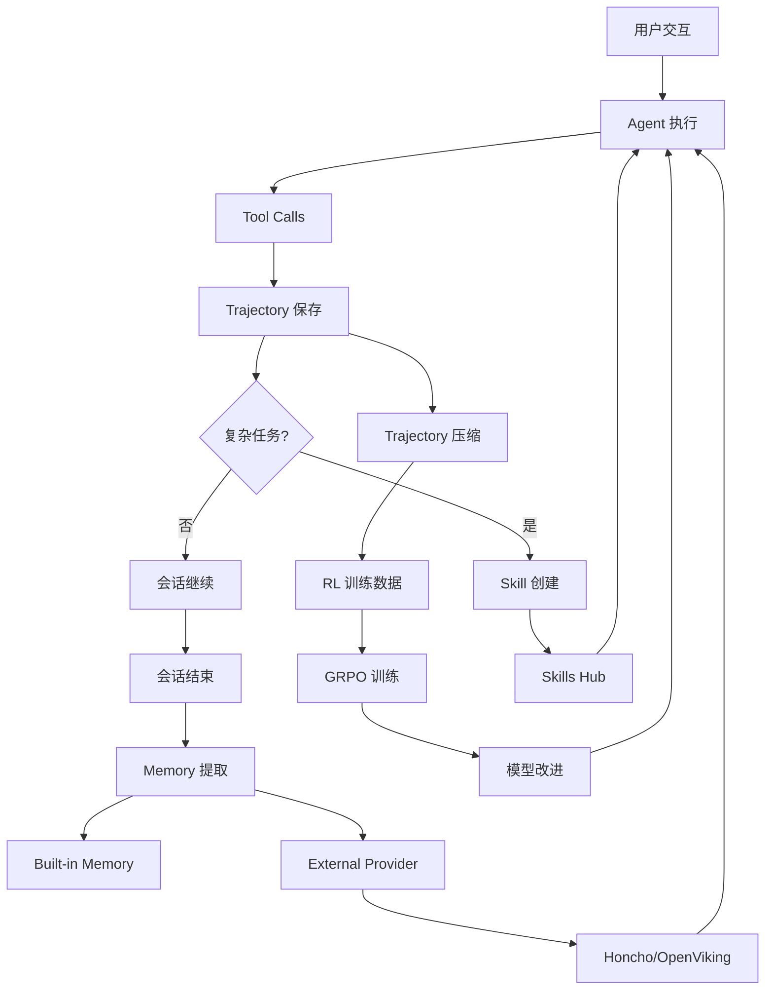

# Hermes 自我学习能力详解

> **版本**: v0.1.0-draft  
> **日期**: 2026-04-05

---

## 1. RL 训练闭环（Tinker-Atropos）

### 1.1 架构概览

Hermes 集成了完整的 RL 训练管道，基于 **Tinker-Atropos** 框架实现 GRPO（Group Relative Policy Optimization）算法。

**三进程协同架构**：

```
┌─────────────────────────────────────────────────────────────┐
│  Atropos API Server (port 8000)                             │
│  - Trajectory 协调                                           │
│  - Rollout group 管理                                        │
│  - Advantage 计算                                            │
└─────────────────────────────────────────────────────────────┘
                          ↕
┌─────────────────────────────────────────────────────────────┐
│  Environment (BaseEnv 实现)                                  │
│  - 数据集加载（HuggingFace）                                 │
│  - Prompt 构建                                               │
│  - Scoring/Verification                                      │
└─────────────────────────────────────────────────────────────┘
                          ↕
┌─────────────────────────────────────────────────────────────┐
│  Tinker Trainer (port 8001)                                 │
│  - LoRA 训练                                                 │
│  - FastAPI 推理服务器                                        │
│  - Optimizer steps (Adam)                                   │
└─────────────────────────────────────────────────────────────┘
```

### 1.2 GRPO 算法核心

**Group Relative Policy Optimization** 的关键特性：

- **无需单独 reward model**：通过组内比较学习
- **Group size**：每个 prompt 生成 8-16 个 completions
- **Advantage 计算**：组内相对排名决定梯度方向
- **Importance sampling**：处理 on-policy 和 off-policy 数据

**训练循环**：

```python
for step in range(total_steps):
    # 1. 从 Atropos 获取 batch
    batch = atropos.fetch_batch(batch_size=128)
    
    # 2. 转换为 Tinker Datum
    data = [Datum(tokens, logprobs, advantages) for item in batch]
    
    # 3. Forward-backward pass
    loss = trainer.forward_backward(data)
    
    # 4. Optimizer step
    trainer.step(lr=4e-5, beta1=0.9, beta2=0.95)
    
    # 5. 保存权重并创建新 sampling client
    trainer.save_checkpoint()
    sampling_client = trainer.create_sampling_client()
    
    # 6. 记录指标到 WandB
    wandb.log({"loss": loss, "reward_mean": batch.reward_mean})
```

### 1.3 环境发现机制

**AST 扫描动态加载**：

```python
# tools/rl_training_tool.py
def discover_environments():
    env_dir = Path("tinker-atropos/tinker_atropos/environments")
    environments = []
    
    for py_file in env_dir.glob("*.py"):
        tree = ast.parse(py_file.read_text())
        for node in ast.walk(tree):
            if isinstance(node, ast.ClassDef):
                # 检查是否继承 BaseEnv
                if any(base.id == "BaseEnv" for base in node.bases):
                    environments.append({
                        "name": node.name,
                        "file": py_file.name,
                        "docstring": ast.get_docstring(node)
                    })
    
    return environments
```

**环境定义示例（GSM8K）**：

```python
class GSM8KEnv(BaseEnv):
    def load_dataset(self):
        return load_dataset("gsm8k", "main", split="train")
    
    def get_next_item(self):
        item = self.dataset[self.current_index]
        return {
            "prompt": f"Question: {item['question']}\nAnswer:",
            "reference": item["answer"]
        }
    
    def score_answer(self, completion, reference):
        # 提取数字答案
        pred = extract_number(completion)
        true = extract_number(reference)
        
        # 正确性 reward
        correctness = 1.0 if pred == true else 0.0
        
        # 格式 reward（是否包含推理步骤）
        format_score = 0.5 if "<<" in completion else 0.0
        
        return {
            "correctness": correctness,
            "format": format_score,
            "total": correctness + format_score
        }
```

### 1.4 配置管理

**Locked fields（基础设施参数，不可修改）**：

```yaml
tokenizer_name: "Qwen/Qwen3-8B"
rollout_server_url: "http://localhost:8000"
max_token_length: 8192
max_num_workers: 2048
total_steps: 2500
lora_rank: 32
learning_rate: 4e-5
max_token_trainer_length: 9000
```

**Configurable fields（可调整）**：

```yaml
group_size: 16              # 每个 prompt 的 completions 数量
batch_size: 128             # 训练 batch size
wandb_name: "gsm8k-run-1"   # WandB 运行名称
temperature: 0.7            # 采样温度
```

### 1.5 Inference Testing

**快速验证环境（无需 Tinker API）**：

```python
# 使用 OpenRouter 测试环境
def test_inference(env_name, steps=3, group_size=16):
    models = [
        "qwen/qwen3-8b",           # Small
        "z-ai/glm-4.7-flash",      # Medium
        "minimax/minimax-m2.7"     # Large
    ]
    
    for model in models:
        for step in range(steps):
            # 生成 completions
            completions = [
                openrouter.complete(prompt, model=model)
                for _ in range(group_size)
            ]
            
            # 评分
            scores = [env.score_answer(c) for c in completions]
            
            # 验证
            assert all(s is not None for s in scores)
```

**验证内容**：
- 环境加载正确
- Prompt 构建有效
- 推理响应解析鲁棒（跨模型规模）
- Verifier/scoring 逻辑产生有效 rewards

---

## 2. Trajectory 数据生成与压缩

### 2.1 压缩策略

**保护头尾，压缩中间**：

```
原始 trajectory（100 turns，20k tokens）：
┌─────────────────────────────────────────────────────────────┐
│ [保护区] system, first human, first gpt, first tool         │
├─────────────────────────────────────────────────────────────┤
│ [压缩区] 2nd tool response ~ (N-4)th turn                    │
│          → 用单个 human summary 消息替换                      │
├─────────────────────────────────────────────────────────────┤
│ [保护区] 最后 4 turns（最终动作和结论）                      │
└─────────────────────────────────────────────────────────────┘

压缩后 trajectory（15k tokens）：
┌─────────────────────────────────────────────────────────────┐
│ [保护区] system, first human, first gpt, first tool         │
├─────────────────────────────────────────────────────────────┤
│ [摘要] "You previously executed X, Y, Z tools..."           │
├─────────────────────────────────────────────────────────────┤
│ [保护区] 最后 4 turns                                        │
└─────────────────────────────────────────────────────────────┘
```

**压缩算法**：

```python
# trajectory_compressor.py
def compress_trajectory(messages, target_max_tokens=15250):
    # 1. 识别保护区
    protected_head = identify_protected_head(messages)  # system, first human/gpt/tool
    protected_tail = messages[-4:]  # 最后 4 turns
    
    # 2. 计算中间区域
    middle_start = len(protected_head)
    middle_end = len(messages) - 4
    middle_messages = messages[middle_start:middle_end]
    
    # 3. 估算 tokens
    head_tokens = estimate_tokens(protected_head)
    tail_tokens = estimate_tokens(protected_tail)
    middle_tokens = estimate_tokens(middle_messages)
    total_tokens = head_tokens + middle_tokens + tail_tokens
    
    # 4. 如果超出预算，压缩中间区域
    if total_tokens > target_max_tokens:
        tokens_to_save = total_tokens - target_max_tokens + 750  # 摘要预留
        
        # 5. 调用 LLM 生成摘要
        summary = await summarize_middle_section(
            middle_messages,
            target_tokens=750,
            model="google/gemini-3-flash-preview"
        )
        
        # 6. 构建压缩后的 trajectory
        compressed = protected_head + [
            {"role": "user", "content": summary}
        ] + protected_tail
        
        return compressed
    
    return messages  # 无需压缩
```

### 2.2 并行处理

**异步 API 调用 + Semaphore 限流**：

```python
async def compress_batch(trajectories, max_concurrent=50):
    semaphore = asyncio.Semaphore(max_concurrent)
    
    async def compress_one(traj):
        async with semaphore:
            try:
                return await compress_trajectory(traj, timeout=300)
            except asyncio.TimeoutError:
                logger.error(f"Timeout compressing {traj['id']}")
                return None
    
    tasks = [compress_one(t) for t in trajectories]
    results = await asyncio.gather(*tasks, return_exceptions=True)
    
    return [r for r in results if r is not None]
```

### 2.3 数据流

**从数据集到训练数据**：

```
HuggingFace datasets
    ↓ 随机采样（min_tokens 过滤）
JSONL batches (每个 1000 条)
    ↓ 并行压缩（50 concurrent requests）
Compressed JSONL
    ↓ 合并为单个文件
Final training data (ShareGPT 格式)
    ↓ 上传到训练服务器
RL Training
```

**ShareGPT 格式**：

```json
{
  "conversations": [
    {"from": "system", "value": "You are a helpful assistant."},
    {"from": "human", "value": "What is 2+2?"},
    {"from": "gpt", "value": "2+2 equals 4."}
  ]
}
```

---

## 3. 技能系统（程序性记忆）

### 3.1 自动创建触发条件

**何时创建技能**：

1. **复杂任务成功**：5+ tool calls，最终成功
2. **错误恢复**：遇到错误或死胡同，找到工作路径
3. **用户纠正**：用户纠正其方法
4. **非平凡工作流**：发现可复用的模式

**触发器实现**：

```python
# run_agent.py
def should_create_skill(conversation_history):
    tool_calls = [m for m in conversation_history if m.get("tool_calls")]
    
    # 条件 1：5+ tool calls
    if len(tool_calls) < 5:
        return False
    
    # 条件 2：最终成功（无错误消息）
    last_messages = conversation_history[-3:]
    has_error = any("error" in m.get("content", "").lower() for m in last_messages)
    if has_error:
        return False
    
    # 条件 3：非平凡（使用了多种工具）
    unique_tools = set(tc["name"] for m in tool_calls for tc in m["tool_calls"])
    if len(unique_tools) < 3:
        return False
    
    return True
```

### 3.2 技能操作

**CRUD 操作**：

```python
# tools/skill_manager_tool.py

# Create - 从头创建新技能
skill_create(
    name="deploy-to-railway",
    description="Deploy a Node.js app to Railway",
    content="""
# Deploy to Railway

## When to use
- Deploying Node.js applications
- Need automatic HTTPS and domain

## Steps
1. Install Railway CLI: `npm i -g @railway/cli`
2. Login: `railway login`
3. Initialize: `railway init`
4. Deploy: `railway up`
    """
)

# Patch - 目标修复（首选，token 高效）
skill_patch(
    name="deploy-to-railway",
    operation="add_step",
    location="after:railway init",
    content="5. Link to project: `railway link <project-id>`"
)

# Edit - 主要结构重写
skill_edit(
    name="deploy-to-railway",
    new_content="..."  # 完整的新内容
)

# Delete - 完全删除
skill_delete(name="deploy-to-railway")

# 管理支持文件
skill_write_file(
    skill_name="deploy-to-railway",
    path="references/railway-cli-docs.md",
    content="..."
)
```

### 3.3 安全扫描

**检查项**：

```python
def scan_skill_content(content):
    risks = []
    
    # 1. 数据泄露
    if re.search(r"(api[_-]?key|password|secret|token)\s*[:=]", content, re.I):
        risks.append("potential_data_leak")
    
    # 2. Prompt injection
    if "ignore previous instructions" in content.lower():
        risks.append("prompt_injection")
    
    # 3. 破坏性命令
    dangerous_commands = ["rm -rf", "dd if=", "mkfs", "> /dev/sda"]
    if any(cmd in content for cmd in dangerous_commands):
        risks.append("destructive_command")
    
    # 4. 供应链信号
    if re.search(r"curl.*\|\s*bash", content):
        risks.append("supply_chain_risk")
    
    return risks

def is_dangerous(risks):
    return len(risks) >= 2 or "destructive_command" in risks
```

### 3.4 渐进式披露

**三级信息披露**：

```python
# Level 0: 列表（~3k tokens）
skills_list()
# 返回：[{"name": "...", "description": "...", "category": "..."}]

# Level 1: 完整内容（~10k tokens）
skill_view(name="deploy-to-railway")
# 返回：完整 SKILL.md + 元数据

# Level 2: 特定参考文件
skill_view(name="deploy-to-railway", path="references/railway-cli-docs.md")
# 返回：单个参考文件内容
```

---

## 4. 记忆系统（声明性知识）

### 4.1 架构

**Built-in + External 双层架构**：

```
┌─────────────────────────────────────────────────────────────┐
│  MemoryManager                                              │
│  - 协调 built-in 和 external providers                      │
│  - 自动化流程编排                                            │
└─────────────────────────────────────────────────────────────┘
         ↓                                    ↓
┌──────────────────────┐          ┌──────────────────────────┐
│  Built-in Provider   │          │  External Provider       │
│  (始终活跃)           │          │  (最多一个)               │
│  - MEMORY.md         │          │  - Honcho                │
│  - USER.md           │          │  - OpenViking            │
│  - 工具：save_memory │          │  - Mem0                  │
└──────────────────────┘          │  - Hindsight             │
                                  │  - Holographic           │
                                  │  - RetainDB              │
                                  │  - ByteRover             │
                                  └──────────────────────────┘
```

### 4.2 自动化流程

**每轮对话的记忆操作**：

```python
# agent/memory_manager.py
class MemoryManager:
    async def on_turn_start(self, user_message):
        # 1. Prefetch（后台预取相关记忆）
        await self.prefetch_all(user_message)
    
    async def on_turn_end(self, user_message, assistant_message):
        # 2. Sync（同步对话到提供者）
        await self.sync_turn(user_message, assistant_message)
    
    async def on_session_end(self, messages):
        # 3. Extract（提取记忆）
        await self.extract_memories(messages)
        
        # 4. Mirror（内置记忆写入镜像到外部）
        if self.external_provider:
            await self.mirror_to_external()
```

**System prompt 注入**：

```python
def build_system_prompt(self):
    blocks = []
    
    # Built-in memory
    blocks.append(self.builtin.system_prompt_block())
    
    # External provider context
    if self.external_provider:
        blocks.append(self.external_provider.system_prompt_block())
    
    return "\n\n".join(blocks)
```

### 4.3 Honcho 特色（用户建模）

**Dialectic Q&A**：

```python
# Honcho 在会话结束时提问
questions = honcho.generate_questions(conversation)
# ["What programming languages does the user prefer?",
#  "What is the user's experience level with Docker?"]

# 用户回答后，Honcho 更新 profile
honcho.update_profile(user_id, questions, answers)

# 下次对话时，Honcho 提供上下文
context = honcho.get_user_context(user_id)
# "User prefers Python and TypeScript. Intermediate Docker experience."
```

**Semantic search**：

```python
# 跨会话搜索
results = honcho.search(
    user_id=user_id,
    query="docker deployment issues",
    limit=5
)
# 返回：相关的历史对话片段 + 结论
```

### 4.4 OpenViking 特色（分层检索）

**文件系统式层次结构**：

```
knowledge/
├── profile/
│   ├── basics.md          # L0: 基本信息
│   └── preferences.md     # L1: 偏好详情
├── entities/
│   ├── people.md          # L0: 人物列表
│   └── organizations.md   # L1: 组织详情
└── patterns/
    ├── workflows.md       # L0: 工作流摘要
    └── best-practices.md  # L2: 最佳实践全文
```

**分层加载**：

```python
# L0: 概览（~100 tokens）
context_l0 = openviking.load_context(level=0)

# L1: 中等详情（~2k tokens）
context_l1 = openviking.load_context(level=1, categories=["profile", "entities"])

# L2: 完整内容（按需）
context_l2 = openviking.load_context(level=2, path="patterns/best-practices.md")
```

---

## 5. 完整学习闭环

### 5.1 闭环流程图



### 5.2 关键差异化特性

**与其他智能体框架的区别**：

1. **Agent-curated memory**：定期 nudges，agent 决定何时持久化知识
2. **Autonomous skill creation**：复杂任务后自动创建技能
3. **Skills self-improve**：使用期间通过 `patch` 操作改进
4. **FTS5 session search**：跨会话召回，LLM 摘要
5. **Dialectic user modeling**：Honcho 提供跨会话用户理解
6. **Closed training loop**：Trajectory → 压缩 → RL 训练 → 部署

---

## 6. Rust 实现考虑

### 6.1 Trajectory 保存

**Rust 实现**：

```rust
// agent-diva-core/src/trajectory/mod.rs
pub struct TrajectoryStore {
    output_dir: PathBuf,
}

impl TrajectoryStore {
    pub async fn save_trajectory(&self, session_id: &str, messages: &[Message]) -> Result<()> {
        let trajectory = Trajectory {
            id: session_id.to_string(),
            conversations: messages.iter().map(|m| Conversation {
                from: match m.role {
                    Role::System => "system",
                    Role::User => "human",
                    Role::Assistant => "gpt",
                    Role::Tool => "tool",
                }.to_string(),
                value: m.content.clone(),
            }).collect(),
        };
        
        let path = self.output_dir.join(format!("{}.json", session_id));
        let json = serde_json::to_string_pretty(&trajectory)?;
        tokio::fs::write(path, json).await?;
        
        Ok(())
    }
}
```

### 6.2 Trajectory 压缩

**调用外部 Python 脚本**：

```rust
// agent-diva-core/src/trajectory/compressor.rs
pub async fn compress_trajectory(input_path: &Path, output_path: &Path) -> Result<()> {
    let output = Command::new("python")
        .arg("scripts/trajectory_compressor.py")
        .arg("--input").arg(input_path)
        .arg("--output").arg(output_path)
        .arg("--target-max-tokens").arg("15250")
        .output()
        .await?;
    
    if !output.status.success() {
        return Err(anyhow!("Compression failed: {}", String::from_utf8_lossy(&output.stderr)));
    }
    
    Ok(())
}
```

### 6.3 技能系统

**Rust 实现**：

```rust
// agent-diva-agent/src/skills/manager.rs
pub struct SkillManager {
    skills_dir: PathBuf,
    cache: HashMap<String, Skill>,
}

impl SkillManager {
    pub async fn should_create_skill(&self, history: &[Message]) -> bool {
        let tool_calls: Vec<_> = history.iter()
            .filter(|m| !m.tool_calls.is_empty())
            .collect();
        
        // 条件 1：5+ tool calls
        if tool_calls.len() < 5 {
            return false;
        }
        
        // 条件 2：最终成功
        let last_messages = &history[history.len().saturating_sub(3)..];
        let has_error = last_messages.iter()
            .any(|m| m.content.to_lowercase().contains("error"));
        if has_error {
            return false;
        }
        
        // 条件 3：非平凡
        let unique_tools: HashSet<_> = tool_calls.iter()
            .flat_map(|m| &m.tool_calls)
            .map(|tc| &tc.name)
            .collect();
        if unique_tools.len() < 3 {
            return false;
        }
        
        true
    }
    
    pub async fn create_skill(&mut self, name: &str, content: &str) -> Result<()> {
        // 安全扫描
        let risks = self.scan_content(content);
        if self.is_dangerous(&risks) {
            return Err(anyhow!("Skill content failed security scan: {:?}", risks));
        }
        
        // 写入文件
        let skill_dir = self.skills_dir.join(name);
        tokio::fs::create_dir_all(&skill_dir).await?;
        tokio::fs::write(skill_dir.join("SKILL.md"), content).await?;
        
        // 更新缓存
        self.cache.insert(name.to_string(), Skill::parse(content)?);
        
        Ok(())
    }
}
```

### 6.4 RL 训练编排

**调用外部 Python 进程**：

```rust
// agent-diva-core/src/rl/trainer.rs
pub struct RLTrainer {
    tinker_api_key: String,
    wandb_api_key: String,
}

impl RLTrainer {
    pub async fn start_training(&self, env_name: &str, config: &TrainingConfig) -> Result<String> {
        let run_id = Uuid::new_v4().to_string();
        
        // 启动 Python RL CLI
        let child = Command::new("python")
            .arg("rl_cli.py")
            .arg("--environment").arg(env_name)
            .arg("--run-id").arg(&run_id)
            .arg("--config").arg(serde_json::to_string(config)?)
            .env("TINKER_API_KEY", &self.tinker_api_key)
            .env("WANDB_API_KEY", &self.wandb_api_key)
            .spawn()?;
        
        // 存储进程 ID 用于后续监控
        self.store_process(run_id.clone(), child.id())?;
        
        Ok(run_id)
    }
    
    pub async fn check_status(&self, run_id: &str) -> Result<TrainingStatus> {
        // 查询 WandB API 获取训练状态
        let url = format!("https://api.wandb.ai/runs/{}", run_id);
        let response: WandbRunResponse = reqwest::get(&url).await?.json().await?;
        
        Ok(TrainingStatus {
            step: response.summary.step,
            reward_mean: response.summary.reward_mean,
            percent_correct: response.summary.percent_correct,
        })
    }
}
```

---

**文档版本**：v0.1.0-draft  
**最后更新**：2026-04-05
