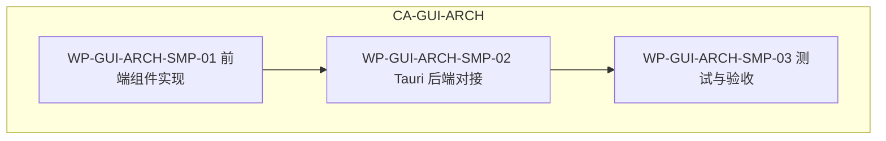

# CA-GUI-ARCH：ServiceManagementPanel 服务生命周期管理 UI 设计

> 本文档为 Agent Diva GUI 设置页中 **ServiceManagementPanel** 区域的 UI 设计规范，对应 `CA-GUI-ARCH` 控制账户下的服务生命周期管理能力。  
> 设计遵循 `agent-diva-gui-pm-ui` 技能中的设计系统与组件映射。

---

## 1. 设计目标与范围

### 1.1 目标

在 **设置 → 通用设置** 页面中，提供本机 Agent Diva 网关服务的生命周期管理界面，支持：

- **状态展示**：安装状态、运行状态、可执行路径等
- **生命周期操作**：安装、卸载、启动、停止
- **平台适配**：Windows Service、Linux systemd、macOS launchd（受控降级）

### 1.2 边界

- **可见性**：仅在打包应用（`is_bundled === true`）且平台为 `windows` / `linux` / `macos` 时完整展示；开发模式下显示灰显提示
- **可操作性**：Windows、Linux 支持完整操作；macOS 当前为受控降级，仅展示状态与“待接入”提示
- **位置**：`GeneralSettings.vue` 内的独立区块，不新增路由

---

## 2. 信息架构

### 2.1 组件层级

```
SettingsView
└── GeneralSettings
    ├── ChatSettings（聊天显示偏好）
    └── ServiceManagementPanel  ← 本设计对象
        ├── PanelHeader（标题 + 刷新）
        ├── RuntimeInfoBar（运行时 / 平台）
        ├── ServiceStatusCard（状态详情）
        ├── ServiceActionButtons（操作按钮组）
        └── PlatformNotice（平台提示 / 错误）
```

### 2.2 状态模型

| 状态维度 | 取值 | 说明 |
|----------|------|------|
| `installed` | `true` / `false` | 服务是否已安装 |
| `running` | `true` / `false` | 服务是否正在运行 |
| `busy` | `true` / `false` | 是否有操作进行中（安装/卸载/启停） |
| `error` | `string \| null` | 最近一次错误信息 |
| `platform` | `windows` / `linux` / `macos` | 当前平台 |
| `is_bundled` | `boolean` | 是否为打包应用 |

### 2.3 服务状态文案映射（i18n）

| 条件 | 文案 Key | 示例（en） |
|------|----------|------------|
| 状态未知 | `general.serviceStateUnknown` | Unknown |
| 未安装 | `general.serviceStateNotInstalled` | Not installed |
| 已安装未运行 | `general.serviceStateInstalled` | Installed / stopped |
| 已安装且运行 | `general.serviceStateRunning` | Installed / running |

---

## 3. 布局与视觉规范

### 3.1 容器结构

```
┌─────────────────────────────────────────────────────────────┐
│ [ServerCog] Service Management                    [Refresh]   │
│ Runtime: Bundled app · Platform: Windows                      │
├─────────────────────────────────────────────────────────────┤
│ Service state: Installed / running                            │
│ Installed: Yes                                                │
│ Running: Yes                                                  │
│ [details / executable_path 如有]                              │
├─────────────────────────────────────────────────────────────┤
│ [Install service] [Start] [Stop] [Uninstall service]         │
│ [平台提示 / 错误信息]                                          │
└─────────────────────────────────────────────────────────────┘
```

### 3.2 设计系统对齐

| 元素 | 类 / Token | 说明 |
|------|------------|------|
| 外层卡片 | `bg-white border border-gray-100 rounded-xl p-4` | 与 ChatSettings 卡片一致 |
| 标题区 | `flex items-center gap-2` + `ServerCog` 图标 | 图标 `text-violet-500` |
| 主按钮（安装） | `bg-violet-600 text-white hover:bg-violet-700` | 主操作 |
| 次按钮（启停） | `border border-gray-200 text-gray-700 hover:bg-gray-50` | 次要操作 |
| 危险按钮（卸载） | `border border-red-200 text-red-600 hover:bg-red-50` | 破坏性操作 |
| 禁用态 | `disabled:opacity-60` | 统一禁用样式 |
| 错误文案 | `text-xs text-red-600 break-words` | 错误提示 |
| 平台提示 | `text-xs text-amber-600` | macOS 受控降级 |

### 3.3 主题支持

- **theme-default**：使用 `gray-*`、`violet-*`、`red-*` 等默认色
- **theme-dark**：依赖 `theme-dark` 根类，`.text-gray-*` 等由 `styles.css` 自动覆盖为浅色
- **theme-love**：若需强调色适配，可将主按钮改为 `pink-500` 系，与 `.chat-bubble-user` 等保持一致

---

## 4. 交互流程

### 4.1 生命周期操作与按钮可用性

| 操作 | 前置条件 | 按钮可用性 |
|------|----------|------------|
| 安装服务 | `!installed` 且 `serviceActionsEnabled` | 安装按钮可用 |
| 启动服务 | `installed` 且 `!running` | 启动按钮可用 |
| 停止服务 | `installed` 且 `running` | 停止按钮可用 |
| 卸载服务 | `installed` | 卸载按钮可用（建议二次确认，当前实现为直接执行） |

### 4.2 操作流程

```
用户点击操作
    → 设置 serviceBusy = true，清空 serviceError
    → 调用对应 Tauri command（install_service / start_service / stop_service / uninstall_service）
    → 成功：refreshServiceStatus()，更新 serviceStatus
    → 失败：设置 serviceError，保持 serviceStatus
    →  finally：serviceBusy = false
```

### 4.3 平台差异化

| 平台 | 安装按钮文案 | 卸载按钮文案 | 启停 | 备注 |
|------|--------------|--------------|------|------|
| Windows | Install service | Uninstall service | ✓ | 完整支持 |
| Linux | Install systemd service | Uninstall systemd service | ✓ | 完整支持 |
| macOS | Install launchd service | Uninstall launchd service | ✗ | 受控降级，显示 `servicePlatformPending` |

---

## 5. 组件实现规范

### 5.1 PanelHeader

- **结构**：左侧图标 + 标题 + 副标题；右侧刷新按钮
- **刷新按钮**：`disabled` 当 `serviceBusy || !servicePanelEnabled`
- **i18n**：`general.serviceTitle`、`general.refreshService`、`general.runtimeLabel`、`general.platformLabel`

### 5.2 ServiceStatusCard

- **展示字段**：`serviceState`、`installed`、`running`、`details`、`executable_path`
- **空态**：`serviceStatus === null` 时显示“Unknown”或加载中
- **i18n**：`general.serviceState`、`general.serviceInstalled`、`general.serviceRunning`、`general.yes`、`general.no`

### 5.3 ServiceActionButtons

- **按钮顺序**（从左到右）：安装 → 启动 → 停止 → 卸载
- **安装**：主按钮样式，`!installed` 时突出
- **启停**：次按钮样式，`installed` 时可用
- **卸载**：危险样式，`installed` 时可用
- **统一**：`serviceBusy` 时全部 `disabled`

### 5.4 PlatformNotice

- **macOS**：显示 `general.servicePlatformPending`，`text-amber-600`
- **错误**：`serviceError` 非空时显示，`text-red-600`

### 5.5 开发模式占位

当 `!servicePanelEnabled` 时：

- 显示 `general.serviceOnlyBundled` 标题
- 显示 `general.serviceOnlyBundledDesc` 描述
- 不展示状态卡片与操作按钮
- 若有 `serviceError`（如 getRuntimeInfo 失败）仍展示

---

## 6. i18n Key 清单

以下 key 已在 `locales/en.ts` 与 `locales/zh.ts` 的 `general` 命名空间下定义，设计时需保持一致：

| Key | 用途 |
|-----|------|
| `general.serviceTitle` | 面板标题 |
| `general.runtimeLabel` | 运行时标签 |
| `general.platformLabel` | 平台标签 |
| `general.runtimeBundled` | 打包应用 |
| `general.runtimeDev` | 开发模式 |
| `general.refreshService` | 刷新按钮 |
| `general.serviceState` | 状态标签 |
| `general.serviceInstalled` | 已安装 |
| `general.serviceRunning` | 运行中 |
| `general.serviceStateUnknown` | 未知 |
| `general.serviceStateNotInstalled` | 未安装 |
| `general.serviceStateInstalled` | 已安装/已停止 |
| `general.serviceStateRunning` | 已安装/运行中 |
| `general.installService` | 安装服务（Windows） |
| `general.uninstallService` | 卸载服务（Windows） |
| `general.installSystemd` | 安装 systemd 服务 |
| `general.uninstallSystemd` | 卸载 systemd 服务 |
| `general.installLaunchd` | 安装 launchd 服务 |
| `general.uninstallLaunchd` | 卸载 launchd 服务 |
| `general.startService` | 启动服务 |
| `general.stopService` | 停止服务 |
| `general.yes` / `general.no` | 是/否 |
| `general.serviceOnlyBundled` | 仅打包可用标题 |
| `general.serviceOnlyBundledDesc` | 仅打包可用描述 |
| `general.servicePlatformPending` | 平台待接入提示 |

---

## 7. Tauri Commands 依赖

| Command | 用途 |
|---------|------|
| `get_runtime_info` | 获取 `platform`、`is_bundled`、`resource_dir` |
| `get_service_status` | 获取 `installed`、`running`、`state`、`details`、`executable_path` |
| `install_service` | 安装系统服务 |
| `uninstall_service` | 卸载系统服务 |
| `start_service` | 启动已安装服务 |
| `stop_service` | 停止运行中服务 |

前端 API 封装见 `agent-diva-gui/src/api/desktop.ts`。

---

## 8. 验收标准

### 8.1 功能验收

- [ ] 打包应用中，`is_bundled === true` 且平台合法时，服务管理面板完整展示
- [ ] 状态刷新按钮可正确拉取 `get_service_status` 并更新 UI
- [ ] Windows / Linux：安装、启动、停止、卸载按钮可正常触发并更新状态
- [ ] macOS：显示受控降级提示，操作按钮 `disabled` 或隐藏
- [ ] 开发模式下：显示“仅打包应用可用”占位，无操作按钮
- [ ] 操作失败时，错误信息在 `PlatformNotice` 区域展示

### 8.2 视觉与主题

- [ ] 与 ChatSettings 卡片风格一致（圆角、边框、内边距）
- [ ] `theme-default`、`theme-dark`、`theme-love` 下无错位或对比度问题
- [ ] 800px 宽度下布局正常，按钮组可换行

### 8.3 国际化

- [ ] 所有用户可见文案均有 i18n key，中英文切换正常

### 8.4  smoke 测试

- [ ] `just ci` 通过
- [ ] `pnpm tauri dev` 启动 GUI，进入设置 → 通用，验证开发模式占位
- [ ] 打包后在同一平台进入设置 → 通用，验证服务管理面板展示与操作（若环境允许）

---

## 9. 实现位置索引

| 文件 | 职责 |
|------|------|
| `agent-diva-gui/src/components/settings/GeneralSettings.vue` | ServiceManagementPanel 主实现 |
| `agent-diva-gui/src/api/desktop.ts` | Tauri commands 封装 |
| `agent-diva-gui/src-tauri/src/commands.rs` | 后端 command 实现 |
| `agent-diva-gui/src/locales/en.ts`、`zh.ts` | i18n 文案 |
| `agent-diva-gui/src/styles.css` | 主题与全局样式 |

---

## 10. 与 WBS 的映射

本 UI 设计对应：

- **CA-GUI-ARCH**：GUI 控制面架构与后端集成
- **WP-GUI-CMDS-00**：服务管理板块（Service Management Panel）界面与交互
- **WP-GUI-CMDS-04**：运行时信息与服务状态命令

与 `wbs-gui-cross-platform-app.md` 中 WP-GUI-CMDS-00、WP-GUI-CMDS-04 的实施步骤与测试验收保持一致。

---

## 11. 技术增强版 WBS 实施规范

本节按技术增强版 WBS 要求，将 ServiceManagementPanel 拆解为可执行工作包，明确控制账户、技术路线、代码级实践与测试流程。

### 11.1 工作包概览



| WP | 职责 | 输入 | 输出 |
|----|------|------|------|
| WP-GUI-ARCH-SMP-01 | 前端 ServiceManagementPanel 组件实现 | 第 3–5 章设计规范 | GeneralSettings.vue 内嵌面板 |
| WP-GUI-ARCH-SMP-02 | Tauri commands 与 CLI/脚本桥接 | WP-GUI-CMDS-04 约定 | get_runtime_info、get_service_status、install/start/stop/uninstall_service |
| WP-GUI-ARCH-SMP-03 | 测试与验收 | WP-QA-DESKTOP-01/02/03 | verification.md、smoke 记录 |

---

### WP-GUI-ARCH-SMP-01：前端组件实现

#### 概述

在 `GeneralSettings.vue` 内实现 ServiceManagementPanel 区域，按第 3–5 章设计规范完成 PanelHeader、RuntimeInfoBar、ServiceStatusCard、ServiceActionButtons、PlatformNotice 与开发模式占位。

#### 先决条件

- Vue 3 Composition API、vue-i18n、Tailwind CSS、lucide-vue-next 已接入项目
- `agent-diva-gui/src/api/desktop.ts` 已导出 `getRuntimeInfo`、`getServiceStatus`、`installService`、`uninstallService`、`startService`、`stopService`、`isTauriRuntime`
- `locales/en.ts` 与 `locales/zh.ts` 的 `general` 命名空间下已定义第 6 章所列 i18n key

#### 实施步骤

1. **技术路线**：Vue 3 Composition API、vue-i18n、Tailwind、lucide-vue-next（ServerCog 图标）

2. **核心 computed 逻辑**（可直接复用或对照实现）：

   ```ts
   const isBundledApp = computed(() => runtimeInfo.value?.is_bundled === true);
   const servicePanelEnabled = computed(
     () => isBundledApp.value && ['windows', 'linux', 'macos'].includes(runtimeInfo.value?.platform || '')
   );
   const serviceActionsEnabled = computed(() =>
     runtimeInfo.value?.platform === 'windows' || runtimeInfo.value?.platform === 'linux'
   );
   const serviceStateLabel = computed(() => {
     if (!serviceStatus.value) return t('general.serviceStateUnknown');
     if (!serviceStatus.value.installed) return t('general.serviceStateNotInstalled');
     if (serviceStatus.value.running) return t('general.serviceStateRunning');
     return t('general.serviceStateInstalled');
   });
   ```

3. **模板结构**（与 ChatSettings 卡片同级，`bg-white border border-gray-100 rounded-xl p-4`）：

   ```vue
   <div class="bg-white border border-gray-100 rounded-xl p-4 space-y-4">
     <div class="flex items-center justify-between gap-4">
       <div class="flex items-center gap-2">
         <ServerCog :size="16" class="text-violet-500" />
         <div>
           <h4 class="text-sm font-semibold text-gray-800">{{ t('general.serviceTitle') }}</h4>
           <p class="text-xs text-gray-500">{{ t('general.runtimeLabel') }}: {{ runtimeModeLabel }} · {{ t('general.platformLabel') }}: {{ platformLabel }}</p>
         </div>
       </div>
       <button :disabled="serviceBusy || !servicePanelEnabled" @click="refreshServiceStatus">
         {{ t('general.refreshService') }}
       </button>
     </div>
     <div v-if="servicePanelEnabled" class="space-y-3">
       <!-- ServiceStatusCard -->
       <div class="rounded-lg border border-gray-100 bg-gray-50 px-4 py-3 text-sm text-gray-700 space-y-1">
         <p>{{ t('general.serviceState') }}: <span class="font-medium">{{ serviceStateLabel }}</span></p>
         <p>{{ t('general.serviceInstalled') }}: <span class="font-medium">{{ serviceStatus?.installed ? t('general.yes') : t('general.no') }}</span></p>
         <p>{{ t('general.serviceRunning') }}: <span class="font-medium">{{ serviceStatus?.running ? t('general.yes') : t('general.no') }}</span></p>
         <p v-if="serviceStatus?.details" class="text-xs text-gray-500 break-words">{{ serviceStatus.details }}</p>
         <p v-if="serviceStatus?.executable_path" class="text-xs text-gray-500 break-all">{{ serviceStatus.executable_path }}</p>
       </div>
       <!-- ServiceActionButtons -->
       <div class="flex flex-wrap gap-2">
         <button class="px-3 py-2 text-sm rounded-lg bg-violet-600 text-white hover:bg-violet-700 disabled:opacity-60" :disabled="serviceBusy || !serviceActionsEnabled" @click="runServiceAction('install_service')">{{ installLabel }}</button>
         <button class="px-3 py-2 text-sm rounded-lg border border-gray-200 text-gray-700 hover:bg-gray-50 disabled:opacity-60" :disabled="serviceBusy || !serviceActionsEnabled || !serviceStatus?.installed" @click="runServiceAction('start_service')">{{ t('general.startService') }}</button>
         <button class="px-3 py-2 text-sm rounded-lg border border-gray-200 text-gray-700 hover:bg-gray-50 disabled:opacity-60" :disabled="serviceBusy || !serviceActionsEnabled || !serviceStatus?.installed" @click="runServiceAction('stop_service')">{{ t('general.stopService') }}</button>
         <button class="px-3 py-2 text-sm rounded-lg border border-red-200 text-red-600 hover:bg-red-50 disabled:opacity-60" :disabled="serviceBusy || !serviceActionsEnabled || !serviceStatus?.installed" @click="runServiceAction('uninstall_service')">{{ uninstallLabel }}</button>
       </div>
       <p v-if="runtimeInfo?.platform === 'macos'" class="text-xs text-amber-600">{{ t('general.servicePlatformPending') }}</p>
       <p v-if="serviceError" class="text-xs text-red-600 break-words">{{ serviceError }}</p>
     </div>
     <div v-else class="space-y-2">
       <h4 class="text-sm font-semibold text-gray-700">{{ t('general.serviceOnlyBundled') }}</h4>
       <p class="text-xs text-gray-500">{{ t('general.serviceOnlyBundledDesc') }}</p>
       <p v-if="serviceError" class="text-xs text-red-600 break-words">{{ serviceError }}</p>
     </div>
   </div>
   ```

4. **onMounted 初始化**：当 `hasTauriRuntime` 时调用 `loadRuntimeInfo()`；若 `servicePanelEnabled` 则调用 `refreshServiceStatus()`。

#### 测试与验收

- `pnpm tauri dev` 启动后，进入设置 → 通用，开发模式占位可见（`general.serviceOnlyBundled`、`general.serviceOnlyBundledDesc`）
- 打包应用（`pnpm tauri build`）后，在同一平台进入设置 → 通用，服务管理面板完整展示（状态卡片、操作按钮、平台提示）
- 按钮顺序与样式符合第 3.2、5.3 节规范

---

### WP-GUI-ARCH-SMP-02：Tauri 后端对接

#### 概述

在 `agent-diva-gui/src-tauri/src/commands.rs` 中实现 `get_runtime_info`、`get_service_status`、`install_service`、`uninstall_service`、`start_service`、`stop_service`，通过 `AppHandle` 注入获取资源路径，按平台分支调用 CLI 或系统命令。

#### 先决条件

- Tauri 2 已接入，`invoke_handler` 可注册 commands
- Headless WBS 已定义各平台服务行为（Windows `agent-diva service *`、Linux systemd、macOS launchd）
- `scripts/ci/prepare_gui_bundle.py` 或等价流程已将 CLI 二进制 staged 到 `resources/bin/<platform>/agent-diva(.exe)`

#### 实施步骤

1. **技术路线**：Tauri 2、`AppHandle` 注入、`run_service_cli`（Windows）/ `linux_service_status`（Linux）/ `macos_service_status`（macOS）

2. **`get_runtime_info` 签名与结构**：

   ```rust
   #[derive(Debug, Clone, Serialize)]
   pub struct RuntimeInfo {
       pub platform: String,   // "windows" | "linux" | "macos"
       pub is_bundled: bool,   // !cfg!(debug_assertions)
       pub resource_dir: Option<String>,
   }

   #[tauri::command]
   pub fn get_runtime_info(app: AppHandle) -> RuntimeInfo;
   ```

3. **`ServiceStatusPayload` 结构**：

   ```rust
   #[derive(Debug, Clone, Serialize, Deserialize)]
   pub struct ServiceStatusPayload {
       pub installed: bool,
       pub running: bool,
       pub state: String,
       pub executable_path: Option<String>,
       pub details: Option<String>,
   }
   ```

4. **`candidate_cli_paths` 解析顺序**（`resolve_cli_binary` 使用）：
   - `resources/bin/<platform>/agent-diva(.exe)`（打包资源）
   - 当前可执行文件同目录及 `resources/bin/<platform>/`
   - `target/release` 或 `target/debug`（开发）
   - `which::which("agent-diva")`

5. **平台分支**：
   - **Windows**：`run_service_cli(&app, &["status", "--json"])`、`["install", "--auto-start"]`、`["uninstall"]`、`["start"]`、`["stop"]`
   - **Linux**：`systemctl show agent-diva` 查询状态；`pkexec bash resources/systemd/install.sh`、`uninstall.sh`；`pkexec systemctl start|stop agent-diva`
   - **macOS**：`launchctl list` + `~/Library/LaunchAgents/com.agent-diva.gateway.plist` 查询；install/uninstall/start/stop 调用 launchd 脚本或返回受控降级

6. **`ensure_bundled_runtime`**：当 `!is_bundled` 时，`get_service_status`、`install_service`、`uninstall_service`、`start_service`、`stop_service` 均返回 `Err("service management is only available in bundled app")`。

#### 测试与验收

- 开发模式（`cargo tauri dev`）下：`get_runtime_info().is_bundled` 为 `false`；`get_service_status` 等返回明确错误，不修改系统服务
- 打包应用下：`get_runtime_info().is_bundled` 为 `true`，`platform` 与实际 OS 一致；各平台 `get_service_status` 返回正确 `installed`/`running` 状态
- Windows：`agent-diva.exe service status --json` 可解析为 `ServiceStatusPayload`；安装/启停/卸载可成功执行

---

### WP-GUI-ARCH-SMP-03：测试与验收

#### 概述

将 ServiceManagementPanel 纳入桌面 GUI smoke 测试矩阵，确保三平台上开发模式占位与打包模式面板均按设计验证，并记录于 `verification.md`。

#### 先决条件

- `docs/app-building/wbs-validation-and-qa.md` 已定义 WP-QA-DESKTOP-01/02/03
- 至少一个平台的 GUI 安装包可获取（CI artifact 或本地 `pnpm tauri build`）

#### 实施步骤

1. **与 wbs-validation-and-qa.md 的映射**：在 WP-QA-DESKTOP-01（Windows）、WP-QA-DESKTOP-02（macOS）、WP-QA-DESKTOP-03（Linux）的 GUI 操作步骤中，补充“设置 → 通用 → 服务管理面板”专项检查点（见第 3 步）。

2. **跨平台验证矩阵**：

   | 平台 | 开发模式 | 打包模式 |
   |------|----------|----------|
   | Windows | 占位可见，无操作按钮 | 状态展示、安装/启停/卸载可操作 |
   | Linux | 占位可见，无操作按钮 | 状态展示、systemd 安装/启停可操作 |
   | macOS | 占位可见，无操作按钮 | 状态展示、受控降级提示，操作 disabled |

3. **检查点命令与观察**：

   ```bash
   # 开发模式 smoke
   cd agent-diva-gui && pnpm tauri dev
   # 手动：设置 → 通用 → 确认 "服务管理（仅打包应用可用）" 占位可见

   # 打包后 smoke（以 Windows 为例）
   pnpm bundle:prepare && pnpm tauri build --target x86_64-pc-windows-msvc
   # 安装并启动 GUI，设置 → 通用 → 确认服务管理面板完整展示
   # Windows：可点击安装/启动/停止/卸载（若环境允许）
   ```

4. **自动化**：`just ci` 必须通过；可选对 `desktop.ts` 的 `getRuntimeInfo`、`getServiceStatus` 做 Vitest mock 单元测试，验证调用约定。

#### 测试与验收

- 每次迭代的 `docs/logs/<theme>/v<version>-<slug>/verification.md` 中，至少记录一条 ServiceManagementPanel 相关 smoke 执行结果
- WP-QA-DESKTOP-01/02/03 的验收记录中显式包含“服务管理面板”检查结论
- 若某平台因权限或环境无法执行实际安装/卸载，需在日志中写明阻塞点，不静默跳过
