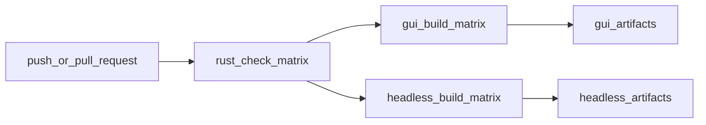

> 使用说明（面向 Agent）：  
> 当你（Agent 或子 Agent）在 CI/CD 环境中扮演“构建与发布执行器”时，本文件是第一阶段 `CA-CI-MATRIX` 的研发级执行说明书。  
> 当前阶段只落地 1 个 CA：先把三平台构建矩阵、artifact 产出与基础验收门禁固定下来，再把发布与 smoke 测试接到这套底座上。

## 1. 当前阶段范围与技术路线

### 当前阶段范围

- **已完成上游**：`CA-HL-CLI-GATEWAY`
  - 现状：`agent-diva gateway run` 已存在，可作为 Headless artifact 的统一入口。
- **当前阶段唯一 CA**：`CA-CI-MATRIX`
  - 目标：把现有 `.github/workflows/ci.yml` 收敛为三平台统一矩阵，覆盖 Rust 校验、GUI 构建、Headless 构建与 artifact 上传。
- **明确不在本阶段实施**
  - `CA-CI-ARTIFACTS`：Release 发布与 tag 编排
  - `CA-CI-SMOKE`：安装/启动 smoke job

### 确定性技术路线

- **CI 平台**：GitHub Actions
- **Rust 工具链**：`dtolnay/rust-toolchain@stable` + `Swatinem/rust-cache@v2`
- **基础质量门**：`just fmt-check`、`just check`、`just test`
- **GUI 构建**：`agent-diva-gui` + `pnpm` + `pnpm tauri build`
- **Headless 构建**：`cargo build -p agent-diva-cli --release`
- **Headless 打包辅助脚本**：`scripts/ci/package_headless.py`
- **随包最小说明模板**：`docs/app-building/headless-bundle-quickstart.md`

### 仓库落点（必须对齐真实文件）

- CI workflow：`.github/workflows/ci.yml`
- Rust 命令入口：`justfile`
- GUI 包管理入口：`agent-diva-gui/package.json`
- Tauri 配置：`agent-diva-gui/src-tauri/tauri.conf.json`
- Headless CLI 包版本来源：`agent-diva-cli/Cargo.toml`

## 2. 控制账户（CA）概览

- **CA-CI-MATRIX：多平台构建矩阵**
  - 目标：在 Windows / macOS / Linux 上固化统一构建矩阵，产出 GUI 与 Headless 工件。
  - 边界：只改 CI 编排、打包脚本与文档，不触碰核心业务逻辑。
  - 责任主体（建议）：构建/平台 Agent，必要时联动 GUI Agent 与 Headless Agent 做输入确认。

- **CA-CI-ARTIFACTS：构建产物发布**
  - 目标：把第一阶段的 CI artifacts 提升为 Release 资产。
  - 状态：下一阶段接入，不在当前变更范围。

- **CA-CI-SMOKE：自动化 smoke 测试**
  - 目标：对安装、启动、服务管理执行最小自动化验证。
  - 状态：依赖当前矩阵产物完成后接入，不在当前变更范围。

---

## 3. CA-CI-MATRIX：多平台构建矩阵

### 3.1 CA 边界、输入与输出

- **控制账户（CA）编号**：`CA-CI-MATRIX`
- **边界**
  - 输入：
    - Rust workspace 可编译
    - `agent-diva-gui` 可执行 `pnpm tauri build`
    - `agent-diva gateway run` 可作为 Headless 入口
  - 输出：
    - 三平台 Rust 校验结果
    - 三平台 GUI bundles artifact
    - 三平台 Headless bundles artifact
- **不输出**
  - Release 页面资产
  - GUI 安装/启动 smoke 结果
  - systemd / launchd / Windows Service 自动化执行结果

### 3.2 Artifact 命名规范

- **GUI artifact name**
  - `agent-diva-gui-{os_tag}-{runner.arch}-{github.sha}`
- **Headless artifact name**
  - `agent-diva-headless-{os_tag}-{runner.arch}-{github.sha}`
- **Headless 压缩包文件名**
  - Windows：`agent-diva-{version}-windows-{arch}.zip`
  - macOS / Linux：`agent-diva-{version}-{os_tag}-{arch}.tar.gz`

### 3.3 Workflow 总体结构



---

### WP-CI-MATRIX-01：基础 Rust workspace 校验 job

- **控制账户 / 工作包**
  - CA：`CA-CI-MATRIX`
  - WP：`WP-CI-MATRIX-01`
- **目标**
  - 在三平台统一执行仓库规定的质量门：`just fmt-check`、`just check`、`just test`。
- **技术边界**
  - 不引入 GUI/Tauri 依赖
  - 不执行 Release 发布
- **先决条件**
  - `justfile` 中已定义 `fmt-check`、`check`、`test`
  - CI runner 能安装 Rust stable
- **代码级实施方案**
  1. 在 `.github/workflows/ci.yml` 中定义三平台矩阵：

     ```yaml
     rust-check:
       name: Rust Check (${{ matrix.os }})
       runs-on: ${{ matrix.os }}
       strategy:
         fail-fast: false
         matrix:
           os: [ubuntu-latest, windows-latest, macos-latest]
     ```

  2. 使用统一步骤执行所有质量门：

     ```yaml
     steps:
       - uses: actions/checkout@v4
       - uses: dtolnay/rust-toolchain@stable
         with:
           components: rustfmt, clippy
       - uses: Swatinem/rust-cache@v2
       - name: Install just
         run: cargo install just --locked
       - name: Run workspace validation
         run: |
           just fmt-check
           just check
           just test
     ```

- **测试与验收**
  - 三平台 job 全绿；
  - 任一平台格式、clippy 或测试失败时，job 立即失败并保留原生命令日志；
  - `fail-fast: false` 保证其他平台仍继续执行，便于一次性收集差异。

---

### WP-CI-MATRIX-02：GUI 构建矩阵 job

- **控制账户 / 工作包**
  - CA：`CA-CI-MATRIX`
  - WP：`WP-CI-MATRIX-02`
- **目标**
  - 在三平台上构建 `agent-diva-gui` 的 Tauri bundles，并上传为 artifact。
- **技术边界**
  - 只负责构建与上传，不负责发布、签名、notarization 与安装验证。
- **先决条件**
  - `agent-diva-gui/package.json` 提供 `pnpm tauri` 命令
  - `agent-diva-gui/src-tauri/tauri.conf.json` 已启用 `bundle.active`
  - `scripts/ci/prepare_gui_bundle.py` 可将 `agent-diva` CLI 二进制整理到 `agent-diva-gui/src-tauri/resources/`
  - Ubuntu runner 可安装 Tauri 依赖
- **代码级实施方案**
  1. 定义 GUI matrix job：

     ```yaml
     gui-build:
       needs: rust-check
       runs-on: ${{ matrix.os }}
       strategy:
         fail-fast: false
         matrix:
           include:
             - os: ubuntu-latest
               os_tag: linux
             - os: windows-latest
               os_tag: windows
             - os: macos-latest
               os_tag: macos
     ```

  2. 安装前端与 Linux bundler 依赖：

     ```yaml
     - uses: pnpm/action-setup@v4
       with:
         version: "9"
         run_install: false
     - uses: actions/setup-node@v4
       with:
         node-version: "20"
         cache: pnpm
         cache-dependency-path: agent-diva-gui/pnpm-lock.yaml
     - name: Install Linux GUI build dependencies
       if: runner.os == 'Linux'
       run: |
         sudo apt-get update
         sudo apt-get install -y \
           libgtk-3-dev \
           libwebkit2gtk-4.1-dev \
           libayatana-appindicator3-dev \
           librsvg2-dev \
           patchelf
     ```

  3. 在 `agent-diva-gui` 目录执行：

     ```yaml
     - name: Build GUI companion binaries
       shell: bash
       run: |
         cargo build -p agent-diva-cli --release
         if [ -f agent-diva-service/Cargo.toml ]; then
           cargo build -p agent-diva-service --release
         else
           echo "agent-diva-service not present; continuing without service binary"
         fi

     - name: Stage GUI bundle resources
       run: python scripts/ci/prepare_gui_bundle.py --gui-root agent-diva-gui

     - name: Install frontend dependencies
       working-directory: agent-diva-gui
       run: pnpm install --frozen-lockfile

     - name: Build Tauri bundles
       working-directory: agent-diva-gui
       run: pnpm tauri build
     ```

  4. 上传 bundle 目录：

     ```yaml
     - name: Upload GUI artifacts
       uses: actions/upload-artifact@v4
       with:
         name: agent-diva-gui-${{ matrix.os_tag }}-${{ runner.arch }}-${{ github.sha }}
         path: agent-diva-gui/src-tauri/target/release/bundle/**
         if-no-files-found: error
     ```

- **测试与验收**
  - 三个平台的 artifact 列表中都能看到 GUI bundle；
  - bundle 目录内至少存在平台对应安装包或 app 目录；
  - bundle 对应安装目录中可找到 `resources/bin/<platform>/agent-diva(.exe)` 的入包来源；
  - 若缺少依赖、打包失败或 bundle 目录为空，job 必须失败。

---

### WP-CI-MATRIX-03：Headless 构建矩阵 job

- **控制账户 / 工作包**
  - CA：`CA-CI-MATRIX`
  - WP：`WP-CI-MATRIX-03`
- **目标**
  - 在三平台构建 `agent-diva` Release 二进制，并打成可下载的最小 Headless 压缩包。
- **技术边界**
  - 本阶段只打包 `agent-diva-cli` 输出的 `agent-diva` / `agent-diva.exe`
  - 不把 `agent-diva-service`、systemd、launchd 模板纳入当前 CI 产物
- **先决条件**
  - `agent-diva-cli/Cargo.toml` 中存在 `[[bin]] name = "agent-diva"`
  - `gateway run` 可作为统一入口
- **代码级实施方案**
  1. 定义 Headless matrix job：

     ```yaml
     headless-build:
       needs: rust-check
       runs-on: ${{ matrix.os }}
       strategy:
         fail-fast: false
         matrix:
           include:
             - os: ubuntu-latest
               os_tag: linux
               binary_path: target/release/agent-diva
             - os: windows-latest
               os_tag: windows
               binary_path: target/release/agent-diva.exe
             - os: macos-latest
               os_tag: macos
               binary_path: target/release/agent-diva
     ```

  2. 先只构建 CLI：

     ```yaml
     - name: Build headless binary
       run: cargo build -p agent-diva-cli --release
     ```

  3. 从 `agent-diva-cli/Cargo.toml` 读取版本，交给打包脚本：

     ```yaml
     - name: Read CLI version
       id: cli_version
       shell: bash
       run: |
         python - <<'PY' >> "$GITHUB_OUTPUT"
         import pathlib
         import tomllib
         data = tomllib.loads(pathlib.Path("agent-diva-cli/Cargo.toml").read_text(encoding="utf-8"))
         print(f"version={data['package']['version']}")
         PY
     ```

  4. 使用 `scripts/ci/package_headless.py` 打包最小压缩包：

     ```yaml
     - name: Package headless bundle
       shell: bash
       run: |
         python scripts/ci/package_headless.py \
           --binary "${{ matrix.binary_path }}" \
           --version "${{ steps.cli_version.outputs.version }}" \
           --os "${{ matrix.os_tag }}" \
           --arch "${{ runner.arch }}" \
           --output-dir dist \
           --readme docs/app-building/headless-bundle-quickstart.md
     ```

  5. 上传压缩包：

     ```yaml
     - name: Upload headless artifacts
       uses: actions/upload-artifact@v4
       with:
         name: agent-diva-headless-${{ matrix.os_tag }}-${{ runner.arch }}-${{ github.sha }}
         path: dist/*
         if-no-files-found: error
     ```

- **测试与验收**
  - Headless artifact 命名满足本文件的规范；
  - 解压后至少包含：
    - `agent-diva` 或 `agent-diva.exe`
    - `README.md`
    - `bundle-manifest.txt`
  - 下载任一平台 artifact 后，按 `README.md` 执行最小启动命令可以进入 `gateway run` 路径。

---

### CA-HL-WIN-SERVICE 在 CI 层的增量验证

- **控制账户**：`CA-HL-WIN-SERVICE`（Windows Service 守护进程）
- **验证位置**：`rust-check` job，仅 `runner.os == 'Windows'` 时执行
- **验证步骤**（`.github/workflows/ci.yml`）：
  1. 构建 `agent-diva-cli` 与 `agent-diva-service`（release）；
  2. 执行 dry-run 命令（不修改系统服务）：
     - `agent-diva.exe service install --auto-start --dry-run`
     - `agent-diva.exe service status --dry-run`
     - `agent-diva.exe service uninstall --dry-run`
- **验收**：CI 日志中能看到 `[dry-run] would install/query/uninstall...` 输出；失败时能区分是构建、CLI 解析还是 dry-run 逻辑问题。
- **参考**：`docs/app-building/wbs-headless-service-mode.md` 中 `CA-HL-WIN-SERVICE` 实现状态记录。

---

## 4. 阶段一验收门禁

- **门禁 G1：三平台 Rust 校验全部通过**
  - 对应 WP：`WP-CI-MATRIX-01`
  - 判定：`just fmt-check`、`just check`、`just test` 全绿
- **门禁 G2：三平台 GUI bundles 上传成功**
  - 对应 WP：`WP-CI-MATRIX-02`
  - 判定：artifact 可下载，bundle 目录非空
- **门禁 G3：三平台 Headless bundles 上传成功**
  - 对应 WP：`WP-CI-MATRIX-03`
  - 判定：压缩包名、包内文件结构与模板说明一致
- **门禁 G4：失败可定位**
  - 判定：日志能区分是 Rust 校验、GUI 依赖、Tauri 打包，还是 Headless 打包失败

---

## 5. 下一阶段衔接（非本阶段实施）

### CA-CI-ARTIFACTS

- 复用当前 `gui-build` 与 `headless-build` 的 artifact 命名规范；
- 在 tag/release workflow 中增加 `download-artifact` + `softprops/action-gh-release`；
- 先修正当前发布流中与真实二进制名称不一致的部分，再接入。

### CA-CI-SMOKE

- GUI smoke 直接消费 `agent-diva-gui-*` artifacts；
- Headless smoke 直接消费 `agent-diva-headless-*` artifacts；
- smoke job 不再重复构建，只下载并验证当前矩阵产物。

### WP-HL-LNX-04（规划型）：Linux Headless Smoke Job 设计草案

> 依赖 `CA-HL-LNX-SYSTEMD` 落地后的下一阶段 CA，由 CI/QA Agent 负责实现。当前仅提供设计轮廓，不在 CI 中立即开启新 job。

- **目标**
  - 在 GitHub Actions Linux runner 上，对 Linux Headless 压缩包执行最小服务安装与启动验证。
- **输入**
  - `agent-diva-headless-linux-{arch}-{sha}` artifact（含 `bin/agent-diva`、`systemd/agent-diva.service`、`systemd/install.sh`、`systemd/uninstall.sh`）。
- **步骤轮廓（可直接映射为 future GitHub Actions YAML）**
  1. 下载 Linux Headless artifact，解压到工作目录；
  2. 若 unit 模板使用 `User=agent-diva`，则创建该用户：`sudo useradd -r -s /bin/false agent-diva`；
  3. 创建数据目录：`sudo install -d -m 0755 -o agent-diva -g agent-diva /var/lib/agent-diva /var/log/agent-diva`；
  4. 执行安装：`cd <解压目录>/systemd && sudo ./install.sh`；
  5. 校验服务：`sudo systemctl status agent-diva` 输出包含 `active (running)`；
  6. 校验日志：`journalctl -u agent-diva --no-pager -n 20` 有网关启动相关输出；
  7. 执行卸载：`cd <解压目录>/systemd && sudo ./uninstall.sh`；
  8. 校验清理：`systemctl list-unit-files | grep agent-diva` 无结果，`/usr/bin/agent-diva` 已删除。
- **验收**
  - 上述步骤在 `ubuntu-latest` runner 上全部通过；
  - 失败时日志能区分是解压、安装、启动还是卸载阶段出错。

### 与分发/QA 文档的输入输出关系

- 输出给 `wbs-distribution-and-installers.md`
  - 统一 artifact 命名
  - 最小压缩包目录结构
- 输出给 `wbs-validation-and-qa.md`
  - 可被 smoke 与人工验收直接下载的构建产物
  - 失败日志与平台差异信息
    
---

## 6. CA-CI-ARTIFACTS：构建产物发布 WBS

> 本节对应规划中的 `CA-CI-ARTIFACTS`，目标是在**不重复实现构建矩阵**的前提下，把 `CA-CI-MATRIX` 产出的 artifacts 提升为可对外发布的 Release 资产，并与分发 / QA 文档形成稳定输入输出关系。

### 6.1 CA 边界、输入与输出

- **控制账户（CA）编号**：`CA-CI-ARTIFACTS`
- **输入（来自 CA-CI-MATRIX）**
  - 三平台 GUI artifacts：
    - `agent-diva-gui-{os_tag}-{runner.arch}-{github.sha}`
  - 三平台 Headless artifacts：
    - `agent-diva-headless-{os_tag}-{runner.arch}-{github.sha}`
- **输出**
  - GitHub Releases 中的发布资产（assets），按版本聚合三平台 GUI + Headless 安装包 / 压缩包；
  - 提供给分发 WBS（`wbs-distribution-and-installers.md`）的“官方下载来源”；
  - 提供给 QA WBS（`wbs-validation-and-qa.md`）的“Release 验收与 smoke 测试输入”。
- **不负责**
  - 重新定义构建矩阵（继续复用 `ci.yml` 中的 `rust-check` / `gui-build` / `headless-build`）；
  - GUI / Headless 运行时行为本身的变更。

---

### WP-CI-ART-01：Release 触发与版本/tag 策略

- **控制账户 / 工作包**
  - CA：`CA-CI-ARTIFACTS`
  - WP：`WP-CI-ART-01`
- **目标**
  - 约定统一的 **版本号 / Git tag / Release** 对齐策略，并在独立 workflow（建议：`.github/workflows/release-artifacts.yml`）中固化触发方式。
- **技术路线**
  - **版本规范**：采用 SemVer（`MAJOR.MINOR.PATCH`），Git tag 使用前缀 `v`，例如：`v0.2.0`；
  - **主版本来源**：以 `agent-diva-cli/Cargo.toml` 中的 `package.version` 为主（其他 crate 可按需跟进）；  
  - **触发方式**：
    - `push` 到 `v*.*.*` tag（正式发布主路径）；
    - `workflow_dispatch`（用于手动发布历史 commit 的补发版）。
- **代码级实施方案（workflow 轮廓）**
  1. 新建 `.github/workflows/release-artifacts.yml`，定义触发条件：

     ```yaml
     name: Release Artifacts

     on:
       push:
         tags:
           - 'v*.*.*'
       workflow_dispatch: {}
     ```

  2. 在 `jobs` 中增加一个统一的 release job，并在开头解析 tag 为 `release_version`，供后续步骤使用：

     ```yaml
     jobs:
       release:
         name: Release (${{ github.ref_name }})
         runs-on: ubuntu-latest
         steps:
           - uses: actions/checkout@v4

           - name: Parse release version from tag
             id: version
             run: |
               ref="${GITHUB_REF##*/}"   # v0.2.0
               echo "tag=${ref}" >> "$GITHUB_OUTPUT"
               echo "release_version=${ref#v}" >> "$GITHUB_OUTPUT"
     ```

- **测试与验收**
  - 在测试仓库或本仓库的非正式 tag（如 `v0.0.0-test`）上触发一次 workflow：
    - 确认 job 被正常触发；
    - 日志中打印的 `tag` 与 `release_version` 与预期一致（如 `v0.0.0-test` / `0.0.0-test`）。
  - 在本 WBS 中记录该测试的结论，供迭代日志引用。

---

### WP-CI-ART-02：下载并汇总 CI 产物

- **控制账户 / 工作包**
  - CA：`CA-CI-ARTIFACTS`
  - WP：`WP-CI-ART-02`
- **目标**
  - 在 Release workflow 中统一下载 `CA-CI-MATRIX` 产出的 GUI / Headless artifacts，并规范化整理到 `dist/` 目录结构，作为发布与 QA 的统一入口。
- **技术路线**
  - 继续使用 GitHub Actions 官方 `actions/download-artifact@v4`；
  - **推荐方式**：  
    - 在 `ci.yml` 与 `release-artifacts.yml` 之间，通过 `workflow_run` / `workflow_call` 或统一 pipeline 设计保证 release job 能直接访问到当前 commit 的 artifacts；  
    - 初始实现可以简单约定：当以 tag 形式触发时，先运行一次 `ci.yml`，再执行 release workflow。
- **目录结构约定**
  - 统一将 artifacts 重新整理为：
    - GUI：`dist/gui/{os_tag}/...`；
    - Headless：`dist/headless/agent-diva-{version}-{os_tag}-{arch}.(zip|tar.gz)`。
- **代码级实施方案（示例片段）**
  1. 在 `jobs.release.steps` 中添加下载与整理步骤（伪代码结构，需结合具体 pipeline 选择 run-id / 触发方式）：

     ```yaml
     - name: Download GUI artifacts
       uses: actions/download-artifact@v4
       with:
         path: _artifacts/gui

     - name: Download headless artifacts
       uses: actions/download-artifact@v4
       with:
         path: _artifacts/headless

     - name: Normalize artifact structure
       run: |
         mkdir -p dist/gui dist/headless
         # 根据 CA-CI-MATRIX 的命名规范移动/重命名文件
         # 示例：将 agent-diva-headless-linux-*.*.*.tar.gz 归档到 dist/headless/
     ```

  2. 在文档中给出一个轻量 Python/Bash 校验脚本伪代码，用于确保 Headless 包内至少包含：
     - `agent-diva` / `agent-diva.exe`；
     - `README.md`；
     - `bundle-manifest.txt`。

- **测试与验收**
  - 从一次成功的 CI 运行中下载 artifacts，执行整理脚本后检查：  
    - `dist/gui/` 目录包含三平台 GUI 安装包或 bundle 目录；  
    - `dist/headless/` 下存在三平台 Headless 压缩包，文件名符合 `wbs-headless-cli-package.md` 的命名规范；  
    - 随机抽取一个 Headless 包，解压后结构与 `wbs-headless-cli-package.md` 中的契约一致。

---

### WP-CI-ART-03：发布到 GitHub Releases

- **控制账户 / 工作包**
  - CA：`CA-CI-ARTIFACTS`
  - WP：`WP-CI-ART-03`
- **目标**
  - 将 `dist/gui/**` 与 `dist/headless/**` 作为资产发布到 GitHub Releases，使得 GUI 安装器与 Headless 压缩包都有稳定、可追溯的官方来源。
- **技术路线**
  - 使用社区成熟方案之一：
    - `softprops/action-gh-release@v2`；或
    - `gh release create` / `gh release upload`（需预装 GitHub CLI 并配置 token）。
  - 初期建议使用 `softprops/action-gh-release`，简化配置。
- **代码级实施方案（示例片段）**
  1. 在 `jobs.release.steps` 末尾添加 Release 步骤：

     ```yaml
     - name: Publish GitHub Release
       uses: softprops/action-gh-release@v2
       with:
         tag_name: ${{ steps.version.outputs.tag }}
         name: Agent Diva ${{ steps.version.outputs.release_version }}
         files: |
           dist/gui/**
           dist/headless/**
         draft: false
         prerelease: false
       env:
         GITHUB_TOKEN: ${{ secrets.GITHUB_TOKEN }}
     ```

  2. Release body 建议引用当前迭代日志中的摘要（例如：`docs/logs/2026-03-ci-artifacts-release/v0.0.1-ca-ci-artifacts/summary.md`），可在后续迭代中引入自动生成逻辑。

- **测试与验收**
  - 使用测试 tag（如 `v0.0.0-test`）完整跑通 release workflow 后，检查：  
    - GitHub Releases 中出现对应版本的 Release，标题与 tag 对齐；  
    - Release assets 列表中包含三平台 GUI 安装包与 Headless 压缩包；  
    - 从 Release 随机下载一个 GUI 安装包与一个 Headless 包，按分发 WBS / Headless Quickstart 文档执行最小 smoke 流程均可成功；
  - 在 `wbs-distribution-and-installers.md` 与 `wbs-validation-and-qa.md` 中，引入对本 CA 输出资产的引用，作为“官方获取方式”与“Release 验收 checklist”的一部分。