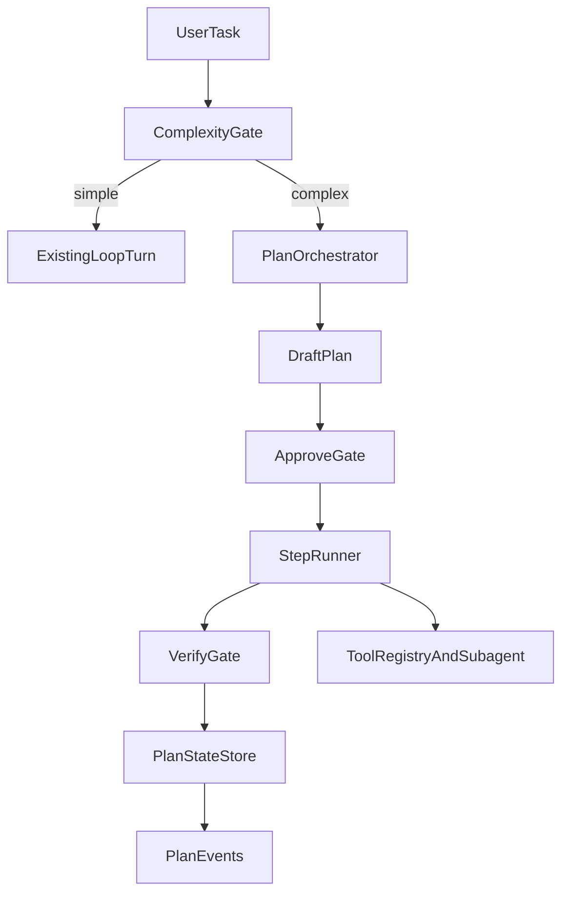

# Codex + GenericAgent Plan Mode 璋冪爺鎬荤粨锛坅gent-diva锛?

## 鐗堟湰淇℃伅
- 鐗堟湰鍙? v0.0.1-codex-genericagent-diva
- 鏃ユ湡: 2026-05-27
- 鑼冨洿: `.workspace/codex`銆乣.workspace/GenericAgent`銆乣agent-diva` 褰撳墠涓诲垎鏀?
- 绾︽潫: 鍙璋冪爺锛屼笉淇敼涓氬姟浠ｇ爜

---

## 鐩爣

鍥寸粫 Plan Mode锛屽畬鎴愪笁浠朵簨锛?

1. 鎻愮偧 Codex 涓?GenericAgent 鐨勫彲杩佺Щ鏈哄埗锛?
2. 鏄犲皠鍒?agent-diva 鐜版湁鏋舵瀯鑳藉姏涓庣己鍙ｏ紱
3. 缁欏嚭鏈€灏忎镜鍏ャ€佸垎闃舵鍙惤鍦板缓璁紙Phase 0-3锛夈€?

---

## 涓€銆丳lanMode 鏈哄埗鏄犲皠锛圱odo-1锛?

### GenericAgent 鍙€熼壌鏈哄埗

- 鍥涢樁娈靛崗璁細鎺㈢储 -> 瑙勫垝 -> 鎵ц -> 楠岃瘉
- 纭棬绂侊細澶嶆潅浠诲姟鎵嶈繘鍏?Plan锛涢獙璇佹€佸繀椤荤粰 `PASS/FAIL/PARTIAL`
- 闃插け鎺э細`no_tool` 鎷︽埅銆乼urn 闄愬埗銆乧heckpoint 绾︽潫
- subagent 鍗忎綔鍗忚锛氭敮鎸?`_stop/_keyinfo/_intervene` 浜哄伐绾犲亸

### Codex 鍙€熼壌鏈哄埗

- 宸ョ▼鍖栬竟鐣岋細瀹℃壒銆佹墽琛岀瓥鐣ャ€佸伐鍏疯矾鐢卞垎灞?
- 鍙娴嬩簨浠讹細绾跨▼/鎵ц鐘舵€佹竻鏅?
- 瀹夊叏绛栫暐锛氬鎵?绛栫暐闂搁棬鏇寸粏绮掑害

### 鏄犲皠鍒?agent-diva 鐨勫垽鏂?

- 鍙洿鎺ュ€熼壌锛氶樁娈甸棬绂佹€濇兂銆侀獙璇佸绾︺€佹楠ゅ寲鎵ц
- 闇€瑕佹敼閫犲悗鍊熼壌锛歴ubagent 鍗忚瀹炵幇鏂瑰紡锛堝簲璧?typed/event锛屼笉寤鸿绾枃浠跺崗璁級
- 涓嶅缓璁収鎼細Codex 閲嶅瀷鍐呮牳涓庡畬鏁存墽琛岀瓥鐣ヤ綋绯?

---

## 浜屻€丳lanOrchestrator 鏈€灏忎镜鍏ユ灦鏋勶紙Todo-2锛?

鏍稿績寤鸿锛?*鏂板缂栨帓灞傦紝涓嶉噸鍐欐墽琛屽唴鏍?*銆?

### 鑱岃矗杈圭晫

- `loop_turn`: 淇濇寔鈥滃崟鍥炲悎鎵ц鈥濊亴璐?
- `PlanOrchestrator`: 璐熻矗璁″垝鐢熷懡鍛ㄦ湡
- `SubagentManager`: 浣滀负 step 鎵ц鍣ㄥ鐢?
- `MemoryProvider`: 娌夋穩璁″垝鎽樿/璇佹嵁锛屼笉鎵胯浇璁″垝鐘舵€佹満
- `PlanStateStore`锛堟柊澧炴蹇碉級: 璁″垝鐘舵€佹寔涔呭寲锛屼笌浼氳瘽娑堟伅鍒嗙

---

## 涓夈€丳hase 0-3 璺嚎涓庨獙鏀讹紙Todo-3锛?

### Phase 0锛堝畾涔変笌瑙傛祴锛?
- 杈撳嚭锛?
  - `Plan/PlanStep/PlanState/VerificationVerdict` 鏁版嵁妯″瀷
  - `PlanDrafted/Approved/StepStarted/StepBlocked/PlanCompleted` 浜嬩欢鍗忚
- 楠屾敹锛氬彲鐢熸垚缁撴瀯鍖?plan draft锛堜笉鏀瑰彉鎵ц璺緞锛?

### Phase 1锛堝崟璁″垝涓茶闂幆锛?
- 杈撳嚭锛?
  - 澶嶆潅浠诲姟瑙﹀彂璁″垝鑽夋
  - 瀹℃壒闂搁棬 + 涓茶 step 鎵ц
  - step 璇佹嵁褰掓。
- 楠屾敹锛?-step 浠诲姟鍙墽琛屽苟杈撳嚭瀹屾暣姝ラ璇佹嵁

### Phase 2锛堟仮澶嶄笌鍥炴粴锛?
- 杈撳嚭锛?
  - 璁″垝鐘舵€佹寔涔呭寲
  - pause/resume/retry/failover
- 楠屾敹锛氶噸鍚悗鍙粠鏈€杩戞湭瀹屾垚 step 鎭㈠

### Phase 3锛堢瓥鐣ュ寲澧炲己锛?
- 杈撳嚭锛?
  - step 绾у伐鍏风櫧鍚嶅崟
  - 鍙€変緷璧栧浘骞惰
  - 楠岃瘉鍣ㄦā鏉?
- 楠屾敹锛氬鏉備换鍔″彲骞惰骞朵繚鎸佸彲瑙傛祴銆佸彲鍥炴粴

---

## 鍥涖€侀闄╀笌闃叉帶锛圱odo-4锛?

### 涓昏椋庨櫓

1. 鐘舵€佹満鑶ㄨ儉瀵艰嚧澶嶆潅搴﹁繃楂?
2. 骞跺彂姝ラ绔炰簤瀵艰嚧鐘舵€佷笉涓€鑷?
3. 楠岃瘉鎴愭湰鎶珮浜や簰寤惰繜
4. 闂ㄧ璇垽褰卞搷鐢ㄦ埛浣撻獙
5. 璁″垝鐘舵€佷笌浼氳瘽鍘嗗彶鑰﹀悎姹℃煋

### 闃叉帶绛栫暐

- 鍏堜覆琛屽悗骞惰锛岄€愰樁娈靛紑鍚兘鍔?
- 楂樺鏉傚害浠诲姟鎵嶅惎鐢?Plan Mode
- 璁″垝鐘舵€佷笌浼氳瘽娑堟伅鍒嗙瀛樺偍
- 楠岃瘉鍣ㄥ垎绾цЕ鍙戯紙鎸変换鍔￠闄╋級
- 淇濈暀浜哄伐骞查鍙ｏ紙鏆傚仠銆佺户缁€佹嫆缁濄€侀噸璇曪級

---

## 浜斻€佸 agent-diva 鐨勭洿鎺ュ缓璁?

1. 绗竴浼樺厛绾т笉鏄€滈噸鍐?loop鈥濓紝鑰屾槸鈥滄柊澧炵紪鎺掑眰鈥濄€?
2. 鎶?Plan Mode 浣滀负鍙€夎兘鍔涳紝涓嶅己鍒舵墍鏈変换鍔¤繘鍏ャ€?
3. 鐢ㄤ簨浠朵笌鐘舵€佹ā鍨嬪厛鍋氬彲瑙傛祴鎬э紝鍐嶅仛鑷姩鍖栨墽琛屾繁搴︺€?
4. 灏?GenericAgent 鐨勭‖闂ㄧ涓?Codex 鐨勭瓥鐣ュ垎灞傝瀺鍚堬紝褰㈡垚杞婚噺鍖?Plan 鏍稿績銆?

---

## 鍏抽敭瀵逛綅鏂囦欢

- `agent-diva-agent/src/agent_loop.rs`
- `agent-diva-agent/src/agent_loop/loop_turn.rs`
- `agent-diva-agent/src/context.rs`
- `agent-diva-agent/src/subagent.rs`
- `agent-diva-agent/src/agent_loop/loop_tools.rs`
- `agent-diva-agent/src/consolidation.rs`
- `agent-diva-core/src/memory/manager.rs`

鏈増鏈负璋冪爺缁撹鏂囨。锛屼笉鍚唬鐮佸彉鏇淬€?
