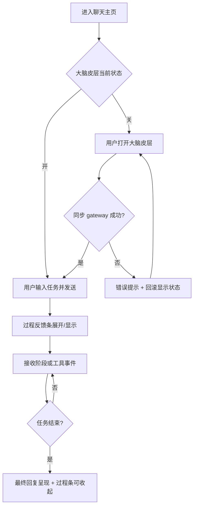
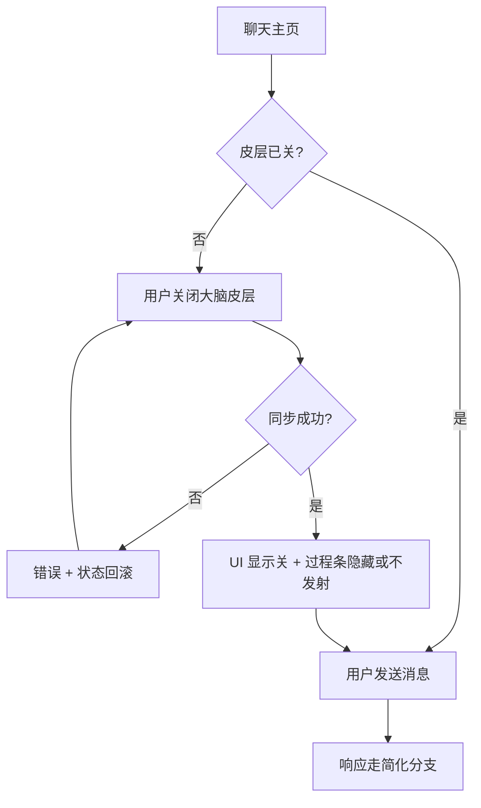
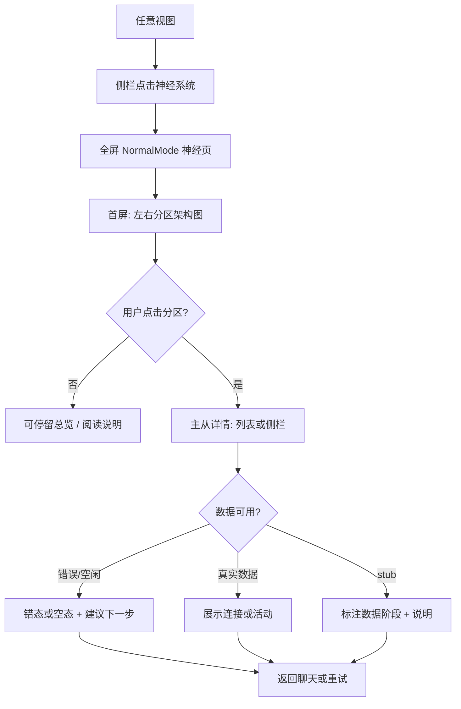

---
stepsCompleted:
  - 1
  - 2
  - 3
  - 4
  - 5
  - 6
  - 7
  - 8
  - 9
  - 10
  - 11
  - 12
  - 13
  - 14
design_directions_wireframe: _bmad-output/planning-artifacts/ux-design-directions.html
inputDocuments:
  - _bmad-output/planning-artifacts/prd.md
  - _bmad-output/planning-artifacts/epics.md
  - agent-diva/project-context.md
ux_workflow_started_at: "2026-03-30"
ux_workflow_completed_at: "2026-03-30"
ux_workflow_status: complete
lastStep: 14
ux_amended_at: "2026-03-30"
ux_amendment_note: >-
  与 PRD 第二次修订对齐：旅程五～六（反模式）、FR19–FR22、NFR-P3；
  增补 UX-DR4/UX-DR5、轻量路径与收敛的交互说明、可选用量提示；修正维护者文档引用为 FR17。
---

# UX Design Specification newspace

**Author:** Com01
**Date:** 2026-03-30

---

<!-- UX design content will be appended sequentially through collaborative workflow steps -->

## Executive Summary

### Project Vision

**newspace / agent-diva** 在棕地演进中，为桌面端（**Tauri + Vue**）提供 **Person 对外单一叙事** 下的 **可选蜂群层**：用户在 **聊天主页** 用 **「大脑皮层」**（大脑图标开关）显式控制蜂群开/关；在 **开** 状态下，任务进行中可获得 **过程反馈**（非仅最终文本）。**路由与收敛纪律（PRD FR19–FR21、NFR-P3）：** 轻量意图（如显式 skill、短问答）**默认** 走 **可完成** 路径，**不** 在无显式选择时等同「全量多代理蜂群」；编排须有 **完成定义** 与 **内部轮次/步数上限** 的 **可感知终态**（成功或 **明确失败原因**），避免界面暗示 **无尽内部思考**。**神经系统** 全屏视图承担 **连接、活动、对内拓扑** 的可视与排障线索，且 **MVP 与后期愿景分期**：前期入口 **直达** **DIVA 大脑** 的 **架构图式** 主视图（**左右分区**、轻交互）；后期再演进为 **总控台优先**、游戏化与《头脑特工队》式 **拟人忙碌** 愿景（**不纳入 MVP 验收**）。**中控台** 与神经系统 **概念分坑**，文案与入口须区分（UX-DR2）。**用量可观测（FR22）** 在 MVP 以 **开发者向挂点**（设置或折叠调试区、非阻断提示）为主，完整计费 UI 可后置 Growth。

### Target Users

- **主用户：** 使用 **agent-diva-gui** 的开发者 / 高阶用户；在本地桌面与 DiVA 对话、跑工具链、排障。
- **关键子集 — 进阶用户：** 需要理解「系统在干什么」、愿意进入 **神经系统** 查看状态与线索（可能配合聊天记录重试或切换大脑皮层）。
- **集成/维护者：** 依赖 **无 GUI 可测** 的契约与文档；界面设计 **不得** 把编排逻辑只堆在前端（FR13）。

用户 **技术敏感度偏高**；主交互为 **键鼠**，须满足 **NFR-A1** 基线（控件可命名、可键盘操作）。

### Key Design Challenges

1. **认知负荷：** 在 **单一 Person** 前提下传递 **对内协作** 与 **过程**，避免多机器人头像式界面，同时让开关与模式 **一眼可辨**（FR4、FR8–FR9）。
2. **神经系统分期：** MVP 必须坚持 **简单、架构图式、左右脑分区首屏**；抑制「先做总控台/小人动画」的冲动，并与 PRD **FR15–FR16** 对齐；**stub 数据** 须 **诚实标注**（FR6）。
3. **主路径不被拖垮：** 过程反馈 **不遮挡** 主输入与流式区，更新 **可节流**（UX-DR3、NFR-P2）；大脑皮层切换 **短延迟感知**（NFR-P1）。
4. **术语与隐喻：** **神经系统 ≠ 中控台**；**左脑/右脑** 须在 UI 文案中体现 **产品语义**，避免被误读为解剖学字面义。
5. **轻量意图不误上「全量蜂群舞台」：** 即使用户 **开着大脑皮层**，**短问题 / 单 skill** 也不应在 UI 上呈现 **无限迭代的内部阶段条** 或 **无 done 的转圈**；须与后端 **轻量路径** 一致，并在超时/触顶时 **显式终态**（FR19–FR20、UX-DR4）。
6. **成本与信任：** 高频用户须能 **在可选通道** 理解「为何本次偏重」（内部步数、预算提示），避免 **黑盒烧 token** 引发弃用；MVP **不** 强求消费级账单页（FR22、UX-DR5、NFR-P3）。

### Design Opportunities

1. **开关作为「信任把手」：** 大脑皮层 **开/关** 清晰、可恢复错误态（NFR-R1），成为用户控制 **深度 vs 简单** 的核心锚点。
2. **过程可见性：** 最小一种过程反馈组件即可形成相对「纯黑盒聊天」的 **差异化可信赖感**（FR2）。
3. **诚实的观测面：** 神经系统用 **架构图 + 分区下钻** 先建立 **心智模型**；空/错/空闲态给 **可行动提示**（FR7），为后期游戏化 **预留同一数据模型**。
4. **桌面原生：** 利用 **全屏视图**、侧栏导航等现有 **NormalMode** 模式，减少跨平台折衷成本。
5. **收敛可见性：** 过程区文案与阶段模型 **绑定「会结束」** 的后端语义（例如「阶段 N/M」或 **明确上限**），支撑 **可预测性** 与 PRD **旅程五** 的反向验收。

## Core User Experience

### Defining Experience

**核心循环：** 用户在 **聊天主页** 与 **DiVA（单一 Person）** 对话并完成 **任务**（提问、工具、多步推理）。**次核心但产品关键** 的动作是：用 **大脑皮层** 在 **「要深度编排 + 过程可见」** 与 **「简化路径」** 之间切换；在 **开** 状态下，用户应能 **不离开主聊天** 即感知 **进行中状态**，且 **轻量任务** 仍须在 **合理反馈粒度** 下 **到达终态**（与 FR19–FR20 一致）。**神经系统** 是 **进阶观测与排障** 的延伸：从侧栏进入后 **MVP 首屏即「DIVA 大脑」架构图**，**左右分区** 可点入 **列表/侧栏** 查看连接与活动，而非先进入游戏化总控台。

**必须做对的一件事：** **大脑皮层状态** 与 **界面反馈**、**后端真相源** 一致（FR14），且切换 **不长时间卡死 UI**（NFR-P1）。

### Platform Strategy

- **平台：** **桌面应用**（**Tauri 2** + **Vue 3** + **Tailwind**）；键鼠为主，兼顾 **键盘可达性**（NFR-A1）。
- **约束：** GUI **仅消费** 已文档化的 API/事件（FR13）；编排语义在 **Rust** 侧，前端不做「第二套编排脑」。
- **离线：** 以现有 DiVA 行为为准；本 UX 规格 **不** 新增「必须离线完整可用」的承诺，除非产品另发增量。
- **能力利用：** 全屏 **神经系统** 视图、侧栏路由、与 gateway 同步的开关状态。

### Effortless Interactions

- **一眼知道模式：** 大脑皮层 **开/关** 在聊天主页 **无需解释即可辨识**（UX-DR1、FR4）。
- **切换即生效（感知上）：** 点击开关后 **即时 UI 反馈** + 后端一致（目标量级对齐 NFR-P1）。
- **过程反馈不抢戏：** 进行中反馈 **附属** 于聊天区（条带/时间线等择一），**不挡输入、不挡流式**（UX-DR3、NFR-P2）。
- **诚实空态：** 无数据或 stub 时 **短文案 + 下一步建议**，而非空白或假数据（FR6、FR7）。
- **轻量不空转：** 简单请求下过程反馈 **要么短、要么不出现深度阶段链**；若触顶停止，**主对话区** 出现 **可读懂的结束说明**（非静默）（FR19–FR20）。

### Critical Success Moments

1. **第一次打开大脑皮层跑任务：** 用户看到 **非仅最终回复** 的推进信号，仍感觉 **只有一个 DiVA 在说话**（FR2、FR8）。
2. **第一次进神经系统：** 立刻理解 **「这是大脑/拓扑视图」**（左右分区 + 架构图风格），并能 **点进一区** 看到 **有用或诚实占位**（FR5、FR6、PRD 神经系统 UI 分期）。
3. **出错或卡住：** 过程区或神经视图给出 **可行动线索**（重试、看日志、关大脑皮层等），而非静默失败（FR7、NFR-R1）。
4. **轻量任务有终态：** 短问题或单 skill 在 **开皮层** 下也 **结束得干脆**；若触顶，用户 **在对话区读到原因**，而非无限「思考中」（FR19–FR20）。

### Experience Principles

1. **单一 Person，分层揭示：** 默认界面 **不** 暴露多聊天机器人；深度通过 **开关 + 过程条 + 神经系统** **分层** 打开。
2. **先简单图式，后炫技：** MVP 神经系统 **架构图优先**；游戏化总控台与拟人忙碌 **仅作愿景**，不与 MVP 首屏争优先级。
3. **契约先于皮肤：** 所有「看得见」的状态 **有后端或诚实 stub 来源**，避免前端自创真相。
4. **主路径性能与清晰优先：** 动画与装饰 **让位于** 可读性、响应与排障。
5. **默认最省路径：** UI **不鼓励** 为每个请求营造「大型蜂群剧场」；深度过程展示 **与任务复杂度匹配**（UX-DR4、NFR-P3）。

## Desired Emotional Response

### Primary Emotional Goals

1. **掌控感（Empowered）：** 用户清楚 **大脑皮层开或关** 意味着什么，并相信界面状态与真实行为一致。  
2. **可信 / 踏实（Trust）：** 任务进行中 **看得见推进**，减少「黑盒焦虑」；出错时 **有解释、有退路**，而非失控感。  
3. **专注（Calm focus）：** 主聊天仍是 **工作台面**；过程反馈与神经系统 **增强理解** 而不 **轰炸注意力**。  
4. **好奇与期待（面向后期愿景，MVP 轻触即可）：** 产品隐喻（大脑、分区）**友好、可理解**，为日后游戏化总控台 **埋伏笔但不抢戏**。

### Emotional Journey Mapping

| 阶段 | 期望情绪 | UX 提示 |
|------|----------|---------|
| **首次发现开关** | 好奇 → 很快变 **清晰** | 图标与文案 **自解释**；首次可辅以轻量提示（非强制教程） |
| **核心对话（皮层开）** | **投入 + 安心** | 过程条/阶段反馈 **稳定、可读**；不抖动、不遮挡输入 |
| **核心对话（皮层关）** | **轻、快** | 界面 **收敛**；无「漏关蜂群」的隐含焦虑 |
| **进入神经系统** | **豁然开朗（心智模型对齐）** | MVP **架构图式首屏** 让用户感到「我懂结构了」；stub 诚实则 **不愚弄** |
| **任务完成** | **满足 + 愿意再来** | 单一 Person 叙事 **不断裂**；无「被多机器人围观」的违和 |
| **出错 / 卡住** | **仍被支持** | 明确状态 + 建议下一步；切换失败 **可恢复**（NFR-R1） |
| **再次打开应用** | **熟悉、可预期** | 开关与模式 **可记忆**；导航入口 **稳定** |
| **轻量问题却长时间「内部推进」无终态（反模式）** | **烦躁 → 不信任** | 过程条须 **有界** 或 **降级**；触顶时 **明确文案 + 建议（关皮层 / 简化重试）**（旅程五、UX-DR4） |
| **高频使用感到 token 被「无效博弈」烧掉（反模式）** | **焦虑 → 弃用蜂群** | 可选 **开发者/高级** 用量提示；**不** 用装饰性忙碌掩盖真实轮次（旅程六、UX-DR5、FR22） |

### Micro-Emotions

- **优先放大：** **自信**（我懂现在在哪种模式）、**信任**（系统没在骗我）、**胜任感**（排障有线索）。  
- **刻意抑制：** **困惑**（神经系统 vs 中控台术语混用）、**多疑**（状态与行为不一致）、**烦躁**（动画/通知抢主路径）、**空转焦虑**（看得见「在忙」却 **无 done、无失败说明**）。  
- **谨慎使用「惊喜」：** MVP 以 **清晰** 为先；**惊喜** 留给后期总控台/拟人愿景，且须 **绑定真实状态**。

### Design Implications

| 情感目标 | UX 手段 |
|----------|---------|
| 掌控感 | 大脑皮层 **显式、可逆**；错误态 **回滚或明确报错** |
| 信任 | **单一真相源** 呈现；stub **标注数据阶段** |
| 专注 | 过程反馈 **节流、靠边**；神经系统 **全屏独立** 不叠加在输入区上 |
| 踏实 | 空/闲/错 **模板化文案** + **下一步**；与聊天记录 **互补** 不重复堆日志 |
| 可预测完成 | 过程展示 **有界** 或与轻量路径 **降级**；触顶时 **主对话** 给 **失败/停止说明**（UX-DR4） |
| 成本敏感用户的控制感 | **开发者/高级** 通道展示 **步数或预算提示**（非阻断）；**不** 用假忙碌掩盖（UX-DR5、FR22） |
| 避免孤立感 | 保持 **一个 DiVA** 口吻；内部协作 **不** 用多头像聊天室表达 |

### Emotional Design Principles

1. **Clarity over spectacle（MVP）：** 先让用户 **懂**，再让用户 **爽**。  
2. **Honesty builds trust：** 数据未到就 **说未到**，胜过 **假装繁忙**。  
3. **Control is caring：** 开关与模式 **始终可感知、可纠正**。  
4. **One voice, many layers：** 情感上 **始终是一个人**；深度是 **掀开的一层**，不是 **另一群人**。

## UX Pattern Analysis & Inspiration

### Inspiring Products Analysis

1. **IDE（如 VS Code / Cursor 类）**  
   - **做得好：** 主工作区 **稳定**；**状态栏 / 侧栏** 承载次要信息；**开关类设置**（扩展、功能标志）**可发现、可逆**。  
   - **可借鉴：** **聊天 + 辅助面板** 的主次分层；**键盘可达** 与 **少打断流**。

2. **开发者工具（浏览器 DevTools — Network / Performance）**  
   - **做得好：** **拓扑/时间线** 把复杂运行时 **压成可扫读** 的图式；**空态**（无请求）**明确**。  
   - **可借鉴：** 神经系统 MVP 的 **架构图 + 分区** 与 **「诚实空态」**；点击条目 **下钻详情**。

3. **高质量桌面聊天 / Copilot 类（通用模式）**  
   - **做得好：** **流式输出** 为主角；**次要进度** 常以 **细条、小字、可折叠** 呈现。  
   - **可借鉴：** 过程反馈 **靠边、节流**，对齐 NFR-P2 / UX-DR3。

4. **《头脑特工队》式总控（愿景参照，非具体 App）**  
   - **借鉴点：** **角色 = 状态隐喻** 的前提是 **与真实队列/活动绑定**；MVP **不抄** 多角色动画，只保留 **后期叙事方向**（PRD 已分期）。

### Transferable UX Patterns

**导航与信息架构**

- **侧栏进全屏专视图：** 聊天为主、**神经系统** 为 **独立空间** — 符合进阶排障心智，避免主界面堆叠。  
- **Hub 后置：** **后期** 总控台先进、再进大脑；**MVP 相反**（直达大脑）— 分期已在 PRD 锁定。

**交互**

- **显式模式开关：** 类似功能标志 / 电源切换 — **大脑皮层** 须 **状态可见 + 即时反馈**。  
- **进行中的「轻量遥测」：** 步骤条、时间线、事件 chip — 择一 **与后端事件对齐**。  
- **分区 → 详情：** 左/右脑（或产品命名）**选中 → 侧栏或二级列表** — 经典 **主从布局**。

**视觉**

- **架构图美学：** 区块、连线、标签 — **低装饰、高可读**，支撑 **信任** 与 **专注** 情感目标。  
- **错误与恢复：** 与 IDE **构建失败 / 同步失败** 类似 — **说明 + 重试 + 回滚状态**。

### Anti-Patterns to Avoid

- **多聊天机器人头像并列** — 直接违背 FR8/FR9 与「单一 Person」叙事。  
- **装饰性忙碌**（无真实状态支撑的动画、假进度）— 破坏信任与 FR6「诚实 stub」精神。  
- **过程反馈遮挡输入或打断流式** — 违背 UX-DR3、NFR-P2。  
- **神经系统与中控台文案混用** — 违背 UX-DR2，引发困惑。  
- **把编排逻辑做成前端独有状态机** — 违背 FR13，导致双端漂移焦虑。  
- **轻量任务仍展示「无尽内部阶段」或假循环进度** — 违背 FR19–FR20 与 UX-DR4，放大旅程五挫败。  
- **无任何通道暴露「本次内部步数/预算」却声称深度蜂群** — 违背 FR22 与 UX-DR5，放大旅程六挫败（MVP 至少保留 **开发者向** 挂点）。

### Design Inspiration Strategy

**采用**

- IDE 式 **主从分区** 与 **状态栏/侧栏** 信息层级。  
- DevTools 式 **图式总览 + 点击下钻**。  
- Copilot 式 **流式为主、进度为辅**。

**改造**

- **总控台 / 游戏化** — **整段后置 Growth**，MVP 仅保留 **隐喻与信息架构** 一致性。  
- **拟人角色** — 仅当 **能绑定真实运行时事件** 时采用（后期）。

**避免**

- 为多 agent **营销展示** 牺牲 **单一 Person**。  
- MVP 阶段 **炫动画** 先于 **数据契约**。  
- **术语堆叠** 无词汇表或首次轻提示。

## Design System Foundation

### 1.1 Design System Choice

**棕地延续：以 Tailwind CSS 工具类 + 既有 Vue 组件 + Lucide 图标为唯一主栈；MVP 不引入新的整套第三方组件体系（如 Material / Ant Design Vue 全量接入）。**

新能力（**大脑皮层**、**过程反馈条**、**神经系统** 架构图视图）在 **同一设计语言** 下以 **增量组件** 交付，而非换肤或换库。

### Rationale for Selection

1. **仓库现状：** `agent-diva-gui` 已依赖 **tailwindcss ^3.4**、**vue ^3.5**、**lucide-vue-next**，无大型 UI kit — 选型与 **实现成本、学习曲线** 一致。  
2. **PRD 边界：** 明确 **跳过** 通用 visual_design 立法；UX 以 **行为与信息架构** 为主，视觉 **跟现有 GUI 体系** 走。  
3. **工程约束：** FR13 要求 GUI **消费契约**；设计系统应 **薄**、易测，避免前端堆叠 **第二套「真相」样式状态**。  
4. **无障碍基线：** NFR-A1 要求控件 **可命名、可键盘操作** — 通过 **语义化 HTML + 焦点环 + Tailwind 可复用模式** 满足，而非依赖某一 kit 的默认 a11y（仍须在实现时 **逐控件验收**）。

### Implementation Approach

- **布局与间距：** 延续现有 **Tailwind** 断点与 spacing；全屏 **NormalMode** 与聊天主布局 **不拆两套 token**。  
- **图标：** **大脑皮层** 等隐喻优先 **lucide-vue-next** 中与「大脑/活动」语义接近的图标，保证 **与侧栏/工具栏其它图标** 线宽与风格一致。  
- **新组件：**  
  - `CortexToggle`（或等价命名）：开关 + 状态文案 / `aria`  
  - `ProcessFeedback`（条带/时间线择一）：**可折叠、节流** 区域  
  - `NervousSystemBrain`（MVP）：**SVG / 分区 div + 架构图式** 样式，**少动画**  
- **i18n：** 继续使用 **vue-i18n**；**神经系统 / 中控台 / 左脑右脑** 等术语 **键名稳定**，避免与 epics 文案漂移。

### Customization Strategy

- **主题：** 若已有暗色/亮色，**新组件必须同时适配**；不单独为神经系统做「第三主题」除非产品明确要求。  
- **Design tokens（轻量）：** 在 `tailwind.config` 或 CSS 变量中 **集中**「强调色 / 边框 / 图式连线色」，便于神经系统 **连线与区块** 统一。  
- **后期愿景预留：** 游戏化总控台若落地，**优先复用同一 token + 布局栅格**，避免与 MVP **分裂成两套视觉系统**。  
- **文档：** 在实现 PR 或 `agent-diva-gui` README **附录** 中维护 **「蜂群相关组件清单 + a11y 注意」**，呼应 **FR17** 维护者说明。

## 2. Core User Experience

### 2.1 Defining Experience

**定调交互（可对外一句话）：** 用户在 **同一个 DiVA、同一块聊天主舞台** 上做事，并用 **大脑皮层** 明确选择 **「要深度蜂群 + 可见过程」** 或 **「简化路径」**；在需要理解内在结构或排障时，进入 **神经系统**，**MVP 首屏即架构图式「DIVA 大脑」左右分区**。

若只把 **一件事** 做到极致，应是：**开/关大脑皮层** 时 **状态、行为与情感预期** 完全一致（**信任把手**），且 **从不破坏「一个人」** 的叙事（FR8/FR9）。

### 2.2 User Mental Model

- **默认预期：** DiVA = **一个对话伙伴**（非群聊面板）。  
- **大脑皮层：** 类似 IDE **功能开关 / Difficulty** — 「我显式要了更多内部编排」；关 = 「我只要轻量对话」。  
- **过程反馈：** 类似 **构建日志缩略条** — 知道 **还在跑 / 卡在哪**，但 **主输出仍是同一条对话流**。  
- **神经系统：** 类似 **DevTools Network / 拓扑图** — 「看结构和连接」，**不是** 第二个聊天窗口；**左/右脑** 应读作 **产品分区语义**，首次进入可用 **一行说明** 消歧。  
- **混淆点（须设计规避）：** 多机器人头像、中控台与神经系统 **同名/同入口**、假数据装真。

### 2.3 Success Criteria

1. **切换可信：** 操作大脑皮层后 **≤500ms 量级** 内 UI 与后端状态一致（NFR-P1）；失败 **可恢复或可理解**（NFR-R1）。  
2. **模式可自述：** 不看文档也能答「现在是开还是关」「关的时候会不会还在蜂群」。  
3. **过程不喧宾夺主：** 流式与输入 **始终可操作**；过程区 **可折叠或可忽略**（NFR-P2、UX-DR3）。  
4. **神经系统首屏：** 3 秒内建立 **「这是大脑拓扑」** 心智；分区可点、下有 **真实数据或诚实 stub**（FR6）。  
5. **排障有路：** 空/错/闲 **各有一种** 明确文案 + 建议动作（FR7）。
6. **收敛可对账：** 蜂群路径在 UI 上 **不出现** 无 **done** 的永久进行中；与 **内部轮次上限** 对齐的 **终态** 可验收（FR20、NFR-P3）。
7. **用量挂点：** 至少 **一条** 开发者可见路径（设置子区、折叠调试条或日志标记）能区分「轻量完成」与「深度多轮」，呼应 FR22（完整产品化计费面板可后置）。

### 2.4 Novel UX Patterns

- **成熟模式为主：** 侧栏导航、全屏详情、开关、主从列表、图式总览 — 均 **已建立**。  
- **产品特有成套叙事：** **单一 Person × 内化蜂群 × 显式皮层开关 × 分期神经系统** — 组合较新，**不靠炫交互**，靠 **文案、入口分区与诚实数据** 教学。  
- **教育策略：** **渐进披露** — 主聊天只暴露开关 + 轻过程条；神经系统给 **架构图**；**总控台/游戏化** **后置**，避免 MVP 认知超载。

### 2.5 Experience Mechanics

**A. 大脑皮层（聊天主页）**

1. **发起：** 用户进入主聊天即见 **大脑图标控件**（常驻、不藏在二级设置深处）。  
2. **操作：** 点击 / 键盘激活切换；**立即** 局部 UI 反馈（颜色/标签/ `aria-pressed`）。  
3. **反馈：** 同步契约成功 → 全局状态一致；失败 → **toast/行内错误 + 回滚**。  
4. **完成：** 用户继续发消息；**下一条请求** 走对应 ON/OFF 分支（以后端为准）。

**B. 过程反馈（皮层 ON）**

1. **发起：** 用户发送任务后自动出现 **附属条**（或等价区域）。  
2. **交互：** 默认可 **折叠**；展开见阶段/事件列表或时间线 **一种**。  
3. **反馈：** 事件与后端 **同源**；过高频时 **节流/合并** 展示。  
4. **完成：** 任务结束可 **自动收起** 或保留摘要一条，**不挡** 后续输入。

**C. 神经系统（侧栏 → 全屏）**

1. **发起：** 用户点 **神经系统**（与中控台 **文案/图标** 区分）。  
2. **交互：** 首屏 **大脑架构图 + 左右分区**；点击分区 → **侧栏或右栏** 列表/详情。  
3. **反馈：** 选中态、加载态、**数据阶段** 角标或说明文字。  
4. **完成：** 用户侧栏返回聊天或他视图；**无强制** 走完教程。

**D. 轻量路径与收敛（与 FR19–FR21 对齐）**

1. **路由：** 后端判定 **轻量类** 请求时，GUI **过程反馈条** 采用 **极简模式**（单阶段、短文案或折叠占位），**不** 展开完整多阶段时间线，除非用户 **显式** 展开调试视图（若产品提供）。  
2. **触顶：** 当内部轮次 **达上限** 或 **超时** 时，**主对话气泡/系统消息** 须展示 **可读说明**（非仅控制台）；过程条进入 **`capped` / `stopped`** 态（见 `ProcessFeedbackStrip`）。  
3. **强制轻量：** 若产品将 **「仅轻量路径」** 与 **皮层 OFF** 合并（FR21 实现选型之一），则 **关皮层** 的文案与空状态须 **一致传达**「无多代理对弈链」；若独立策略，须在 **设置** 中单点命名并 **可键盘到达**。  
4. **可观测：** **FR22** 数据（如内部步数、是否超建议预算）**默认不打扰** 主聊天；置于 **开发者设置**、**折叠「诊断」条** 或 **神经系统详情** 的次要行，使用 **琥珀非阻断** 样式，与 **错误红** 区分。

## Visual Design Foundation

### Color System

- **延续：** 主界面沿用现有 **粉/玫红系** 作为 **主行动与焦点**（如 `pink-500` 族、渐变按钮等既有用法）；**灰阶**（`gray-*` / `slate-*`）用于 **面板、边框、次要文案**。  
- **语义扩展（建议在 `tailwind.config` 或 CSS 变量中命名）：**  
  - **`neuro-region`：** 左右脑分区 **填充/描边** — 与主粉 **同色相或降低饱和度**，保证 **并排时可区分**、**不抢聊天主粉 CTA**。  
  - **`neuro-edge`：** 架构图 **连线** — 中对比灰或低饱和强调色，**细线**（1–2px 逻辑像素）。  
  - **`neuro-active`：** 选中分区 — **描边加粗或浅底高亮**，与 `focus-visible` 环 **可并存且可辨**。  
  - **`process-muted`：** 过程条背景/轨道 — **低于** 主内容区对比度，表明 **附属信息**。  
- **状态色：** **成功/警告/错误** 优先复用 Tailwind **emerald / amber / red** 既有习惯（与设置页等现有一致）；**大脑皮层 ON** 可用 **略高饱和** 点缀，**OFF** 用 **中性灰**，避免仅靠颜色无文案。  
- **对比度：** 文本与背景目标 **≥ WCAG AA** 为主路径；图式内 **标签** 若压于深色块上，须 **单独测对比**。

### Typography System

- **主字体：** 延续全局 **`Inter` + 系统栈**（见 `src/styles.css`）。  
- **层级：** 聊天与设置已形成的习惯 — **标题 `text-lg`–`text-xl` + `font-bold`**，正文 **`text-sm`**，辅助 **`text-xs`**；神经系统 **分区标题** 与 **图内标签** 不超过 **两级** 字重，避免架构图 **字海**。  
- **等宽：** 配置、路径、ID 等继续 **`font-mono` + text-sm**（与 Providers 等页一致）。  
- **语气：** **清晰、工具感**；神经系统 **避免装饰性 Display 字体**（MVP）。

### Spacing & Layout Foundation

- **间距基座：** 延续 **Tailwind 4/8 倍数**；全屏神经系统 **外边距** 与现有 **NormalMode** 全屏页 **对齐**（不另起一套 page padding）。  
- **密度：** 聊天主路径 **偏透气**；神经系统 **架构图区留白充足**，列表/详情区 **可略密**（类 DevTools 下栏）。  
- **栅格：** 大脑主视图 **左右两栏或两瓣** 建议 **弹性分栏**（如 `flex` / `grid-cols-2`），**窄窗** 时 **纵向堆叠** 或 **一瓣全宽 + 另一瓣抽屉**，避免 MVP 横向挤爆。  
- **过程反馈条：** 与输入框 **同一列宽内**、`gap` 固定，**不悬浮遮挡** 输入。

### Accessibility Considerations

- **NFR-A1：** 大脑皮层控件 **`aria-pressed` 或 switch 语义**、**可见 focus 环**（与现有 `focus:ring-pink-*` 模式一致）。  
- **非仅靠色：** 开/关、错误/成功 **配图标或文案**，不仅换色。  
- **神经系统：** 分区除颜色外有 **标题与可选 `aria-label`**；键盘 **Tab** 可遍历 **分区与列表**，顺序符合 **先总览后详情**。  
- **动效：** MVP **尊重 `prefers-reduced-motion`**（若有动画，提供减弱或关闭路径）。

## Design Direction Decision

### Design Directions Explored

共 **6** 个线框方向，见 **`ux-design-directions.html`**（与本文同目录；浏览器打开，Tab 切换）。覆盖：聊天主路径 + **大脑皮层** 占位、**过程反馈条** 三种纵向位置、**神经系统** 双瓣 / 堆叠、以及 **高密度日志**（标注为慎用）。

### Chosen Direction

**以「方向 1 基线」为主轴**，叠加 **方向 4 的神经系统双瓣架构** 作为 MVP 神经系统首屏；**过程反馈** 在实现阶段可在 **方向 2 与 3** 间择一（以实现与可用性走查为准），默认倾向 **不抬高输入区认知成本** 的方案。

**明确不采纳为 MVP 默认：** **方向 6** 全量技术事件流 — 仅可保留为 **折叠调试向** 或后续版本。

### Design Rationale

- **棕地：** 与现有 **粉强调 + Inter 工具感** 一致，降低视觉与工程分裂。  
- **PRD：** 神经系统 **架构图式首屏 + 左右分区** 与方向 4 对齐；**单一 Person** 与方向 1 主聊天结构兼容。  
- **情感目标：** 优先 **清晰、信任**；高密度日志易引发 **焦虑与噪声**，与本文「Desired Emotional Response」原则一致。

### Implementation Approach

- 在 `agent-diva-gui` 中 **增量** 实现 `CortexToggle`、`ProcessFeedback`、`NervousSystemBrain`，布局参考 HTML 线框与 **Visual Design Foundation** 中的 token 命名。  
- **HTML 线框** 为 **沟通与验收参照**，非生产 bundle；像素级以 Vue 实现与现有组件为准。  
- 过程条位置若在 2/3 间犹豫，用 **一版原型 + NFR-P2**（节流、不挡流式）做走查后锁定。

### UX Decision Register（摘录 · 与 PRD 修订对齐）

| ID | 决策 |
|----|------|
| **UX-DR1** | 大脑皮层开/关须在聊天主页 **一眼可辨**（FR4）。 |
| **UX-DR2** | **神经系统** 与 **中控台** 术语、入口、图标 **区分**，避免混用。 |
| **UX-DR3** | 过程反馈 **不挡输入、不挡流式**，可节流（NFR-P2）。 |
| **UX-DR4** | **轻量意图** 下界面须传达 **「会收敛」**：有 **终态**（成功 / **明确失败或触顶说明**），**禁止** 仅靠无尽阶段动画暗示「仍在开会」；与后端收敛事件一致（FR19–FR20）。 |
| **UX-DR5** | **成本/用量** MVP 以 **开发者向挂点** 为主（设置、折叠调试区、次要文案）；可用 **非阻断琥珀提示** 表示超建议预算；**完整计费 UI** Post-MVP（FR22）。 |

## User Journey Flows

> **PRD 基础：** 旅程一～四为成功与主路径；**旅程五～六** 为 **须通过 UX 消除的反模式**；本节细化 **入口、分支、反馈与恢复**。

### 旅程一：大脑皮层 ON — 复杂任务（成功路径）

**目标：** 用户在主聊天中打开蜂群层，进行中获得过程反馈，且仍感知 **单一 Person**。

**流程序列：** 进入聊天主页 → 确认/打开 **大脑皮层** → 发送任务 → **过程反馈条** 出现（可折叠）→ 事件/阶段更新 → 流式回复完成 → 可选收起过程条。

### 旅程二：大脑皮层 OFF — 简化路径

**目标：** 用户显式关闭蜂群层，获得符合 **简化模式** 的预期响应，无「仍在蜂群」的困惑。

### 旅程三：神经系统 — 排障与理解拓扑

**目标：** 侧栏进入全屏神经视图，**首屏双瓣大脑**，点分区查看连接/活动或 **诚实 stub**，并获得 **空/错/闲** 线索。

### 旅程四：集成/开发者 — 无 GUI 可信（UX 边界说明）

**目标：** 契约与测试路径不依赖 GUI；界面是 **消费者** 而非 **真相源**。

**UX 含义：** GUI 变更 **不得** 引入仅前端持久化的皮层状态；验收以 **契约测试** 与 PRD **FR12–FR14、FR19–FR22** 及 **NFR-P3** 为准（含 **轻量路径** 与 **收敛** 的可测行为）。

### 旅程五（反模式 → 目标体验）：轻量意图却蜂群空转

**PRD 挫败点：** 用户只想 **调 skill / 问简单句**，系统却 **长时间内部推理无终态**。  
**UX 目标：** **过程条有界或极简**；**触顶/超时** 时 **对话区系统消息** 可读；建议动作 **关皮层 / 重试简化提示词**（与 UX-DR4、§2.5 D 一致）。  
**流程序列（修复后）：** 用户发送轻量输入 → UI **不** 默认展开重度阶段链 → 后端走轻量路径 **或** 在上限处停止 → **终态** 出现在 **主对话**。

### 旅程六（反模式 → 目标体验）：高频使用、token 被无效博弈消耗

**PRD 挫败点：** 每日使用下 **多轮对内博弈** 导致 **配额/成本** 不可接受。  
**UX 目标：** **默认不渲染**「审查链剧场」；**开发者/高级** 可开 **用量摘要**（本次内部步数、超预算警告）；主路径 **不** 用假进度条伪装「一直在努力」（UX-DR5、FR22）。

### Journey Patterns

- **导航：** 侧栏 **模式切换**（聊天 ↔ 神经系统全屏）；**返回** 始终可达。  
- **决策：** **二元开关**（皮层）+ **可选下钻**（分区 → 详情）。  
- **反馈：** **即时局部反馈**（点击开关）→ **异步真相**（gateway）→ **持续反馈**（过程条 / 神经列表）。  
- **恢复：** 同步失败 **回滚 + 说明**；排障 **模板化空错态**。

### Flow Optimization Principles

1. **最短路径到价值：** 不开神经也能完成对话；神经为 **可选加深**。  
2. **决策点少：** 皮层 **一键**；神经 **先总览后详情**，避免强制向导。  
3. **错误可逆：** 所有失败路径 **回到上一稳定 UI 状态**。  
4. **与实现对齐：** 图中节点须在 **Epic 1–3 故事**（契约、聊天 UI、神经视图）中有对应验收。
5. **反旅程验收：** 旅程五、六 各至少 **一条** 走查或自动化用例：**轻量输入 + 开皮层** 不得出现 **无终态**；**调试/设置** 可见 **FR22 挂点**（可为 feature-flag 控制）。

## Component Strategy

### Design System Components

**既有栈（无大型 UI kit）：** `agent-diva-gui` 中已大量使用的 **Tailwind 工具类**（布局、圆角、阴影、`focus:ring-pink-*`）、**Vue 单文件组件**、**lucide-vue-next** 图标、**vue-i18n**。

**视为「基础原子」、直接复用而非新建：**

- **布局：** `flex` / `grid`、侧栏宽度、全屏主内容区（与现有 `NormalMode` 一致）。  
- **表单与按钮：** 现有 **主按钮 / 次要按钮 / 输入框** 模式（如 `styles.css` 与 Settings 等页）。  
- **反馈：** `toast` 或行内错误（若项目已有封装则沿用）。  
- **列表与卡片：** Settings / Providers 类 **卡片 + 标题 + 元信息** 行。

**缺口：** 上述 **不包含**「皮层开关 + 过程遥测 + 大脑图式」语义 —— 须 **自定义组件** 承载。

### Custom Components

#### CortexToggle（大脑皮层开关）

- **用途：** FR1/FR4 — 显式开/关蜂群层，状态可感知、可键盘操作（NFR-A1）。  
- **内容：** 图标（大脑）、短标签或 `aria-label`（i18n）、ON/OFF 视觉态。  
- **操作：** 单击切换；**Space/Enter** 触发；**禁用** 态（如同步中可选）。  
- **状态：** `off` / `on` / `loading` / `error`（error 时显示上一稳定态 + 提示）。  
- **无障碍：** `role="switch"` 或按钮 + `aria-pressed`；可见 `focus-visible`。  

#### ProcessFeedbackStrip（过程反馈条）

- **用途：** FR2 — 任务进行中 **非最终文本** 反馈；可折叠（UX-DR3、NFR-P2）。  
- **内容：** 当前阶段文案、可选步骤索引、最近事件一行摘要；展开区为 **列表或极简时间线**。  
- **操作：** 展开/折叠；不抢夺输入焦点。  
- **状态：** `idle`（隐藏或占位）/ `streaming` / `throttled`（合并展示提示）/ `done` / **`capped`（已达内部轮次或超时上限，须伴主对话区说明）** / **`lightweight`（轻量路径：极简展示，不展开全阶段链）**。  

#### RunTelemetryHint（运行用量提示 · 可选 · FR22）

- **用途：** **FR22** — 在 **不阻断聊天** 的前提下暴露 **内部步数、阶段计数或「超建议预算」**；默认 **关闭** 或置于 **开发者设置**。  
- **内容：** 一行摘要 + 可选展开；**琥珀** 警告色，**区别于** 错误红。  
- **位置候选：** 设置 → 高级 → DiVA 运行时；或聊天页 **折叠「诊断」抽屉**；或神经系统详情页脚 **次要行**（与产品择一，实现时冻结）。  

#### NervousSystemView（神经系统壳）

- **用途：** FR5 — 侧栏进入后的 **全屏路由壳**；含标题、返回、与中控台 **文案区分**（UX-DR2）。  
- **内容：** 插槽：`BrainOverview` + `NeuroDetailPanel`。  
- **状态：** `loading` / `ready` / `error`。  

#### BrainOverview（大脑架构图 · MVP）

- **用途：** PRD 神经系统分期首屏 — **左右分区** + 架构图式（FR15）。  
- **内容：** 两区块（左/右语义标签）、可选 **SVG 连线**；**首次进入** 可一行 `hint`。  
- **操作：** 点击分区 → `select-hemisphere` 事件；键盘 **左右键** 切换选中（可选）。  
- **状态：** `default` / `selected-left` / `selected-right` / `empty-stub`（整图数据未就绪时的诚实说明）。  

#### NeuroDetailPanel（分区详情）

- **用途：** FR6/FR7 — 连接/活动列表或 **stub + 数据阶段**；空错闲模板。  
- **内容：** 列表行、状态点、错误文案、建议动作链接（非原始日志堆叠）。  

#### DataPhaseBadge（数据阶段角标，可选原子）

- **用途：** FR6 — `live` / `stub` / `degraded` 等 **诚实标注**。  

### Component Implementation Strategy

- **目录建议：** `agent-diva-gui/src/components/swarm/`（或项目既定 feature 文件夹），与通用 UI **分文件夹**，便于 Codeowner 与懒加载。  
- **数据：** 一律经 **Tauri command / 已有 gateway 客户端** 注入 props 或 store；**禁止** 在组件内伪造长期皮层状态。  
- **样式：** 使用 **Visual Design Foundation** 建议的 CSS 变量或 Tailwind 扩展 token（`neuro-*`、`process-muted`）。  
- **测试：** 关键交互 **Vue Test Utils / Playwright** 择一与仓库现状对齐；至少 **开关** 与 **神经入口** 有一条冒烟路径。

### Implementation Roadmap

| 阶段 | 组件 | 对应旅程 / Epic |
|------|------|-----------------|
| **Phase 1** | `CortexToggle` + 错误回滚 | 旅程一、二；Epic 2 Story 2.1–2.2；Epic 1 契约 |
| **Phase 1** | `ProcessFeedbackStrip` | 旅程一；Epic 2 Story 2.3 |
| **Phase 2** | `NervousSystemView` + `BrainOverview` + `NeuroDetailPanel` | 旅程三；Epic 3 Story 3.1–3.3 |
| **Phase 2** | `DataPhaseBadge`（若需） | FR6 诚实标注 |
| **Phase 3** | 空错闲文案与动效打磨、`prefers-reduced-motion` | 情感与 NFR 收尾 |
| **Phase 2–3（择一）** | `RunTelemetryHint`（或等价） | 旅程六、FR22；开发者/高级可见 |

## UX Consistency Patterns

> 与 **Design System Foundation**、**Component Strategy** 一致；桌面（Tauri）优先，**非** 移动优先产品。

### Button Hierarchy

- **主行动：** 发送消息、保存配置等 — 沿用现有 **粉渐变 / 实心** 主按钮样式。  
- **次要行动：** 取消、返回、折叠过程条 — **描边灰** 或 **文本按钮**，不得与主行动 **同色同重**。  
- **破坏性行动：** 删除凭据等 — **红系** + 二次确认（若现有模式已有则复用）。  
- **皮层开关：** **非** 传统主次按钮梯队的 CTA；为 **切换型控件**，视觉 **紧凑**、靠图标 + 状态色区分，避免与「发送」竞争。

### Feedback Patterns

- **成功：** 轻量 — **行内对勾 / 短 toast**；皮层切换成功 **优先靠控件自身状态**，不必每次 toast。  
- **错误：** **非阻塞** 为主（聊天仍可用）— 行内或 toast + **可重试**；皮层同步失败 **必须回滚 UI** 并说明原因（NFR-R1）。  
- **警告：** 琥珀色系 — 如「数据为 stub」「功能 beta」、**「本次内部轮次较高 / 超过建议预算」**（FR22、UX-DR5，**非阻断**）。  
- **信息：** 灰蓝/中性 — 神经系统 **首次提示**、过程条 **节流说明**。  
- **进行中：** 过程条与 **聊天流式指示器** **分工** — 前者阶段/工具，后者 token；避免 **两套转圈** 无意义并存。

### Form Patterns

- **设置与 Provider：** 延续现有 **标签上置、校验行内、保存按钮右下**；本 UX 增量 **不** 新建第二套表单规范。  
- **能力 manifest（FR10/11）：** 错误 **字段级** 或 **文件级**；与 Epic 4 Story 4.2 对齐。

### Navigation Patterns

- **侧栏：** **当前项高亮** 与现有 neuro 入口一致；**神经系统** 与 **中控台** **不同图标 + 不同 i18n key**（UX-DR2）。  
- **全屏视图：** **顶栏或侧栏保留「返回聊天」**；系统返回键/快捷键若已有则 **映射同一行为**。  
- **深链：** MVP **可不支持** URL 深链至神经子区；若加，须与路由现状一致。

### Additional Patterns

**空态 / 加载态**

- **列表空：** 插图或图标 + **一句原因** + **主行动**（如「发起对话」「刷新」）。  
- **骨架屏：** 神经首屏加载可用 **轻量骨架**，避免长时白屏；**禁止** 骨架暗示「已有数据」若实际为 stub。  
- **Stub 数据：** **必须** 配 `DataPhaseBadge` 或等价文案（FR6）。

**Modal / 遮罩**

- **少用：** 蜂群相关 **尽量不** 用阻断式模态，以免打断对话流；**确认 destructive** 时沿用全局模式。

**搜索 / 筛选**

- **神经系统列表：** MVP **可选** 简单文本筛选；无则 **文档声明后置**。

**桌面特定**

- **键盘：** 皮层开关、侧栏项、神经分区 **Tab 顺序** 符合 **先主后次**；**Esc** 关闭展开面板（若适用）。  
- **窗口缩放：** 神经 **双瓣 → 堆叠** 见 Visual Foundation；过程条 **不溢出** 输入区。

## Responsive Design & Accessibility

### Responsive Strategy

- **主平台：** **Tauri 桌面窗口**（可缩放、非固定手机视口）。策略为 **desktop-first**：聊天 + 侧栏 + 全屏神经视图为 **默认设计点**。  
- **平板：** 若用户将窗口拉到中等宽度，**沿用桌面布局** 直至 **断点以下** 再折叠；**不** 单独做「平板专用」信息架构（除非产品另立里程碑）。  
- **小窗口 / 笔记本分屏：** **优先保证** 主聊天 + 输入 **可用**；神经系统 **双瓣 → 纵向堆叠**（见 Visual Foundation）；侧栏可 **收窄图标栏**（与现有 GUI 行为一致则复用）。  
- **触摸：** 非主场景；若二合一设备，点击目标 **至少 40×40px 逻辑像素**（与皮层开关、分区热区设计对齐）。

### Breakpoint Strategy

- **与 Tailwind 默认对齐：** `sm` / `md` / `lg` 作为 **神经布局切换** 参考（具体数值以 `tailwind.config` 为准）。  
- **建议：** `BrainOverview` 在 **`md` 以下**（或窗口宽 < 768px）切换为 **单列堆叠**；过程条 **不换行溢出** — 文案截断 + `title` 或展开见全文。  
- **最小窗口：** 定义 **产品级最小可接受宽度**（如 360px）— 低于则 **横向滚动** 或 **提示放大窗口**（择一，实现时与现有窗口策略对齐）。

### Accessibility Strategy

- **目标等级：** **以 WCAG 2.x AA 为设计意图** 对待主路径（正文对比、焦点可见、名称可编程）；PRD NFR-A1 为 **显式合同**。**完整 AAA** 不设为 MVP 硬性范围。  
- **键盘：** 所有新增交互（皮层、过程条折叠、神经入口、分区选择、详情列表）**可 Tab 到达**；**焦点顺序** 符合视觉顺序。  
- **屏幕阅读器：** 开关 **状态** 与 **标签** 同步；过程条 **live region** **谨慎使用** — 仅对 **关键阶段变化** 播报，避免 **每条事件刷屏**（与 NFR-P2 一致）。  
- **色觉：** 状态 **不单独依赖颜色**（开/关、错误/成功配 **图标或文案**）。  
- **动效：** `prefers-reduced-motion: reduce` 时 **禁用非必要动画**（分区高亮可保留瞬时 CSS，避免长循环）。

### Testing Strategy

- **响应式：** 手工 **拖拽窗口** + 常见分辨率预设（1080p、1366×768、分屏一半宽）；神经 **双瓣/堆叠** 各 **一截图** 归档 PR。  
- **无障碍：** **键盘-only** 走通旅程一～三；**axe** 或 **Lighthouse** 对聊天页 + 神经页 **各跑一次**（修复阻塞项）；有条件时用 **NVDA**（Win）抽样。  
- **回归：** 皮层开/关、神经入口 **纳入** 自动化冒烟（若仓库已有 E2E 框架）。

### Implementation Guidelines

- **响应式：** 优先 **flex/grid + max-width**，避免 **固定 px 宽度** 锁死神经图。  
- **字体：** 使用 **rem** 与现有根字号；**禁止** 仅 `transform: scale` 冒充响应式。  
- **可访问实现：** 语义标签（`button` / `nav` / `main`）；`aria-expanded` 用于过程条折叠；神经分区 **`role="button"` 或带 `tabindex=0` 的自定义区域** 须 **键盘 Enter/Space** 触发。  
- **对比度：** 新 token（`neuro-*`）合并前用 **对比度检查工具** 过一遍。  
- **不阻塞：** 异步失败 **焦点不丢失**；错误提示 **可被屏幕阅读器朗读**（`role="alert"` 慎用，仅持久错误）。

---

**BMad UX 工作流：** `bmad-create-ux-design` 步骤 **1–14** 已完成（`ux_workflow_status: complete`）。线框对比稿：**`ux-design-directions.html`**（与本文件同目录）。

**2026-03-30 修订：** 已与 PRD **旅程五～六、FR19–FR22、NFR-P3** 对齐；新增 **UX-DR4、UX-DR5**、`ProcessFeedbackStrip` 扩展态、可选 **`RunTelemetryHint`**；维护者文档引用更正为 **FR17**（见 frontmatter `ux_amendment_note`）。
