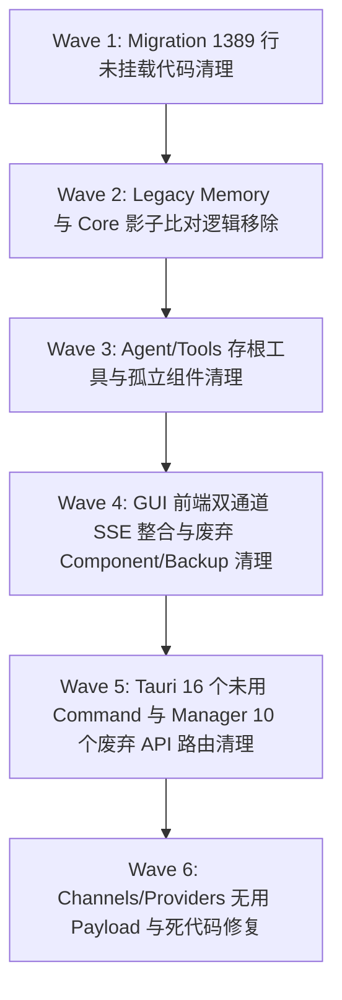

# agent-diva 代码审计提案发布与重构路线图（全量扩展版）

## 1. 重构路线图

本重构计划分为 **6 个独立切片（Wave 1 ~ Wave 6）**。重构仅在用户明确批准后开启，每个 Wave 独立提交 Git Commit 并全量通过 CI 验证：

### Wave 1: Migration 1389 行未挂载死文件清理 (P0)
- 物理删除 `agent-diva-migration/src/config_migration.rs`, `memory_migration.rs`, `session_migration.rs`。

### Wave 2: Legacy Memory 兼容层与影子比对逻辑移除 (P1)
- 清理 `governance_adapter.rs` (135 行)、`memory_boundary.rs` 中的 `CutoverMemoryProvider` 及 `recall.rs` 影子比对函数。

### Wave 3: Agent & Tools 存根与死工具清理 (P1)
- 移除 `PlanApproveTool` 存根、`MessageTool`、4 个旧版 Planning Tools，并迁移 `wtf.rs` ASCII Logo。

### Wave 4: GUI 前端双通道 SSE 整合与废弃组件清理 (P1)
- 整合 `App.vue` 双通道，删除 `ApprovalBanner.vue`, `GatewayControlPanel.vue`, `MaskSwitcher.vue` 及 3 个备份文件。

### Wave 5: Tauri 16 个废弃 Command 与 Manager 10 个废弃 API 路由清理 (P2)
- 从 `commands.rs` 和 `lib.rs` 移除 16 个未用 Command，从 `manager` 移除 `/api/command-approvals` 等 10 个旧路由。

### Wave 6: Channels/Providers 死代码与无用 Payload 清理 (P2)
- 重构 `email.rs` 消除重复解析，修复 `telegram.rs` 打字状态，精简各 Channel Payload 未用字段。
