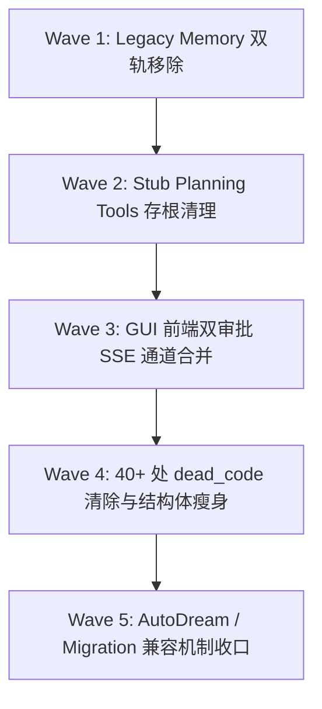

# agent-diva 代码审计提案发布与重构路线图

## 1. 重构执行策略

本预案为 **提案与规划阶段（Proposal-only Phase）**，当前阶段不修改任何生产代码。

在提案被批准后，重构工作将按阶段分批（Phase / Wave）推进，每个阶段包含独立的开发、验证与 Commit：

---

## 2. 阶段规划路线图 (Wave Plan)

### Phase 1 (Wave 1): 彻底移除 Legacy Memory Boundary 双轨分支
- 包含文件：`agent-diva-agent/src/memory_boundary.rs`, `agent-diva-core/src/config/schema.rs`
- 目标：将 `MemoryAuthorityMode` 限制为单轨生产机制，彻底删除 `MemoryManager` 运行时引用。

### Phase 2 (Wave 2): 移除失效的 Agent 工具存根
- 包含文件：`agent-diva-agent/src/planning/tools.rs`, `agent-diva-agent/src/tool_assembly.rs`
- 目标：清理 `PlanApproveTool` 存根，收口工具分派与提示词渲染。

### Phase 3 (Wave 3): GUI 双审批通道与前端状态合并
- 包含文件：`agent-diva-gui/src/App.vue`, `agent-diva-gui/src-tauri/src/`
- 目标：合二为一，统一前端 SSE 事件流与审批数据源。

### Phase 4 (Wave 4): 全局 死代码 (Dead Code) 专项清理
- 包含文件：`agent-diva-channels`, `agent-diva-gui`, `agent-diva-core` 等 10+ 个 Crate
- 目标：删除 40+ 处带有 `#[allow(dead_code)]` 的废弃字段与函数。

### Phase 5 (Wave 5): 收口 AutoDream 历史运行格式与 Migration
- 包含文件：`agent-diva-autodream/src/service.rs`, `agent-diva-migration/`
- 目标：彻底消灭历史遗留代码隐患。
