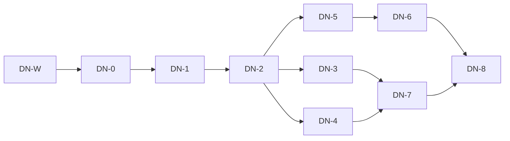

# DIVA Next — planning package index

Initiative: backend separation and Rust runtime retirement ("DIVA Next").
Authoritative design: [ProjectViVy/agent-diva#13, plan comment DN-P1](https://github.com/ProjectViVy/agent-diva/issues/13#issuecomment-5853903385) (2026-09-27). This index tracks execution state only; the issue remains the design source of truth. Do not maintain a competing status table elsewhere.

- Baseline code revision: `0fd005a105d8987df02ae7b796a3c591e04b9ca3` (main).
- Backend counterpart: [ProjectViVy/agent-vivy#63](https://github.com/ProjectViVy/agent-vivy/issues/63) and its [backend scope supplement](https://github.com/ProjectViVy/agent-vivy/issues/63#issuecomment-5851799141).
- VIVY audit revision referenced by the issue: `f6fb11bc71be2d06946ff33b0462aa56f9ff51ef`; the actual integration revision is selected and recorded by DN-0.

## Requirements (traceability to issue §8)

| Req | Requirement (issue §8 definition of done) |
| --- | --- |
| R-1 | Every DN-0 required behavior has a verified VIVY/native replacement or explicit agreed scope disposition |
| R-2 | No old Rust business chain, automatic legacy fallback, or competing persistence authority in the new product |
| R-3 | New frontend performs real model/chat/tool/approval/recovery against the pinned VIVY Generation |
| R-4 | Companion state is real, durable, and reflected in runtime behavior |
| R-5 | Voice/avatar optional, follow run cancellation/replay/resource semantics |
| R-6 | Native host lifecycle works on declared supported platforms |
| R-7 | Historical data migration repeatable, preserves source data |
| R-8 | Clean product build/package/CI independent of the retired Rust workspace |

## Story DAG

| Story | Epic / requirement | Outcome | Immediate predecessors (required output) | Plan | Status | Evidence / blocker |
| --- | --- | --- | --- | --- | --- | --- |
| DN-W | A / R-2,R-8 | Legacy Rust backend fully removed from the branch (user-ordered phase 1) | — | [DN-W.md](DN-W.md) | Done | tests 485 pass, vue-tsc+Vite build pass, zero Rust sources in tree |
| DN-0 | A / R-1 | Command/data inventory + VIVY compatibility baseline frozen | — | [DN-0.md](DN-0.md) | Ready | VIVY integration revision must be selected inside DN-0; inventory reads baseline `0fd005a1` from git history |
| DN-1 | A / R-2,R-3 | Framework-neutral VIVY client + Vue state seam | DN-0 (contract freeze record, pinned revision) | [DN-1.md](DN-1.md) | Planned | needs DN-0 `backend-separation-contracts.md` |
| DN-2 | A / R-2,R-3 | Rust-free chat/session/approval loop | DN-1 (client + session projection) | [DN-2.md](DN-2.md) | Planned | needs selected VIVY core runtime |
| DN-3 | B / R-1,R-3 | Settings/operational pages on VIVY authority | DN-2 (verified VIVY mutation path) | [DN-3.md](DN-3.md) | Planned | per-domain VIVY APIs, individually gated |
| DN-4 | B / R-4 | Companion pages on real persona/memory/evolution/report services | DN-2 | [DN-4.md](DN-4.md) | Blocked | #63 domain capabilities (persona projection, working memory, AutoDream/review, reports) |
| DN-5 | C / R-6 | Non-Rust desktop host + lifecycle | DN-2 | [DN-5.md](DN-5.md) | Blocked | host/platform/origin capability probe (part of the Story) |
| DN-6 | C / R-5 | Speech/avatar/resource chain on new host/backend | DN-5 | [DN-6.md](DN-6.md) | Blocked | VIVY speech/resource/event contracts under #63 |
| DN-7 | D / R-7 | Offline data handoff with versioned import receipts | DN-3, DN-4 | [DN-7.md](DN-7.md) | Blocked | import contracts + asset schema from target domains |
| DN-8 | D / R-1,R-2,R-8 | Accept packaged DIVA Next; boundary gate + parity sign-off | DN-6, DN-7 | [DN-8.md](DN-8.md) | Planned | deletion already done by DN-W; this is the final release gate |

Execution waves: `{DN-W}` → `{DN-0}` → `{DN-1}` → `{DN-2}` → `{DN-3, DN-4, DN-5}` → `{DN-6, DN-7}` → `{DN-8}`.

## Shared-file conflicts (serialize, not a logical dependency)

- `agent-diva-gui/src/App.vue`: touched by DN-2, DN-3, DN-4 — sequential edits only.
- `agent-diva-gui/package.json` + lockfile: touched by DN-1, DN-3, DN-6, DN-8 — sequential.
- Build recipes (`justfile`, `scripts/`, `.github/workflows/`): touched by DN-5, DN-8 — sequential.
- Parallel write lanes require isolated worktrees and the `LOCK.md` protocol (AGENTS.md).

## Authorized scope and exclusions (from issue §1)

- Vue presentation retained; VIVY is sole agent/backend authority via pinned artifact and native control protocol.
- Incremental replacement on this migration branch with an independent data directory; old release remains a separately launched historical artifact only.
- Excluded: keeping Rust Manager as protocol translator; deleting Rust code before parity; assuming a specific desktop shell before the DN-5 probe.
- No dual-backend operation against the same mutable data; no silent legacy fallback.

## Decision log (append-only)

| When | Decision / change | Source |
| --- | --- | --- |
| 2026-09-27 | Planning package created from issue comment DN-P1; all Stories Planned except DN-0 (Ready investigation) | this branch |
| 2026-09-27 | Artifact layout follows issue-proposed `docs/plans/diva-next/`; DN-0 produces `backend-separation-contracts.md` here | issue §6 DN-0 |
| 2026-09-27 | User directive: phase 1 is wire-cut only — legacy Rust backend deleted immediately (DN-W), ahead of DN-P1's delete-after-parity ordering. DN-8 rescoped to boundary gate + acceptance. Old code remains the reference via git history `0fd005a1`. | user message 2026-09-27 |

## Next executable work

DN-0 (inventory + contract freeze against baseline `0fd005a1` in git history). DN-1 becomes Ready when DN-0's contract record lands and its named VIVY dependencies are confirmed. The full #63 backend backlog does not block DN-1/DN-2.
