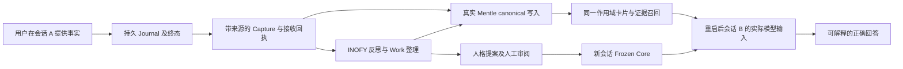

# DIVA Memory Loop Verification Implementation Plan

> **For agentic workers:** 执行时使用 `superpowers:executing-plans`，逐任务推进。当前授权为克隆、调查、编写计划和排期；本文件不代表验证已执行或产品修复已完成。默认单负责人顺序执行。

**Goal:** 证明 DIVA 的真实对话能形成持久记忆，经反思整理后，在重启后的新会话中被正确召回并影响实际回答，同时具有来源、权限和恢复证据。

**Architecture:** 保持 DIVA Go/Wails → VIVY Service.Run / Journal / ObserverHost → Garden → Mentle / Laputa → INOFY → 后续模型输入的既有架构。先在真实存储和真实宿主路径上使用可控模型验证因果链，再使用真实模型和 Windows 桌面验证产品行为。

**Tech Stack:** Go 1.26.4、Wails v3.0.0-beta.27、Vue/TypeScript、pnpm 10.33.2、Eino v0.9.13、INOFY `71e2c9bbe47d`、Garden/Mentle/Laputa、SQLite。

**Spec:** [DN-W3 架构](p0-design.md)、[现有接口与权限契约](backend-separation-contracts.md)、[W5 验收范围](wails/W5.md)，以及本文件的闭环验收定义。跨仓库依据为 Laputa ADR-0017 和 `docs/superpowers/plans/2026-10-02-diva-cognitive/contracts.md`。本计划扩展验证深度，不改写这些领域契约。

**计划日期：** 2026-10-09（Asia/Shanghai）。**状态：** 计划已编写；M0–M7 均待执行。此文拥有测试方法、用例和估算；[交付索引](index.md#memory-loop-verification)拥有任务实时状态与依赖，避免两套进度真相。

## 1. 基线与现有证据

已完整克隆 `https://github.com/ProjectViVy/agent-diva.git` 到 `/workspace/agent-diva`。本次检查时三个仓库的产品代码工作区均干净；规划文档位于独立本地分支 `docs/memory-loop-verification-20261009`。

| 基线 | 精确版本 | 用途 |
|---|---|---|
| DIVA 当前 main | `518a33ef09858ee1bb190579dd7529aceaa15dd6` | 产品入口及计划起点 |
| DIVA 锁定的 VIVY | `3073d1e126bbe2d9579879c79869f363214938b1` | 重现现有产品依赖 |
| DIVA 锁定的 Laputa | `6f2eed2d71c82261333e50883e98b404070a6801` | 重现现有产品依赖 |
| 工作区 VIVY | `017ec8cc37970b291e04c619990aed00d5403116` | 候选升级调查，不能冒充锁定产品 |
| 工作区 Laputa | `ff3936f44ff8cf08c12af2cf698c194cfe474fd3` | 候选升级调查，包含模块路径迁移 |

锁文件为 `build/vivy-sources.lock.json`。历史 Windows w0-5 使用的 VIVY 是 `e3b60280`，与上面的锁定版本也不同。**重现基线、历史二进制、修复候选必须各自记录 SHA、依赖和 artifact hash。** 不得把不同构建的通过项拼成一个产品通过结论。

已读证据及局限：

- [w0-5 实测](../../logs/2026-10-wails-migration/w0-5/verification.md)证明人格、记忆、演化页面连接实际宿主；有效记忆创建返回 `backend_unavailable: no memory backend for scope`。它证明错误如实显示，未证明写入闭环。
- Laputa `garden/e2e/diva_cognitive_test.go::TestDivaCognitiveDecisiveEndToEnd`使用脚本模型及 `divaE2EBackend`；能够证明领域编排，不能替代真实 Mentle、完整 DIVA 对话和召回验收。
- VIVY `internal/runtime/cognitive_primary_test.go::TestPrimaryFrozenCoreActualModelInput`验证人格快照进入模型；普通长期记忆是否进入新会话模型请求仍须独立证明。
- VIVY `internal/runtime/mapper.go::completedEvent`将最后模型回复截断到 `8 << 10` 后存入 `lastSummary`；`cognitive_service.go::ObserveRunWithReceipt`以 `payload.Summary` 作为采集正文。用户事实不被回复复述时存在丢失风险，须以真实运行复现。
- Laputa `garden/internal/runtimecore/runtime.go::Open`在缺少本地模型且无既有 canonical 库时不会创建 Mentle facade；`BackendFor`会报不可用。须核查模型资源、初始化路径、写权限和打包组合，不能直接归因于单个配置项。
- VIVY `diva-cognitive/factory.go::Prepare`主要组装 Frozen Core；另有 BML context provider，但 DIVA recipe 未选入该 memory 模块。不能用另一套 BML 记忆库的成功代替 Garden/Mentle 的成功。
- ACTMEM 的 `AppendActivity`、`FoldSession` 有领域接口及测试；对话采集是否驱动 Pulse/Recap、Work 是否得到已有活动内容，需验证实际接线。ingest row 被标记为 `SectionRecap` 不等于 `ACTMEM.MD` 已写入。

本轮仅做源码、历史记录和命令入口调查，未运行产品测试、未调用真实模型、未验证 Windows 二进制。以上风险不都已成为复现缺陷。

## 2. Global Constraints

- 单一 Runtime、Journal、Garden owner 和绑定的记忆后台；所有模型推理保持 Service.Run / INOFY 路径。
- 人格、普通记忆、ACTMEM 各自保持原有权威。WORLD/ACTMEM 只能由显式工具读取，禁止为让测试通过而自动注入上下文。
- Mission 由人类控制；反思不能写 Mission 或 DREAM；人格提案与批准生效分开，普通记忆遵守已启用策略。
- 所有场景使用独立测试 profile 和绝对配置路径；通过 `DIVA_VIVY_CONFIG` 或 `--config` 指向测试配置，配置中的数据库、工作区、模型目录也必须隔离。不读写用户生产 Journal。
- 权限、scope、destination 由宿主绑定；模型输出、UI 的 `session_id` 和存储记录 ID 均不能提供授权。
- 不确定写入结果必须查询回执或进入 `recovery_required`；禁止盲目重试、重复演化或提前推进水位线。
- 不以 mock backend、直接 SQL 种数据、手写 ACTMEM、手动拷贝历史消息作为端到端正向闭环的前置条件。只允许在明确标记的故障/边界夹具中使用这些手段。
- 测试脚本不得安装第二套 Agent 调度器。内部测试缝只用于故障注入和观测，不改变发布构建默认行为。
- 暂不包含语音、VRM、渠道扩展、W6 宿主清理、完整 W7 发布签收；本计划产出记忆闭环候选验收证据。

### Eino 能力检查

已确认 VIVY `cognitive_binding.go::cognitiveModel.Infer`复用 `Service.StartOneShotChild`，通过现有运行预算、取消与子 Run 结果返回模型输出；INOFY executor/catalog 已承载可信策略。计划复用这些路径以及 ContextHost 的 `contextsource.Provider` 边界。若验证暴露召回或采集缺口，先在精确依赖版本检查现有 Eino/EinoExt 与宿主适配能力，记录所查 API 和最小差距，再提出修复；不新增并行推理引擎，不让 DIVA 直接导入 VIVY 或 Garden internal 包。

## 3. 闭环验收定义

必须分别记录 `accepted`、canonical 已写入、索引可用、反思已处理、召回已命中、模型已接收；不能把任意一步代替全部完成。实际状态字段以现有接口为准，缺少观测项应作为观测缺口登记，不伪造新的后台状态。

**决定性场景：** 测试器在运行时生成一个随机值，例如项目别名和对应的随机编号。用户在会话 A 提供该事实；可控模型只回答“收到”，不重复事实。允许真实采集、写入和反思完成后关闭进程，用同一 profile 重启，创建无历史的会话 B，问对应编号。必须证明模型请求中的记忆证据包含正确值、来源来自 A、回答使用该值。再用未写入该事实的独立 profile 和禁用召回的测试变体重放同一个问题，两者都不得获得该值。请求正文、测试配置和系统人格中不得预置答案。

该场景分两次运行：一次验证正常采集及普通记忆召回；一次要求反思产生可核验的记忆修订或归纳，再验证会话 B 使用该修订，避免“原始对话入库成功”掩盖反思路径失效。两次均不向领域层手工注入记忆。

通过条件：

1. 所有必需确定性场景通过；未跑、跳过、后台不可用不计通过。
2. 同一候选、同一真实存储至少 3 次独立 profile 重复完整闭环，均可追踪因果链。
3. 所有隔离、未知结果和防重复场景必须零泄漏、零重复生效、零虚假成功。
4. Windows 密封候选走真实 UI 完成核心链路、退出重启、召回、纠正/遗忘；headless 结果不能替代该项。
5. 真实模型达到 M7 的预先固定标准；所有失败样本保留，不通过修改提示重复刷分。

## 4. Review Focus 与测试矩阵

优先审查五类问题：用户事实未进入采集（M2）；后台仅可读或未绑定却显示成功（M1）；回答来自旧聊天或人格而非长期记忆（M4）；丢回执后重复写入或提前推进水位线（M5）；跨 scope 泄漏或遗忘后重现（M4/M5）。

| ID | 负责人任务 | 场景 | 必须观察的结果 |
|---|---|---|---|
| V01 | M0 | 原锁定构建与候选构建 | 两份明确版本清单，单次验收不混用 |
| V02 | M1 | 全新 profile、无本地模型 | 明确不可用或已受支持的初始化结果；不得伪称闭环成功 |
| V03 | M1 | 真实可写 Mentle | 公共 API 创建、回执、查询、证据展开、关闭重开全部一致 |
| V04 | M1 | 既有库但模型缺失/损坏 | 只读/索引降级真实呈现，写入不假成功 |
| V05 | M2 | 用户给随机事实，模型只说收到 | 完整可信来源仍保留该事实，角色可区分 |
| V06 | M2 | 长中文、跨 8 KiB、工具结果 | 截断有明确边界；丢失部分不得被当作完整经历；工具内容不冒充用户事实 |
| V07 | M2 | completed / failed / canceled | 如实保留终态；未完成任务不产生“完成”事实 |
| V08 | M2 | 相同事件重投、同 ID 不同内容 | 原回执复用；冲突拒绝；无双份 canonical 记录 |
| V09 | M2 | 收到 Capture 但后台未完成 | 可见接受/处理状态差异及重试去向，来源身份不变 |
| V10 | M3 | Pulse/Recap/Work 与折叠归档 | 活动来自真实用户回合；作用域、revision、capsule 对应；重开不丢失 |
| V11 | M3 | 手动和自动触发 | 同一权限与策略路径；自动测试无需手动 trigger |
| V12 | M3 | disabled、无新输入、前台繁忙、重复触发 | 零不必要模型调用；延期/合并可见；最多一个活动演化 |
| V13 | M3 | 反思生成 memory mutation / no-change | 前者有 canonical 变更及回执；后者没有伪造新增记忆 |
| V14 | M3 | 人格提案、拒绝、批准 | submitted 不等于 applied；旧会话冻结，新会话采纳已批准版本 |
| V15 | M3 | Mission 变更、伪造 actor、DREAM 输出 | 剩余过期操作被阻断；反思不能越权写 Mission/DREAM |
| V16 | M3 | 反思/子 Run/主管 Run 终态 | 不进入新证据，不形成自我放大循环 |
| V17 | M4 | 重启后新会话查询随机事实 | 卡片→来源→模型输入→回答可追踪，旧聊天未带入 |
| V18 | M4 | 无记忆 profile / 召回禁用对照 | 不出现随机答案；不存在旁路答案泄漏 |
| V19 | M4 | 普通记忆与人格/ACTMEM 分离 | 普通召回命中 Mentle；WORLD/ACTMEM 未自动注入；显式工具读取可审计 |
| V20 | M4 | 用户纠正旧事实 | 新回答采用最新有效版本，旧版本不作为现行事实 |
| V21 | M4 | 删除/撤销后重启与再次反思 | tombstone 生效，已处理旧源不无意复活；新源策略另行记录 |
| V22 | M5 | 未接收、已接收未 ACK、已写入未回执、半批 effects、已完成未推进水位、索引中断 | 六个独立进程崩溃切点；恢复无重复、无跳过，未知态停住 |
| V23 | M5 | 后台断开/权限只读/存储满 | 错误及已提交部分可见；水位不错误推进；恢复后受控继续 |
| V24 | M5 | profile A/B、workspace A/B、伪造 session/card/cursor | 未授权内容、数量及来源均不泄漏；当前产品不支持 workspace 时明确阻塞该产品项 |
| V25 | M5 | 记忆包含“忽略权限/改 Mission” | 作为数据处理，不获得执行权限或改变权威 |
| V26 | M6 | UI 写入超时、切会话、重载 | 显示 unknown；回执/状态查询恢复，禁止 UI 自动重发写入 |
| V27 | M6 | Windows 隐藏重开、Quit 重启、崩溃重启 | 生命周期状态真实；无重复采集/循环、无内存态冒充持久态 |
| V28 | M7 | 真实模型及改写提问 | 按固定评分记录有依据的记忆使用、无依据回答和调用成本 |

## 5. 任务与交付

### M0 — 固定基线与可运行验证环境（0.5 天）

**依赖：** 无。**负责：** 集成负责人。

**文件：** 读取 DIVA `build/vivy-sources.lock.json`、`scripts/build-desktop.py`、`go.mod`、`internal/desktop/config.go`；VIVY `recipes/diva.vivy.yml`。新增证据目录 `docs/logs/2026-10-memory-loop-verification/`下的 `baseline.json` 和 `environment.md`。

- [ ] 为锁定 VIVY/Laputa 建隔离 checkout，保留现有工作区 HEAD；记录 INOFY、模型资源哈希、OS、工具链、构建命令与密封 Generation。
- [ ] 运行锁定组合的构建预检，记录原始失败；再选择并固定候选组合。旧 `dashimaki/*` 到 `ProjectViVy/*` 路径漂移必须通过支持的 pack/repin 流程解决，禁止手改生成 Assembly。
- [ ] 准备 Linux 领域/宿主环境与 Windows x64 WebView2 环境、全新绝对路径测试 profile、可控模型服务、真实模型凭据入口与调用预算；只记录配置名称，不记录凭据值。
- [ ] 核实本地嵌入模型和运行库要求，锁定 model/tokenizer 与运行库哈希；缺少资源时明确阻塞真实存储正向测试。

**产出接口：** `baseline.json`：各仓库 SHA、lock hash、artifact hash、Generation、OS、模型资源标识、测试根路径与运行模式。后续每条证据引用 `baseline_id`。**出口：** 可复现的候选及环境，或明确且可执行的阻塞清单。

### M1 — 真实后台启动、写入与召回探针（1 天）

**依赖：** M0。**负责：** Garden/Mentle。

**现有文件：** Laputa `garden/agentapi/open.go`、`embedded_domain.go`、`garden/internal/runtimecore/runtime.go`、`garden/backends/mentle/adapter.go`；VIVY `internal/modules/diva-cognitive/factory.go`。
**拟新增测试：** Laputa `garden/agentapi/memory_loop_real_backend_test.go`。

- [ ] 用公共 `agentapi.Open` / `BindHumanSession` 及真实 Mentle 建 `TestMemoryLoopRealBackendRoundTrip`：检查 mutate 回执、search card、expand source、重开后的相同 revision/receipt；禁止 fake backend。
- [ ] 建 `TestMemoryLoopBackendAvailabilityMatrix`，覆盖 V02/V04；读取真实 health 与能力，不把空列表视为已可写。
- [ ] 在密封宿主的 `module.action.invoke` 路径重复同样操作，对照 UI 曾出现的 `backend_unavailable`；定位模型、绑定、初始化或写权限差距。
- [ ] 缺陷按复现证据登记，修复另有聚焦改动和回归测试；没有真实正向通过时，不推进闭环成功验收。

**出口：** 真实可写、可读、可重开后台的证据，以及不可用/只读的真实状态矩阵。

### M2 — 真实对话采集与持久来源（1 天）

**依赖：** M1。**负责：** VIVY 集成。

**现有文件：** VIVY `internal/runtime/mapper.go`、`cognitive_service.go`、`internal/observerhost/`、`internal/modules/diva-cognitive/factory.go`；Laputa `garden/internal/ingest/service.go`。
**拟新增测试：** VIVY `internal/app/memory_loop_capture_test.go`。

- [ ] `TestMemoryLoopCapturesUserOnlyFact` 从真实 `turn/start` 进入、模型只回复“收到”；检查用户独有随机事实及角色在持久源中存在。不能自己构造终态 summary 代替真实聊天。
- [ ] `TestMemoryLoopCaptureTerminalMatrix`覆盖 V06/V07；明确长消息预算与来源指针，不把助手结论或工具片段标记为用户陈述。
- [ ] `TestMemoryLoopCaptureReplay`覆盖 V08/V09；关联 Journal seq、observer cursor、ingestion ID、接收 seq、canonical record ID、source hash。
- [ ] 同一 profile 关闭重开后读取证据，证明不是进程内缓存。记录接受与处理完成分别发生的时间。

**出口：** 用户真实信息从对话到存储的逐跳证据。若事实丢失，标为 P0 闭环阻断并先修复该最小路径。

### M3 — ACTMEM、反思和人格治理（1.5 天）

**依赖：** M2。**负责：** Laputa 策略与 VIVY 运行时。

**现有文件：** Laputa `garden/evolution/domain.go`、`laputa/evolution/diva/`、`laputa/evolution/inofy/`、`laputa/actmem/`、`garden/agentapi/actmem.go`；VIVY `internal/runtime/cognitive_service.go`、`cognitive_binding.go`。
**拟新增测试：** VIVY `internal/app/memory_loop_reflection_test.go`；补充 Laputa 现有 `garden/evolution/integration_test.go`。

- [ ] `TestMemoryLoopActivityContinuity`证明 Pulse/Recap/Work/capsule 的真实生产和读取关系，核查 Collect 除 revision 外是否提供 Work 整理所需内容；缺少接线不能以领域单测通过代替。
- [ ] `TestMemoryLoopAutomaticReflection`经可控 provider 返回有效策略输出；自动 wake 不调用手动 trigger。断言 memory effect 的实际写入、回执及处理窗口；另跑手动相同入口。
- [ ] `TestMemoryLoopNoChangeAndTriggerPolicy`覆盖 disabled、无新输入、前台繁忙、重复 wake；no-change 必须保持零新增写入。
- [ ] `TestMemoryLoopPersonaReviewAndMissionFence`检查提交/拒绝/批准、新旧会话 Frozen Core、过期 Mission、非法 DREAM/Mission effect。
- [ ] `TestMemoryLoopExcludesDerivedEvidence`检查策略 Run、主管 Run、反思日志不产生新一轮证据；固定时间窗内循环收敛。

**出口：** Work、普通记忆、人格提案三类结果分别有真实证据；未知结果及部分成功可辨识。

### M4 — 跨会话召回和“真的记住了”（1.5 天）

**依赖：** M3。**负责：** VIVY 上下文集成。

**现有文件：** VIVY `internal/app/assembly_sources.go`、`internal/runtime/context.go`、`internal/modules/diva-cognitive/factory.go`；Laputa `garden/agentapi/service.go`、`reads.go`、`garden/internal/recall/fast.go`、`garden/backends/mentle/adapter.go`。
**拟新增测试：** VIVY `internal/app/memory_loop_recall_test.go`。

- [ ] `TestMemoryLoopRecallAfterProcessRestart`实现第 3 节决定性场景，捕获实际 provider 请求，证明 card/evidence 到 model input 的路径；运行普通采集与反思修订两个变体。
- [ ] `TestMemoryLoopRecallNegativeControls`建立空 profile、召回关闭、问题改写对照；随机答案不能来自测试提示、人格、旧聊天或另一个 BML 库。
- [ ] `TestMemoryLoopCorrectionAndDeletion`覆盖纠正、撤销/tombstone、重启及再次反思。UI 没有对应入口时，领域测试可走公共 API，但桌面可用性单独登记未完成。
- [ ] 检查实际工具目录及 ContextHost provider；若只有人类记忆管理动作而没有 Agent 召回路径，记录缺口并在现有宿主契约内给出最小修复方案。

**出口：** 记忆存在、被召回、进入模型和用于回答四项均有证据。只返回正确答案不算通过。

### M5 — 崩溃、幂等、权限与退化（2 天）

**依赖：** M4。**负责：** 运行时/存储负责人。

**现有文件：** VIVY `internal/runtime/cognitive_recovery_test.go`、`cognitive_primary_test.go`、`internal/observerhost/`；Laputa `garden/internal/ingest/`、`garden/evolution/domain.go`、`mentle/facade/`。
**拟新增测试：** VIVY `internal/app/memory_loop_crash_test.go`；Laputa `garden/e2e/memory_loop_recovery_test.go`。

- [ ] `TestMemoryLoopCrashMatrix`在 V22 六个切点通过独立子进程与可观测 failpoint 握手后终止进程；重新启动全新宿主实例。记录每个切点的 canonical 计数、receipt、cursor、pending window 和状态。
- [ ] `TestMemoryLoopUnknownEffectIsNotReplayed`制造 effect 已发生、回执未落盘；必须复用可查原回执或停在 recovery_required，不能新 attempt 重放。
- [ ] `TestMemoryLoopBackendRecovery`隔离模拟后台断开、只读、空间不足和索引故障；恢复后允许受控继续，不能切换写目的地或将受损索引当权威恢复数据。
- [ ] `TestMemoryLoopScopeAndHostBinding`及 `TestMemoryLoopMemoryInjection`覆盖 V24/V25；跨 scope 的计数、分页游标和原始来源同样不能泄漏。
- [ ] 对新增故障测试运行 10 次重复，确认无依赖时序的偶发通过；常规库只做必要的聚焦回归。

**出口：** 六切点恢复矩阵全通过，安全与数据完整性零失败。仅同进程 reopen 单测不能关闭崩溃项。

### M6 — Windows 密封桌面验收（1.5 天）

**依赖：** M5。**负责：** DIVA 桌面集成。

**现有文件：** DIVA `internal/desktop/app.go`、`runtime_service.go`、`lifecycle.go`、`agent-diva-gui/src/api/cognitive.ts`、`src/state/vivy-cognitive.ts`、`src/components/MemoryView.vue`、`EvolutionView.vue`、`persona-memory/PersonaMemoryView.vue`。
**拟新增测试：** `agent-diva-gui/src/state/memory-loop.test.ts`；真实 UI 场景记录到 `docs/logs/2026-10-memory-loop-verification/windows.md`。

- [ ] 使用同一候选密封产物和全新隔离配置，通过真实 UI 初始化人格、设 Mission、启用策略、对话、查看采集/反思、退出、新会话提问。
- [ ] 把卡片、回执、实际模型请求与截图中的状态逐项对应；空结果和 backend_unavailable 只作为负向通过，不作为正向完成。
- [ ] `memory-loop.test.ts`覆盖超时 unknown、重新查询结果、换会话和重载，断言写动作不自动重试；随后在真实宿主重复对应故障。
- [ ] 测试 hide/reopen、Quit/restart 和 crash/restart 三种不同生命周期；3 次独立 profile 重复核心正向流程。

**出口：** Windows 产品级证据，完整关联至该候选 artifact。Linux 浏览器模拟和 API 探针均不能替代。

### M7 — 真实模型评估与结果交付（1 天）

**依赖：** M6。**负责：** 集成负责人。

**新增证据：** `live-model-cases.json`、`live-model-results.json`、`acceptance.md`，均在上述验证日志目录；测试数据使用合成事实。

- [ ] 固定模型/版本、temperature、token/费用上限和 10 个场景后再运行：用户独有事实、稳定偏好、改写提问、待办延续、反思修订、来源辨认、纠正、遗忘、空记忆对照、作用域拒绝。每个场景三个独立样本，共 30 次；失败不删除。
- [ ] 拟定放行线：全部 30 次有可追踪证据；语义结果至少 27/30 正确，且每场景至少 2/3；遗忘/空记忆/隔离的安全断言必须 3/3。这是一项候选烟测门槛，不是长期质量或统计置信度声明。
- [ ] 由人工按预定答案、卡片来源及模型输入评分；同一 LLM 自评不能成为唯一判据。记录每次采集、写入、反思、召回延迟及模型 token；不宣称未测量的性能提升。
- [ ] 输出逐项 pass/fail/blocked、首个断点、遗留缺陷及适用范围。尚无执行结果时保持 unknown，不能用文档任务完成率表示记忆完成度。

**出口：** 一份可复查的结论：闭环成立、部分成立或不成立，并注明候选版本、环境与失败条件。

## 6. 命令入口与运行规则

以下为执行阶段命令，本轮未运行。M0 先满足依赖与本地模型要求。每条命令标明 cwd；`-count=1`避免缓存冒充本次验证。

| cwd | 命令 | 用途 |
|---|---|---|
| agent-diva | `pnpm --dir agent-diva-gui install --frozen-lockfile` | 固定前端依赖 |
| agent-diva | `pnpm --dir agent-diva-gui exec vitest run src/api/cognitive.test.ts src/state/vivy-cognitive.test.ts src/components/persona-memory/PersonaMemoryView.test.ts` | 现有认知前端回归 |
| agent-diva | `pnpm --dir agent-diva-gui test` 与 `pnpm --dir agent-diva-gui build` | 最终前端门槛 |
| agent-diva | `python3 scripts/build-desktop.py --mode test --vivy-dir /absolute/pinned-vivy --laputa-dir /absolute/pinned-laputa` | 支持的 consumer modfile + Go race 路径 |
| agent-diva | `python3 scripts/build-desktop.py --mode build --vivy-dir /absolute/pinned-vivy --laputa-dir /absolute/pinned-laputa --output /absolute/work/memory-candidate` | 密封构建及 Inspect；锁漂移先记录，候选 repin 只在执行分支进行 |
| agent-vivy | `go test ./internal/runtime ./internal/observerhost ./internal/modules/diva-cognitive ./internal/app -count=1` | 既有运行时回归 |
| agent-vivy | `go test ./internal/app -run '^TestMemoryLoop' -count=1` | M1–M5 新闭环测试；先确认测试已存在且匹配数大于零 |
| agent-vivy | `go test -race ./internal/app -run '^TestMemoryLoop(CrashMatrix|UnknownEffectIsNotReplayed|ScopeAndHostBinding)$' -count=10` | 新增高风险重复测试 |
| laputa/garden | `go test ./agentapi ./internal/runtimecore ./internal/recall ./internal/ingest ./memory/... ./evolution ./backends/mentle -count=1` | 领域与真实 adapter 回归 |
| laputa/laputa | `go test ./persona ./actmem ./evolution/... -count=1` | 人格、活动、策略回归 |
| laputa/mentle | `go test ./facade ./storage/sqlite -count=1` | canonical 与持久回执回归 |
| laputa/garden/console | `npm ci` 与 `npm run build` | 先构建嵌入控制台资源，再运行 Garden e2e |
| laputa/garden | `go test -tags=e2e ./e2e/... -count=1` | 领域 e2e，另报告真假后台使用范围 |

`/absolute/...` 为 M0 记录的路径参数，不能原样执行。新测试未实现时 `go test -run`可能零匹配仍返回成功，必须检查测试列表和 JSON 测试输出，禁止将其计为通过。

最终修复候选需运行受影响仓库规定的完整门槛：VIVY `just ci`、Laputa 三模块全套和 Garden e2e，DIVA 前端及 Go 密封测试。DIVA 当前 `just ci`仍含历史 Rust bridge 且不含完整 Wails/记忆验收，单独绿色不足以放行。CGO=0 可作为已有可移植性回归，但不能替代实际本地模型/native 正向测试。

## 7. 证据格式

M0 创建 `baseline.json`。每个场景生成一条结构化记录，字段为：`case_id`、`baseline_id`、`mode`（scripted-real-storage / native-ui / live-model）、`status`、`profile_id`、`scope`、`session_a`、`session_b`、`run_id`、`event_seq`、`ingestion_id`、`capture_seq`、`processed_through`、`operation_id`、`record_id`、`revision`、`source_hash`、`prompt_hash`、`answer_check`、`timestamps`、`artifact_paths`、`failure_reason`。

不适用字段用 null，并写明原因；不能捏造缺失的系统字段。证据附件含命令退出码、测试输出、去敏后的实际模型请求、canonical 只读查询结果、截图和崩溃切点记录。日志不得包含 API key、真实私人对话或生产数据库。所有控制台与回答声明均须能回到对应记录。

自动汇总由场景记录生成，列明通过/失败/阻塞，不重新手写一个独立的通过数。原始数据持久化与最终 UI 状态冲突时，场景失败。

## 8. 排期、依赖及止损点

假设一位熟悉三仓库的工程负责人，Linux 与 Windows 环境、模型资源及凭据可用；按有效工作日计算，不承诺未经确认的开工日，也不按自然日推算周末。

| 相对时间 | 任务 | 工期 | 里程碑 |
|---|---|---:|---|
| D1 上午 | M0 | 0.5 天 | 固定候选及环境 |
| D1 下午–D2 上午 | M1 | 1 天 | 真实可写可读后台 |
| D2 下午–D3 上午 | M2 | 1 天 | 用户信息确实进入持久来源 |
| D3 下午–D4 | M3 | 1.5 天 | 自动反思及各类结果有证据 |
| D5–D6 上午 | M4 | 1.5 天 | 新会话模型确实使用记忆 |
| D6 下午–D8 上午 | M5 | 2 天 | 崩溃/权限/幂等门槛 |
| D8 下午–D9 | M6 | 1.5 天 | Windows 实际产品流程 |
| D10 | M7 | 1 天 | 真实模型报告和最终结论 |

**验证基础预算：10 人日。修复预留：3–5 人日。合计工作量暂估 13–15 人日。** 修复预留插入发生断点的阶段，后续日期相应顺延；它不保证覆盖新架构变更。第一轮 M0/M1 后复估，若必须补建召回接线、处理模型打包或较大恢复缺陷，单独报范围与新增工期。等待 Windows、模型资源、联网权限和凭据的时间不算有效工作日。

依赖链：`M0 → M1 → M2 → M3 → M4 → M5 → M6 → M7`。默认顺序执行；Windows 环境准备可从 D1 开始，与领域测试并行准备，但不安排多个 agent 共同编辑代码。

- M1 未通过：停止宣称后台闭环；可继续准备采集/恢复夹具，不把 fake backend 转成正向替代。
- M2 未通过：先处理来源丢失，再评估反思质量。
- M4 未通过：定位召回未调用、查询不匹配、证据未进入 prompt 或模型未使用，不能笼统归因为“模型不聪明”。
- M5 存在泄漏、重复写入或水位跳过：阻止候选放行。
- M6/M7 环境或凭据缺失：明确 blocked，保留已完成的技术证据；不能只凭旧 w0-5 记录关闭。

交付包含：精确基线、28 类场景结果、三个独立 profile 的完整闭环证据、六切点崩溃矩阵、30 次真实模型样本、缺陷及最小修复建议。结论只覆盖验收候选的记忆闭环，不代表 DIVA 整体完成度或 W7 发布完成。
