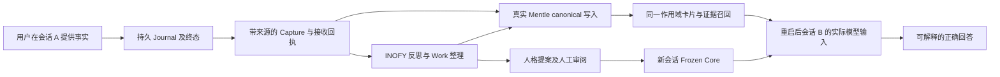

# 记忆闭环验证目标与源码依据

版本：2026-10-10。本计划包承接 2026-10-09 调查结论，原始基线不自动等同当前远端 HEAD。

## 目标与架构

证明 DIVA 的真实对话能形成持久记忆，经反思整理后，在重启后的新会话中被正确召回并影响实际回答，同时具有来源、权限和恢复证据。

**Architecture:** 保持 DIVA Go/Wails → VIVY Service.Run / Journal / ObserverHost → Garden → Mentle / Laputa → INOFY → 后续模型输入的既有架构。先在真实存储和真实宿主路径上使用可控模型验证因果链，再使用真实模型和 Windows 桌面验证产品行为。

**Tech Stack:** Go 1.26.4、Wails v3.0.0-beta.27、Vue/TypeScript、pnpm 10.33.2、Eino v0.9.13、INOFY `71e2c9bbe47d`、Garden/Mentle/Laputa、SQLite。

**Spec:** [DN-W3 架构](../p0-design.md)、[现有接口与权限契约](../backend-separation-contracts.md)、[W5 验收范围](../wails/W5.md)，以及本文件的闭环验收定义。跨仓库依据为 Laputa ADR-0017 和 `docs/superpowers/plans/2026-10-02-diva-cognitive/contracts.md`。本计划扩展验证深度，不改写这些领域契约。

## 基线与现有证据

已完整克隆 `https://github.com/ProjectViVy/agent-diva.git` 到 `/workspace/agent-diva`。本次检查时三个仓库的产品代码工作区均干净；规划文档位于独立本地分支 `docs/memory-loop-verification-20261009`。

| 基线 | 精确版本 | 用途 |
|---|---|---|
| DIVA 当前 main | `518a33ef09858ee1bb190579dd7529aceaa15dd6` | 产品入口及计划起点 |
| DIVA 锁定的 VIVY | `3073d1e126bbe2d9579879c79869f363214938b1` | 重现现有产品依赖 |
| DIVA 锁定的 Laputa | `6f2eed2d71c82261333e50883e98b404070a6801` | 重现现有产品依赖 |
| 工作区 VIVY | `017ec8cc37970b291e04c619990aed00d5403116` | 候选升级调查，不能冒充锁定产品 |
| 工作区 Laputa | `ff3936f44ff8cf08c12af2cf698c194cfe474fd3` | 候选升级调查，包含模块路径迁移 |

锁文件为 `build/vivy-sources.lock.json`。历史 Windows w0-5 使用的 VIVY 是 `e3b60280`，与上面的锁定版本也不同。**重现基线、历史二进制、修复候选必须各自记录 SHA、依赖和 artifact hash。** 不得把不同构建的通过项拼成一个产品通过结论。

已读证据及局限：

- [w0-5 实测](../../../logs/2026-10-wails-migration/w0-5/verification.md)证明人格、记忆、演化页面连接实际宿主；有效记忆创建返回 `backend_unavailable: no memory backend for scope`。它证明错误如实显示，未证明写入闭环。
- Laputa `garden/e2e/diva_cognitive_test.go::TestDivaCognitiveDecisiveEndToEnd`使用脚本模型及 `divaE2EBackend`；能够证明领域编排，不能替代真实 Mentle、完整 DIVA 对话和召回验收。
- VIVY `internal/runtime/cognitive_primary_test.go::TestPrimaryFrozenCoreActualModelInput`验证人格快照进入模型；普通长期记忆是否进入新会话模型请求仍须独立证明。
- VIVY `internal/runtime/mapper.go::completedEvent`将最后模型回复截断到 `8 << 10` 后存入 `lastSummary`；`cognitive_service.go::ObserveRunWithReceipt`以 `payload.Summary` 作为采集正文。用户事实不被回复复述时存在丢失风险，须以真实运行复现。
- Laputa `garden/internal/runtimecore/runtime.go::Open`在缺少本地模型且无既有 canonical 库时不会创建 Mentle facade；`BackendFor`会报不可用。须核查模型资源、初始化路径、写权限和打包组合，不能直接归因于单个配置项。
- VIVY `diva-cognitive/factory.go::Prepare`主要组装 Frozen Core；另有 BML context provider，但 DIVA recipe 未选入该 memory 模块。不能用另一套 BML 记忆库的成功代替 Garden/Mentle 的成功。
- ACTMEM 的 `AppendActivity`、`FoldSession` 有领域接口及测试；对话采集是否驱动 Pulse/Recap、Work 是否得到已有活动内容，需验证实际接线。ingest row 被标记为 `SectionRecap` 不等于 `ACTMEM.MD` 已写入。

上述为规划调查时的历史结论。首轮实际运行结果见 README 及执行 handoff；用户来源丢失现已复现，Windows/live 未验证。

## Global Constraints

- 单一 Runtime、Journal、Garden owner 和绑定的记忆后台；所有模型推理保持 Service.Run / INOFY 路径。
- 人格、普通记忆、ACTMEM 各自保持原有权威。WORLD/ACTMEM 只能由显式工具读取，禁止为让测试通过而自动注入上下文。
- Mission 由人类控制；反思不能写 Mission 或 DREAM；人格提案与批准生效分开，普通记忆遵守已启用策略。
- 所有场景使用独立测试 profile 和绝对配置路径；通过 `DIVA_VIVY_CONFIG` 或 `--config` 指向测试配置，配置中的数据库、工作区、模型目录也必须隔离。不读写用户生产 Journal。
- 权限、scope、destination 由宿主绑定；模型输出、UI 的 `session_id` 和存储记录 ID 均不能提供授权。
- 不确定写入结果必须查询回执或进入 `recovery_required`；禁止盲目重试、重复演化或提前推进水位线。
- 不以 mock backend、直接 SQL 种数据、手写 ACTMEM、手动拷贝历史消息作为端到端正向闭环的前置条件。只允许在明确标记的故障/边界夹具中使用这些手段。
- 测试脚本不得安装第二套 Agent 调度器。内部测试缝只用于故障注入和观测，不改变发布构建默认行为。
- 暂不包含语音、VRM、渠道扩展、W6 宿主清理、完整 W7 发布签收；本计划产出记忆闭环候选验收证据。

### Eino 能力检查

已确认 VIVY `cognitive_binding.go::cognitiveModel.Infer`复用 `Service.StartOneShotChild`，通过现有运行预算、取消与子 Run 结果返回模型输出；INOFY executor/catalog 已承载可信策略。计划复用这些路径以及 ContextHost 的 `contextsource.Provider` 边界。若验证暴露召回或采集缺口，先在精确依赖版本检查现有 Eino/EinoExt 与宿主适配能力，记录所查 API 和最小差距，再提出修复；不新增并行推理引擎，不让 DIVA 直接导入 VIVY 或 Garden internal 包。

## 闭环定义

必须分别记录 `accepted`、canonical 已写入、索引可用、反思已处理、召回已命中、模型已接收；不能把任意一步代替全部完成。实际状态字段以现有接口为准，缺少观测项应作为观测缺口登记，不伪造新的后台状态。

**决定性场景：** 测试器在运行时生成一个随机值，例如项目别名和对应的随机编号。用户在会话 A 提供该事实；可控模型只回答“收到”，不重复事实。允许真实采集、写入和反思完成后关闭进程，用同一 profile 重启，创建无历史的会话 B，问对应编号。必须证明模型请求中的记忆证据包含正确值、来源来自 A、回答使用该值。再用未写入该事实的独立 profile 和禁用召回的测试变体重放同一个问题，两者都不得获得该值。请求正文、测试配置和系统人格中不得预置答案。

该场景分两次运行：一次验证正常采集及普通记忆召回；一次要求反思产生可核验的记忆修订或归纳，再验证会话 B 使用该修订，避免“原始对话入库成功”掩盖反思路径失效。两次均不向领域层手工注入记忆。

通过条件：

1. 所有必需确定性场景通过；未跑、跳过、后台不可用不计通过。
2. 同一候选、同一真实存储至少 3 次独立 profile 重复完整闭环，均可追踪因果链。
3. 所有隔离、未知结果和防重复场景必须零泄漏、零重复生效、零虚假成功。
4. Windows 密封候选走真实 UI 完成核心链路、退出重启、召回、纠正/遗忘；headless 结果不能替代该项。
5. 真实模型达到 S13 的预先固定标准；所有失败样本保留，不通过修改提示重复刷分。

## Review Focus

1. 用户独有事实丢失：S04。
2. 后台缺失/只读却显示成功：S02、S11。
3. 回答来自旧聊天、人格或另一记忆库：S08。
4. 丢回执导致重复效果或水位跳过：S10。
5. 外域泄漏、遗忘后重现或记忆指令提升权限：S09、S11。

首轮已交付执行基础与诊断证据；后续按修复准入连续开发，正式验收仍依赖原 gate。实时状态只在 README 维护；旧文档和其他候选的通过记录不会自动推进本包状态。
