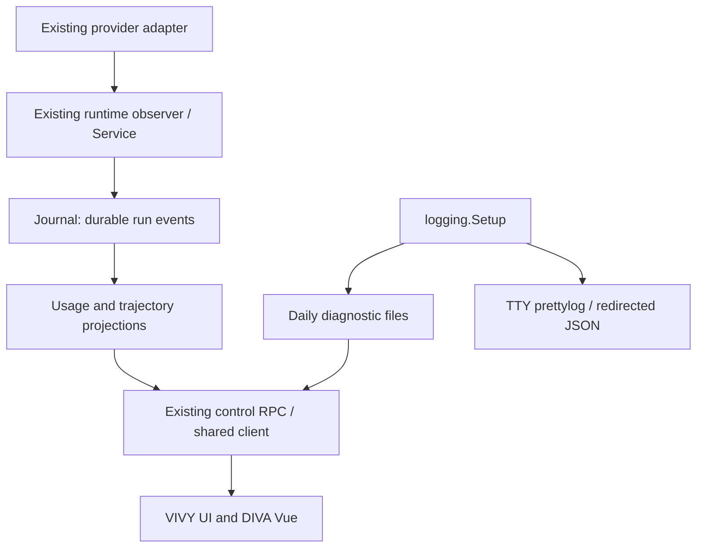

# Observability extension — OBS-D1 review draft

VIVY must produce readable terminal diagnostics, durable model-call evidence, useful trajectories and honest token totals. DIVA must show those facts through the shared-library client. This is the observability domain of DN-3, extending [P0-D1](../p0-design.md), not a replacement desktop architecture. Planning is authorized; this draft does not start implementation or certify a packaged runtime. Delivery status belongs only to the [parent index](../index.md).

## Baseline and requirements

Inspected source pins: DIVA code `d96e396d1641a5e7636e30e1f6cdbd0e597b62c8`; latest DIVA planning `3407b3c91bd345d21facb7966979f77223d7e941`; VIVY `8fc6bea1236458b1ef2c72a845ec45eabc02d913`; prettylog merged main `8b8e03760378b0202723b66f78da69b1b530bc1b`; deepseek-harness reference `639ed015397290b3745d163aafe02ffee4aa3f84`. The newer VIVY inspection supplements P0-D1's older pin, not an accepted binary substitution. DN-0 must select the integration pin and DN-L must rebuild/inspect its Generation.

| ID | Required result | Acceptance owner |
| --- | --- | --- |
| O1 | Terminal formatting with prettylog; machine-readable redirected output; independent daily file format and existing redaction | OBS-01 |
| O2 | Every observable provider invocation in chat runs has durable identity, start, usage observations and finish; live delivery follows commit | OBS-02 |
| O3 | Correct usage replacement, attribution, missing/partial coverage and estimated-price semantics | OBS-03 |
| O4 | Actual call/tool/run/wait/cancel/child activity, stable IDs, honest active states and replay recovery | OBS-04, OBS-07 |
| O5 | Bounded runtime/GUI diagnostic access; acknowledged GUI writes and visible failures | OBS-05, OBS-08 |
| O6 | DIVA token dashboard, connection status and preview reflect the real core | OBS-06 |
| O7 | Explicit disposition for console placeholders and deferred capabilities | OBS-06, OBS-08, OBS-09 |
| O8 | Existing VIVY UI remains compatible; real native package proves cross-repository behavior | OBS-03, OBS-04, OBS-09 |

Existing evidence is stronger than the “all placeholders” hypothesis: `stats/tokens` already reads Journal usage through both SQL stores; `trajectory/session` already folds Journal/messages. Prettylog is merged but is not yet a VIVY dependency. DIVA still invokes removed commands. Its shared library, Tauri bridge and typed client remain P0-D1 proposals. Neither `run/log` nor a JSON diagnostic file is a global audit service.

## Authority and boundaries



Journal is the sole authority for run/call/usage facts. Projections are reconstructible reads; no token ledger, second run engine or frontend completion authority is added. Diagnostic files describe operations and may expire; they are not replay or billing evidence. Rust remains the P0-D1 native shell/FFI owner. No desktop HTTP listener, WebSocket replacement host, Manager command facade or alternate provider stack is introduced.

VIVY changes stay in `internal/logging`, `internal/runtime`, `internal/domain`, `internal/storage`, `internal/rpc`, existing provider adapters and existing UI consumers. Eino imports remain inside runtime/provider quarantine. DN-L owns Recipe/generated Assembly/sealed Generation changes and embedded process lifetime; observability does not write generated assembly or create another pack path. Public embedding code must call VIVY-owned setup internally because external applications cannot import `internal/logging`.

## D1 — Split console and file handlers

Keep `logging.format=json|text` / `VIVY_LOG_FORMAT` as the current file-format contract. Add `logging.console_format=auto|pretty|json|text` and strict `VIVY_LOG_CONSOLE_FORMAT`; default `auto` selects pretty on a real terminal and JSON when redirected. Explicit values override detection. Reuse pinned `golang.org/x/term.IsTerminal` on the actual console descriptor; prettylog's standalone defaults do not decide VIVY routing. Respect prettylog's `NO_COLOR` behavior and test redirected output for absence of ANSI codes.

`logging.Setup(opts Options) (*slog.Logger, Effective, io.Closer, error)` remains the owning constructor. Extend Options with `ConsoleFormat string`, Effective with resolved file/console formats. Compose file and console using Go 1.26.4's standard `slog.NewMultiHandler`; do not implement a competing fan-out handler. Put the existing redactor outside the fan-out so every sink receives the same sanitized record. Resolve `LogValuer` leaves and redact error/Stringer text at that seam; preserve attributes/groups, enabled levels and existing daily rotation/retention. A disabled console produces only the file handler.

Use `github.com/mastwet/prettylog` at the merged commit; resolve and record its exact module version with Go tooling during OBS-01 rather than guessing a pseudo-version. No further prettylog feature change is required by this design. Bootstrap logging in `cmd/vivy/main.go` also uses the same setup seam; failures before config parsing use proposed `logging.NewBootstrap(stderr *os.File) *slog.Logger`, which uses the same console selection/redactor without opening a file before config is known. `cmd/vivy/run.go` preserves its stdout for assistant output. The embedded DN-L owner initializes logging once and closes its file resources after run shutdown; window close never closes the logger. Diagnostic directory/setup failures are initialization errors, not successful startup with discarded logs.

## D2 — Capture calls at the real model boundary

The current drive-leg `model.request` is not a provider-call boundary. Move new request emission to `observingChatModel.Generate/Stream` before invoking the inner model. Keep old v1/v2 schemas for history only. Extend the existing observer, including Generate and WithTools-bound clones; do not add a second stream tee.

Proposed runtime-local types, finalized under this draft before OBS-02 implementation:

```go
type modelCallInput struct {
    Mode string // "generate" or "stream"
    Messages []*schema.Message
    Tools []*schema.ToolInfo // bound + final common model options
}
type modelCallMeta struct {
    CallID, Provider, Model, Source, ContextViewID string
}
type modelCallResult struct {
    Err error
    Usage *schema.TokenUsage // latest normalized cumulative sample; nil means absent
    UsagePartial bool      // contradictory/ambiguous normalization
    ResponseComplete bool  // Generate succeeded or Stream reached normal EOF
}
type modelCallObserver interface {
    Begin(context.Context, modelCallInput) (modelCallMeta, error)
    StreamOpened(modelCallMeta)
    Chunk(context.Context, modelCallMeta, *schema.Message) error
    End(context.Context, modelCallMeta, modelCallResult) error
}
```

The observer binds the owning run, selected route, source (`main|child|summary`) and emitter. Begin allocates one opaque `call_id` per concrete model-interface invocation and commits the start. Start persistence failure prevents provider invocation. Tool follow-ups and summary failover invocations each get a new ID. No separate attempt ID or retry-group ID is introduced: Eino supplies neither at this seam. Anthropic SDK transport retries can occur under one observed call; they remain explicitly unobservable. Resolve actual bound tools and final options using pinned `model.GetCommonOptions` because ADK adds `model.WithTools` to the invocation options. Preserve the current digest's privacy/coverage limits: text and selected tool names/IDs, not image/audio/video bytes, reasoning or tool-call argument fingerprints. An existing context_view references the admitted drive-leg feed, not a byte-exact current prompt; label it accordingly and omit it for summary routes without that view. Do not create another prompt store.

`StreamOpened` runs only after successful inner Stream, before exposing the tee; pre-call Begin must not set the mapper's observed-stream marker on setup failure. Generalize observation to Eino `BaseModel[*schema.Message]` for in-run summary primary and fallback models; retain an optional ToolCallingChatModel wrapper for chat WithTools, cloning route/source metadata. Update `engine.go`/`compaction_middleware.go` wiring without changing Eino's compaction/failover execution. Child source comes from execution context, not the mapper's current default `main`.

| Event / payload version | Proposed additions and meaning |
| --- | --- |
| `model.request` v3 | Existing digest fields and optional admitted drive-leg context-view reference plus required `call_id`, `mode:"generate"|"stream"`, `provider`, `model`, `source`; captures the actual invocation input subject to the documented digest limits |
| `model.usage` v2 | Existing core counts plus required `call_id`, `provider`, `model`, `source`, `usage_kind:"cumulative"`, optional `normalization_partial:true` for ambiguous core evidence, optional `settlement:true` only for the at-most-one changed final sample emitted by End; optional reasoning/cache counts remain absent when unknown |
| `model.call.finished` v1 (new) | `call_id`, `status:"completed"|"failed"|"cancelled"`, required `usage_present:boolean`, `response_complete:boolean`, optional sanitized `error`; finishes a provider invocation, never a run or durable assistant message |

`model.completed` keeps its current durable assistant-message meaning. Normalize provider chunks before calling them cumulative samples. Claude MessageStart and MessageDelta conversion can lose per-field JSON presence and turn omitted input/cache counters into scalar zero; its pinned test covers only a full delta, so raw-last replacement is unsafe. Reuse pinned Eino schema.ConcatMessages's per-bucket monotonic/max merge on usage-only messages (bounded state, no text accumulation or extra stream reader), then compute normalized total as input + output under VIVY's convention. OpenAI's final usage-only chunk is included. A positive contradictory/decreasing counter or unsupported accounting convention marks normalization_partial and forbids complete/cost-known claims; do not silently sum chunks or claim unknown presence. Add a MessageStart input=10 then output-only cumulative delta=20 fixture: normalized total=30, not 20 or a sum of all samples. This conservative rule is justified by inspected source/fixtures, not proof of every Anthropic server version.

The latest committed normalized sample replaces earlier samples for the same `(run_id,call_id)`. Different observed calls add. A non-nil provider-reported zero usage is a real sample; nil metadata produces no sample. The new v2 payload uses `*int`/JSON optional fields for reasoning_tokens and cached_tokens, without dropping a known pointer-to-zero. In the inspected Eino path these buckets are scalar ints with no presence bit: normalize positive values as known and zero as unknown (nil optional field). Top-level non-nil all-zero usage still records core counts and presence. No generic conversion can certify optional zero. A future adapter may supply known-zero only with actual raw-provider presence evidence and pinned tests; reimplementing provider HTTP or guessing support is outside this round. Receiver/fold fixtures still test known-zero versus absent wire fields.

Begin must precede inner Stream setup so setup errors are observed. Generate observes its returned message once, then End. Stream retains the current bounded producer `Recv → persist → Send` path, tool-settled barrier and error propagation. End is exactly once for normal EOF, setup error, read error, downstream close or cancellation. An error/early close with previously reported usage remains partial. Final settlement records presence/completeness, never duplicate token counts in the finish event. Service owns draining/cancelling the observer before committing a run terminal; use its existing bounded terminal persistence context to settle after caller cancellation. Journal failure fail-closes delivery and may prevent finish from persisting: replay then shows an interrupted/unsettled attempt, not a forged successful finish. Process crash has the same honest projection. No usage is appended after run closure; title generation/manual compaction outside an owned open run are deferred. Budget ownership moves observed model-call charging to Begin, before invocation; suppress the later model.completed/tool.requested model charge for those observed calls while retaining fallback accounting for unobserved test/legacy paths. Equal cumulative usage samples are not re-emitted. The separate MaxEvents quota needs explicit settlement semantics: v3 request and ordinary usage samples consume it normally. The new finish event and at most one changed End usage sample tagged settlement:true are mandatory closure evidence and exempt from MaxEvents, as run terminals already are. At most two extra bounded records are allowed per successfully admitted call; they never admit model/tool/retry work. Each call still consumes its request slot, so finite MaxEvents also bounds this extra cardinality even if MaxModelCalls is unlimited. End uses the existing Service/Journal writer and emits its final sample/finish as one ordered settlement; it cannot emit repeated exempt samples. Ledger replay applies the same exemptions and charges model work once from v3 requests, keeping legacy event accounting for histories without v3. Track the accounting mode per run so a parent's new events do not suppress a child's legacy charges. This is an explicit event-policy amendment, not an unmeasured performance target. Add MaxEvents/model/tool boundary, concurrent child and recovery tests to prevent double charging, unbounded exemptions or tool-budget bypass.

Pinned Eino `v0.9.13` supplies ChatModel/ToolCallingChatModel, typed streams and callbacks. Existing source documents why `OnEndWithStreamOutput`/`StreamReader.Copy` callbacks are sibling consumers after Stream returns, unable to guarantee producer persistence/backpressure. Reuse Eino execution/checkpoints and the already justified observer; do not replace orchestration. Inspect and record OpenAI/Claude adapter usage normalization, summary routing and cancellation tests against the pinned modules before releasing OBS-02. No guarantee of invoice completeness is made.

## D3 — Honest usage projection and wire compatibility

Extend `storage.UsageRow` and its two existing readers to fold request/usage/finish events by attempt. Share pure normalization/fold logic; SQL adapters fetch canonical events and preserve parity. This requires no new usage table or DDL. If profiling later justifies an index, use paired append-only SQLite/PostgreSQL migrations in a separate reviewed change.

New attempt attribution/time comes from its start, even if its final usage crosses a period boundary. Select attempts by start time, then read their latest sample/finish up to the snapshot watermark; filtering samples first would lose replacements. Legacy v1 usage is keyed by `(run_id,seq)` and keeps its historical sample timestamp/count behavior. Do not infer missing legacy calls or retrofit IDs onto ambiguous history. Existing main/child/summary route rules remain, and unknown summary attribution stays unknown.

`stats/tokens` keeps its current period union, `tz_offset_minutes` sign, `session_limit`, `scope:"chat_runs"` and total/model/provider/timeline/session fields. Add `projection_version:2` and `coverage` to snapshot and each displayed aggregate where completeness differs:

```ts
type UsageCoverage = {
  state: 'empty' | 'complete' | 'partial' | 'legacy';
  observed_calls: number;       // v3 starts in the selected scope
  completed_with_usage: number; // normally settled calls with a valid sample
  reported_calls: number;      // distinct new attempts with a usage sample
  missing_usage_calls: number; // settled/interrupted new attempts without usage
  partial_usage_calls: number; // abnormal/ambiguous calls with a valid sample
  active_calls: number;        // started and not settled; not zero-cost failures
  legacy_usage_records: number;
  unknown_buckets: ('reasoning' | 'cached')[];
  hidden_retries_observable: false;
};
```

Partitions satisfy `observed_calls = completed_with_usage + partial_usage_calls + missing_usage_calls + active_calls`; reported may include active calls and is not a disjoint partition. `request_count` remains the number of distinct reported new calls plus legacy usage records; label it “usage reports”, not total billed requests. Show observed count separately. State is empty only with no calls/legacy records; complete only when all observed calls settled normally with valid, non-partial normalization and known requested buckets, with no legacy records; pure legacy is legacy; all mixed/incomplete data is partial.

Reported totals are known subtotals when coverage is incomplete. Preserve existing numeric fields for old consumers; new consumers use coverage to avoid presenting unknown optional buckets as exact zero. Prompt includes cached input in VIVY's normalized convention; cached is a subset of prompt, reasoning a subset of completion. Neither is added again to total. Validate nonnegative counts, safe summation and subset consistency; invalid samples are excluded and produce partial coverage plus a sanitized diagnostic, not silently plausible totals. A call with no valid sample counts as missing; an earlier valid sample followed by invalid/ambiguous data is partial provisional evidence. Such provisional values are not asserted as exact final usage or a guaranteed lower bound.

Cost is a reference-catalog estimate. Existing `cost_known:false` remains authoritative for unknown routes/prices/billable cache splits and for missing/partial/active coverage. Show “— / incomplete estimate”, never “free”. A known subtotal may be displayed as such, without claiming a complete charge. Keep each row's completeness separate from global completeness. Title generation/manual compaction, unobserved SDK retries and external provider traffic remain outside `chat_runs`; the dashboard states this scope.

OBS-03 owns both backend and `ui/src/lib/api.ts` / existing VIVY TokenStatsPanel updates. OBS-06 consumes the same snake_case wire DTO in DIVA; it does not retain the seven-call legacy aggregate or invent realtime TPS from bucket totals. Refresh on authoritative usage/finish/terminal events with one coalesced in-flight request, plus manual refresh and reconnect; no permanent unbounded event buffer or hidden polling loop.

## D4 — Trajectory as a live Journal view

Enhance existing `trajectory/session({session_id,limit?})`, retaining default 20/max 50 recent runs and 8KiB detail clipping. Add `projection_version:2`, per-run `watermarks:{[run_id]:seq}` and `has_older_runs:boolean`. It is a recent-run window, not complete historical pagination; expose that limit. Full historical browsing is deferred.

Request rows gain stable `request_id`, `run_id`, `call_id`, `call_status:"active"|"completed"|"failed"|"cancelled"|"interrupted"|"legacy"`, optional `finished_at`, `usage_state:"missing"|"reported"|"partial"|"active"|"legacy"` and nullable `usage_evidence`. Preserve old `status`, `completed_at` and numeric `usage` as legacy compatibility fields; v2 clients render call_status/usage_evidence so unknown never becomes zero. `usage_evidence` core counts are numeric, optional reasoning/cache counts preserve pointer presence as in D2. Add `run_activity:[{run_id,status,activity_state,wait_kind?,parent_run_id?,child_run_ids,workflow_id?}]`: status is the existing authoritative RunStatus; activity_state is `queued|active|waiting|completed|failed|cancelled`; wait_kind is `approval|question|child|workflow` only when a durable event identifies it. Waiting belongs here, never on a finished model call. Existing tool `call_id` and model `call_id` occupy separately typed rows. Record IDs derive from persisted `(run_id,seq,record_kind)`; request IDs from `(run_id,call_id)`, with legacy `(run_id,request_start_seq)` only when attributable. Do not reuse positional `rec-N`, equate non-error with completed, or treat a model finish as run terminal. Open calls after a recovered terminal/crash are interrupted; run waiting/approval is not an error; a completed model call remains completed while the run waits on its tool/approval. Include parent/child and workflow references from existing run/events without copying their state authority or inventing a workflow scheduler.

Live algorithm: attach DN-1 notification listener first; read the trajectory snapshot; subscribe to its known runs with watermarks; deduplicate `(run_id,seq)` and advance only contiguous sequences. On a new session run, re-read the snapshot using the session/run discovery seam accepted by DN-2. On gaps/bridge `gap`, pause advancement, replay `run/log` or refresh the snapshot, then resume. Reconnect/window reopen always reconciles. Snapshot has no durable sequence for transient diagnostic logs; those use the independent file cursor below. Incomplete older backends negotiate capability and show unavailable rather than fake rows.

OBS-04 updates VIVY projection, capability advertisement and existing trajectory UI together. OBS-07 mounts the DIVA trajectory and child view for a selected authoritative session; its old unmounted SubAgentPanel is rewritten against `child/list`/run IDs only after DN-0 accepts exact child DTOs. No browser demo dataset is connected to the production view.

## D5 — Bounded diagnostic RPC (proposed)

No equivalent global log RPC exists at the inspected pin. Add these to the existing control handler, advertise `diagnostics.logs` / `diagnostics.gui_append`, and retain normal peer authorization:

```ts
type DiagnosticRecord = {
  id: string; at?: number; level?: 'debug'|'info'|'warn'|'error';
  component?: string; message: string; fields?: Record<string, unknown>;
  truncated: boolean;
};
// diagnostics/logs
type DiagnosticQuery = {
  source: 'runtime'|'gui'; date?: string; after?: string;
  limit?: number; level?: 'debug'|'info'|'warn'|'error'; query?: string;
};
type DiagnosticPage = {
  source: 'runtime'|'gui'; records: DiagnosticRecord[];
  next_cursor?: string; gap: boolean; has_more: boolean;
};
// diagnostics/gui/append
type GuiLogBatch = {records: Omit<DiagnosticRecord, 'id'|'truncated'>[]};
type GuiLogAck = {accepted: number};
```

Dates are strict local log-family dates, cursors server-issued resource/offset tokens tied to source/date/file identity; clients cannot supply paths. Read only configured runtime/GUI families, reject symlinks or containment escapes, and reapply redaction to legacy/raw lines. Empty files return an empty page. Text files expose raw sanitized message with unknown structured fields; JSON files preserve bounded sanitized attributes. Rotation/retention/invalidation returns `gap:true`; the UI visibly resets/reloads instead of claiming continuity. Requests support cancellation. Draft bounds reuse the existing AuditPage 500-line ceiling and trajectory 8KiB detail ceiling: default/max page records 500; max GUI batch/queue records 500; max serialized diagnostic record 8KiB; max scan/batch bytes per request 500 × 8KiB. Scan exhaustion returns the cursor of the scanned prefix and has_more; it does not scan the whole file to find matches. A malformed/oversize JSON line is omitted with a diagnostic placeholder, not exposed as an unredacted raw fragment. OBS-05 supplies these verified contract bounds to DN-0; OBS-05 tests exact-boundary/over-boundary behavior. Bounds are resource guards, not performance targets.

GUI records use the same owned rotating-file facility with a distinct GUI family; do not append arbitrary browser data to the run Journal. Validate a bounded batch, normalize level/time, redact before disk and acknowledge accepted records only after successful writes. Failure is an RPC error, never successful `accepted:0` with hidden loss. Partial writes return an explicit error with accepted count and are not blindly retried. DIVA's recorder keeps a bounded queue, reports dropped/unpersisted records and flush failures via state outside console capture to prevent recursive logging. Core logs and GUI logging failure must not disable chat. Embedded ownership and close ordering follow DN-L; append/read after shutdown fail closed.

The current AuditPage becomes “Diagnostics” with runtime/GUI tabs. The removed `get_audit_events` has no verified global audit equivalent: show per-run activity via trajectory and mark global audit unavailable in the DN-0 ledger. A required global audit feature is a parity blocker until separately specified or explicitly retired; diagnostic logs cannot silently satisfy it.

## Console and placeholder disposition

| Surface / source | Inspected behavior | This round | Deferred owner / condition |
| --- | --- | --- | --- |
| `ConsoleView.vue` gateway status/buttons | Preview reports stopped; legacy process commands absent | OBS-06 shows connected/connecting/disconnected/unavailable from DN-1 transport + initialize/artifact metadata; remove false gateway control semantics | Host Quit/restart remains DN-5; no new runtime restart button without lifecycle contract |
| Console whole config load/save | Preview `{mock:true}` and success timestamp | OBS-06 removes fake success; unavailable until real mapped settings | Real per-domain settings remain DN-3, not a whole-config alias |
| `TokenStatsPanel.vue` / `api/tokenStats.ts` | Seven calls across six deleted commands, Promise.all | OBS-06 uses one real snapshot and honest scope/cost/coverage | All-process auxiliary accounting and invoice reconciliation separate |
| VIVY trajectory / demo fixture | Real projection but call/status/live semantics incomplete | OBS-02/04; production route only | Historical pagination separate; demos stay explicit development fixtures |
| DIVA missing trajectory / unmounted SubAgentPanel | No mounted real activity view | OBS-07 selected-session trajectory, child links and replay | New workflow management features remain their own domain |
| AuditPage runtime/GUI tabs + guiLogger | Removed commands; append failure swallowed | OBS-05/08 diagnostic RPC + visible persistence state | Global audit feed unresolved DN-0 row |
| Browser connection/config preview | Fixed sample data and fabricated success | OBS-06 explicit desktop unavailable, read-only presentation if chosen | Actual browser-control features need verified VIVY contracts |
| Memory, workflows, Cron, normal skills | VIVY has real capabilities; DIVA mappings incomplete | Do not label all as mock; retain DN-0 per-domain inventory | Existing DN-3/DN-4 owners |
| Persona/evolution/Notebook/reports | Legacy governance/domain assumptions | Record as deferred, no fabricated storage or success | DN-4 accepted semantic mappings; Notebook owner determined by DN-0 |
| Generation parameters / speech / historical import | Outside observability contract | No implementation here | DN-0/DN-6/DN-7 |

## Reference choices and execution gates

Use deepseek-harness's `packages/llm/token-meter/src/usage-projection.ts` latest-sample replacement and `turn-usage.ts` strict incomplete-attempt handling as concepts. VIVY prompt/cache conventions differ: do not transplant DSH's uncached-input sum. Reuse stable request rows and virtualization ideas from its `packages/client/ui-trajectory` only when needed; no React/DSH framework dependency, telemetry exporter or alternate persistence is justified.

Alternatives considered: pretty-only global output breaks machine/file consumers; piping an external prettylog command misses embedded boot/errors and lifecycle; Eino sibling callbacks alone break persist-before-delivery; a second usage DB creates competing truth; reusing removed DIVA commands preserves dead semantics; native frontend fixtures cannot prove a live bridge. Selected design adds one console dependency and a small existing-seam extension, with explicit schema/consumer compatibility costs.

Release gates: approve OBS-D1; implement independent VIVY Stories against inspected 8fc6bea and hand verified contracts/fixtures to DN-0 for integration selection; consume accepted DN-1/DN-2 client/session outputs for DIVA; run OBS-09 through a newly packed DN-L artifact and DN-P native chain. Toolchain availability improved: official Go 1.26.4 is installed in this research workspace and the pinned Eino module was downloaded. This removes an environment obstacle, not the ABI/Generation/platform acceptance blocker. No native acceptance or fresh product CI is claimed by the planning package.

All story plans include failure-first verification and handoff. Wire changes update event schemas, Go projections, both UIs and shared fixtures together. If target signatures differ after DN-0 selection, revise this draft and affected plans before execution rather than silently guessing adapters.

## Source pointers (immutable inspected revisions)

- [VIVY runtime observer](https://github.com/ProjectViVy/agent-vivy/blob/8fc6bea1236458b1ef2c72a845ec45eabc02d913/internal/runtime/model_stream_observer.go), [mapper](https://github.com/ProjectViVy/agent-vivy/blob/8fc6bea1236458b1ef2c72a845ec45eabc02d913/internal/runtime/mapper.go), [token RPC](https://github.com/ProjectViVy/agent-vivy/blob/8fc6bea1236458b1ef2c72a845ec45eabc02d913/internal/rpc/tokenstats.go), [trajectory](https://github.com/ProjectViVy/agent-vivy/blob/8fc6bea1236458b1ef2c72a845ec45eabc02d913/internal/runtime/trajectory.go).
- [DIVA console](https://github.com/ProjectViVy/agent-diva/blob/d96e396d1641a5e7636e30e1f6cdbd0e597b62c8/agent-diva-gui/src/components/ConsoleView.vue), [token panel](https://github.com/ProjectViVy/agent-diva/blob/d96e396d1641a5e7636e30e1f6cdbd0e597b62c8/agent-diva-gui/src/components/console/TokenStatsPanel.vue), [P0-D1 baseline](https://github.com/ProjectViVy/agent-diva/blob/3407b3c91bd345d21facb7966979f77223d7e941/docs/plans/diva-next/p0-design.md).
- [Prettylog merged Handler](https://github.com/mastwet/prettylog/blob/8b8e03760378b0202723b66f78da69b1b530bc1b/handler.go); [Eino pinned interfaces](https://github.com/cloudwego/eino/blob/v0.9.13/components/model/interface.go), [stream callback contract](https://github.com/cloudwego/eino/blob/v0.9.13/callbacks/interface.go), [standard MultiHandler](https://go.dev/src/log/slog/multi_handler.go).
- [DSH latest-sample usage projection](https://github.com/deepseek-ai/deepseek-harness/blob/639ed015397290b3745d163aafe02ffee4aa3f84/packages/llm/token-meter/src/usage-projection.ts), [strict turn usage](https://github.com/deepseek-ai/deepseek-harness/blob/639ed015397290b3745d163aafe02ffee4aa3f84/packages/llm/token-meter/src/turn-usage.ts).
