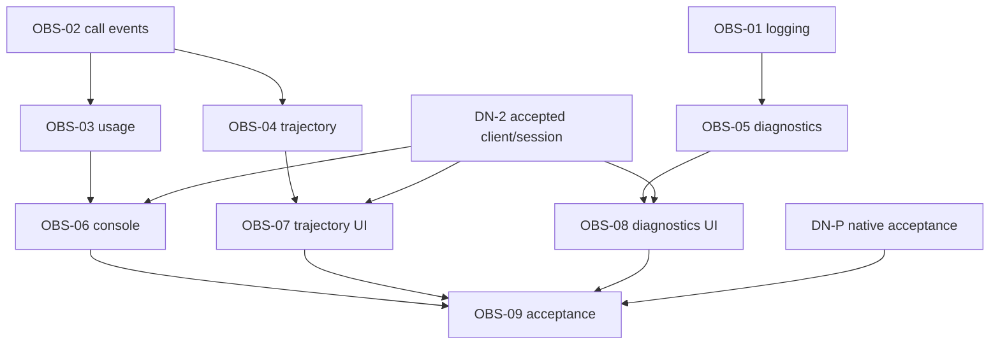

# Observability plan map

Specification: [architecture.md](architecture.md), revision OBS-D1. This page owns requirement mapping and execution order only. Delivery states/evidence live in the [parent index](../index.md); do not duplicate them here. Every Story, including currently blocked consumers, has a concrete executable plan.

| Epic | Outcome | Stories | Requirements |
| --- | --- | --- | --- |
| OBS-A | Reliable readable production evidence | OBS-01, OBS-02, OBS-05 | O1,O2,O5 |
| OBS-B | Correct Journal projections and existing VIVY views | OBS-03, OBS-04 | O3,O4,O8 |
| OBS-C | DIVA console consumes authoritative data | OBS-06, OBS-07, OBS-08 | O4,O5,O6,O7 |
| OBS-D | Native cross-repository acceptance | OBS-09 | O7,O8 |

| Story | Result | Immediate predecessors and consumed result | Executable plan |
| --- | --- | --- | --- |
| OBS-01 | Console/file handler split and prettylog integration | — | [OBS-01](OBS-01.md) |
| OBS-02 | Real provider-call Journal lifecycle | — | [OBS-02](OBS-02.md) |
| OBS-03 | Usage replacement/coverage + VIVY token UI | OBS-02: accepted event schema and event fixtures | [OBS-03](OBS-03.md) |
| OBS-04 | Correct trajectory + VIVY live UI | OBS-02: stable call/event schema and fixtures | [OBS-04](OBS-04.md) |
| OBS-05 | Bounded diagnostic reads and GUI writes | OBS-01: owned rotating handler and redaction seam | [OBS-05](OBS-05.md) |
| OBS-06 | DIVA token/connection console | OBS-03: stats v2 fixtures; DN-2: accepted session/client/recovery path | [OBS-06](OBS-06.md) |
| OBS-07 | DIVA trajectory + child links | OBS-04: trajectory v2 fixtures; DN-2: authoritative session/discovery/notifications | [OBS-07](OBS-07.md) |
| OBS-08 | DIVA diagnostics + GUI logging state | OBS-05: diagnostic producer/fixtures; DN-2: accepted shared client/lifetime | [OBS-08](OBS-08.md) |
| OBS-09 | Packaged observability closure | OBS-06, OBS-07, OBS-08: accepted consumers; DN-P: accepted native P0-A chain | [OBS-09](OBS-09.md) |

Common execution condition is OBS-D1 plan/spec approval. VIVY-only work uses the inspected backend baseline and does not need a DIVA ABI or DN-0 integration pin. DN-0 consumes the resulting observability contracts/fixtures and selects the native integration pin; that gate is inherited by DIVA consumers through DN-2. DN-2 transitively provides DN-1/DN-5/DN-L/DN-0; do not add these as redundant immediate edges. DN-3 accepts this domain only after OBS-09; it is the parent umbrella, not an executable predecessor of the child Stories.

Backend waves: `{OBS-01, OBS-02}` → `{OBS-03, OBS-04, OBS-05}`. Once DN-2 and matching backend producers are accepted: `{OBS-06, OBS-07, OBS-08}`. Once these and DN-P are accepted: `{OBS-09}`. These are logical batches, not staffing or calendar promises.

Serialize shared files separately from logical dependency:

- VIVY `internal/rpc/control.go`: OBS-03, OBS-04, OBS-05 one at a time; capability additions reviewed as one set.
- VIVY `internal/storage/contracts.go` and UI `lib/api.ts`: OBS-03 then OBS-04; these remain logically independent after OBS-02.
- VIVY `internal/logging/**`: OBS-01 first; OBS-05 consumes its resulting ownership rather than parallel rewriting rotation.
- DIVA `src/api/vivy/contracts.ts`, capabilities and package files: DN-1 first, then OBS-06/07/08 scoped sequential integration; one contract authority.
- DIVA `App.vue` / `ConsoleView.vue`: DN-2 first; OBS-06 mounts console, OBS-07 trajectory, OBS-08 diagnostics serially. Tests may be prepared in isolated lanes; mock tests do not satisfy predecessor acceptance.
- Recipe/Generation/ABI changes remain DN-L's lane. Any observability addition invalidates the old artifact acceptance and requires rebuild/inspect before OBS-09.

Execution handoff must include selected source commits, contract fixture version, exact test commands/results, accepted outputs, unresolved blockers and a clean scoped commit. Start OBS-01/02 only after design review; start DIVA consumers only after real predecessor evidence. No Story becomes Done from this document generation.
