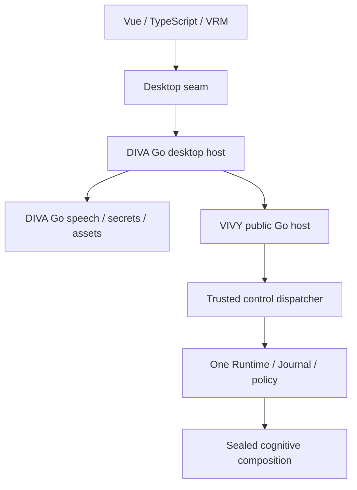
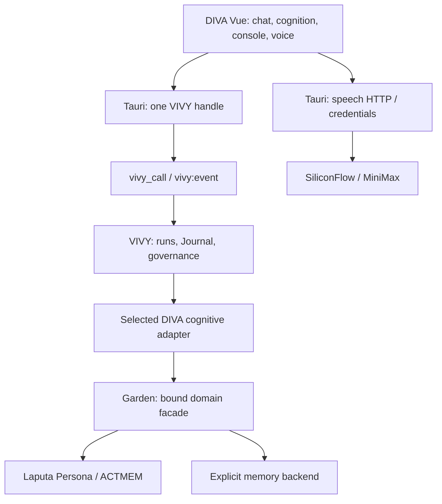
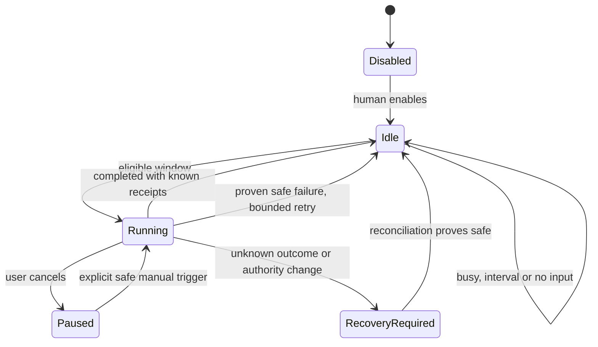
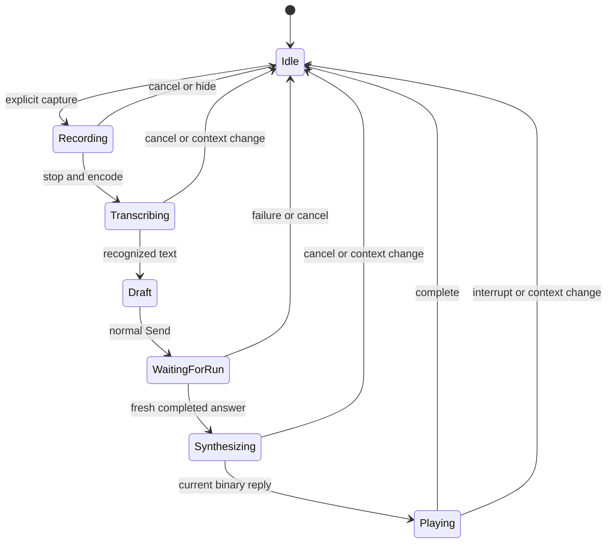
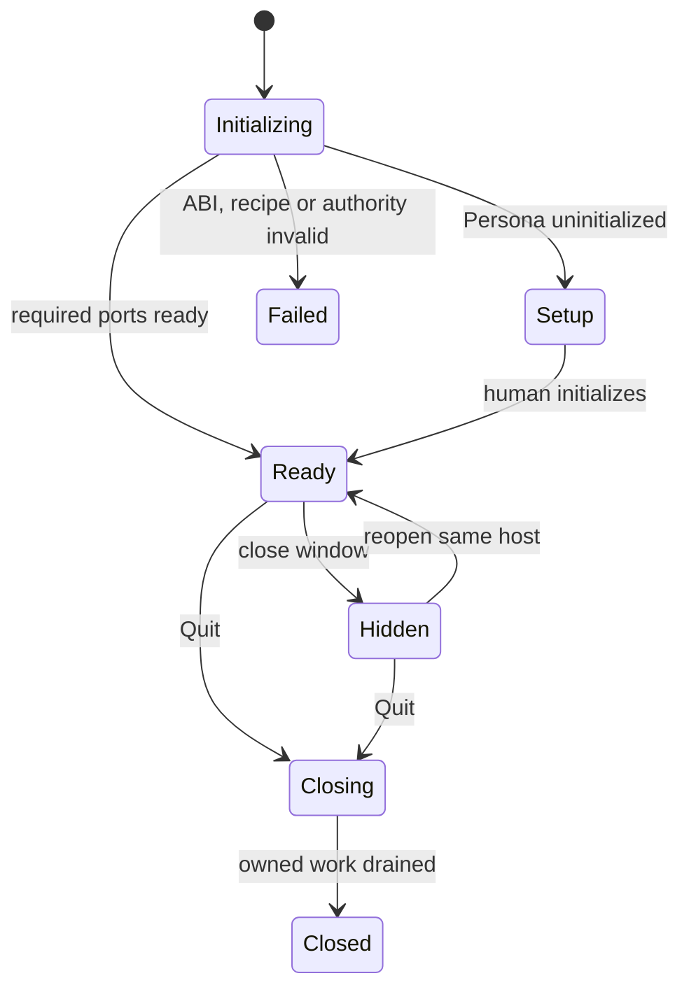

# DIVA Next closure — detailed architecture

## DN-W3: Go-owned desktop migration (2026-10-04)

**Current architectural amendment; planned, not implemented.**
The owner approved retiring the custom C ABI and Rust/Tauri desktop host.
This section supersedes every DN-C2 host/transport/build/lifecycle choice
below. DN-C2 domain behavior remains applicable where this section does not
replace it. The [index](index.md) alone schedules work; the
[W3 contract ledger](backend-separation-contracts.md#w3-go-host-contracts)
owns exact shared interfaces. Do not introduce a second migration spec.

### Goal and architecture classification

This is a cross-repository host and build-boundary migration, not an Agent
rewrite. The benefit is removing application-managed foreign memory,
numeric handles, C string ownership, dynamic-library lifetime, Rust polling,
and duplicated shutdown coordination. Go does not remove concurrency bugs,
OS/WebView constraints, CGO, or the JavaScript-to-native boundary. Wails
encapsulates native integration; our runtime lifecycle remains Go-owned.

A C ABI can be engineered reliably, but this product currently pays that
cost for one Go consumer reached through a Rust host. Maintaining five
exports, error/JSON marshalling, allocation/free rules, race-safe shutdown,
headers, native library packaging and two native test stacks provides
little durable benefit for the accepted single-host product. The migration
pays a one-time cost chiefly in sealed packaging, native speech and native
acceptance; deleting glue is a small final step.

### Ownership and forbidden shortcuts

| Component | Owns | Must not own |
| --- | --- | --- |
| Vue and VRM | Presentation, microphone capture, WAV encoding, playback, subtitles, lip sync, UI projection | Provider secrets, native file paths, Agent state authority |
| DIVA Go desktop | Windows/tray, lifecycle coordinator, Wails services, frontend assets, native speech | Run scheduler, second Journal, direct tool/policy bypass |
| VIVY public host | Opening a sealed runtime, trusted control peer, event queue, ordered close | Wails imports, desktop/window state, speech provider clients |
| VIVY runtime/Hosts | Runs, sessions, tools, permissions, approvals, diagnostics and cognitive scheduling | Browser/window lifetime |
| Laputa/Garden/INOFY | Existing bound cognitive domain/frozen context/capture/evolution | A new DIVA-owned parallel cognitive store |
| SDK pack/compiler | Recipe/source resolution, generated assembly, conformance, manifest/Inspect | Unverified dynamic plugins or hand-created runtime registry |

Keep the existing authenticated in-process control path through
`internal/app/facehost.go`. Go calls replace C ABI marshalling; they do not
grant blanket access to internal storage or skip ActionHost grants. The
public host is a trusted process embedder, not a new module capability.
One sealed RuntimeAssembly remains authoritative. Do not rename VIVY's
entire Go module or move its internal packages into DIVA.

### Repository layout

DIVA gains a root Go module and `cmd/diva/main.go`, plus
`internal/desktop/` and `internal/speech/`. The existing
`agent-diva-gui/` remains the frontend. The package name is
`github.com/ProjectViVy/agent-diva`; the consumer imports
`agent-vivy/sdk/host/v1`. These are proposed new paths, not existing code.

VIVY adds `sdk/host/v1/` over `internal/embedded/`. Its public API uses
standard-library types and its own exported DTOs, with no exposed app.Config,
RPC peer, storage handles or Eino types. The VIVY module remains `agent-vivy`.
Normal VIVY CLI/server and executable Generation builds remain supported.

Retain `desktop-host.ts` as the sole frontend native seam. Adapt
`src/api/vivy/transport.ts` behind the existing client interface. Components
must not start importing Wails directly. Keep current speech function names
and DTO meanings at this seam; regenerate Wails bindings deterministically.
Use ordinary Go services and focused constructors, not a new generic
service container or a second frontend RPC architecture.

### Lifetime and cancellation

The Go desktop coordinator is the sole lifetime owner, with states
`starting -> ready -> closing -> closed`; a startup failure unwinds to
closed without publishing readiness. Only short state transitions hold a
mutex. Calls execute outside it. Admission, request cancellation, event
delivery and shutdown must not wait behind a long model call.

Create exactly one VIVY host at startup. Constructor cancellation stops
partial startup; successful opening transfers ownership to explicit Close.
A WebView reload, route change or hidden main window does not close VIVY.
Frontend subscription close disposes listeners only. Single-instance behavior
prevents two desktop processes opening the same state root concurrently.

Hide invalidates speech context, stops recording/playback and hides the
window. Reopen obtains fresh authoritative projections and resumes event
delivery without replaying TTS. Explicit Quit stops admission, stops automatic
producers, invalidates/cancels speech, cancels active work according to VIVY
semantics, drains/joins bounded tasks and closes stores last.

Use one end-to-end shutdown budget, initially five seconds to match current
product policy. Context-aware close must cover actual resources; merely
waiting on a goroutine with a timer is not proof those resources closed.
Timeout reports an unclean shutdown and the still-open component, blocks
reinitialization, and allows the native process exit policy to act. Avoid
panics, duplicate closes and false success. W0 verifies how Wails app context
cancellation and service shutdown hooks interact; never inherit an already
cancelled UI context as the storage-flush context.

Distinguish hide/reopen, normal process quit/restart, and abnormal crash.
The current explicit quit cancels active/suspended runs; this migration does
not promise durable suspended approval continuation. Persisted session access
must be re-established via authenticated host admission, not silent durable
full grants. W5 tests fresh and reopened sessions separately.

### Generation-preserving build

Direct `go build ./cmd/diva` is insufficient as the release path. Current
SDK pack generates assembly and embeds a framed manifest. VIVY also has
`replace` entries for local modules and sibling Laputa packages, and Go
does not propagate a dependency's replace directives into its consumer.

Extend SDK pack with a **go-host** target. It snapshots pinned VIVY and DIVA
source plus required sibling sources, resolves replacements into a temporary
consumer modfile, generates the selected VIVY assembly and manifest overlay,
then compiles the DIVA host. Keep overlays/build temporaries private; never
commit developer absolute replace paths or use floating main branches.
Generated paths within the dependency snapshot must be the ones the Go
compiler actually resolves. W2 verifies that property from an external
consumer module, not just from VIVY's repository.

The final manifest/Inspect evidence covers recipe, selected modules,
dependency locks, DIVA host source identity and final frontend bytes. Use
`vivy_headless` for VIVY's web face exclusion while embedding DIVA frontend
assets separately. No unused VIVY web UI build dependency should be
accidentally introduced by treating go-host as ordinary executable packing.
Record unsigned binary, signed binary and installer hashes separately; code
signing changes file bytes. An embedded Generation ID is not a substitute
for a final executable checksum.

Proposed commands and pack outputs are frozen in W3-4. They are not claimed
to exist yet. W2 adds parser, implementation, negative tests and Inspect
support before DIVA depends on them. The current VIVY executable target
must continue passing its conformance tests.

### Native speech migration

Port the implemented DIVA Rust speech behavior to DIVA Go. Preserve
SiliconFlow STT and SiliconFlow/MiniMax TTS, revisioned preferences, OS secret
storage, bounded reference assets, cancellation, stale-result rejection and
diagnostic redaction. Keep provider model/base URL configuration explicit.
Do not make browser requests to providers or move credentials into Vue,
environment-dumped logs or plaintext preference files.

Raw audio moves through a bounded Wails same-origin media handler. It must
not create a separately listening daemon or expose filesystem paths.
W0 must prove native caller identity and the route capability mechanism on
the pinned release before W3/W4 can consume it. If this cannot be enforced,
stop adoption and revise the contract explicitly; do not weaken the sender
check to a client-supplied window ID.

Go's OS keyring implementation is selected and pinned by W0 after testing
Windows Credential Manager, supported macOS Keychain and Linux Secret
Service behavior. Missing/unavailable keyring fails closed. This is a
native implementation choice, not permission to add an unreviewed fallback
credential format. Browser capture/playback/VRM stays in the frontend.

### Framework and platform gate

Candidate baseline: **Wails v3.0.0-beta.27** with an exact module/CLI/runtime
pin. v3 is a beta; this plan does not equate Go ownership with a more mature
desktop framework. W0 compares its required Windows behavior against the
acceptance matrix before adoption. A switch to stable v2, a later v3, or a
different transport is a recorded design revision, not a hidden fallback.

W0 must prove service startup/shutdown order, cancellation, caller identity,
event subscription cleanup, hide/tray/reopen/quit, raw WAV transport,
WebView2/microphone permission and clean package startup. Windows x64 is the
release gate; Linux developer tests do not stand in for it. macOS/Linux
native smoke is required for any platform actually advertised in the
release, otherwise support is marked unverified.

Primary references checked 2026-10-04:
[releases](https://github.com/wailsapp/wails/releases),
[lifecycle](https://v3.wails.io/concepts/lifecycle/),
[services](https://v3.wails.io/features/bindings/services/),
[Wails v3 reference](https://v3.wails.io/reference/application/).
Live docs may differ from beta.27; pinned source and a compiling probe are
the W0 authority.

### Existing findings carried into acceptance

The latest merged source already starts the cognitive loop from
StartEmbeddedServices; do not plan that as a missing feature. The current
diva-cognitive Prepare path calls ReadFrozen; fresh-session bootstrap still
needs explicit verification. The recorded package matrix also identifies
missing embedded runtime logging setup, process-local session grants,
quit cancellation semantics, and misleading pause text on denied sandbox
tools. W1/W5 own reproduction and targeted correction, preserving the
underlying authorization rules. General ACTMEM rendering/provider asset
issues remain in the existing backlog unless they block required scenarios.

Changing the desktop language will not itself fix these domain behaviors.
Use fixtures as historical evidence with their source/artifact pins, then
capture new results. No old evidence is silently relabelled as Wails proof.

### Scope and release gates

No historical data migration, old home reads or cleanup; use fresh Next
state. No new pet windows, local voice engines, broad resources/reports,
plugin loading system or Agent algorithm changes. App data-path selection
must be explicit, absolute and independent of the working directory.

Before W6 deletes the old line, W5 must show working chat/cognition/console/
speech and failure recovery on the new host, while W2 proves sealed assembly.
After deletion, re-run replacement CI and the final package path. An owner
sign-off follows the engineering evidence. The archive is source recovery,
not automatic binary rollback; see the archive record.

---

## Historical DN-C2 domain specification and implementation evidence

The retained DN-C2 text below is historical for host choices and scheduling.
DN-W3 above and the current index override its C ABI, Tauri, Rust speech and
shared-library build requirements. Its business DTOs and explicit deferred
scope remain reference material.

Revision **DN-C2**, 2026-10-03. Status: **detailed design for review; not
implemented or product-accepted**. This replaces DN-C1 in the same authority
set. [The index](index.md) owns stage state and dependencies;
[the contract ledger](backend-separation-contracts.md) owns existing versus
proposed wire contracts; TODOLIST owns unfinished work. This is architecture,
not a second architecture authority. The 2026-10-03 executable Story package
now lives under this [same index](index.md#executable-story-package). It maps
section 12 probes and implementation to existing DN/OBS stages; planning does
not imply runtime proof, implementation or final owner acceptance.

## 1. Delivery goal and eight closure rules

The next installed DIVA should support a real primary conversation with
permissions, images, regeneration and goal entry; bound Persona/Mission,
ACTMEM and cognitive review; useful logs/trajectory/usage; and explicit online
voice input/output. Engineering prepares code, packages and reproducible
checks. The owner performs final installed-product acceptance.

1. **One Agent runtime.** VIVY owns runs, Journal, policy, tools, approvals,
   sessions and Agent settings. Reuse the sealed library and `vivy_call` /
   `vivy:event`. Never restore the Rust Manager or another Agent executor.
2. **One cognitive authority per domain.** Laputa owns Persona/Mission and
   versioned Markdown ACTMEM; Garden composes these and the selected memory
   backend; VIVY owns scheduling. No duplicate ACTMEM or implicit BML/Mentle
   replacement. Backend selection and degraded capabilities are visible.
3. **Close the selected scope.** Include cognition, console, chat wiring,
   online STT/TTS and native package preparation. Local voice ONNX/OLVRS,
   general report/resource systems and pet-window expansion remain deferred.
4. **Online speech is DIVA-native.** Reuse SiliconFlow STT and SiliconFlow /
   MiniMax TTS. Vue captures/plays/subtitles/renders; Tauri owns speech HTTP,
   credentials and required voice references. Agent/model credentials and
   business storage remain in VIVY. No VIVY speech plugin in this delivery.
5. **No historical import.** DN-7 is cancelled. Use fresh Next state without
   old-home discovery, import, live reads, dual writes or deletion. Importing
   a new voice sample is a device action, not database migration.
6. **Truthful failures and cancellation.** Unsupported capabilities/files are
   explicit. Ambiguous writes reconcile by authoritative reads. Cancellation
   invalidates queued/late audio; replay never speaks automatically.
7. **One plan authority.** Amend this design/index/ledger/TODOLIST. DIVA #15
   is the execution entry; #13 is superseded; VIVY #18 tracks backend
   obligations. Historical plans retain evidence without competing premises.
8. **Prepare first, owner accepts last.** Build/test/PR status is engineering
   evidence, not final acceptance. Missing native access is recorded pending;
   independent work continues. No automatic merge, release or branch push.

Repository commit, lock, documentation and secret rules still apply. Old
instructions naming retired Rust crates do not override the owner's Next
scope. Their reconciliation is a documentation follow-up, not a fabricated
permission gate for already authorized work.

## 2. Verified source baseline and remaining gaps

| Repository/artifact | Inspected pin | What exists | What remains |
| --- | --- | --- | --- |
| DIVA main | `f5866a0561e2676a9b8afc2405395dc72d087dfb` | PR #16: thin host, FFI, typed client, chat/settings/masks, boundary gates | Cognition, console consumers, chat controls and native voice |
| VIVY main | `1db8b55ce905ee4a212326e7801e0958e7f4376a` | #26 cognitive runtime; #27 OBS; #28 shared embedding | Bound domain, Persona projection, embedded cognition and human controls |
| Laputa main | `dc6066e2bb983ebd6b31e53dec908a9a23366956` | #2: public Agent API, Mission/ACTMEM, evolution and scoped backends | Public extension exposing the same domain, writes/reviews and selected backend |
| DIVA bundled Generation | `1fd14fb27032931339bcb26d772123c2d4f3c7b4a9bfd0e18e9d71e6e9adfc5b` | Twenty modules; initial Linux evidence | No selected companion cognition; new source is not binary evidence |

Corrections to DN-C1:

- `garden/agentapi.Open(Config)` already opens an in-process runtime without
  a listener; `BindSession`, bootstrap/recall/capture and scoped reads exist.
  Extend this entry point. `NewService` takes an internal runtime type;
  VIVY must not import `garden/internal/` or construct another domain copy.
- Public Garden Config does not expose the internal injected-backend map;
  recall still uses Mentle-specific seams. Selection must consistently govern
  recall, capture and effects. Exporting a constructor alone is insufficient.
- VIVY observer inventory must exactly match the sealed manifest. ObserverHost
  is constructed before Service. A naked late subscription append bypasses
  that contract.
- Current cognitive binding pins Mission at service construction; failed runs
  can retry with a new attempt automatically. Capture checks primary kind,
  but the cognitive supervisor is also primary. Integration needs per-run
  pins, explicit recovery stops and supervisor exclusion.
- `StartEmbeddedServices()` starts sweeper/cron, not cognition. DIVA does not
  call `App.Run()`, which owns the listener and cognitive loop.
- Image/permission/rewind, trajectory v2 and diagnostics producers exist.
  They need consumers and proof on the selected artifact.
- Existing voice wrappers invoke removed `pet_*` commands; STT makes browser
  cloud fetch and turns HTTP errors into empty text. Reuse recorder/player
  and protocol mapping, not the old boundary.

Proposed names below are **new design**, unless marked existing in the ledger.
Source inspection is not presented as a runtime probe.

## 3. Architecture and ownership

| Layer | Owns | Must not own |
| --- | --- | --- |
| Vue | Views, draft, recording/playback/subtitles, existing VRM rendering | Agent execution, domain authority, persistent cloud keys |
| Tauri | Process/windows, FFI buffers, speech HTTP/config/keys/reference files | Agent database, cognitive scheduler, arbitrary business translation |
| VIVY | Admission/policy/tools/approvals/runs/replay/model context/cognitive scheduling | Another Persona/ACTMEM store, cloud speech audio |
| DIVA cognitive module | Adapter between selected composition and public domain ports | Generic plugin framework, duplicate domain authority |
| Garden | One in-process composition, bindings, recall/capture/domain facade | Another Agent or HTTP daemon |
| Laputa / selected backend | Markdown authority, CAS/review, scoped canonical memory/receipts | UI state, scheduler or transport authentication |

In-process cognition reuses existing libraries and governance. Native speech
keeps media/keys beside the device. A shared VIVY speech module has no second
confirmed consumer; browser-direct HTTP expands frontend secret handling.
Whole-utterance voice adds less state than realtime duplex, VAD, sentence
streaming or failover. Those are later proposals, not first-delivery blockers.

## 4. Cognitive composition

### 4.1 Public facade and compiled selection

Reuse `garden/agentapi.Client` as lifetime owner. Proposed extensions live in
`garden/agentapi/embedded_domain.go` and existing config/bound-operation files.
Return public Laputa/Garden DTOs or narrow capabilities, never internal
service pointers or raw database handles.

| Port | Reuse / proposed extension | Ownership condition |
| --- | --- | --- |
| Open/Close and reads | Existing Open/BindSession/Bootstrap/FastRecall/ReadPersona/ReadActivity/SearchCards/ReadEvidence | One runtime per profile |
| Backend selection | Extend Config with explicit selected backend/factory and destination; route recall/capture/effects through it | No fallback to another writer |
| Strategy domain | Proposed bound EvolutionDomain implementing existing Domain, Mission revision and scoped high watermark | Reuse already-open Persona/ACTMEM/ingest/backend |
| Human controls | Proposed Persona initialize/save/review, validated ACTMEM save, memory mutation | Principal outside payload; domain CAS/restrictions apply |
| Agent tools | Scoped reads/Work edits; narrow proposal/P16/memory methods where required | No human-save or Mission capability |
| Result projections | Proposed bounded receipt/reflection/status views | Existing ledgers, no second report store |

Do not open separate Clients with different principals against the same files.
Extend the owner with internally issued principal-specific capabilities sharing
its runtime. Only trusted composition obtains human control. Model arguments
cannot obtain that capability.

The first supported Garden-backed memory adapter is the existing Mentle adapter,
selected explicitly as `backend_id: mentle` during fresh setup. No BML adapter
is added speculatively. Full memory acceptance requires its canonical writer /
receipt and required resources to be available; frozen-only/spooled/index-
degraded behavior remains visible and is not called full memory delivery.
This is a design choice for the new composition, not an automatic backend
switch in an existing home. Backend changes are stopped-host reconfiguration.

Proposed selected module: `vivy/diva-cognitive`, under VIVY
`internal/modules/diva-cognitive/`. Add a typed factory through the existing
Source Catalog/generated Assembly, following the mask factory pattern.
A generated optional `CognitiveFactoryValue() any` is strictly converted to
its typed factory; missing/mismatched selected binding fails initialization.
Unselected compositions remain unavailable/no-op. No package-global active
profile registry or dynamic module loader.

The generated factory and inventory share the same selected adapter instances;
factory wiring arms their single-use binding cells, never registers another
set of action/observer objects. Factory output is one owned bundle: primary-context preparation, human/agent
facades, bound domain/source/sink, generated action/observer adapters and Close.
It receives trusted config, Generation and owned VIVY stores. The existing
`ServiceDeps.Cognitive` binding is extended minimally, not replaced by another
runtime. Construction order:

1. Validate recipe/Generation/fresh paths/profile/scope/destination/backend.
   Open VIVY stores and one selected Garden client.
2. Create the bundle and arm compiled observer/action adapters with domain
   ports; IDs/event policies/grants must match manifest. Unarmed selected
   adapters are initialization failures.
3. Build ObserverHost from generated inventory. Recovery can capture before
   Service exists: durable receipt/high watermark suffices; defer its wake
   notification until Service attaches, without an unbounded queue.
4. Construct one Service with cognitive/context ports; attach its
   status/policy/trigger/cancel callbacks to generated adapters.
5. Publish ready only after all required ports are armed; start embedded
   services once. Partial construction closes in reverse.

No arbitrary registration bypasses exact generated inventory. Core app imports
only a narrow contract; optional library/module imports remain behind the
selected factory, like masks.

### 4.2 Identity, scope and first-delivery domain

Use one fresh profile and one configured evolution binding per VIVY Service,
matching its existing single-binding model. Default is personal; explicitly
configured workspace scope is supported. No multi-workspace background
scheduler is added. A Code session can use trusted workspace scoped reads;
evolution for a different unconfigured workspace is unavailable, never
silently redirected to personal scope.

| Identity | Issuer / validation |
| --- | --- |
| Profile/subject | Fresh setup; stable nonempty ID, not caller-selected path |
| Workspace | VIVY admitted session/workspace registry; exact subject/kind/workspace tuple |
| Destination | Selected scope-bound backend config and receipt namespace |
| Session/run | VIVY stores/admission; verify profile/workspace ownership |
| Human/agent principal | Authenticated transport or governed tool execution; no JSON authority claims |
| Mission/policy/strategy | Authority and selected recipe at run admission; persist and recheck before effects/recovery |

Human control uses the authenticated embedded DIVA peer. Add a server-owned
invocation-origin marker at `DialControl`; absent origin is denied for
human-only cognition writes. ActionHost authorization checks origin, action
ID and bound session, then supplies an internal capability resolver to the
generated providers. Do not add an RPC origin field or replace opaque caller
authentication. Face text alone is insufficient. Model tools use separate
agent capabilities and cannot dispatch the human control action inventory.

Human saves are deliberate UI operations using domain CAS/audit, not Agent
tool approval continuations. Add authorization for exact selected human action
IDs only. Keep normal governance/grants elsewhere. Current ActionHost has no
action-specific approval continuation: do not set RequiresApproval then bypass
its refusal, or mark every action full-auto. Persona domain review and Agent
execution approval are separate; one never accepts the other.

### 4.3 Frozen Core in actual model input

Add a narrow optional primary-context preparation port to Service, supplied
by the selected factory. Prepare durable session FrozenCore v2 before primary
inference; reopened sessions read the same snapshot. Core run records reference
the envelope digest/revisions; Garden remains snapshot authority. Preparation
is idempotent, not a distributed transaction: an orphan prepared snapshot
following failed admission has no active run.

Use existing VIVY static-instruction/mask ordering; add validated FrozenCore
as required authority context in the per-run preparation path, before optional
recall/history consumes its budget. Tests establish that mask guidance/evidence
cannot replace or claim Persona authority. Seven ordered slots: Mission,
Identity, Relationship, Redline, User, Dream, Dark. WORLD/ACTMEM are tool-only.
No full ACTMEM automatic injection or changing profile in global static prompt.

Ordinary ContextSource candidates are currently appended as user evidence;
that is not an authority slot. Use that existing path for optional bounded
recall cards/evidence, with exact scope/revision expansion. Reuse existing
character caps and final byte budget; reserve authority bytes before optional
sources. If required validated projection cannot fit, reject preparation
rather than silently omit a required section.

Fresh-home Persona initialization is a human setup gate. App remains navigable
for settings/setup while primary admission is gated. Mission may be explicitly
unassigned; no generated Mission. Memory/index failure may degrade recall
while preserving FrozenCore. Required Persona/snapshot corruption or absence
fails primary admission visibly. A v1 envelope requires a new session, not
conversion of old data.

Human edits affect **new session snapshots**. UI shows current versus frozen
revision and “start new conversation to apply.” Rewind keeps the snapshot;
fork prepares a new snapshot and records parent reference. Cognitive workflows
pin **current authority Mission** on their own admission, independently of a
primary session's immutable Mission slot.

### 4.4 Capture, scheduling and recovery

Capture committed Journal terminal events, not Vue messages. Reuse durable
observer cursors and CognitiveCaptureProvider. Exclude internal cognitive
supervisor session/run as well as workflow/child kinds. Classify stored run /
session provenance; payload text never grants subject/scope. Reject conflicts
and preserve original event identity.

Sink reads bounded committed user input and authoritative final assistant
output for that run; failed/cancelled capture includes only known committed
content/outcome. A short terminal summary is not the complete conversation.
Attachments contribute metadata, not raw images/audio or inferred observation.
Normalize/hash capture; submit stable `run_id:journal_seq`; advance observer
cursor only after durable acceptance. Dedup returns original receipt/sequence.
Capture acceptance, ingestion completion, canonical commit and index readiness
are separate. Unavailable writer can leave durable activity/spool pending.

Source IDs and persisted trigger keys include profile/scope/destination;
never reuse generic `cognitive/state` across a changed binding. Default automatic
policy is disabled until enabled by the human; manual trigger while disabled
returns disabled and the UI offers the explicit enable setting. Manual/timer
entry share eligibility; keep existing five-second host wake and configured
minimum interval. No UI/domain scheduler.

Extend CognitiveBinding with a per-admission binding resolver. It refreshes
Mission/policy pins while keeping subject/scope/destination fixed. Persist the
validated binding in workflow input; recovery uses the original. workflowNodes
constructs a run-bound guard from that input, not current mutable service pins.
Before effects, verify scope/destination, Mission and revoked capabilities.
A host authority gate serializes UI Mission edits against effect checks/writes;
an in-flight strategy cannot silently target a new Mission. Concurrent direct
file edits are unsupported; changed/corrupt files fail the next verified read.

This is required integrated behavior, not a claim of current implementation.
Serialize manual/timer admissions. If state persistence fails after workflow
creation, reconcile its persisted operation key before another attempt.
Only completed proven-safe windows advance watermark. Proven transient
failures retry at most three attempts for that window under existing runtime
budgets and interval gates; exhaustion pauses for explicit human inspection.
Admission cancellation is not classified as a transient failure. Unknown effect outcome,
missing binding or authority change sets durable block reason and stops
automatic retries. Cancellation pauses admission for that window; toggling
enabled does not clear an unknown-outcome block. Status/trigger reconciliation
may settle a block only when scoped receipts and stored run facts prove the
outcome; a receipt missing or still unknown leaves it blocked. Human inspection
of a document is not an automatic receipt repair. No generic force-clear
control is shipped; unresolved authority repair remains visibly required.

Reuse closed effect union/receipts: Work/memory obey scope and CAS; Persona /
capability proposals return submitted, not applied. Mission/Dream are excluded
from evolution effects. Known canonical receipts can replay idempotently;
ACTMEM/Persona writes without atomic receipt proof remain recovery-required.
A failed graph does not prove earlier target writes absent. Never mint a new
attempt key to bypass ambiguity. Capability intake uses existing selected
EvoMap; when absent, reject only that effect as unavailable. Reflection notes
remain real notes, not fabricated scheduled reports.

### 4.5 Cognitive UI

Reuse the existing PersonaMarkdownEditor and current client/controller;
DN-4D creates the absent scoped PersonaMemoryView/PersonaSetupGate, MemoryView
and EvolutionView with policy controls. Proposed `src/api/cognitive.ts` consumes ledger actions
through the existing client. Views own draft/selection/fetch state, not a
business database.

- Persona: readiness, current/frozen revisions, human CAS edit, review diff;
  stale review refreshes/re-proposes, never forces acceptance.
- ACTMEM: scoped Pulse/Recap/Work with existing caps; agent Work patch and
  validated human whole-save are separate capabilities.
- Memory: explicit backend/destination/scope, canonical/index state, card
  search before exact evidence expansion; no BML DTO relabelling.
- Evolution: policy, eligibility, watermark/window, active run, workflow
  progress, receipts/reflection notes, pause/recovery reason.
- Ambiguous write: retain draft; read authority/receipt. No success toast or
  automatic resubmission after timeout.

## 5. Chat wiring

Reuse typed client, chat/session state and controller as single execution /
subscription owner. App.vue composes features, not native invokes or a second
stream merger.

| Interaction | Required behavior |
| --- | --- |
| Send/image | Accept text or supported image; real name/MIME/base64 bytes; check model support and total serialized 4 MiB call frame |
| Unsupported file | Preserve draft and show supported types/limits; never silently drop |
| Permissions | Explicit UI mapping to cautious/smart/trusted; session/set_permission, confirm/read back ambiguity, then send; abort unconfirmed choice |
| Regenerate | Resolve selected assistant to original user/input/images; atomic session/edit for text; inclusive rewind plus original-image turn/start for image turns |
| Goal | Expose existing start_goal through work controller, no parallel planner |
| Restart cancel | Rehydrate run/approval state; cancel actual run; read back not-found before claiming settled |
| Session/rewind/fork | Invalidate voice first, update authoritative projection/frozen reference, then allow send |

VIVY rewind removes chosen message **inclusively** from visible history;
Journal stays append-only. Regenerate must target the original user boundary,
not retain that user then append it twice. The inspected `session/edit` has no attachment field. Use it for text turns;
image regeneration validates original bytes first, then uses inclusive rewind
followed by `turn/start` with those images. Fixture that selected-artifact
sequence; never silently regenerate an image turn as text.
Fallback rewind success/send failure leaves a retryable draft. Ambiguous new
run creation reconciles before resubmission.

Serialize user mutations per session. Permission set and turn are two RPCs,
not a transaction; admitted run policy snapshot is authoritative/visible.
Check base64 expansion, text and JSON overhead together in bytes. A producer
present only in newer source is unavailable on an older selected artifact.

## 6. Console and diagnostics

Extend ConsoleView/TokenStatsPanel with logs/trajectory via existing OBS-06..09.

1. One projection owns run subscriptions, sequence/replay/readback. Console
   consumes it, never independently double-appends.
2. Fetch `trajectory/session` v2 and reconcile through that owner; honor
   watermarks and older-run window. Gap means incomplete and refetch.
3. Distinguish queued/active/waiting/terminal runs from model-call state;
   wait reasons appear only when durable events identify them.
4. Read logs with `diagnostics/logs` source/date/cursor/filter/limit. Preserve
   gap/has_more/truncated; no browser paths or second log database.
5. Usage preserves missing/partial/active/legacy versus reported buckets;
   unknown cost is unknown, measured zero is zero. Approval wait is not an
   active model-call spinner.

GUI errors use bounded sanitized `diagnostics/gui/append` batches. Exclude its
own errors from recursive capture. Partial/ambiguous append is not blindly
retried: current wire error lacks machine-readable dedupe receipt. Report
unconfirmed/dropped records without another durable log store.

Native speech emits one allowlisted `speech:diagnostic` event to main window:
identity/phase/provider/safe code/HTTP status/elapsed/byte counts. A bounded
console queue forwards it into GUI log family as `component: diva.speech`.
It is not a model trajectory step. Redact before emitting and at VIVY boundary;
omit keys, transcript/synthesis/reference text, audio, full URL and provider
body. Lost batches remain visible diagnostic loss; no per-chunk log stream.

## 7. Online voice

### 7.1 Flow and media representation

First flow: explicit capture/Stop -> STT -> editable draft -> normal Send ->
VIVY final assistant text -> TTS -> playback. STT is recognition, not language
translation. No automatic transcript submission. Auto-read replies is an
opt-in setting; only fresh completed primary user turns in current session
qualify. Failed/cancelled/cognitive/child runs, reopened history, replay,
console reads and recovery never auto-speak. Explicit message replay creates
a new utterance under the same cancellation contract.

Reuse MediaRecorder/player/preprocessing. Freeze cloud input as mono 16 kHz
PCM16 WAV: after Stop, decode bounded local recording in WebView and resample /
encode with Web Audio. This avoids unspecified recorder MIME at provider
boundary and needs no FFmpeg/local voice model. Record/decode/resample failure
is visible device capability failure; native validates header/duration/size.
Windows WebView2/Linux decoding is a required probe, not assumed success.

Return bounded MP3 bytes via `tauri::ipc::Response`; Vue owns Blob/object URL,
audio node and optional analyser for existing VRM lip motion. Upload STT
ArrayBuffer via `tauri::ipc::Request` Raw body. Audio never enters Go JSON ABI.
This supersedes DN-C1's provisional native audio handle/custom resource:
no TTS temp files, custom protocol or `speech_release_audio` command. Revoke
object URLs/stop tracks on completion/cancel/unmount/hide/Quit; no durable
playback queue.

STT failure preserves ordinary editing; TTS failure leaves answer visible and
offers explicit retry. Never convert failure to empty-success. Empty recognized
text is distinct `no_speech`.

### 7.2 Native service, identity and cancellation

Proposed `src-tauri/src/speech/`: service, closed provider adapters, credential
adapter, bounded reference store and command DTOs. Reuse Tauri async runtime;
no daemon. Proposed `src/api/speech.ts` calls only desktop-host.ts, which owns
literal invokes including Raw headers/body. Ledger specifies commands.

Identity: `{request_id,session_id,run_id?,utterance_id,generation}`. Caller
window comes from Tauri, not payload. `speech_context_set` advances that
window's context monotonically, cancels prior operations and acknowledges
before new speech starts. Admission atomically checks session/generation and
reserves request ID. Duplicate live ID rejects. Max one STT and one TTS per
window; no native queue. Vue keeps one current playback.

Cancel/session replacement/regenerate/new capture/interrupt/hide/dispose
increment generation and clear queued auto-read. Stop local audio/tracks
immediately, then advance native context. Reply is usable only if captured
identity matches active controller. TTS binary identity follows the specific
invoke Promise, not an invented response header. JSON responses/errors carry
identity. Drop late results even if abort races completion.

`speech_cancel` aborts admitted request and is idempotent after settlement;
context invalidation handles cancel-before-admission races. Cancellation
covers connect/upload/bounded read/decode; register before HTTP and remove
on every terminal path. Never hold mutex during HTTP/keyring calls. Quit
rejects admission, aborts requests and joins under host deadline. Local abort
cannot guarantee reversal of remote billing/acceptance.

### 7.3 Settings, secrets and provider compatibility

Preferences use a versioned atomic native JSON file under fresh app data.
Keys use OS credential storage via minimal `keyring` v1 facade (inspected
4.2.0): Windows Credential Manager/macOS Keychain/Unix Secret Service. Only
Windows/Linux are closure acceptance obligations. Pin crate/features/lock
following native build probes; installed mock/sample/plaintext stores are
forbidden. Locked/unavailable Secret Service returns credential_unavailable;
no plaintext fallback.

Set/delete one provider credential through separate commands. Config reads
return presence/store availability only. Clear key form after operation/close;
do not promise elimination of all transient JS/IPC copies. Derive slots from
fixed app ID/profile/closed provider enum, not arbitrary service/user names.
Agent keys keep VIVY ownership. Speech credential namespace is fixed at native
startup from the fresh app-home identifier; request/config payloads cannot
select another profile or keyring slot.

Preference CAS and keychain operations are separate. Save preferences after
credential success; report partial failure, not cross-store atomicity. Requests
freeze config revision/provider/model/voice at admission. Settings changes
invalidate voice generation before later requests use new config. Key deletion
makes later requests not-configured without editing Agent settings.

Use bounded reqwest JSON/multipart/stream support with one selected TLS backend,
prefer platform TLS subject to build/probe. No frontend HTTP plugin. Pin/audit
the actual dependency closure. Validate TLS; disable cross-host redirects and
automatic retry/failover; provider origin comes from configured HTTPS settings,
not request arguments. Preserve region/model IDs; no silent model repair or
endpoint rewriting.

| Provider | Mapping | Validation |
| --- | --- | --- |
| SiliconFlow STT | POST /audio/transcriptions; multipart file + configured model | JSON text; checked reference has no language parameter, so remove speculative forwarding |
| SiliconFlow TTS | POST /audio/speech; existing model/input/voice/speed/reference mapping; request MP3 | Bounded binary MP3; validate configured model's fields |
| MiniMax TTS | Existing t2a_v2 adapter; configured model/voice/speed/volume; nonstreaming MP3 | HTTP success plus base_resp.status_code=0; validate/decode data.audio hex |

MiniMax documentation fetch timed out in DN-C2. Preserve DN-C1's checked record
and existing wrapper, then refresh region/model fixtures before readiness.
Do not silently replace a configured minimaxi host with another endpoint family.

### 7.4 References, avatar and bounds

Support system voices, configured reusable SiliconFlow voice IDs, and existing
inline references only for fixture-proven provider/model pairs. Imported
reference files receive native-generated ID/MIME/size/digest/safe display name.
Import/list/read/delete is a closed voice-reference surface, not arbitrary
resource management. Copy explicitly selected bytes into owned storage;
reject unexpected MIME/size/path traversal/symlinks. Hold a read lease during
admitted synthesis; deletion becomes pending until released. Deleted reference
in config is an explicit error.

Keep existing VRM render/lip motion reusable without pet window. Built-in
avatar may accompany playback. General VRM management, pet/neuro-link and old
asset command restoration are deferred; voice works in main chat/settings.

| Proposed guard | Value | Purpose |
| --- | --- | --- |
| Recording | 120 s; mono 16 kHz PCM16 WAV; <=8 MiB | Validate again natively |
| STT reply | <=64 KiB JSON; text <=16 KiB UTF-8 | Reject malformed/oversize |
| TTS text | <=4,000 code points and <=16 KiB, then tighter provider bound | Longer answer offers selected-text playback, no silent truncation |
| TTS audio | <=16 MiB MP3; MiniMax hex JSON <=34 MiB | Stream caps before decode/allocation |
| References | <=10 MiB each; <=20 files; <=100 MiB total | Bounded owned assets |
| HTTP | 10 s connect; 120 s total | No automatic retries |
| Concurrency | 1 STT + 1 TTS per main window; one playback | New context cancels old work |

Guards are proposed resource limits, not measured latency/provider guarantees.
Record necessary tighter limits in ledger. Probe decoded local recording
memory as well as encoded-size guard.

## 8. Persistence/configuration

Use existing fresh Next home resolution. This table is a **logical layout**,
not a claim that all config keys currently exist.

| Owner | Data | Recovery/lifetime |
| --- | --- | --- |
| VIVY | Journal/sessions/messages/approvals/work/snapshots | Existing storage; no Rust/Vue mirror |
| VIVY | Namespaced cognitive policy/watermark/active/block state | Existing SnapshotStore; verify source identity at reopen |
| Garden/Laputa | Persona/one ACTMEM, frozen/activity/ingest/spool, effects/reflection | Explicit fresh absolute paths; one runtime owner |
| Selected memory | Canonical/receipts/index/outbox | Index never substitutes for canonical commit |
| Native speech | Preferences/reference manifest and files | Atomic revision-CAS config; bounded assets |
| OS store | Speech keys | Closed slots; no plaintext in files |
| Vue | Draft/recording/Blob/player/projections | Memory only; release on teardown |

Resolve paths before opening and show redacted setup summary. No cwd/environment
fallback to old DIVA/Garden homes. Existing file does not authorize historical
import. Libraries may create their own canonical data under fresh paths; no
compatibility database.

Recipe declares module, source policies, observer allowlist, action IDs/grants
and backend identity. UI settings cannot add modules, broaden destination/scope
or load a different binary. Profile/scope/destination changes require stopped
host/reopen, not mutation of an active binding. Unavailable selected backend
never opens ordinary BML as substitute.

## 9. ABI, lifecycle and package

Keep five exports: VivyInit/VivyCall/VivyPollEvents/VivyShutdown/VivyFree.
Init: abi_version/config_path/without_ears?; call: method/params/timeout_ms?;
poll: max-events. No request_id/data_dir/wait_ms replacement ABI. Numeric native
handle stays in Rust, never rounded through JavaScript. Copy/free allocated
strings exactly once; no Go pointers or dynamic Go library unload.

Current guards: 4 MiB input; 10,000-event queue with oldest-drop gap; <=500
polled events; 120 s default call timeout; five-second shutdown grace. Timeout
is not rollback. Frontend diagnostic batches must leave framing overhead
below 4 MiB, even though backend's theoretical payload ceiling is 4 MiB.

Hide retains host/approvals/scheduler, stops recording/playback and invalidates
voice. Reopen reads state without reinitialization/audio replay. Quit rejects
new host/speech work, stops cognitive admission, closes action admission,
cancels speech/runs, waits within deadline, closes observers before sinks,
Garden bundle before VIVY storage, then releases native handle. Durable pending
effects survive restart; deadline expiry is not successful drain. Run/embedded
paths share one idempotent service-start helper, never duplicate loops.

Build inputs currently depend on sibling replacements: VIVY -> ../laputa/laputa;
Garden -> Laputa/Mentle siblings; Laputa -> sibling INOFY. Pack stages exact pins
in bounded build directory with explicit generated go.work/replacements, never
assumes developer home layout or edits their checkout. Pin/hash Garden/Mentle /
INOFY transitively; exact closure is an engineering probe.

Use Recipe -> Assembly -> pack -> inspect. Manifest records source pins,
compiler/toolchain, recipe/Generation, library/header hashes, target ABI and
required native dependencies. Garden/Mentle may introduce CGO/tokenizer/ONNX
requirements even with local **voice** deferred. Inspect compiled/link/load
closure; missing-model degradation does not prove absent link-time dependency.
No implicit startup model download. Explicit backend/model setup and truthful
degradation are separate from online voice.

New module/action/context/dependency pins require new Generation and refreshed
installed evidence. Previous Linux results remain pin-scoped; check Windows
DLL/FFI/installer on new artifact. Speech needs no second Agent runtime.

## 10. Repository/file change map

Paths marked proposed are not existing APIs or implementation.

| Repository | Existing reuse | Proposed boundary |
| --- | --- | --- |
| Laputa | garden/agentapi, evolution/domain, laputa/persona/actmem/evolution, memory/backend | Same-owner public domain/control capabilities; consistent explicit backend selection; bounded receipt/reflection reads |
| VIVY | app/assembly observers/sources/masks, runtime cognitive/context/admission, ActionHost/compiler | internal/cognitivecontract/, modules/diva-cognitive/, app/assembly_cognitive.go; generated factory/adapters; primary context, per-run guards/recovery/lifecycle |
| DIVA state | api/vivy, chat/session/controller | Actual OBS/chat DTOs; api/cognitive.ts and api/speech.ts; one projection/voice controller |
| DIVA Vue | Existing PersonaMarkdownEditor/Console/chat/settings; former Persona/Memory/Evolution views are absent at this pin | Proposed scoped views and real wiring; truthful errors; voice reachable without pet |
| DIVA native | lib.rs/lifecycle.rs and vivy-bridge | src-tauri/src/speech/{mod,commands,config,credentials,assets,providers}.rs; narrow Cargo additions |
| DIVA gates | check_legacy_frontend_calls.mjs/check_vivy_backend_boundary.py/staging/justfile | Exact native allowlist/Raw fixtures, activated voice outside dormant exemption, dependency/artifact/native evidence |

Serialize shared edits to App.vue, desktop-host, contracts/client, shell
lifecycle, locks and VIVY recipe/assembly. Existing stages retain ownership;
this is not another parallel task track.

## 11. Verification and owner acceptance

| Requirement IDs from index | Scenario | Engineering evidence | Owner-visible result |
| --- | --- | --- | --- |
| R-4 | Setup -> primary turn | FrozenCore-to-actual-model-input, seven slots/budget/mask order | Persona affects chat; frozen/current distinction |
| R-2, R-4 | Mission human/model | Origin negatives, CAS and forbidden automatic effects | Human edits; model cannot gain human authority |
| R-4 | ACTMEM/memory | Exact scope/hidden-record/no-fallback/canonical-index checks | Correct scope and pending/degraded status |
| R-4 | Capture/reflection/restart | Dedupe/supervisor exclusion/watermark/unknown block/admission recovery | No duplicated ambiguous effects |
| R-9 | Console | Real v2/usage/gap/rotation/append loss/redaction fixtures | Actual work/wait state explained |
| R-3 | Image/permission/regenerate/goal | Selected artifact contract, total frame, inclusive cutoff/reconciliation | Controls affect actual admitted work |
| R-5 | Mic/STT | WebView WAV probe, multipart/error fixtures | Editable recognized text; visible failures |
| R-5 | Both TTS/interrupt | Binary/hex/oversize/abort/late/replay tests | Fresh answer speaks; interruption stays stopped |
| R-2, R-5 | Credentials/references | OS reopen/locked/unavailable/redaction/assets/delete lease | Safe settings and actionable missing inputs |
| R-6, R-8 | Hide/reopen/Quit/crash | One host/loop, approvals, teardown, new DLL/FFI/package | Same conversation, bounded shutdown |

R-1 is the evidence/disposition rule applied to every row; R-2 also governs
all dependency/command boundaries. R-7 is fulfilled by fresh-home/no-legacy-
read checks, not an importer. These IDs refer to the index, not new requirements.

Use focused owning-boundary tests plus real selected-artifact integration and
native probes, not mocks presented as installed acceptance. Existing GUI /
shell/bridge/build/staging/CI recipes remain required for affected code.
**This design iteration runs documentation checks only.**

Handoff includes source/artifact hashes, fresh install/start/key/model/region
steps, scenarios, engineering results and pending native limits. Owner final
Windows x64 acceptance covers model/approval/cancel/reopen, cognition/review /
restart, console and mic/STT/both TTS/interrupt/Quit. Evaluate recognition /
listening with owner sample phrases; no invented accuracy/latency percentage.
No importer or automatic release.

## 12. Engineering probes and delivery order

Design selects ownership/transport/contracts/failure rules. Remaining items
are verification inputs, not new product-scope questions or Ready assertions.

| Probe | Resolves | Blocks |
| --- | --- | --- |
| Same-owner Garden/backend conformance | One authority, consistent recall/capture/effects selection | DN-4 contract freeze |
| Generated assembly/origin/context fixture | Exact inventories, actual prompt/per-run pins | New DN-L capability/DN-4 |
| Clean pinned build/native inventory | Replacements, transitive SHAs, CGO/ONNX/tokenizer | Repack/DN-8 evidence |
| Actual chat/OBS fixtures | Selected dependencies/DTOs, image regeneration | DN-2/OBS acceptance |
| Raw/Response/audio decode | Bundled Tauri and Windows/Linux WAV/MP3/memory | DN-6 readiness |
| Keyring/provider fixtures | Lock/MSRV/secure persistence/region/model/reference; refresh MiniMax docs | DN-6 online evidence |
| Windows runner/install | DLL/FFI/media on actual target | DN-8 owner handoff |

Order: freeze same-owner facade/generated integration; capture contracts;
implement cognition/chat/console/bounded speech; repack/inspect/pin; reconcile
DN-M with evidence; prepare DN-8. Chat/console can proceed on real existing APIs
without unrelated speech/report backends. The execution-plan iteration now
maps each probe and implementation increment to a concrete Story in the
[authoritative index](index.md#executable-story-package). Contracts stay
proposed until producer evidence; only independent roots are plan-Ready.

## 13. Sources and dispositions

Source pins: section 2; DIVA #16, VIVY #26/#27/#28, Laputa #2 and
`docs/superpowers/plans/2026-10-02-diva-cognitive/{contracts,S08}.md`.
Inspection covered public Agent API/runtimecore/domain/Persona/ACTMEM,
VIVY assembly/action/context/cognition/lifecycle/control/trajectory/diagnostics,
DIVA wrappers and native gates.

Official references checked 2026-10-03:
[Tauri Raw body and binary Response](https://v2.tauri.app/develop/calling-rust/),
[keyring 4.2.0 v1](https://docs.rs/keyring/4.2.0/keyring/v1/index.html),
[reqwest client policy](https://docs.rs/reqwest/latest/reqwest/struct.ClientBuilder.html),
[SiliconFlow STT](https://docs.siliconflow.cn/docs/api/audio-transcriptions-post),
[SiliconFlow TTS](https://docs.siliconflow.cn/docs/api/audio-speech-post).
[MiniMax HTTP TTS](https://platform.minimax.cn/docs/api-reference/speech-t2a-http)
was checked in DN-C1; DN-C2 refetch timed out, so current details remain a named
readiness probe, not an unverified API update.

TODOLIST keeps deferred notebooks/report schedules/resource/pet expansion,
skill upload/delete/edit/request, command-rule/wipe and old search/MCP tuning.
These are scope dispositions, not migrated features. DN-7 is cancelled,
not deferred and not a release predecessor.
