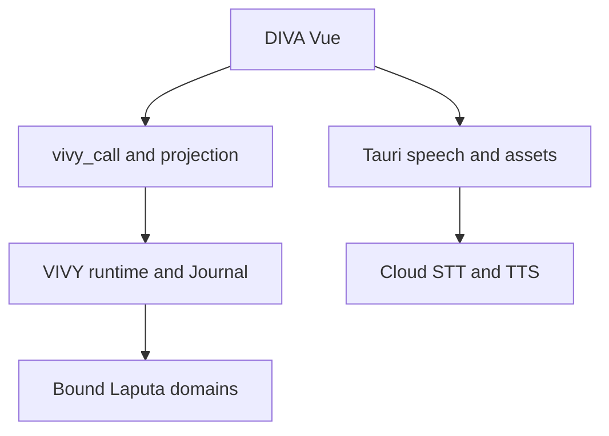

# DIVA Next closure — preliminary architecture

Revision: DN-C1, 2026-10-03. This revises the existing design rather than
starting another track. The owner approved the scope below; the technical
architecture is preliminary. This iteration changes documentation and issue
wording only, and does not claim product implementation or final acceptance.
[index.md](index.md) owns status/dependencies; the
[contract ledger](backend-separation-contracts.md) owns verified wire mappings.
Existing logs remain evidence for their recorded pins.

## 1. Owner decisions and eight closure rules

1. **One Agent runtime.** VIVY owns runs, Journal, policy, tools, approvals,
   sessions and Agent settings. Reuse the sealed library and `vivy_call` /
   `vivy:event`; never restore Rust Manager or a second Agent executor.
2. **One cognitive authority per domain.** Reuse merged Laputa/Garden services
   and VIVY cognitive runtime. Persona/Mission, scoped Markdown ACTMEM and
   selected memory backend remain distinct. No second ACTMEM store or silent
   BML/Mentle/backend switch.
3. **Close the selected scope.** Include cognition, console, chat wiring,
   online STT/TTS and native package preparation. Local ONNX and OLVRS remain
   separate. Broader report/resource-platform and desktop-pet expansion are
   deferred, not completed; unfinished dispositions remain visible.
4. **Online speech is DIVA-native.** Reuse SiliconFlow STT and SiliconFlow /
   MiniMax TTS. Vue owns capture/playback/subtitles/VRM; Tauri owns media HTTP,
   speech credentials and new voice assets. This narrow exception supersedes
   the earlier no-Rust-credentials premise for speech only. Agent/model
   credentials and business storage remain in VIVY.
5. **No historical import.** DN-7 is cancelled by the owner. Use fresh Next
   state; no old-home autodiscovery/import/live reads, dual writes or deletion.
   New voice/VRM asset import is a device feature, not database migration.
6. **Truthful failures and cancellation.** Show missing capabilities and
   unsupported attachments explicitly. Unknown writes reconcile by reads.
   Cancel invalidates queued/late audio; history replay never speaks itself.
7. **One plan authority.** Update the existing design/index/ledger/TODOLIST.
   Issue #15 is the execution entry; #13 and VIVY #18 link to it. Archive stale
   tasks rather than execute them. No duplicate epic or speech plugin system.
8. **Prepare first, owner accepts last.** Engineering delivers code, scoped
   checks, artifacts and reproducible native steps before the owner's final
   installed-product acceptance. Missing native access means pending, not
   passed, and does not stop independent work. No automatic release or merge.

These are closure-specific rules. AGENTS.md still owns repository governance;
its obsolete Rust-workspace instructions need an explicitly authorized
rewrite before being used for product implementation. This draft does not
rewrite repository instruction files.

## 2. Verified baseline

| Repository/artifact | Pin | Evidence |
| --- | --- | --- |
| DIVA main | `f5866a0561e2676a9b8afc2405395dc72d087dfb` | PR #16 merged; core/settings/masks and CI gates |
| VIVY main | `1db8b55ce905ee4a212326e7801e0958e7f4376a` | #28 embedding, #26 cognitive runtime, #27 observability |
| Laputa main | `dc6066e2bb983ebd6b31e53dec908a9a23366956` | #2 ACTMEM/Mission/strategy/bound domain |
| Bundled DIVA Generation | `1fd14fb27032931339bcb26d772123c2d4f3c7b4a9bfd0e18e9d71e6e9adfc5b` | Twenty modules, no companion memory selection; newer source is not shipped evidence |

DIVA frontend paths below are relative to `agent-diva-gui/`. Reuse
`src/api/vivy/`, `src/state/{vivy-chat,vivy-session}.ts`,
`src/platform/desktop-host.ts`, existing Persona/Memory/Evolution/Console
components, `src/features/diva-pet/voice/`, `avatar-runtime-vrm/` and the
`src-tauri` shell/bridge. Both TTS wrappers remain in
`voice/services/tts/providers/`, invoking removed `pet_minimax_synthesize` /
`pet_siliconflow_synthesize`. `voice-api.ts` makes frontend SiliconFlow STT
requests and returns empty text on HTTP failure. Reuse protocol/player logic;
replace dead commands/config and direct cloud fetch, without old business
crates. Activating speech also requires narrowing the AST gate's wholesale
`diva-pet/**` exemption.

VIVY `internal/rpc/control.go` already supports image `turn/start.attachments`,
`session/set_permission`, `session/rewind`, `skills/revisions/list`,
`trajectory/session`, `diagnostics/logs`, `diagnostics/gui/append` and
`stats/tokens`. Old producer-gap TODOs require correction. Each still needs
capability/dependency proof on the new sealed artifact; image support does
not imply arbitrary file support.

`internal/runtime/cognitive_{binding,service}.go` has binding, policy/status/
trigger and capture seams. The app has no real bound cognitive domain;
`StartEmbeddedServices()` starts sweeper/cron only, while `App.Run()` starts
the cognitive loop. No cognitive control case was found in `control.go`.
Garden contains real authority services but some Persona/projection code is
under `garden/internal/`; export a minimal owning-library facade rather than
copy internals or start a separate Garden HTTP service.

## 3. Chosen approach and alternatives

Keep the existing in-process VIVY path for Agent/cognition and add a small
DIVA-native media adapter beside it. Reuse the two existing cloud TTS
consumers and merged domain libraries. A shared VIVY speech module adds
assembly/contracts without another confirmed consumer; browser-direct cloud
HTTP retains secret/platform handling in the wrong boundary. Neither is
needed for this closure. Local sherpa/ONNX, full-duplex realtime and OLVRS
integration are separate future work, not dependencies of online voice.

### Cognitive boundary

- Proposed DIVA-selected module `vivy/diva-cognitive`, proposed VIVY path
  `internal/modules/diva-cognitive/`: open admitted Laputa/Garden services
  once; reuse stores, scope DTOs, CAS/review/effect receipts and FrozenCore v2.
  Export only the public facade missing from the owning library.
- Compose `runtime.CognitiveBinding` from trusted subject/workspace,
  destination, Mission/policy pins, capture source/sink and VIVY snapshot
  store. Caller actor/scope fields never grant authority. Register
  `CognitiveCaptureSubscription` on committed primary events; strategy/child
  outputs never become source evidence.
- Supply the binding before starting services. Start embedded cognition once;
  stop admission/drain before cancelling runs and closing storage. Unselected
  compositions retain unavailable/no-op behavior.
- Reuse `module.action.invoke` for authenticated domain controls and existing
  run/read/review contracts where they fit. Proposed action families cover
  persona/Mission read+human CAS edits, scoped ACTMEM read+Work edits, memory,
  cognitive status/policy/trigger/cancel and domain review. Exact IDs, wire
  fixtures, composition hooks and grants must be frozen before detailed
  implementation plans; these are not existing APIs or Ready tasks.
- Authenticate human edits separately from model actions. Bind actual
  Persona/Mission projection to subsequent primary model inputs and persist
  immutable session snapshots. Editing a page without affecting model input
  fails acceptance. WORLD/ACTMEM are not FrozenCore slots; proposals remain
  submitted until domain acceptance. Mission is human-only; automatic effects
  cannot write DREAM. No implicit default memory backend replacement.
- Reuse Persona/Memory/Evolution pages for Laputa S08: current/frozen revision,
  scope/backend, eligibility, active run, partial/unknown/recovery-required,
  receipts and domain review. VIVY owns scheduling. Broader report schedules
  are deferred; real reflection notes are not presented as completed reports.

### Console and chat boundary

- Extend the typed client with actual `trajectory/session` (not the PR
  shorthand `trajectory/get`), projection v2, token coverage and diagnostics.
  One subscription owner feeds timeline/trajectory; gaps refetch. Distinguish
  run waiting from model-call activity, and missing usage from measured zero.
- Add logs and trajectory to the existing token panel. Preserve cursor
  rotation/truncation gaps. GUI log append is bounded/redacted and must not
  recursively log itself. No browser filesystem reads or second log database.
  Freeze native speech diagnostic ingestion with the console contract.
- Replace old attachment IDs with accepted image bytes/MIME; unsupported
  formats show an explicit error. Base64 plus JSON must fit the actual ABI
  4 MiB input frame. No general file import inferred from image support.
- Wire permissions using `session/set_permission` before sending; abort on
  failure and read back ambiguous changes. Regenerate binds the selected
  message to actual rewind semantics, not last-user resubmission. Add the
  existing `start_goal` choice and reconcile restart cancel from run snapshots.

### Online speech and native assets

- Preliminary first flow: explicit capture/stop -> cloud transcript -> editable
  text -> existing VIVY turn -> finalized assistant text -> cloud TTS -> local
  audio/subtitles/VRM. Push-to-talk and whole-utterance synthesis are defaults;
  automatic failover and full-duplex realtime are outside this scope.
- Reuse SiliconFlow STT and SiliconFlow/MiniMax TTS, preserving configured
  provider model IDs, voices/speed and applicable reference-voice behavior.
  New sample import/read/delete belongs to bounded native asset storage;
  do not restore pet-window/neuro-link commands or a general resource platform.
  Unsupported references/models fail visibly; do not silently discard them.
- Proposed commands: `speech_config_get`, `speech_config_set`,
  `speech_transcribe`, `speech_synthesize`, `speech_cancel`,
  `speech_release_audio`; exact asset commands are allowlisted separately.
  Invokes stay in `platform/desktop-host.ts`. Agent traffic still uses only
  `vivy_call`; the native host does not translate arbitrary business methods.
- Speech config stores nonsensitive preferences in a DIVA-native file and
  secret references in platform credential storage. Keys enter native code
  once, are cleared from the form and never returned by config reads,
  persisted in localStorage/PetConfig or logged. Return masked presence only.
  Select/probe the smallest platform credential implementation before Ready;
  failure is visible, with no plaintext fallback. Agent secrets stay in VIVY.
- Identity: `{request_id,session_id,run_id?,utterance_id,generation}`. Native
  requests are cancellable and echo identity. Cancel/conversation replacement
  increments generation, stops playback and releases resources. Drop late
  invalid-generation responses even when abort races. HTTP cancellation cannot
  promise remote billing reversal.
- STT returns text or a typed error: `not_configured`, `device_unavailable`,
  `credential_unavailable`, `provider_error`, `invalid_audio`, `cancelled`,
  `timeout`. Actual no-speech is distinct from provider failure; never submit
  an empty failure as a successful turn.
- Native HTTP owns binary/hex decoding, bounded response reading and provider
  error mapping. Return an opaque temporary audio handle and app-scoped local
  playback resource; release on completion/cancel/quit. No audio over the Go
  JSON ABI, caller-chosen arbitrary filesystem paths, or persistent audio
  queue. Binary IPC/resource mechanics, recording MIME and size limits need
  Windows/Linux probes before detailed plan freeze.
- Only fresh output from the selected primary user turn speaks automatically.
  Cognitive/child runs and history/replay/reopen/logs
  never trigger TTS; explicit user replay is a new utterance. Voice failure
  leaves text mode usable. Speech UI is reachable from the main chat/settings,
  independently of the dormant desktop-pet window.

## 4. ABI, gates and unresolved engineering inputs

Reuse the five existing C exports and generated header. Actual init is
`{abi_version,config_path,without_ears?}`; call is
`{method,params,timeout_ms?}`; poll's second argument is max-events, not
wait-ms. No incompatible replacement ABI is proposed. Changes go through
Recipe/Assembly/pack/inspect and invalidate old binary acceptance. Native
speech requires scoped AST/native-command negative fixtures and dependency /
package checks, never a blanket exemption.

Before executable plans: freeze the public domain facade/actions and human
identity; compiled binding/context/capture/lifecycle; image/permission/rewind
fixtures on the selected artifact; secure credentials/audio transport probes;
Windows DLL toolchain/runner availability. These are engineering tasks, not
new product decisions. Downstream work stays contract-blocked until resolved.

Reuse client/projection/voice preprocessing/player and domain libraries. Add
only bounded native HTTP/media ownership; no speculative caches, model server
or plugin framework. Record costs only if measured. Cloud compatibility,
transcription quality and native media behavior remain unverified here.

## 5. Verification and final handoff

Engineering owns scoped tests for domain scope/CAS/human Mission refusal,
exact-once capture/effect recovery, actual persona-to-model projection,
embedded cognition lifecycle, truthful console gaps/usage, attachments /
permission/rewind, voice abort/late-results/replay exclusion, secret redaction,
and clean package/ABI/boundary checks. Run native checks where possible;
otherwise record them pending, without blocking independent work.

Prepare source/Generation/hash pins, install/start commands, fresh-home setup,
provider/key setup and observable scenarios. The owner performs final native
acceptance: chat -> approval -> cancel -> window reopen; Mission/ACTMEM /
reflection -> restart; console logs/trajectory; mic -> STT -> Agent text ->
both TTS providers -> interruption -> Quit; Windows DLL/FFI/install behavior.
Historical importer is excluded. No final acceptance has occurred here.

## 6. Sources and scope disposition

DIVA #16; VIVY #26/#27/#28; Laputa #2. Reuse Laputa
`docs/superpowers/plans/2026-10-02-diva-cognitive/{contracts,S08}.md`; bridge
arrival removes one historical prerequisite, not the domain binding gap.
Official provider APIs checked 2026-10-03:
[SiliconFlow STT](https://docs.siliconflow.cn/docs/api/audio-transcriptions-post),
[SiliconFlow TTS](https://docs.siliconflow.cn/docs/api/audio-speech-post),
[MiniMax HTTP TTS](https://platform.minimax.cn/docs/api-reference/speech-t2a-http).
The current MiniMax endpoint family differs from old examples; freeze region /
base URL and model without silently rewriting configured settings.

Deferred residuals remain in TODOLIST: broad notebook/report schedules,
general resource platform, pet windows, skill upload/delete/edit/request
workflows, command-rule UI, backend wipe and old search/MCP tuning knobs.
These are not claimed migrated; any expansion requires a scope decision.
