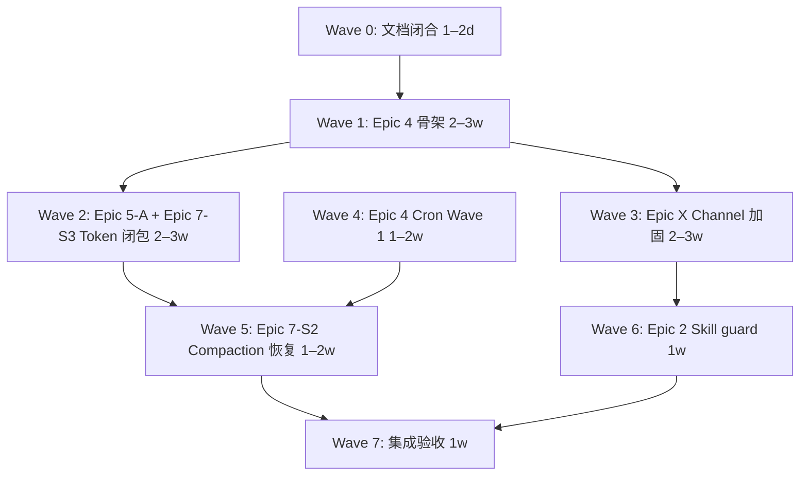

# Harness Engineering PRD v1.1

## 0. 范围与约束

### 0.1 总体目标
在 Agent Diva 已具备功能广度（13 channel adapter、47 provider registry（v1.1 将收敛为 Anthropic 原生 + OpenAI-compatible 两条链路）、渐进式 skill 加载、Module 化 cron、LoopGuard 熔断）的基础上，补齐 Harness v1.1 所需的 **可靠性闭环、安全边界、可审计性、配置演进** 四大支柱。本次 PRD 直接基于 P0-R1~P0-R6 四批审计结论与 Provider 架构简化决策编写。

### 0.2 关键约束

| 约束 | 说明 |
|------|------|
| **Channel / Manager：Harness 增强 only** | 不新增功能性内容，不做功能移植；仅做安全、审计、可靠性、可观测性加固 |
| **不移植参考代码** | zeroclaw / openfang / codex / nanobot 仅作设计参考，不作为移植目标 |
| **JSON-only config** | v1.1 坚持 JSON 配置格式；PRD/文档中的 `config.yaml` 字面量需同步修订为 `config.json` |
| **最小侵入** | 优先自研最小实现，不引入新运行时依赖 unless 必要 |
| **Provider 极简主义** | agent-diva 仅原生支持 Anthropic Messages API 与 OpenAI-compatible 两条链路；OAuth/网页登录/云平台 IAM 类 provider 明确不做；其他 provider 由用户通过自部署 OpenAI-compatible 转接层接入 |
| **不阻塞 PRD 编写** | 本 PRD 可与审计文档修订并行；终稿评审前需闭合 §0.3 前置条件 |

### 0.3 前置条件（终稿前必须闭合）

| ID | 条件 | 状态 |
|----|------|------|
| PC-1 | P0-R1/R2/R3/R6 Batch 2 REVISE 必改项闭合 | 已完成 |
| PC-2 | Channel / Manager Epic 标注「Harness 增强 only」约束 | 本 PRD 已注入 |
| PC-3 | AGENTS.md / CLAUDE.md reference path 统一为 `agent-diva\.workspace\` | 已完成 |
| PC-4 | Token usage Done Definition 跨 Epic 5 + 7 合并 | 本 PRD 已合并 |
| PC-5 | Config 格式决策记录：v1.1 JSON-only | 本 PRD 已记录 |
| PC-6 | Provider 架构简化决策拍板：仅 Anthropic 原生 + OpenAI-compatible | 本 PRD 已记录 |

---

## 1. Executive Summary

Agent Diva 当前处于「可运行的集成产品」阶段，但 Harness v1.1 要求的工程基线在六域均存在 P0 级缺口。本次 PRD 以 P0-R1~P0-R6 审计结论为输入，聚焦以下跨域主题：

1. **Token usage 全链路断裂**（Provider → Agent Loop → Session → Subagent）
2. **ContextCompactor 架构回归**（LLM 摘要模块被删除，仅删最旧消息）
3. **Channel 安全面分裂**（13 套 allowlist 策略、Neuro-link/WhatsApp 无认证、无 Channel 维度审计）
4. **Config 热重载名存实亡**（无 `config_version`、Watcher 未接入、Harness 域不在 Config）
5. **Cron 执行语义不完整**（fire-and-forget、无锁、API 无鉴权）
6. **Skill 上下文风险**（无 injection 扫描、无大小上限、无 provenance）

**PRD v1.1 输出：** 6 个 Epic + Global Done Definition + Wave 实施计划。

---

## 2. Product Vision

### 2.1 核心隐喻
> Model = CPU, Context Window = RAM, Harness = OS, Agent = Application

### 2.2 核心原则
> Model proposes, Harness executes.

LLM 输出绝不直接产生副作用；所有动作都经过 harness 层的校验、授权、执行和记录。

### 2.3 成功标准（Global Done Definition）

| ID | 验收项 | 验证方法 |
|----|--------|----------|
| GD-01 | 10 轮 DeepSeek/Ollama 流式调用，TokenUsed.total > 0 比例 ≥ 95% | 集成测试 |
| GD-02 | Session JSONL 含每 turn usage 字段；subagent turn 可见 TokenUsed | 会话持久化测试 |
| GD-03 | 503 自动重试成功；401 不重试；429 → `RateLimited` + Retry-After | 模拟 provider 测试 |
| GD-04 | `deepseek-chat` @ native endpoint outbound model 字段不变 | Provider 单元测试 |
| GD-05 | 空 allowlist 默认 deny；Neuro-link 默认 127.0.0.1 + shared secret | Channel 安全测试 |
| GD-06 | Channel 拒绝产生 `ChannelInboundRejected` / `ChannelAuthDenied` AuditEvent | 审计日志 grep |
| GD-07 | Cron callback 等待 Agent 完成；无 token HTTP 写拒绝；双进程 lock 仅一次触发 | Cron 集成测试 |
| GD-08 | 长会话触发 LLM 摘要后 history 含 summary 指针（非仅删消息） | Context 质量测试 |
| GD-09 | 含 injection 的 always skill 被 block 或降级；upload zip 超 5MB 拒绝 | Skill 红队测试 |
| GD-10 | v1→v2 migrate + `.bak`；`logging.level` 热更 5s 内生效；`channels.token` 变更提示 restart | Config 热重载测试 |
| GD-11 | Channel + Cron + Skill upload + LoopStopped 至少 4 类新 AuditEvent 可 grep | 审计事件测试 |

---

## 3. Epic 列表

### 3.1 概览

| Epic | 名称 | 严重度 | 审计来源 | 估算人天 |
|------|------|--------|----------|----------|
| **Epic 2** | Skill 安全加固 | P0 | P0-R4 | 5–7 |
| **Epic 4** | Config 版本化 + 热重载 + Cron 可靠性 | P0 | P0-R3 + P0-R6 | 10–14 |
| **Epic 5-A** | Provider 可靠性（Anthropic 原生 + OpenAI-compatible + retry/fallback/usage） | P0 | P0-R1 + provider simplification | 8–12 |
| **Epic 5-B** | Subagent 取消与工具可中断性 | P1 | P0-R5 | 3–5 |
| **Epic 7** | Context & Memory 质量 | P0 | P0-R5 | 10–14 |
| **Epic X** | Channel 安全与审计加固（Harness-only） | P0 | P0-R2 | 5–8 |

### 3.2 不做项（v1.1 Out of Scope）

| 项 | 原因 |
|----|------|
| Channel rate limit / 有界 MessageBus / 全量 backpressure | 功能性改造，超出 Harness-only 约束 |
| 分布式 Cron leader election | 功能项，v1.1 声明单实例部署 |
| OllamaProvider 完整修复 | 可做 spike；生产路径走 OpenAI-compatible + include_usage |
| Skill bundle / multi-scope / registry | 功能项，延后 |
| 并行 inbound / 全量有界 bus | 架构功能改造，延后 |
| Provider 探活 / raw HTTP debug tap | P2 可观测项，延后 |
| GUI 审计页面独立实现 | 如与行为审计重叠，复用现有 infra |
| OAuth / 网页登录 / device flow 类 provider | 与 Provider 极简主义约束冲突：Claude Code CLI、Qwen Code CLI、Gemini CLI、GitHub Copilot |
| 云平台 IAM 类 provider | 与 Provider 极简主义约束冲突：AWS Bedrock IAM、Google Vertex AI、Azure AD |
| 需要刷新 token 的 provider | 与 Provider 极简主义约束冲突：MiniMax OAuth、Qwen OAuth、GLM JWT 等 |
| agent-diva 内置 gateway / 聚合器 | 与 Provider 极简主义约束冲突；用户通过自部署 OpenAI-compatible 转接层接入 |

---

## 4. Epic 详述

### Epic 2 — Skill 安全加固

**目标：** 为 skill 加载与注入增加质量门，防止 prompt injection 与 context 挤占。

**Story：**

| ID | Story | 验收标准 |
|----|-------|----------|
| E2-S1 | Always skill injection 扫描 | `SkillsLoader` 在注入前调用 `detect_injection()`；high severity 默认降级为 `summary-only`，可配置为 `block`；GUI 新增配置选项 |
| E2-S2 | Skill zip 上传门控 | 限制 zip 大小 5MB、SKILL.md 字符数；frontmatter schema 校验；写入 provenance (uploader, timestamp, sha256) |
| E2-S3 | Trust tier | `source=builtin` trusted；`source=workspace` review；config 可选禁用 workspace always skill |
| E2-S4 | Context budget cap | 新增 `AgentSkillsConfig.max_always_chars`（默认 8000）、`max_always_count`（默认 3）、`max_summary_skills`（默认 50） |
| E2-S5 | Skill audit event | `AuditEvent::SkillUploaded / SkillDeleted / SkillInjectionBlocked` 进入审计日志 |
| E2-S6 | Instruction hierarchy | 新增 `agent-diva-core/src/security/instruction_hierarchy.rs`：System > User > Tool 优先级；prompt 装配时按层级裁剪冲突指令 |
| E2-S7 | Tool result filter | 新增 `agent-diva-core/src/security/tool_result_filter.rs`：将工具输出包入 `<untrusted>` 标签并附 prompt 提示；与 `detect_injection()` 联动 |

**不做：** skill bundle、multi-scope、registry、Codex file watcher。PII 类别扩展与 SHA-256 hash（NFR-SC-004 标记为 follow-up）。

---

### Epic 4 — Config 版本化 + 热重载 + Cron 可靠性

**目标：** 建立 config schema 版本化与 Rust→Rust 迁移链；让热重载真正接入 gateway；补齐 Cron 执行闭环。

#### 4.1 Config Schema 与迁移

| ID | Story | 验收标准 |
|----|-------|----------|
| E4-S1 | `config_version` | `Config` 根增加 `config_version: u32`，默认 1；新增 `migrate.rs` 实现 1→2 链式迁移；**启动时默认自动 migrate**，CLI 保留显式 `config migrate --upgrade` |
| E4-S2 | Harness 域入 Config | `SecurityConfig`、`PresenceConfig`、`HeartbeatConfig`、audit/PII/injection 规则进入 `Config` schema |
| E4-S3 | `ReloadPlan` / `ConfigDiff` | 实现 hot-reloadable vs restart-required 字段分类；`compute_changed_fields` 覆盖 PII/注入/presence/heartbeat |
| E4-S4 | `ConfigWatcher` 接入 gateway | mtime poll 5s；变更后调用 `on_config_reload`；失败保留旧 config + error log |
| E4-S5 | `config migrate --upgrade` | CLI 支持显式升级；生成 `.bak`；env overrides 在 reload 时重新应用 |

#### 4.2 Cron 可靠性（Harness 增强）

| ID | Story | 验收标准 |
|----|-------|----------|
| E4-C1 | Turn await 闭环 | `build_cron_callback` 等待 Agent turn 完成或 timeout；`last_status` 与真实执行一致 |
| E4-C2 | 单实例 leader lock | `jobs.json.lock` 文件锁；双 Gateway 仅一实例触发 |
| E4-C3 | HTTP API 最小鉴权 | `/api/cron/jobs/*` 要求 gateway token；`CronJob` 增加 `owner` 字段 `{channel, chat_id, user_id}`，与 session_key 语义一致 |
| E4-C4 | Cron audit event | `AuditEvent::CronJobCreated / Triggered / Completed / Failed` |
| E4-C5 | 原子写 | `write temp + rename`，kill -9 后 store 可解析 |

**不做：** 分布式 leader election、misfire catch-up、自动重试/告警（P1 功能项）。

---

### Epic 5-A — Provider 可靠性

**目标：** 在 Provider 极简架构下（仅 Anthropic 原生 + OpenAI-compatible 通用链路），实现**生产级完整**的 provider 层：流式 Token usage 闭环、retry/fallback、RateLimited 识别、Model ID 安全、完整的 tool schema 支持。

**架构约束：**
- 原生链路仅保留 `AnthropicDriver`（Anthropic Messages API）与 `OpenAiCompatibleDriver`（任意 OpenAI-compatible 端点）。
- 现有 `LiteLLMClient` 收敛为 `OpenAiCompatibleDriver`；删除 LiteLLM prefix / keyword / skip_prefix 解析逻辑，直接发送 raw model ID。
- `ProvidersConfig` 从 13 个内置槽位精简为 `anthropic` + `openai_compatible` + `custom_providers`。
- `providers.yaml` 删除或仅保留 Anthropic 模型元数据/示例；不再作为运行时 registry。
- OAuth / 网页登录 / 云平台 IAM / 刷新 token 类 provider 明确不做；用户通过自部署 OpenAI-compatible 转接层（如 NewAPI）接入其他 provider。
- **质量要求**：所有保留的 provider 链路必须是生产级完整，不允许半成品的"最小可用"实现。

| ID | Story | 验收标准 |
|----|-------|----------|
| E5A-S1 | 新增 `AnthropicDriver` | 原生 Messages API；支持 thinking / redacted_thinking、computer-use、prompt caching、beta headers；流式与非流式统一；tool use / function calling 完整；错误分类准确 |
| E5A-S2 | 收敛 `OpenAiCompatibleDriver` | 删除 LiteLLM prefix 逻辑；native/custom endpoint 均发送 raw model ID；保留 SSE 解析、tool call 累积、reasoning_content 透传；支持 vision / image_url |
| E5A-S3 | 接入 `RetryPolicy` | `AnthropicDriver` / `OpenAiCompatibleDriver` 外包 retry；transient/5xx 重试 3 次；4xx/auth 直接失败；backoff 策略可配置 |
| E5A-S4 | `RateLimited` 变体 | 429 解析为 `ProviderError::RateLimited { retry_after }`；agent loop 尊重 Retry-After；metrics 暴露 |
| E5A-S5 | `stream_options.include_usage` | `ChatCompletionRequest` 增加 `stream_options`；final SSE chunk 含 usage；非流式 response 也提取 usage |
| E5A-S6 | Usage fallback | 不支持 `include_usage` 的端点：warn + metrics；可选 provider-specific 兜底；类型统一为 `Usage { prompt, completion, total }` |
| E5A-S7 | Model ID 安全加固 | `OpenAiCompatibleDriver` 在 native endpoint 匹配 registry default_api_base 时强制 raw model；修正错误测试期望；新增回归测试 |
| E5A-S8 | Config schema 精简 | `ProvidersConfig` 仅保留 `anthropic` / `openai_compatible` / `custom_providers`；旧 11 个槽位给出明确 migrate 错误；环境变量覆盖保持 |
| E5A-S9 | 错误分类增强 | `ProviderError` 区分 `RateLimited` / `Auth` / `Transient` / `Permanent` / `ToolSchema`；支撑 retry 与 fallback 决策；用户文案清晰 |
| E5A-S10 | Provider fallback 中间层 | 同一 driver 内 model fallback + 跨 driver provider fallback；最大深度 3；循环检测；缺失 credential 大声失败；fallback 触发记录 audit |

**不做：** OllamaProvider 完整修复；provider 探活；raw HTTP debug tap；OAuth/网页登录/云平台 IAM 类 provider；内置 gateway / 聚合器；provider-specific transformer 插件体系（v1.1 仅保留统一 OpenAI-compatible 协议处理）。

---

### Epic 5-B — Subagent 取消与工具可中断性

**目标：** 用户取消后级联到 subagent 与长工具。

| ID | Story | 验收标准 |
|----|-------|----------|
| E5B-S1 | StopSession 取消 subagent | `StopSession` 调用 `cancel_subagent`；`running_tasks` 中对应 handle abort |
| E5B-S2 | 工具可中断 | shell / MCP 工具接受 `CancellationToken`；取消后尽快退出 |
| E5B-S3 | Subagent TokenUsed | subagent 每轮 emit `TokenUsed`；合并入 parent session |
| E5B-S4 | 统一墙钟 | 去掉 120s/300s 双轨，统一由外层 timeout 控制 |

---

### Epic 7 — Context & Memory 质量

**目标：** 恢复 LLM 摘要 compaction、建立 token 账本、限制 session 无界增长。

| ID | Story | 验收标准 |
|----|-------|----------|
| E7-S1 | Session 上限 | JSONL 条数/字节上限；`SessionManager.cache` 增加 LRU/TTL |
| E7-S2 | LLM 摘要 Compaction 恢复 | 重新引入 LLM 摘要模块；长会话 history 含 summary 指针；非仅删消息 |
| E7-S3 | Token 账本 | Session metadata 含累计 token usage；统一 `Usage { prompt, completion, total }`；subagent 合并；rollup API 可读 |
| E7-S4 | Context budget per-section | system 分段（soul / skills / memory）分别预算；超 reserve 告警 |
| E7-S5 | LoopStopped 审计事件 | `AgentEvent::LoopStopped { reason }` 进入审计日志 |

**不做：** 并行 inbound、全量有界 MessageBus（功能项）。

---

### Epic X — Channel 生产级完整与审计加固

**目标：** 精简后的 Channel 层必须达到**生产级完整**：所有保留的一等公民 channel 支持群聊/频道/私聊、文件/媒体收发、完整入站/出站链路、无 OAuth 配置方式；同时统一安全策略、加固信任边界、补齐审计事件。

**约束：**
- 本 Epic 仅保留/增强 8 个一等公民 channel：Telegram、Discord、Slack、Email、QQ、Feishu/Lark、DingTalk、WeChat。
- Matrix 与 Neuro-Link 保留但不做完整增强。
- WhatsApp / Mattermost / Nextcloud Talk / IRC 从原生代码移除。
- 不移植参考代码；不做 rate limit / backpressure 新功能。
- **质量要求**：不允许半成品的"最小可用" channel 实现；每个保留 channel 必须通过链路核对清单。

| ID | Story | 验收标准 |
|----|-------|----------|
| EX-S1 | 统一 ChannelAuthPolicy | 所有 adapter 委托 `BaseChannel`；空 allowlist 默认 deny；Telegram 特例对齐；未知策略不再 fail-open |
| EX-S2 | Ingress 审计事件 | `AccessDenied` emit `ChannelAuthDenied`；拒绝进入 AuditLogger |
| EX-S3 | Neuro-link 加固 | 默认 bind `127.0.0.1`；增加 shared secret；sender/chat 不可客户端伪造 |
| EX-S4 | WhatsApp bridge 加固 | bridge token / shared secret；不信任未认证 bridge（若保留为 plugin） |
| EX-S5 | session_key 纳入 sender_id | `InboundMessage::session_key()` = `"{channel}:{chat_id}:{sender_id}"`；breaking change，v1.1 统一采用 |
| EX-S6 | Feishu webhook 校验 | `encrypt_key` / `verification_token` 接入 WS/Webhook 路径 |
| EX-S7 | 日志脱敏 | DingTalk 完整 content 不再 info 日志；debug raw 默认 redact content 或 opt-in |
| EX-S8 | Telegram 全面增强 | 群聊 + 私聊 + 文件/图片上传 + 停止生成 + 打字指示器；完整 Markdown→HTML |
| EX-S9 | Discord 全面增强 | Gateway 稳定重连 + 附件上传/下载 + 回复线程 + Guild/mention 过滤 |
| EX-S10 | Slack 全面增强 | Socket Mode + Polling 回退 + thread backfill + 文件上传 + draft 流式 + Block Kit；参考 ZeroClaw 链路 |
| EX-S11 | Email 全面增强 | IMAP IDLE 或更可靠轮询 + 附件收发 + HTML/纯文本双向 + 邮件去重 |
| EX-S12 | QQ 全面增强 | C2C 私聊 + 群聊（如开放平台支持）+ 附件 + token 刷新稳定 |
| EX-S13 | Feishu 全面增强 | WebSocket 稳定 + 交互卡片 + 附件 + 群聊/私聊策略 |
| EX-S14 | DingTalk 全面增强 | Stream Mode 稳定 + 群聊/私聊 + Markdown + 附件 |
| EX-S15 | WeChat 新增 | iLink Bot QR 扫码 + 长轮询；文本/图片/文件/视频/语音收发；无 OAuth；token 持久化 |

**不做：** channel rate limit、有界 bus、跨 channel 集成测试大规模改造、功能移植、OAuth/网页登录 channel。

---

## 4.2 已确定的技术决策

以下问题已由用户决策，本 PRD 直接采用：

| ID | 决策 | 采用方案 |
|----|------|----------|
| B-1 | `config_version` 升级策略 | **默认自动 migrate**：启动时检测旧版本并自动升级；重大变更记录迁移报告；CLI 保留显式 `config migrate --upgrade` |
| B-2 | Channel `session_key` 纳入 `sender_id` | **直接改**：`session_key = "{channel}:{chat_id}:{sender_id}"`；旧 session 视为 breaking change，因当前用户少可接受；无需配置回退 |
| B-3 | ContextCompactor 恢复方式 | **参考 Codex/OpenFang 重写**，不直接复用已删除的旧模块；作为 Epic 7 P0 |
| B-4 | Skill high severity injection | **配置化**：默认降级为 `summary-only`，可选 `block`；GUI 新增配置选项 |
| B-5 | Cron `owner` 字段 | 包含 `{channel, chat_id, user_id}`，与 session_key 语义一致 |
| B-6 | Token usage 类型化 | 引入 `Usage { prompt, completion, total }` struct，替代 `HashMap<String, i64>` |
| B-7 | 旧 PRD 处理 | **新 PRD 替换旧 PRD**：旧 PRD 移至 archive |
| B-8 | 旧 PRD 中 Module/Poke/Audit/PII/Injection/Presence 实现状态 | 已由 agent 代码核查：上述模块/事件 **已实现基线**，本 PRD 将其作为已存在基线继承，仅针对审计缺口做增强 |
| C-1 | ContextCompactor | **纳入 v1.1 Epic 7 P0**：在已有 context 压缩基础上做 LLM 摘要加强 |
| C-2 | GUI 审计页面 | **不做独立页面**：审计日志是唯一输入源头；GUI 可复用现有日志查看能力 |

---

## 4.3 旧 PRD 实施基线（B-8 核查结果）

本节对应决策 B-8：对 `prd-harness-engineering-2026-06-24/prd.md` 中六大特性在当前代码库的实现状态进行核查（2026-06-26）。

### 4.3.1 核查结论摘要

| 维度 | 旧 PRD 范围 | 当前代码状态 | v1.1 处理 |
|------|-------------|--------------|-----------|
| **Module 生命周期** | 5 Module 接入 + 拓扑排序 + ReloadPlan | **已实现**（含 5 个 Module impl + inventory 注册 + bootstrap 接线） | 继承基线，Epic 4 仅补 Harness 域入 Config 与 ReloadPlan 字段分类 |
| **Poke 事件链** | 8 变体：`PokeSend`/`ChatSend`/`ChatSent`/`ChatReceived`/`ReasoningReceived`/`ChatOver`/`ChatHistoryAdd`/`TokenUsed` | **部分实现**（仅 `TokenUsed` 一项；当前 8 变体为审计/可观测类 `ToolInvoked` 等） | 视为观察面基线；v1.1 不补全 chat-lifecycle 事件链（超出 Harness-only 约束） |
| **行为审计** | 10 变体 AuditEvent + GUI 审计页 | **部分实现**（8/10 变体；缺 `ReasoningReceived`/`ChatOver`；GUI 审计 reader 已有） | 继承基线；v1.1 通过 Token/Cron/Skill/Channel 新变体扩展审计面（不重复实现已有变体） |
| **PII 脱敏** | 8 类正则 + 脱敏结果含 SHA-256 | **部分实现**（8 类但为 SSN/URL/Name 等；缺 Chinese ID/passport/bank card；结果无 SHA-256） | Epic 2 不再重复实现 PII；NFR-SC-004 标记为 follow-up，不阻塞 v1.1 发布 |
| **注入检测** | 3 类 + `instruction_hierarchy.rs` + `tool_result_filter.rs` | **核心实现**（3 层 5 类 + GuardianReviewer + 538 行红队测试）；**`instruction_hierarchy.rs` 与 `tool_result_filter.rs` 缺失** | 继承基线；新增 `instruction_hierarchy` 与 `tool_result_filter` 作为 Epic 2 增强 story |
| **Presence 状态机** | 3 态（Active/Distracted/Gone）+ 心跳节律切换 | **已实现且超出**（4 态含 Away；完整状态机；`HeartbeatRhythm` 已就位） | 继承基线；P1-7（`Wire heartbeat cadence to PresenceState`）由 Epic X/7 跨 Epic 验收 |

### 4.3.2 关键证据索引

- Module trait / 5 impl / inventory / bootstrap：
  - `agent-diva-tooling/src/module.rs:41-55` `Module` trait
  - `agent-diva-tooling/src/module.rs:22-27` `ModuleCtx`
  - `agent-diva-tooling/src/module.rs:63` `inventory::collect!`
  - `agent-diva-tooling/src/module.rs:104-174` `topological_sort()`
  - `agent-diva-tooling/src/module.rs:198-391` 5 个 Module impl
  - `agent-diva-manager/src/runtime/bootstrap.rs:49-50` `ModuleStartup::from_inventory()` + `start_all()`
- AgentBusEvent / AuditEvent：
  - `agent-diva-core/src/bus/events.rs:54-90` 8 个当前变体
  - `agent-diva-core/src/audit/audit.rs:8-44` 8 个 `AuditEvent` 变体
  - `agent-diva-core/src/audit/audit.rs:123-213` `AuditLogger::emit()` via `tracing::info!(target: "audit")`
- PII / Injection：
  - `agent-diva-core/src/security/pii.rs:69-78` `PiiKind`（8 类）
  - `agent-diva-core/src/security/pii.rs:122-138` `redact_pii()`
  - `agent-diva-core/src/security/injection.rs:18-29` `InjectionPattern`（5 类）
  - `agent-diva-core/src/security/injection.rs:70-269` 14 regex + 15 semantic
  - `agent-diva-core/src/security/tests/injection_redteam.rs` 538 行红队测试
- Presence：
  - `agent-diva-core/src/presence/types.rs:12-46` 4 态 `PresenceState` + `PresenceConfig`
  - `agent-diva-core/src/presence/state_machine.rs:35-133` `PresenceManager`
  - `agent-diva-core/src/presence/rhythm.rs:14-51` `HeartbeatRhythm`
  - `agent-diva-core/src/presence/module.rs:177-291` `PresenceService` Module impl

### 4.3.3 v1.1 继承 vs 增量决策

- **继承（v1.1 不重做）**：Module 生命周期、Presence 状态机、注入检测 3 层核心、Audit 基础变体。
- **增量（v1.1 补缺口）**：
  - `instruction_hierarchy.rs`（Epic 2 新 story）
  - `tool_result_filter.rs`（Epic 2 新 story）
  - Skill injection 配置化（Epic 2 E2-S1）
  - Cron owner 字段扩展（Epic 4 E4-C3）
  - Token usage 类型化（Epic 5-A/7）
  - session_key 纳入 sender_id（Epic X EX-S5）
  - 新增 Channel/Cron/Skill/LoopStopped `AuditEvent` 变体（§5.2）
- **显式不做**：PII 类别扩展与 SHA-256 hash（标记为 follow-up，不阻塞 v1.1）；chat-lifecycle Poke 事件链（超出 Harness-only 约束）。

---

## 5. 跨域主题

### 5.1 Token Usage 全链路

以下链路在六域审计中独立发现、根因一致，PRD 作为单一跨 Epic 验收项：

```
OpenAiCompatibleDriver chat_stream（无 include_usage）
    → LLMResponse.usage 常为空
        → token_event_from_usage 全零 → None
            → TokenUsed 仅 ephemeral bus / audit log
                → Session JSONL 无 turn.usage 字段
                    → Subagent 累积 usage 仅 debug 日志
                        → ContextBudgetPolicy 用估算 token，非 actual usage
```

**修复最小闭包：**
- Epic 5-A Story 5：DTO + provider 层 `stream_options.include_usage`；统一使用 `Usage { prompt, completion, total }` 类型
- Epic 7 Story 3：Session metadata token usage + subagent 合并
- Epic 5-B Story 3：subagent emit TokenUsed

### 5.2 AuditEvent 扩展规范

Epic 4 / Epic X / Epic 2 / Epic 7 共享以下新 `AuditEvent` 变体：

| 域 | 新增事件 |
|----|----------|
| Channel | `ChannelAuthDenied`, `ChannelInboundRejected`, `ChannelIngressAccepted` |
| Cron | `CronJobCreated`, `CronJobTriggered`, `CronJobCompleted`, `CronJobFailed` |
| Skill | `SkillUploaded`, `SkillDeleted`, `SkillInjectionBlocked` |
| Agent Loop | `LoopStopped { reason }` |

---

## 6. Wave 实施计划



| Wave | 内容 | 产出 |
|------|------|------|
| Wave 0 | 审计 Batch 2 REVISE 闭合 + reference path 修正 + PRD 终稿 | PRD 输入终稿 |
| Wave 1 | `config_version` + Harness 域入 Config + ReloadPlan 设计 | v2 schema + migrate 单测 |
| Wave 2 | include_usage + session usage + subagent TokenUsed | Token 闭包测试通过 |
| Wave 3 | Channel AuthPolicy + Bridge + AuditEvent | 13 adapter deny-default 一致 |
| Wave 4 | Cron await + auth + lock | Cron P0 清零 |
| Wave 5 | LLM 摘要 Compaction 恢复 | 摘要链 + integration test |
| Wave 6 | Skill injection scan + upload 门控 + provenance | 维度 #18 → 6/12 |
| Wave 7 | 跨域集成 + Global Done Definition 验收 | v1.1 发布候选 |

**关键路径：** Epic 4 schema → Token 闭包（5-A + 7-S3）→ Channel P0 → Cron P0 → Compaction 恢复。

---

## 7. NFRs

### 7.1 性能

| ID | 要求 | 目标 |
|----|------|------|
| NFR-PF-001 | Audit event 发射开销 | < 1ms / event |
| NFR-PF-002 | Config hot reload 延迟 | < 100ms（从 mtime 变化到 module notification） |
| NFR-PF-003 | Config poll 间隔 | 5s；无变化时无 CPU 开销 |

### 7.2 安全

| ID | 要求 |
|----|------|
| NFR-SC-001 | Channel 空 allowlist 默认 deny（除显式文档例外） |
| NFR-SC-002 | Neuro-link / WhatsApp bridge 需 shared secret |
| NFR-SC-003 | Skill 注入 high severity 不得进入 Active Skills 全文 |
| NFR-SC-004 | Provider native endpoint 不改写 model ID |

### 7.3 可靠性

| ID | 要求 |
|----|------|
| NFR-RL-001 | Config reload 失败保留旧 config |
| NFR-RL-002 | Provider retry max 3 次，指数退避 |
| NFR-RL-003 | Cron 单实例文件锁避免双 Gateway 重复触发 |

---

## 8. 已解决问题 / 决策记录

以下问题在 PRD 编写期间已得到用户明确决策，已全部闭合。

| ID | 问题 | 决策 | 影响 Epic |
|----|------|------|-----------|
| OQ-01 | `config_version` 升级策略：默认自动 migrate 还是显式 `config migrate --upgrade`？ | **默认自动 migrate**；CLI 保留显式升级命令 | Epic 4 |
| OQ-02 | Channel `session_key` 纳入 sender_id 是否为 breaking change？是否需要配置项回退？ | **直接改，breaking change 可接受**，不回退 | Epic X |
| OQ-03 | ContextCompactor 恢复：复用旧模块 git 历史还是参考 Codex/OpenFang 重写？ | **参考 Codex/OpenFang 重写** | Epic 7 |
| OQ-04 | Skill `detect_injection()` high severity 行为：block 还是降级为 summary-only？ | **配置化**：默认 `summary-only`，可选 `block`；GUI 加配置项 | Epic 2 |
| OQ-05 | Cron `owner` 字段设计：仅 `{channel, chat_id}` 还是包含 user_id？ | **包含 `{channel, chat_id, user_id}`** | Epic 4 |
| OQ-06 | Token usage 类型化 | 采用 `Usage { prompt, completion, total }` struct | Epic 5-A / Epic 7 |
| OQ-07 | 旧 PRD 处理方式 | 新 PRD 替换旧 PRD，旧 PRD 移入 archive | Wave 0 |
| OQ-08 | 旧 PRD 中 Module/Poke/Audit/PII/Injection/Presence 是否已部分实现？ | 已代码核查：基线已实现，v1.1 继承并增强 | Wave 0 / 各 Epic |
| OQ-09 | GUI 审计页面是否独立实现？ | **不独立实现**，审计日志是唯一源头 | Epic X / 不做 |

---

## 9. 附录

### 9.1 审计文档索引

| 域 | Batch 1 | Batch 2 | Batch 3 | Batch 4 |
|----|---------|---------|---------|---------|
| Provider | `diva-providers-full-audit-v2.md` | `batch2-quality-p0-r1-provider.md` | `batch3-crossref-p0-r1-provider.md` | `batch4-crossref-p0-r1-provider.md` |
| Channel | `diva-channels-full-audit-v2.md` | `batch2-quality-p0-r2-channels.md` | `batch3-crossref-p0-r2-channels.md` | `batch4-crossref-p0-r2-channels.md` |
| Cron | `diva-cron-full-audit-v2.md` | `batch2-quality-p0-r3-cron.md` | `batch3-crossref-p0-r3-cron.md` | `batch4-crossref-p0-r3-cron.md` |
| Skill | `diva-skills-full-audit-v2.md` | `batch2-quality-p0-r4-skills.md` | `batch3-crossref-p0-r4-skills.md` | `batch4-crossref-p0-r4-skills.md` |
| Agent Loop | `diva-agent-loop-full-audit-v2.md` | `batch2-quality-p0-r5-agent-loop.md` | `batch3-crossref-p0-r5-agent-loop.md` | `batch4-crossref-p0-r5-agent-loop.md` |
| Config | `diva-config-migration-full-audit-v2.md` | `batch2-quality-p0-r6-config.md` | `batch3-crossref-p0-r6-config.md` | `batch4-crossref-p0-r6-config.md` |

### 9.2 P0 缺口 ID 快速索引

| 域 | P0 ID |
|----|-------|
| Provider | P0-01 ~ P0-06 |
| Channel | C-01 ~ C-05 |
| Cron | CRON-R01, CRON-M01, CRON-S01 |
| Skill | S-01 ~ S-04 |
| Agent Loop | AL-01 ~ AL-03 |
| Config | G-CFG-01 ~ G-CFG-05 |

---

*本 PRD 为 Harness Engineering v1.1 终稿（status: ready-for-review），基于 P0-R1~P0-R6 审计结论编写。*

*§0.3 前置条件（PC-1 / PC-2 / PC-3 / PC-4 / PC-5）已全部闭合。*
*§4.2 已记录全部用户决策；§4.3 记录旧 PRD 实施基线核查结果。*
*旧 PRD 已归档至 `docs/prds/archive/prd-harness-engineering-2026-06-24/`。*
