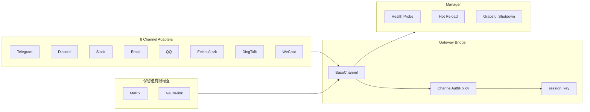
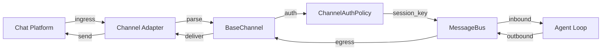

# Harness V1.2 – Channel & Manager 子 PRD

## 0. 范围与约束

### 0.1 总体目标

Channel & Manager 是 Agent Diva 的「外门户」与「控制平面」。V1.2 的目标是：

1. **Channel 层达到生产级完整**：所有保留的一等公民 channel 全场景全链路、无 OAuth 配置
2. **Manager 控制平面增强**：支持动态配置管理、健康探针、优雅扩缩容准备
3. **安全与审计加固**：统一 ACL、补齐审计事件、消除信任边界缺口

### 0.2 关键约束

| 约束 | 说明 |
|------|------|
| **Channel 极简主义** | 仅保留 8 个一等公民 + Matrix + Neuro-Link；其余移除或插件化 |
| **生产级完整** | 每个保留 channel 必须支持群聊/频道/私聊、文件/媒体收发、完整入站/出站链路 |
| **无 OAuth** | 所有 channel 配置方式为 token/secret/QR 扫码，不依赖浏览器 OAuth flow |
| **Harness 增强为主** | 安全、审计、可靠性加固优先；功能增强（如新平台接入）延后 |
| **Manager 不阻塞 Channel** | Manager 增强可与 Channel 加固并行 |
| **独立验收** | 本子 PRD 有独立的 Global Done Definition，不依赖主 PRD 其他 Epic |

### 0.3 前置条件

| ID | 条件 | 状态 |
|----|------|------|
| PC-1 | Channel 全链审计（P0-R2）已完成 | 已完成 |
| PC-2 | Channel 简化决策文档已归档 | 已完成 |
| PC-3 | V1.1 Epic X 框架已映射至 V1.2 Epic 5 | 已完成 |
| PC-4 | Manager 自审（diva-autodream-cli-manager-self-audit.md）已完成 | 已完成 |

---

## 1. Executive Summary

### 1.1 背景

Channel 层当前存在以下系统性问题：

1. **安全面分裂**：13 套 allowlist 策略不一致（Telegram deny vs WhatsApp allow）
2. **信任边界缺口**：Neuro-link 无 TLS/无认证；WhatsApp bridge 无认证；session_key 不含 sender_id
3. **审计缺失**：无 Channel 维度 AuditEvent；AccessDenied 不落 AuditLogger
4. **实现质量参差**：部分 channel 仅支持文本，无文件/媒体；部分无重连；部分无去重
5. **Manager 能力有限**：配置重载不完整；无健康探针；无动态扩缩容准备

### 1.2 V1.2 输出

**Channel 部分：15 个 Story（Epic 5，E5-S1 ~ E5-S15）**

**Manager 部分：6 个 Story（Epic M，EM-S1 ~ EM-S6）**

| 主线 | Story 数量 | 严重度 | 估算人天 |
|------|-----------|--------|----------|
| **Channel 安全加固** | 7（E5-S1 ~ S7） | P0 | 3–5 |
| **Channel 全面增强** | 8（E5-S8 ~ S15） | P1 | 5–8 |
| **Manager 增强** | 6（EM-S1 ~ S6） | P1 | 3–5 |
| **合计** | **21** | — | **11–18** |

### 1.3 成功标准（Global Done Definition）

| ID | 验收项 | 验证方法 |
|----|--------|----------|
| GD-CH-01 | 空 allowlist 默认 deny；所有 adapter 委托 BaseChannel | 安全测试 |
| GD-CH-02 | Neuro-link 默认 127.0.0.1 + shared secret | 安全测试 |
| GD-CH-03 | session_key = "{channel}:{chat_id}:{sender_id}" | 集成测试 |
| GD-CH-04 | Channel 拒绝产生 `ChannelAuthDenied` / `ChannelInboundRejected` AuditEvent | 审计日志 grep |
| GD-CH-05 | Telegram 群聊+私聊+文件/图片+停止生成+打字指示器 | 功能测试 |
| GD-CH-06 | Discord Gateway 重连+附件+回复线程+mention 过滤 | 功能测试 |
| GD-CH-07 | Slack Socket Mode+thread backfill+文件上传+draft 流式 | 功能测试 |
| GD-CH-08 | Email IMAP IDLE+附件收发+HTML/纯文本 | 功能测试 |
| GD-CH-09 | QQ C2C 私聊+群聊+附件+token 刷新 | 功能测试 |
| GD-CH-10 | Feishu WebSocket 稳定+交互卡片+附件+群聊/私聊 | 功能测试 |
| GD-CH-11 | DingTalk Stream Mode 稳定+群聊/私聊+Markdown+附件 | 功能测试 |
| GD-CH-12 | WeChat 新增：iLink Bot QR 扫码+长轮询+媒体收发 | 功能测试 |
| GD-MG-01 | Manager 健康探针 `/health` | 集成测试 |
| GD-MG-02 | Manager 动态配置重载（channel 级别） | 集成测试 |
| GD-MG-03 | Manager 优雅关闭（graceful shutdown） | 集成测试 |

---

## 2. 架构概览

### 2.1 Channel 架构



### 2.2 数据流



---

## 3. Epic 详述

### Epic 5 — Channel 安全与审计加固

**目标：** 统一安全策略、加固信任边界、补齐审计事件、达到生产级完整。

**约束：**

- 保留 8 个一等公民 channel：Telegram、Discord、Slack、Email、QQ、Feishu/Lark、DingTalk、WeChat
- Matrix 与 Neuro-Link 保留但不做完整增强
- WhatsApp / Mattermost / Nextcloud Talk / IRC 从原生代码移除
- 不移植参考代码；不做 rate limit / backpressure 新功能

#### 3.1 安全加固（P0）

| ID | Story | 验收标准 | 优先级 |
|----|-------|----------|--------|
| E5-S1 | 统一 ChannelAuthPolicy | 所有 adapter 委托 `BaseChannel`；空 allowlist 默认 deny；Telegram 特例对齐；未知策略不再 fail-open | P0 |
| E5-S2 | Ingress 审计事件 | `AccessDenied` emit `ChannelAuthDenied`；拒绝进入 AuditLogger | P0 |
| E5-S3 | Neuro-link 加固 | 默认 bind `127.0.0.1`；增加 shared secret；sender/chat 不可客户端伪造 | P0 |
| E5-S4 | WhatsApp bridge 加固 | bridge token / shared secret；不信任未认证 bridge（若保留为 plugin） | P0 |
| E5-S5 | session_key 纳入 sender_id | `InboundMessage::session_key()` = `"{channel}:{chat_id}:{sender_id}"`；breaking change，v1.2 统一采用 | P0 |
| E5-S6 | Feishu webhook 校验 | `encrypt_key` / `verification_token` 接入 WS/Webhook 路径 | P0 |
| E5-S7 | 日志脱敏 | DingTalk 完整 content 不再 info 日志；debug raw 默认 redact content 或 opt-in | P0 |

#### 3.2 Channel 全面增强（P1）

| ID | Story | 验收标准 | 工作量 |
|----|-------|----------|--------|
| E5-S8 | Telegram 全面增强 | 群聊 + 私聊 + 文件/图片上传 + 停止生成 + 打字指示器 + 完整 Markdown→HTML | 2–3 天 |
| E5-S9 | Discord 全面增强 | Gateway 稳定重连 + 附件上传/下载 + 回复线程 + Guild/mention 过滤 | 2–3 天 |
| E5-S10 | Slack 全面增强 | Socket Mode + Polling 回退 + thread backfill + 文件上传 + draft 流式 + Block Kit | 2–3 天 |
| E5-S11 | Email 全面增强 | IMAP IDLE 或更可靠轮询 + 附件收发 + HTML/纯文本双向 + 邮件去重 | 2–3 天 |
| E5-S12 | QQ 全面增强 | C2C 私聊 + 群聊（如开放平台支持）+ 附件 + token 刷新稳定 | 1–2 天 |
| E5-S13 | Feishu 全面增强 | WebSocket 稳定 + 交互卡片 + 附件 + 群聊/私聊策略 | 1–2 天 |
| E5-S14 | DingTalk 全面增强 | Stream Mode 稳定 + 群聊/私聊 + Markdown + 附件 | 1–2 天 |
| E5-S15 | WeChat 新增 | iLink Bot QR 扫码 + 长轮询；文本/图片/文件/视频/语音收发；无 OAuth；token 持久化 | 3–5 天 |

**不做：** channel rate limit、有界 bus、跨 channel 集成测试大规模改造、OAuth/网页登录 channel

---

### Epic M — Manager 控制平面增强

**目标：** 增强 Manager 的控制平面能力：动态配置、健康探针、优雅关闭。

**来源：** `diva-autodream-cli-manager-self-audit.md`、V1.2 主 PRD Epic 5

| ID | Story | 验收标准 | 优先级 |
|----|-------|----------|--------|
| EM-S1 | 健康探针 `/health` | HTTP endpoint 返回 JSON：status、version、uptime、各组件健康状态 | P1 |
| EM-S2 | 就绪探针 `/ready` | 返回 channel 连接状态、provider 可用性、config 加载状态 | P1 |
| EM-S3 | 动态配置重载（channel 级别） | 通过 Manager API 更新单个 channel 配置，无需重启 gateway | P1 |
| EM-S4 | 优雅关闭 | SIGTERM 时：停接收新消息 → 处理完当前消息 → 关闭连接 → 持久化状态 → 退出 | P1 |
| EM-S5 | 配置版本追踪 | Manager 记录每次配置变更的版本、时间戳、变更内容摘要 | P2 |
| EM-S6 | 运行时指标 `/metrics` | 暴露 Prometheus 格式指标：消息吞吐量、channel 连接数、错误率 | P2 |

**不做：** 多实例协调、分布式 leader election、自动扩缩容

---

## 4. 实施计划

### 4.1 Wave 划分

| Wave | 内容 | 产出 | 估算 |
|------|------|------|------|
| Wave X-1 | E5-S1~S7：安全加固 | 统一 AuthPolicy + 审计事件 + 信任边界加固 | 1–2 周 |
| Wave X-2 | E5-S8~S11：核心 Channel 增强 | Telegram/Discord/Slack/Email 生产级完整 | 2–3 周 |
| Wave X-3 | E5-S12~S15：其他 Channel + WeChat 新增 | QQ/Feishu/DingTalk/WeChat 生产级完整 | 2–3 周 |
| Wave M | EM-S1~S6：Manager 增强 | 健康探针 + 热重载 + 优雅关闭 | 1–2 周 |

### 4.2 依赖关系

```
Wave X-1 (安全加固) ──→ Wave X-2 (核心增强) ──→ Wave X-3 (其他+WeChat)
Wave X-1 ──→ Wave M (Manager)
Wave M 与 Wave X-2/X-3 可并行
```

**关键路径：** Wave X-1 → Wave X-2 → Wave X-3

**总工期：约 5–8 周**

---

## 5. NFRs

### 5.1 性能

| ID | 要求 | 目标 |
|----|------|------|
| NFR-CH-PF-001 | Channel 消息处理延迟 | < 100ms（从接收到进入 MessageBus） |
| NFR-CH-PF-002 | Channel 启动时间 | < 5s（从配置加载到连接就绪） |
| NFR-CH-PF-003 | Manager 健康探针响应 | < 10ms |

### 5.2 安全

| ID | 要求 |
|----|------|
| NFR-CH-SC-001 | 空 allowlist 默认 deny |
| NFR-CH-SC-002 | Neuro-link 默认 127.0.0.1 + shared secret |
| NFR-CH-SC-003 | session_key 含 sender_id，防会话劫持 |
| NFR-CH-SC-004 | 所有 channel 日志脱敏（token、secret 不打印） |

### 5.3 可靠性

| ID | 要求 |
|----|------|
| NFR-CH-RL-001 | Gateway 重连：断线后 30s 内自动重连 |
| NFR-CH-RL-002 | 消息去重：同一消息 ID 不重复处理 |
| NFR-CH-RL-003 | 优雅关闭：SIGTERM 后 30s 内完成关闭 |
| NFR-CH-RL-004 | 配置热重载失败保留旧配置 |

---

## 6. 风险与应对

| 风险 | 概率 | 影响 | 应对 |
|------|------|------|------|
| WeChat iLink Bot API 不稳定 | 中 | 高 | 备选方案：长轮询降级；或 WeChat 延后至 V1.3 |
| Discord Gateway intents 变更 | 低 | 中 | 跟踪 Discord 开发者文档；预留配置项 |
| Slack Socket Mode 连接数限制 | 低 | 中 | 实现 Polling 回退；监控连接数 |
| 所有 channel 同时增强，测试资源不足 | 中 | 中 | 分阶段发布：先核心 4 个，后其他 |
| Manager 热重载引入状态不一致 | 中 | 高 | 原子切换 + 旧配置回滚机制 |

---

## 7. 与主 PRD 的接口

### 7.1 依赖主 PRD 的 Epic

| 本 PRD Story | 依赖主 PRD Epic | 说明 |
|-------------|----------------|------|
| E5-S2 (Ingress 审计) | Epic 9 (Observability) | AuditEvent 基础设施 |
| E5-S5 (session_key) | Epic 6 (Context) | Session 管理 |
| EM-S3 (热重载) | Epic 2 (Config) | ConfigWatcher 基础设施 |
| EM-S4 (优雅关闭) | Epic 4 (Subagent) | 取消级联 |

### 7.2 提供给主 PRD 的接口

| 本 PRD 产出 | 主 PRD 使用者 | 说明 |
|-------------|--------------|------|
| ChannelAuthPolicy | Epic 1 (Skill) | Skill 执行时的 channel 权限上下文 |
| AuditEvent::Channel* | Epic 9 (Observability) | 审计日志消费 |
| Manager 健康状态 | Epic 9 (Observability) | 监控指标 |

---

## 8. 附录

### 8.1 文档索引

| 文档 | 路径 |
|------|------|
| Channel 全链审计 | `docs/research/diva-channels-full-audit-v2.md` |
| Channel 简化决策 | `docs/dev/channel-simplification-decision-2026-06.md` |
| V1.1 Epic X 框架 | `docs/prds/prd-harness-engineering-v1.1/prd.md` §4 |
| Manager 自审 | `docs/research/diva-autodream-cli-manager-self-audit.md` |
| 主 PRD V1.2 | `docs/prds/prd-harness-v1.2/prd.md` |

### 8.2 Channel 能力矩阵（目标状态）

| Channel | 群聊 | 私聊 | 文件上传 | 文件下载 | 图片 | 语音 | 视频 | 重连 | 去重 | 配置方式 |
|---------|------|------|----------|----------|------|------|------|------|------|----------|
| Telegram | ✓ | ✓ | ✓ | ✓ | ✓ | ✓ | ✓ | ✓ | ✓ | Bot Token |
| Discord | ✓ | ✓ | ✓ | ✓ | ✓ | ✓ | ✓ | ✓ | ✓ | Bot Token |
| Slack | ✓ | ✓ | ✓ | ✓ | ✓ | ✓ | ✓ | ✓ | ✓ | Socket Mode Token |
| Email | N/A | ✓ | ✓ | ✓ | ✓ | ✓ | ✓ | ✓ | ✓ | IMAP/SMTP |
| QQ | ✓ | ✓ | ✓ | ✓ | ✓ | ✓ | ✓ | ✓ | ✓ | AppID + Secret |
| Feishu | ✓ | ✓ | ✓ | ✓ | ✓ | ✓ | ✓ | ✓ | ✓ | AppID + Secret |
| DingTalk | ✓ | ✓ | ✓ | ✓ | ✓ | ✓ | ✓ | ✓ | ✓ | ClientID + Secret |
| WeChat | ✓ | ✓ | ✓ | ✓ | ✓ | ✓ | ✓ | ✓ | ✓ | iLink Bot Token |
| Matrix | ✓ | ✓ | ✓ | ✓ | ✓ | ✓ | ✓ | ✓ | ✓ | Homeserver + Token |
| Neuro-link | N/A | N/A | ✓ | ✓ | ✓ | ✓ | ✓ | ✓ | ✓ | Shared Secret |

---

*本 PRD 为 Harness V1.2 Channel & Manager 子规划（status: draft），与主 PRD 协同执行。*
