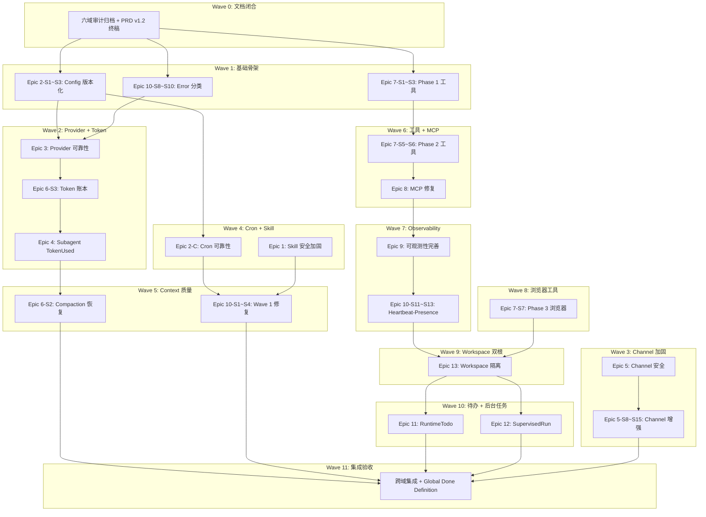

# Harness V1.2 大型更新计划（总 PRD）

## 0. 范围与约束

### 0.1 总体目标

Harness V1.2 是 Agent Diva 从「可运行的集成产品」迈向「生产级完整基线」的关键版本。本 PRD 整合以下 **六大主线**，输出一份可执行的总 PRD：

1. **V1.1 Harness 加固** — Skill、Config、Provider、Subagent、Channel、Context & Memory（Epic 1–6）
2. **工具系统补齐** — patch、search_files、process、execute_code、delegate、browser（Epic 7）
3. **MCP 可靠性修复** — 5 Critical + 4 High 缺陷闭合（Epic 8）
4. **Observability 完善** — debug bundle、HTTP tap、RPC tap、日志查询（Epic 9）
5. **Wave 1 漏洞修复** — System budget、Consolidation 质量门、工具超时等（Epic 10 部分）
6. **基础能力加固** — Error taxonomy、Heartbeat-Presence 联动、Guardian、rate limiter（Epic 10 部分）

**核心原则：**

- **可靠性闭环**：所有执行路径必须有审计、有重试、有降级
- **安全边界**：默认 deny、最小权限、可验证
- **可观测性**：日志是一等公民，一切行为可追踪
- **配置演进**：版本化、可迁移、热重载

### 0.2 关键约束

| 约束 | 说明 |
|------|------|
| **Channel / Manager：独立子 PRD** | Epic 5 详细 Story 见 `prd-channel-manager.md`；主 PRD 保留框架与接口 |
| **JSON-only config** | 坚持 JSON 配置格式；文档中的 `config.yaml` 字面量需同步修订为 `config.json` |
| **不移植参考代码** | zeroclaw / openfang / codex 仅作设计参考，不作为移植目标 |
| **最小侵入** | 优先自研最小实现，不引入新运行时依赖 unless 必要 |
| **Provider 极简主义** | 仅 Anthropic 原生 + OpenAI-compatible 两条链路 |
| **质量要求：生产级完整** | 所有保留功能必须是生产级完整，不允许半成品 |
| **Epic 14 无变更** | Core/Agent 主循环已在 V1.0 实现，V1.2 不修改 |

### 0.3 前置条件

| ID | 条件 | 状态 |
|----|------|------|
| PC-1 | V1.1 PRD 终稿已归档 | 已完成 |
| PC-2 | 六域审计报告（P0-R1~R6）已完成 | 已完成 |
| PC-3 | 工具系统调研与实施计划已完成 | 已完成 |
| PC-4 | MCP deep-dive 审计已完成 | 已完成 |
| PC-5 | Wave 1 漏洞详细调研已完成 | 已完成 |
| PC-6 | 交叉审计（11 维度）已完成 | 已完成 |
| PC-7 | DECISION-v2 完整性检查已完成 | 已完成 |

---

## 1. Executive Summary

### 1.1 背景

Agent Diva 当前具备功能广度（多 channel adapter、provider registry、渐进式 skill 加载、Module 化 cron、LoopGuard 熔断），但存在以下系统性缺口：

1. **Harness 基线未闭合** — Token usage 断裂、Config 热重载名存实亡、Channel 安全面分裂
2. **工具系统缺失关键工具** — patch、search_files、process、execute_code、delegate、browser
3. **MCP 实现有 5 个 Critical 缺陷** — 错误吞掉、并发锁、僵尸进程、无重连、结果无界
4. **Observability 不完整** — 无 debug bundle、无 provider HTTP tap、无 MCP RPC tap
5. **Wave 1 漏洞未修复** — System budget 未实测、Consolidation 无质量门、通用工具无超时
6. **运行时任务能力缺失** — 无 RuntimeTodo、无 SupervisedRun、无 Workspace 隔离

### 1.2 V1.2 输出

**13 个 Epic（Epic 1–13）+ Wave 0–11 实施路线图 + 2 个附属 PRD**

> **注**：Epic 14（Core/Agent 主循环）在 V1.0 中已实现，V1.2 无变更。

| 主线 | Epic | 严重度 | 估算人天 |
|------|------|--------|----------|
| **Harness 加固** | Epic 1: Skill 安全加固 | P0 | 5–7 |
| | Epic 2: Config 版本化 + 热重载 + Cron 可靠性 | P0 | 10–14 |
| | Epic 3: Provider 可靠性 | P0 | 8–12 |
| | Epic 4: Subagent 取消与工具可中断性 | P1 | 3–5 |
| | Epic 5: Channel 安全与审计加固 | P0 | 5–8 |
| | Epic 6: Context & Memory 质量 | P0 | 10–14 |
| **工具系统** | Epic 7: 工具系统补齐 | P0 | 15–20 |
| **MCP 增强** | Epic 8: MCP 可靠性修复 | P0 | 5–7 |
| **Observability** | Epic 9: 可观测性完善 | P1 | 5–7 |
| **基础能力** | Epic 10: 基础能力加固 | P1 | 8–12 |
| **待办任务** | Epic 11: 待办与任务系统 RuntimeTodo | P1 | 5–7 |
| **后台任务** | Epic 12: 后台任务系统 SupervisedRun | P1 | 5–7 |
| **工作区隔离** | Epic 13: 工作区隔离 Workspace | P1 | 5–7 |

**附属文档：**

- `prd-channel-manager.md` — Epic 5 + Manager 控制平面
- `prd-gui-minimal.md` — V1.2 配置暴露最小 GUI 计划

**总估算：100–140 人天**

### 1.3 成功标准（Global Done Definition）

| ID | 验收项 | 验证方法 |
|----|--------|----------|
| GD-01 | 10 轮 DeepSeek/Ollama 流式调用，TokenUsed.total > 0 比例 ≥ 95% | 集成测试 |
| GD-02 | Session JSONL 含每 turn usage 字段；subagent turn 可见 TokenUsed | 持久化测试 |
| GD-03 | 503 自动重试成功；429 → `RateLimited` + Retry-After | 模拟 provider 测试 |
| GD-04 | patch 工具 9 种匹配策略通过测试 | 单元测试 |
| GD-05 | search_files 支持 regex + glob；结果限流 + 上下文 | 单元测试 |
| GD-06 | MCP 5 Critical 缺陷全部修复；并发调用不串行化 | 集成测试 |
| GD-07 | debug bundle 包含 provider HTTP 请求/响应原始字节 | 手动验证 |
| GD-08 | System budget 实际测量；超出时告警 | 单元测试 |
| GD-09 | Consolidation 有质量门；失败时重试最多 2 次 | 集成测试 |
| GD-10 | 通用工具超时 60s；超时时返回 ToolError::Timeout | 单元测试 |
| GD-11 | Error 分类系统：RateLimited / Auth / Transient / Permanent / ToolSchema | 单元测试 |
| GD-12 | Heartbeat 节律随 PresenceState 变化（Active→Normal, Gone→Slow） | 单元测试 |
| GD-13 | Channel 空 allowlist 默认 deny；Neuro-link 默认 127.0.0.1 + secret | 安全测试 |
| GD-14 | Cron callback 等待 Agent 完成；无 token HTTP 写拒绝 | 集成测试 |

---

## 2. 产品愿景

### 2.1 核心隐喻

> Model = CPU, Context Window = RAM, Harness = OS, Agent = Application, Tools = System Calls, Observability = Kernel Logs

### 2.2 核心原则

> Model proposes, Harness executes, Tools extend, Observability records.

LLM 输出绝不直接产生副作用；所有动作都经过 harness 层的校验、授权、执行和记录；工具系统提供可扩展的系统调用能力；可观测性确保一切行为可追踪、可诊断。

---

## 3. Epic 列表

### 3.1 概览

| Epic | 名称 | 严重度 | 来源 | 估算人天 |
|------|------|--------|------|----------|
| **Epic 1** | Skill 安全加固 | P0 | V1.1 Epic 2 | 5–7 |
| **Epic 2** | Config 版本化 + 热重载 + Cron 可靠性 | P0 | V1.1 Epic 4 | 10–14 |
| **Epic 3** | Provider 可靠性 | P0 | V1.1 Epic 5-A | 8–12 |
| **Epic 4** | Subagent 取消与工具可中断性 | P1 | V1.1 Epic 5-B | 3–5 |
| **Epic 5** | Channel 安全与审计加固 | P0 | V1.1 Epic X | 5–8 |
| **Epic 6** | Context & Memory 质量 | P0 | V1.1 Epic 7 | 10–14 |
| **Epic 7** | 工具系统补齐 | P0 | 工具系统实施计划 | 15–20 |
| **Epic 8** | MCP 可靠性修复 | P0 | MCP deep-dive | 5–7 |
| **Epic 9** | 可观测性完善 | P1 | 交叉审计维度 11 | 5–7 |
| **Epic 10** | 基础能力加固 | P1 | Wave 1 调研 + 交叉审计 | 8–12 |
| **Epic 11** | 待办与任务系统 RuntimeTodo | P1 | zeroclaw 调研 | 5–7 |
| **Epic 12** | 后台任务系统 SupervisedRun | P1 | codex 调研 | 5–7 |
| **Epic 13** | 工作区隔离 Workspace | P1 | openfang 调研 | 5–7 |
| **Epic 14** | Core/Agent 主循环 | — | V1.0 已实现 | 0（NOTE ONLY） |

### 3.2 不做项（V1.2 Out of Scope）

| 项 | 原因 |
|----|------|
| Agent Teams / 蜂群协调 | 功能项，V1.2 聚焦基线能力 |
| 插件系统 / ZeroClaw 兼容层 | 长期方向，待 channel 简化后评估 |
| OAuth / 网页登录 / 云平台 IAM | 与 Provider 极简主义约束冲突 |
| 分布式 leader election / 高可用集群 | 功能项，V1.2 声明单实例部署 |
| GUI 独立审计页面 | 审计日志是唯一源头；GUI 复用现有日志能力 |
| 多租户 / SaaS 托管服务 | 超出范围 |
| Epic 14 Core/Agent 主循环改造 | V1.0 已实现，V1.2 无变更 |

---

## 4. Epic 详述

### Epic 1 — Skill 安全加固

**目标：** 为 skill 加载与注入增加质量门，防止 prompt injection 与 context 挤占。

| ID | Story | 验收标准 |
|----|-------|----------|
| E1-S1 | Always skill injection 扫描 | `SkillsLoader` 在注入前调用 `detect_injection()`；high severity 默认降级为 `summary-only`，可配置为 `block`；GUI 新增配置选项 |
| E1-S2 | Skill zip 上传门控 | 限制 zip 大小 5MB、SKILL.md 字符数；frontmatter schema 校验；写入 provenance (uploader, timestamp, sha256) |
| E1-S3 | Trust tier | `source=builtin` trusted；`source=workspace` review；config 可选禁用 workspace always skill |
| E1-S4 | Context budget cap | 新增 `AgentSkillsConfig.max_always_chars`（默认 8000）、`max_always_count`（默认 3）、`max_summary_skills`（默认 50） |
| E1-S5 | Skill audit event | `AuditEvent::SkillUploaded / SkillDeleted / SkillInjectionBlocked` 进入审计日志 |
| E1-S6 | Instruction hierarchy | 新增 `agent-diva-core/src/security/instruction_hierarchy.rs`：System > User > Tool 优先级；prompt 装配时按层级裁剪冲突指令 |
| E1-S7 | Tool result filter | 新增 `agent-diva-core/src/security/tool_result_filter.rs`：将工具输出包入 `<untrusted>` 标签并附 prompt 提示；与 `detect_injection()` 联动 |

**不做：** skill bundle、multi-scope、registry、Codex file watcher

---

### Epic 2 — Config 版本化 + 热重载 + Cron 可靠性

**目标：** 建立 config schema 版本化与 Rust→Rust 迁移链；让热重载真正接入 gateway；补齐 Cron 执行闭环。

#### 4.1 Config Schema 与迁移

| ID | Story | 验收标准 |
|----|-------|----------|
| E2-S1 | `config_version` | `Config` 根增加 `config_version: u32`，默认 1；新增 `migrate.rs` 实现 1→2 链式迁移；启动时默认自动 migrate |
| E2-S2 | Harness 域入 Config | `SecurityConfig`、`PresenceConfig`、`HeartbeatConfig`、audit/PII/injection 规则进入 `Config` schema |
| E2-S3 | `ReloadPlan` / `ConfigDiff` | 实现 hot-reloadable vs restart-required 字段分类；`compute_changed_fields` 覆盖 PII/注入/presence/heartbeat |
| E2-S4 | `ConfigWatcher` 接入 gateway | mtime poll 5s；变更后调用 `on_config_reload`；失败保留旧 config + error log |
| E2-S5 | `config migrate --upgrade` | CLI 支持显式升级；生成 `.bak`；env overrides 在 reload 时重新应用 |

#### 4.2 Cron 可靠性

| ID | Story | 验收标准 |
|----|-------|----------|
| E2-C1 | Turn await 闭环 | `build_cron_callback` 等待 Agent turn 完成或 timeout；`last_status` 与真实执行一致 |
| E2-C2 | 单实例 leader lock | `jobs.json.lock` 文件锁；双 Gateway 仅一实例触发 |
| E2-C3 | HTTP API 最小鉴权 | `/api/cron/jobs/*` 要求 gateway token；`CronJob` 增加 `owner` 字段 `{channel, chat_id, user_id}` |
| E2-C4 | Cron audit event | `AuditEvent::CronJobCreated / Triggered / Completed / Failed` |
| E2-C5 | 原子写 | `write temp + rename`，kill -9 后 store 可解析 |

**不做：** 分布式 leader election、misfire catch-up、自动重试/告警

---

### Epic 3 — Provider 可靠性

**目标：** 在 Provider 极简架构下，实现生产级完整的 provider 层。

**架构约束：**

- 原生链路仅保留 `AnthropicDriver` + `OpenAiCompatibleDriver`
- 删除 LiteLLM prefix 解析逻辑，直接发送 raw model ID
- `ProvidersConfig` 精简为 `anthropic` + `openai_compatible` + `custom_providers`

| ID | Story | 验收标准 |
|----|-------|----------|
| E3-S1 | 新增 `AnthropicDriver` | 原生 Messages API；支持 thinking / computer-use / prompt caching；流式与非流式统一 |
| E3-S2 | 收敛 `OpenAiCompatibleDriver` | 删除 LiteLLM prefix 逻辑；native/custom endpoint 均发送 raw model ID |
| E3-S3 | 接入 `RetryPolicy` | 外包 retry；transient/5xx 重试 3 次；4xx/auth 直接失败 |
| E3-S4 | `RateLimited` 变体 | 429 解析为 `ProviderError::RateLimited { retry_after }` |
| E3-S5 | `stream_options.include_usage` | `ChatCompletionRequest` 增加 `stream_options`；final SSE chunk 含 usage |
| E3-S6 | Usage fallback | 不支持 `include_usage` 的端点：warn + metrics；统一为 `Usage { prompt, completion, total }` |
| E3-S7 | Model ID 安全加固 | native endpoint 匹配 registry default_api_base 时强制 raw model |
| E3-S8 | Config schema 精简 | `ProvidersConfig` 仅保留 3 槽位；旧 11 槽位给出明确 migrate 错误 |
| E3-S9 | 错误分类增强 | `ProviderError` 区分 `RateLimited` / `Auth` / `Transient` / `Permanent` / `ToolSchema` |
| E3-S10 | Provider fallback 中间层 | model fallback + 跨 driver provider fallback；最大深度 3；循环检测 |

**不做：** OllamaProvider 完整修复、provider 探活、raw HTTP debug tap、OAuth provider

---

### Epic 4 — Subagent 取消与工具可中断性

**目标：** 用户取消后级联到 subagent 与长工具。

| ID | Story | 验收标准 |
|----|-------|----------|
| E4-S1 | StopSession 取消 subagent | `StopSession` 调用 `cancel_subagent`；`running_tasks` 中对应 handle abort |
| E4-S2 | 工具可中断 | shell / MCP 工具接受 `CancellationToken`；取消后尽快退出 |
| E4-S3 | Subagent TokenUsed | subagent 每轮 emit `TokenUsed`；合并入 parent session |
| E4-S4 | 统一墙钟 | 去掉 120s/300s 双轨，统一由外层 timeout 控制 |

---

### Epic 5 — Channel 安全与审计加固

**目标：** Channel 层达到生产级完整；统一安全策略、加固信任边界、补齐审计事件。

**详细 Story（E5-S1 ~ E5-S15）及 Manager Epic M 见附属 PRD：** `prd-channel-manager.md`

| ID | Story | 验收标准（摘要） |
|----|-------|------------------|
| E5-S1 | 统一 ChannelAuthPolicy | 空 allowlist 默认 deny；所有 adapter 委托 `BaseChannel` |
| E5-S2 | Ingress 审计事件 | `ChannelAuthDenied` / `ChannelInboundRejected` 进入 AuditLogger |
| E5-S3 ~ E5-S7 | 安全加固 | Neuro-link、session_key、Feishu webhook、日志脱敏等 |
| E5-S8 ~ E5-S15 | Channel 全面增强 | Telegram / Discord / Slack / Email / QQ / Feishu / DingTalk / WeChat |

**不做：** channel rate limit、有界 bus、跨 channel 大规模集成测试改造

---

### Epic 6 — Context & Memory 质量

**目标：** 恢复 LLM 摘要 compaction、建立 token 账本、限制 session 无界增长。

| ID | Story | 验收标准 |
|----|-------|----------|
| E6-S1 | Session 上限 | JSONL 条数/字节上限；`SessionManager.cache` 增加 LRU/TTL |
| E6-S2 | LLM 摘要 Compaction 恢复 | 重新引入 LLM 摘要模块；长会话 history 含 summary 指针；非仅删消息 |
| E6-S3 | Token 账本 | Session metadata 含累计 token usage；统一 `Usage` 类型；subagent 合并；rollup API 可读 |
| E6-S4 | Context budget per-section | system 分段（soul / skills / memory）分别预算；超 reserve 告警 |
| E6-S5 | LoopStopped 审计事件 | `AgentEvent::LoopStopped { reason }` 进入审计日志 |

**不做：** 并行 inbound、全量有界 MessageBus

---

### Epic 7 — 工具系统补齐

**目标：** 补齐核心工具、复合工具、浏览器工具，建立完整的工具系统。

#### Phase 1：核心工具

| ID | Story | 验收标准 |
|----|-------|----------|
| E7-S1 | `PatchTool` 实现 | 9 种匹配策略（Exact、TrimWhitespace、NormalizeWhitespace、CaseInsensitive、IndentTolerance、Fuzzy、LineBased、PartialMatch、Regex）；安全策略检查；返回 diff |
| E7-S2 | `SearchFilesTool` 实现 | 优先 ripgrep，回退内置；支持 regex/glob；结果限流 + 上下文；权限检查 |
| E7-S3 | `ProcessTool` 实现 | 后台进程管理：list/poll/log/wait/kill/write/submit/close；进程状态跟踪 |
| E7-S4 | 工具集配置 | 预定义工具集：core、file、shell、web、browser、code |

#### Phase 2：复合工具

| ID | Story | 验收标准 |
|----|-------|----------|
| E7-S5 | `ExecuteCodeTool` 实现 | PTC 模式：Python 脚本 + RPC 调用工具；沙箱限制（7 工具、1 分钟、10 次调用、10KB 输出） |
| E7-S6 | `DelegateTool` 实现 | 子代理工具：上下文隔离、独立终结果摘要；最多并发 3 个子代理不能再派生 |

#### Phase 3：浏览器工具

| ID | Story | 验收标准 |
|----|-------|----------|
| E7-S7 | `BrowserTool` 实现 | P0：navigate、snapshot、click、type；P1：scroll、press、back；P2：get_images、vision、console |

**新依赖：** `walkdir`、`levenshtein`（Phase 1）；`playwright` 或 `headless_chrome`（Phase 3）

---

### Epic 8 — MCP 可靠性修复

**目标：** 修复 MCP 实现中 5 个 Critical 缺陷与 4 个 High 缺陷。

#### Critical 缺陷修复

| ID | Story | 验收标准 |
|----|-------|----------|
| E8-S1 | `is_error` 标志处理 | `render_tool_result()` 正确处理 `CallToolResult.is_error`；MCP server 错误不再当成功返回 |
| E8-S2 | 并发锁修复 | `execute()` 将 `write()` 锁改为 `read()` 锁或更细粒度锁；同一 MCP server 并发调用不串行化 |
| E8-S3 | 僵尸进程修复 | `to_dto()` 不再 spawn 新进程；admin UI 列表复用已有连接或缓存 |
| E8-S4 | 重连机制 | MCP server 崩溃后自动重连；健康检查；连接状态监控 |
| E8-S5 | 结果大小限制 | `MAX_TOOL_RESULT_CHARS`(80K) 应用于 MCP 输出；恶意 server 无法返回 MB 级文本 |

#### High 缺陷修复

| ID | Story | 验收标准 |
|----|-------|----------|
| E8-S6 | 清理死代码 | 移除 `DEFAULT_TIMEOUT_SECS` 死代码；`load_mcp_tools_sync` 不再阻塞 tokio worker |
| E8-S7 | 错误日志级别 | `handle_process_error` stderr 从 `debug!` 提升为 `error!` 或 `warn!`；crash 堆栈完整 |
| E8-S8 | 热重载 | MCP 配置变更无需重启；动态加载/卸载 MCP server |

---

### Epic 9 — 可观测性完善

**目标：** 建立完整的可观测性体系，日志作为一等公民。

| ID | Story | 验收标准 |
|----|-------|----------|
| E9-S1 | debug bundle 导出 | `gateway run --debug` 生成完整 debug bundle；包含 payload、事件、日志 |
| E9-S2 | provider HTTP tap | 捕获 provider-native 层 HTTP 请求/响应字节；gated behind debug mode |
| E9-S3 | MCP RPC tap | 捕获 MCP SDK 内部 RPC 帧；包含于 debug bundle 中 |
| E9-S4 | 结构化日志完善 | JSONL writer 覆盖所有关键组件；redaction、truncation、retention-aware cleanup |
| E9-S5 | 审计日志持久化 | Security 决策（path denial、rate limit、approval）进入 dedicated persistent sink |
| E9-S6 | 日志查询 API | 提供结构化日志查询接口；按时间、事件类型、session 过滤 |

---

### Epic 10 — 基础能力加固

**目标：** 修复 Wave 1 漏洞，加固基础能力。

#### Wave 1 Critical 修复

| ID | Story | 验收标准 |
|----|-------|----------|
| E10-S1 | System budget 实际测量 | `build_system_prompt()` 后实际测量 token 数；使用 `chars/3` 或 tiktoken；超出时告警 |
| E10-S2 | Consolidation 质量门 | 复用 `QualityScorer`；添加关键词覆盖率检查；失败时重试最多 2 次；返回质量分数 |
| E10-S3 | 通用工具超时 | `Tool` trait 添加 `timeout()` 方法（默认 60s）；`ToolRegistry::execute()` 使用 `tokio::time::timeout` |
| E10-S4 | compaction-of-compaction | 摘要数量 > 10 时触发 meta-compaction；合并为更高层摘要；保留引用链 |

#### Wave 1 High 修复

| ID | Story | 验收标准 |
|----|-------|----------|
| E10-S5 | per-user rate limiter | `RateLimitKey` enum：Global / User / Session；默认 per-user 限制 |
| E10-S6 | Guardian 默认配置 | `auto_approve_known_safe` 默认 `true`；提供 strict / balanced / permissive 模式 |
| E10-S7 | 合并 approval 类型 | 统一 `ExecApprovalRequirement` 与 `ApprovalRequirement` |

#### Error 分类系统

| ID | Story | 验收标准 |
|----|-------|----------|
| E10-S8 | Error taxonomy | 跨 crate 统一 `ErrorKind`：RateLimited / Auth / Transient / Permanent / ToolSchema / Timeout |
| E10-S9 | Retry classification | `ToolError` 实现 `is_retryable()`；registry 根据分类决定重试 |
| E10-S10 | Error codes | 每个错误变体有稳定错误码；支持程序化错误处理 |

#### Heartbeat-Presence 联动

| ID | Story | 验收标准 |
|----|-------|----------|
| E10-S11 | Heartbeat 节律适配 | `Active` → Normal cadence；`Distracted/Gone` → Slow（2× 间隔）；`Away` → Suspended |
| E10-S12 | Heartbeat 重试 | LLM 失败时指数退避重试；jitter 防 thundering herd |
| E10-S13 | Presence 状态审计 | `PresenceChanged` 事件进入审计日志 |

---

### Epic 11 — 待办与任务系统 RuntimeTodo

**目标：** 建立用户/Agent 运行时待办系统，与项目 backlog（`TODOLIST.md`）和后台执行（SupervisedRun）严格区分。

| ID | Story | 验收标准 |
|----|-------|----------|
| E11-S1 | `TodoItem` 数据模型 + `TodoStore` trait | 字段：id、title、description、status、priority、created_at、updated_at、completed_at、source、session_id、parent_id；terminal 态 guard 借鉴 zeroclaw |
| E11-S2 | JSONL 持久化实现 | `{data_root}/todos.jsonl` + 内存 cache；原子 append/rewrite |
| E11-S3 | `todo` 工具（多 action） | create / list / update / complete / cancel / get；单工具多 action 模式 |
| E11-S4 | Session 关联 + Context 注入 | `session_id` 写入；turn 前注入 open todos（pending + active） |
| E11-S5 | CLI `agent-diva todo` | add/list/done/cancel/delete/get；支持 `--session` / `--status` 过滤 |
| E11-S6 | Manager HTTP `/api/todos/*` | RESTful CRUD；query 参数过滤 |
| E11-S7 | `AuditEvent::TodoStatusChanged` | 状态变更审计 + MessageBus |
| E11-S8 | 归档与轮转 | completed > 30 天 → `todos.archive.YYYY-MM.jsonl` |
| E11-S9 | 与 SupervisedRun 弱关联 | `linked_run_id: Option<String>`；Run 完成可选自动 complete 关联 todo |

**持久化：** `{data_root}/todos.jsonl`

**不做：** 甘特图、看板 UI、用户任务分配、邮件提醒、任务调度器、任务抢占

---

### Epic 12 — 后台任务系统 SupervisedRun

**目标：** 建立通用后台任务框架，支持长时间运行、任务队列、结果回调。Cron 仅作 trigger，长作业入队执行。

| ID | Story | 验收标准 |
|----|-------|----------|
| E12-S1 | 任务领域模型 | `SupervisedRunSpec`、`RunStatus`、`RunKind`；`RunHandle` 可 await / poll |
| E12-S2 | TaskStore 持久化 | SQLite `{data_root}/supervised_runs.db`（WAL）；`BEGIN IMMEDIATE` lease claim；FIFO + 优先级；`schedule_at`；dedupe |
| E12-S3 | TaskExecutor | Tokio 调度 loop：claim → handler → complete/fail；默认并发 4；超时 300s |
| E12-S4 | Gateway 可观测性 | `gateway.log` 结构化事件；`GET /api/tasks/:id`；`BackgroundEvent` 侧信道 |
| E12-S5 | Agent 工具 | `enqueue_background_task`、`get_task_status`、`cancel_background_task` |
| E12-S6 | Cron 桥接 | Cron callback 禁止阻塞 > N 秒；长作业必须 enqueue 后立即返回 |
| E12-S7 | Subagent handler | `kind=subagent` 复用 `SubagentManager`；结果写 store + MessageBus |
| E12-S8 | 重试与死信 | `retry_remaining` + `retry_at` backoff；耗尽标记 failed 并告警 |
| E12-S9 | reclaim + reaper | 60s 周期 reclaim lost 任务；reaper 强制终止超时 running 任务 |
| E12-S10 | gateway_boot_id + PID 权威 | 每 Gateway 生成 `gateway_boot_id`；claim 时校验 PID 存活；防双 Gateway 竞争 |

**不做：** 分布式任务队列（Redis/RabbitMQ）、任务分片、MapReduce、cgroup 资源隔离

---

### Epic 13 — 工作区隔离 Workspace

**目标：** 采用 openfang 双根模型（`data_root` + `project_root`），实现工作区间数据、配置、技能完全隔离。

| ID | Story | 验收标准 |
|----|-------|----------|
| E13-S0 | WorkspaceContext 双根模型 | `data_root`（Agent 私有状态）+ `project_root`（用户项目目录）；registry CRUD |
| E13-S1 | 工作区数据模型 | `Workspace`：id、name、data_root、project_root、created_at、updated_at |
| E13-S2 | 目录隔离 | data_root 下：config、sessions、skills、memory、logs、todos、runs |
| E13-S3 | 配置隔离 | workspace-scoped config；`--workspace {id}`；Config v3 迁移 |
| E13-S4 | Skill 隔离 | workspace skills @ data_root；builtin 全局共享 |
| E13-S5 | Session 隔离 | `SessionManager` @ data_root；metadata 含 workspace_id |
| E13-S6 | 工具路径绑定 | `SecurityPolicy` 绑定 project_root；统一 `resolve_sandbox_path` |
| E13-S7 | CLI/GUI 工作区切换 | `agent-diva workspace list/switch/create/delete` |
| E13-S8 | 可选 Docker exec | config 开关；ro mount project_root；默认关闭 |
| E13-S9 | Subprocess env 沙箱 | shell env_clear + passthrough 白名单 |
| E13-S10 | 附件 workspace 索引 | upload/read 限定 workspace index |
| E13-S11 | Config v3 迁移 | 旧 `agents.defaults.workspace` → `default.project_root`；自动迁移 + 备份 |
| E13-S12 | 统一 resolve_sandbox_path | canonicalize + `..` 拒绝 + symlink 检测；所有工具统一使用 |

**不做：** 工作区共享协作、工作区模板市场、工作区加密、分布式文件系统

---

### Epic 14 — Core/Agent 主循环（NOTE ONLY）

**状态：** V1.0 已实现，V1.2 无变更。

**范围：** Agent loop、context builder、skill loader、subagent manager 核心流程已在 V1.0 交付；V1.2 仅通过 Epic 4（取消）、Epic 6（Context）、Epic 10（Error/Heartbeat）做增量加固，不重写主循环架构。

---

## 5. Wave 实施计划

### 5.1 依赖关系



### 5.2 Wave 详细排期

| Wave | 内容 | 产出 | 估算 |
|------|------|------|------|
| Wave 0 | 六域审计报告归档 + PRD v1.2 终稿 | PRD 输入终稿 | 1–2 周 |
| Wave 1 | Epic 2 Config 骨架 + Epic 10 Error 分类 + Epic 7 Phase 1 工具 | v2 schema + migrate 单测 + patch/search/process | 3–4 周 |
| Wave 2 | Epic 3 Provider + Epic 6-S3 Token 账本 + Epic 4 Subagent | Token 闭包测试通过 | 2–3 周 |
| Wave 3 | Epic 5 Channel 安全 + 增强 | deny-default 一致 + 8 一等公民 channel 生产级 | 2–3 周 |
| Wave 4 | Epic 2-C Cron + Epic 1 Skill | Cron P0 清零 + Skill guard | 1–2 周 |
| Wave 5 | Epic 6-S2 Compaction + Epic 10 Wave 1 修复 | 摘要链 + System budget 测量 | 2–3 周 |
| Wave 6 | Epic 7 Phase 2 工具 + Epic 8 MCP | execute_code/delegate + MCP 修复 | 2–3 周 |
| Wave 7 | Epic 9 Observability + Epic 10 Heartbeat-Presence | debug bundle + 节律切换 | 1–2 周 |
| Wave 8 | Epic 7 Phase 3 浏览器工具 | browser navigate/click/snapshot/type | 2–3 周 |
| Wave 9 | Epic 13 Workspace 双根模型 | 工作区隔离 + 数据安全 | 2–3 周 |
| Wave 10 | Epic 11 RuntimeTodo + Epic 12 SupervisedRun | 待办系统 + 后台任务框架 | 2–3 周 |
| Wave 11 | 跨域集成 + Global Done Definition 验收 | v1.2 发布候选 | 1–2 周 |

**关键路径：** Wave 1 (Config) → Wave 2 (Token 闭包) → Wave 5 (Compaction) → Wave 11 (验收)

**总工期：约 18–28 周（4.5–7 个月）**

---

## 6. 跨域主题

### 6.1 Token Usage 全链路

```
OpenAiCompatibleDriver chat_stream（include_usage）
    → LLMResponse.usage 提取
        → token_event_from_usage 非零 → emit TokenUsed
            → Session JSONL 增加 turn.usage 字段
                → Subagent 每轮 emit TokenUsed，合并入 parent
                    → ContextBudgetPolicy 使用 actual usage 而非估算
```

**修复最小闭包：**

- Epic 3 S5：DTO + provider 层 `stream_options.include_usage`
- Epic 6 S3：Session metadata token usage + subagent 合并
- Epic 4 S3：subagent emit TokenUsed

### 6.2 AuditEvent 扩展规范

| 域 | 新增事件 |
|----|----------|
| Channel | `ChannelAuthDenied`, `ChannelInboundRejected`, `ChannelIngressAccepted` |
| Cron | `CronJobCreated`, `CronJobTriggered`, `CronJobCompleted`, `CronJobFailed` |
| Skill | `SkillUploaded`, `SkillDeleted`, `SkillInjectionBlocked` |
| Agent Loop | `LoopStopped { reason }` |
| Presence | `PresenceChanged { from, to }` |
| Tool | `ToolTimeout`, `ToolResultTruncated` |
| MCP | `McpServerConnected`, `McpServerDisconnected`, `McpServerReconnected` |
| Todo | `TodoStatusChanged { todo_id, old_status, new_status }` |
| Background | `BackgroundTaskCompleted`, `BackgroundTaskFailed` |

### 6.3 Error 分类统一

```rust
pub enum ErrorKind {
    RateLimited { retry_after: Option<Duration> },
    Auth { message: String },
    Transient { retryable: bool },
    Permanent { code: String },
    ToolSchema { field: String, expected: String },
    Timeout { limit: Duration },
}
```

---

## 7. NFRs

### 7.1 性能

| ID | 要求 | 目标 |
|----|------|------|
| NFR-PF-001 | Audit event 发射开销 | < 1ms / event |
| NFR-PF-002 | Config hot reload 延迟 | < 100ms（从 mtime 变化到 module notification） |
| NFR-PF-003 | Config poll 间隔 | 5s；无变化时无 CPU 开销 |
| NFR-PF-004 | 工具超时响应 | < 100ms（从超时到返回 ToolError::Timeout） |
| NFR-PF-005 | MCP 并发调用 | 同一 server 5 个并行调用总时间 ≈ 单个调用时间 |

### 7.2 安全

| ID | 要求 |
|----|------|
| NFR-SC-001 | Channel 空 allowlist 默认 deny |
| NFR-SC-002 | Neuro-link / WhatsApp bridge 需 shared secret |
| NFR-SC-003 | Skill 注入 high severity 不得进入 Active Skills 全文 |
| NFR-SC-004 | Provider native endpoint 不改写 model ID |
| NFR-SC-005 | MCP 结果大小限制 80KB |
| NFR-SC-006 | 工具超时默认 60s；可配置 |

### 7.3 可靠性

| ID | 要求 |
|----|------|
| NFR-RL-001 | Config reload 失败保留旧 config |
| NFR-RL-002 | Provider retry max 3 次，指数退避 |
| NFR-RL-003 | Cron 单实例文件锁避免双 Gateway 重复触发 |
| NFR-RL-004 | MCP server 崩溃后 30s 内自动重连 |
| NFR-RL-005 | Heartbeat 失败时指数退避重试，最大间隔 5 分钟 |

### 7.4 可观测性

| ID | 要求 |
|----|------|
| NFR-OB-001 | 所有关键组件（tool call、provider request、channel message、config change）进入结构化日志 |
| NFR-OB-002 | debug bundle 包含完整运行时快照（config、session、tool registry、provider state） |
| NFR-OB-003 | 审计日志保留 30 天；结构化日志保留 7 天 |
| NFR-OB-004 | provider HTTP tap 仅在 debug mode 启用，不影响正常性能 |

---

## 8. 风险与应对

### 8.1 技术风险

| 风险 | 概率 | 影响 | 应对 |
|------|------|------|------|
| 工具系统 Phase 3（浏览器）依赖 Playwright Rust 绑定不成熟 | 中 | 高 | 备选 headless_chrome；或 Phase 3 延后至 V1.3 |
| ContextCompactor 恢复（LLM 摘要）质量不达标 | 中 | 高 | 参考 Codex/OpenFang 重写；加质量门和回退机制 |
| Provider 架构简化引入回归 | 中 | 高 | 充分单元测试；保留 migrate 路径 |
| MCP 并发锁重构引入死锁 | 低 | 高 | 使用 `tokio::sync::RwLock`；充分测试并行场景 |
| Wave 1 修复（System budget 测量）影响性能 | 低 | 中 | 使用 `chars/3` 估算（快）+ 可选 tiktoken（准） |

### 8.2 进度风险

| 风险 | 概率 | 影响 | 应对 |
|------|------|------|------|
| 总工期 4–6 月，可能错过窗口 | 中 | 中 | 分阶段发布：V1.2a（Harness + 工具 Phase 1）+ V1.2b（剩余） |
| Channel/Manager 需求膨胀 | 中 | 中 | 严格约束：仅安全/审计/可靠性加固 |
| 多 Wave 并行，资源分散 | 中 | 中 | 最多 2 个 Wave 并行；关键路径优先 |

### 8.3 依赖风险

| 风险 | 概率 | 影响 | 应对 |
|------|------|------|------|
| 外部 crate（playwright、headless_chrome）API 变更 | 低 | 中 | 锁定版本；定期升级测试 |
| tiktoken Rust 绑定不成熟 | 中 | 低 | 使用 `chars/3` 作为 fallback |
| SQLite 引入（Epic 12）新依赖 | 中 | 低 | 封装 optional feature；JSON+lease 降级方案 |

---

## 9. 已解决问题 / 决策记录

| ID | 问题 | 决策 | 影响 Epic |
|----|------|------|-----------|
| OQ-01 | `config_version` 升级策略 | 默认自动 migrate；CLI 保留显式升级 | Epic 2 |
| OQ-02 | session_key 纳入 sender_id | 直接改，breaking change 可接受 | Epic 5 |
| OQ-03 | ContextCompactor 恢复方式 | 参考 Codex/OpenFang 重写，不复用旧模块 | Epic 6 |
| OQ-04 | Skill high severity 行为 | 配置化：默认 summary-only，可选 block | Epic 1 |
| OQ-05 | Cron owner 字段 | 包含 `{channel, chat_id, user_id}` | Epic 2 |
| OQ-06 | Token usage 类型化 | 采用 `Usage { prompt, completion, total }` | Epic 3 / Epic 6 |
| OQ-07 | 工具系统范围 | Phase 1–3 全部纳入 V1.2 | Epic 7 |
| OQ-08 | MCP 增强范围 | 5 Critical + 4 High 全部纳入 V1.2 | Epic 8 |
| OQ-09 | Observability 优先级 | debug bundle、HTTP tap、RPC tap 纳入 V1.2 | Epic 9 |
| OQ-10 | Wave 1 修复范围 | System budget、Consolidation 质量门、工具超时、compaction-of-compaction 纳入 V1.2 | Epic 10 |
| OQ-11 | Channel/Manager 处理方式 | 拆分为独立子 PRD；主 PRD 保留 Epic 5 框架 | Epic 5 |
| OQ-12 | 基础能力加固范围 | Error 分类、Heartbeat-Presence 联动、Guardian、rate limiter 全部纳入 V1.2 | Epic 10 |
| OQ-13 | RuntimeTodo vs SupervisedRun 命名 | Epic 11 = RuntimeTodo（JSONL）；Epic 12 = SupervisedRun（SQLite）；与 TODOLIST.md 三者在文档中明确区分 | Epic 11 / Epic 12 |
| OQ-14 | Workspace 双根模型 | 采用 openfang data_root + project_root；Config v3 迁移 | Epic 13 |

---

## 10. 附录

### 10.1 文档索引

| 域 | 文档 |
|----|------|
| PRD v1.1 | `docs/prds/prd-harness-engineering-v1.1/prd.md` |
| Channel & Manager 子 PRD | `docs/prds/prd-harness-v1.2/prd-channel-manager.md` |
| GUI 最小化计划 | `docs/prds/prd-harness-v1.2/prd-gui-minimal.md` |
| Provider 审计 | `docs/research/diva-providers-full-audit-v2.md` |
| Channel 审计 | `docs/research/diva-channels-full-audit-v2.md` |
| Cron 审计 | `docs/research/diva-cron-full-audit-v2.md` |
| Skill 审计 | `docs/research/diva-skills-full-audit-v2.md` |
| Agent Loop 审计 | `docs/research/diva-agent-loop-full-audit-v2.md` |
| Config 审计 | `docs/research/diva-config-migration-full-audit-v2.md` |
| MCP Deep Dive | `docs/research/diva-mcp-deep-dive.md` |
| Wave 1 调研 | `docs/research/harness-wave1-detailed-research.md` |
| 交叉审计 | `docs/research/diva-harness-cross-reference-audit.md` |
| Epic 11 参考 | `docs/research/v1.2-ref-zeroclaw-todo-system.md` |
| Epic 12 参考 | `docs/research/v1.2-ref-codex-background-tasks.md` |
| Epic 13 参考 | `docs/research/v1.2-ref-openfang-workspace-isolation.md` |
| 验收报告 | `docs/research/harness-p0-audit-final-acceptance.md` |
| TODOLIST | `TODOLIST.md` |

### 10.2 V1.1 → V1.2 Epic 编号映射

| V1.1 Epic | V1.2 Epic | 名称 |
|-----------|-----------|------|
| Epic 2 | Epic 1 | Skill 安全加固 |
| Epic 4 | Epic 2 | Config 版本化 + 热重载 + Cron |
| Epic 5-A | Epic 3 | Provider 可靠性 |
| Epic 5-B | Epic 4 | Subagent 取消与工具可中断性 |
| Epic X | Epic 5 | Channel 安全与审计加固 |
| Epic 7 | Epic 6 | Context & Memory 质量 |
| — | Epic 7 | 工具系统补齐（NEW） |
| — | Epic 8 | MCP 可靠性修复（NEW） |
| — | Epic 9 | 可观测性完善（NEW） |
| — | Epic 10 | 基础能力加固（NEW） |
| — | Epic 11 | RuntimeTodo（NEW） |
| — | Epic 12 | SupervisedRun（NEW） |
| — | Epic 13 | Workspace 隔离（NEW） |

### 10.3 P0 缺口 ID 快速索引

| 域 | P0 ID |
|----|-------|
| Provider | P0-01 ~ P0-06 |
| Channel | C-01 ~ C-05 |
| Cron | CRON-R01, CRON-M01, CRON-S01 |
| Skill | S-01 ~ S-04 |
| Agent Loop | AL-01 ~ AL-03 |
| Config | G-CFG-01 ~ G-CFG-05 |
| MCP | MCP-C01 ~ MCP-C05 |
| Tools | TOOL-01 ~ TOOL-06 |

---

*本 PRD 为 Harness V1.2 大型更新总计划（status: draft），基于 V1.1 PRD + 六域审计 + 工具系统计划 + MCP 审计 + Wave 1 调研 + 交叉审计 + Epic 11–13 参考调研整合。*

*§0.3 前置条件（PC-1~PC-7）已全部闭合。*

*§9 已记录全部用户决策（OQ-01~OQ-14）。*
