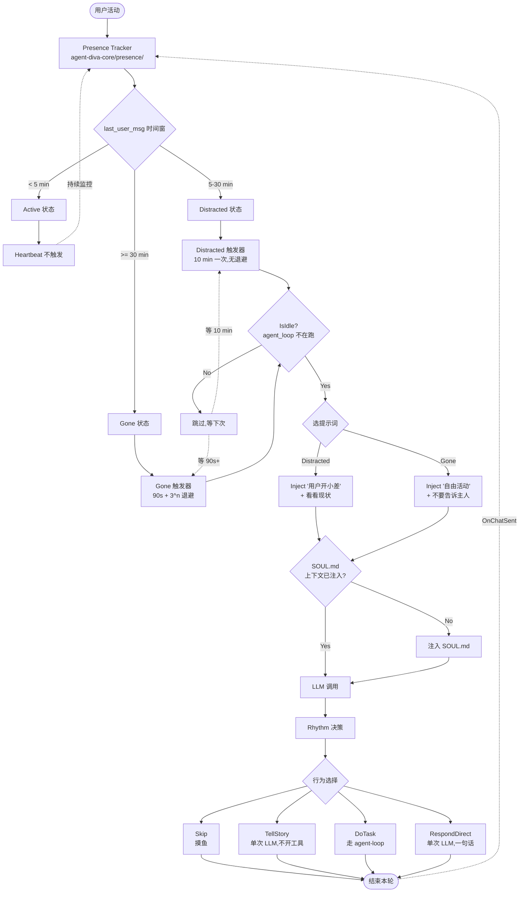

# 自主活动流程对比 —— diva 设计 vs alife 原始设计

> 对比时间: 2026-06-18
> 输入: 大湿提出的 4 层架构 + 3 态用户存在 + Harness Engineering 方向
> 参考: alife SystemEventService.cs (168 行) + ChatBot.cs (308 行) + SA3 报告 + SA4 user-presence-scan

---

## 1. 全局对比表

| 维度 | diva 设计 | alife 原始 | 差异 |
|------|-----------|-----------|------|
| **触发源** | 用户活动 + 计时器 + IsIdle | 纯计时器 + IsIdle | diva 加了用户侧 idle |
| **存在状态** | 3 态:Active / Distracted / Gone | 无(单一态) | diva 更细致 |
| **触发频率** | Distracted 10min / Gone 90s+退避 | 90s + 退避 | diva 两档 |
| **提示词** | 3 个(每态一个)+ SOUL.md 顶部 | 1 个 UpdatePrompt + Start/Destroy | diva 更结构化 |
| **行为选择** | Rhythm:Skip / TellStory / DoTask / RespondDirect | LLM 自由选择(任何 module) | diva 鼓励摸鱼 |
| **治理顶层** | SOUL.md(Laputa 提案治理) | 无对应 | diva 独有 |
| **生命周期** | 概念阶段(Heartbeat 2.0 待写) | AwakeAsync / StartAsync / DestroyAsync | alife 已实现 |
| **安全层** | Harmless(规划) + Harness Engineering(规划) | sandbox 部分 | diva 全栈做 |
| **提示词注入防御** | 规划中(instruction hierarchy 等) | 无 | diva 独有 |
| **自调度** | 未设计 | EWait / EWake 工具 | alife 独有 |
| **Poke 队列** | 未设计 | 有(ConcurrentQueue + 2s flush) | alife 已有 |
| **死锁风险** | 未触碰 | WPF 主线程有真死锁(作者注释承认) | diva 需规避 |

---

## 2. 触发流程对比(mermaid)

### 2.1 diva(用户设计 + Harness 视角)



### 2.2 alife 原始

```mermaid
flowchart TD
    Tick[PeriodicTimer 1s tick<br/>SystemEventService.OnUpdate] --> CheckDue{timeTask 0 到期?}

    CheckDue -->|No| Tick
    CheckDue -->|Yes| IsIdleCheck{functionService.IsIdle<br/>XmlFunctionCaller 忙?}

    IsIdleCheck -->|No| Skip1[跳过]
    Skip1 --> Backoff[continuousTimerCount++]
    Backoff --> Reschedule1[NextTimer<br/>间隔 ×3,封顶 4]

    IsIdleCheck -->|Yes| Poke[Poke '定时报点 + UpdatePrompt']
    Poke --> Queue[ConcurrentQueue<br/>messageCache]
    Queue --> Wait2[等 2s]
    Wait2 --> Flush[TryFlushMessageCache<br/>distinct + join]

    Flush --> Tag[加 '[来自系统]'<br/>前缀]
    Tag --> Chat[Chat 调用 LLM]
    Chat --> LLM[Streaming ChatBot<br/>InvokeStreamingAsync]

    LLM --> Resp{LLM 回应?}
    Resp -->|No response| Backoff
    Resp -->|Yes| Process[正常处理<br/>可调 XmlFunctionCaller]
    Process --> OnChatSent[触发 ChatSent 事件]
    OnChatSent --> ResetCount[continuousTimerCount = 0<br/>NextTimer 重置 90s]
    ResetCount --> Tick

    Reschedule1 --> Tick
```

---

## 3. 关键路径对比

### 3.1 "该不该触发"

| | diva | alife |
|--|------|-------|
| 入口 | `agent-diva-core/heartbeat/state_machine.classify()` | `SystemEventService.OnUpdate` (ITimeIterative) |
| 判定 | 时间窗分类 → 3 态 | 计时器 + IsIdle 二元 |
| 用户活动 | ✅ Presence Tracker | ❌ |
| IsIdle | ✅(agent loop 不在跑) | ✅(XmlFunctionCaller 忙?) |
| 输出 | Skip / Trigger(Distracted 或 Gone prompt) | Skip / Poke |

### 3.2 "怎么注入 prompt"

| | diva | alife |
|--|------|-------|
| 通道 | (设计)MessageBus inbound → LLM context | functionService.Poke → messageCache |
| 队列 | (无,直接走 MessageBus) | ConcurrentQueue 11 条上限 |
| flush 频率 | (无,同步) | 2s 自动批量 |
| 前缀 | (无,纯文本) | "[来自系统的杂项消息推送]" |
| 角色 | (待定) | User role(伪装成用户消息,不破 system cache) |
| 死锁风险 | 需重新设计 | ⚠️ WPF 主线程死锁已发现,Task.Yield 缓解 |

### 3.3 "行为怎么选"

| | diva | alife |
|--|------|-------|
| 决策点 | Rhythm 层(LLM 单次决策) | LLM 直接决策(在 agent loop 内) |
| 选项 | Skip / TellStory / DoTask / RespondDirect | 任何已注册 Module |
| 默认 | Skip(鼓励摸鱼) | 不定(自由) |
| 自调度 | 未设计 | EWait / EWake 工具 |

---

## 4. 关键差异的本质

### 4.1 diva 独有的(原创)

1. **3 态用户存在模型** —— alife 不区分用户是否在场,diva 把"用户在场"分成 3 档
2. **SOUL.md 顶层治理** —— alife 没有"顶层规则文件",只有 character.json 配置 module 列表
3. **Rhythm 层"摸鱼"选项** —— alife 默认假设 AI 会做事,diva 显式允许啥也不干
4. **Harness Engineering 全栈** —— alife 是功能性项目,diva 是治理 + 工程化
5. **Prompt Injection 防御** —— alife 没有这个概念

### 4.2 alife 独有的(diva 应该借鉴)

1. **生命周期三段式**(AwakeAsync / StartAsync / DestroyAsync)
2. **自调度工具**(EWait / EWake 让 AI 自己安排报点)
3. **Poke 队列 + 2s flush**(批量系统消息,避免抖动)
4. **退避算法**(90s × 3^n,封顶 4)
5. **ConcurrentChatSemaphore 设计**(虽然有死锁,但互斥思路对)
6. **InteractiveModule 基类**(任何 module 都有统一生命周期)

### 4.3 双方都有,但实现不同

| | diva | alife |
|--|------|-------|
| 退避 | 90s × 3^n(待实现) | 90s × 3^n(已实现) |
| IsIdle | agent loop busy 检查 | XmlFunctionCaller busy 检查 |
| Event hook | MessageBus(已有) | ChatSent 事件链(已有) |

---

## 5. diva 实现时的关键借鉴清单

### 直接借鉴(代码或设计模式)

- [ ] alife 退避算法 90s × 3^n,封顶 4 → `agent-diva-core/heartbeat/backoff.rs`
- [ ] alife Poke 队列 + 2s flush(避免抖动) → diva 用 tokio mpsc 实现
- [ ] alife EWait / EWake 工具 → diva `agent-diva-tools/src/wake_tools.rs`
- [ ] alife OnChatSent 重置机制 → diva MessageBus hook

### 借鉴思想,不抄代码

- [ ] alife 三段式生命周期 → diva `Harness` trait(awake/start/destroy)
- [ ] alife InteractiveModule 基类 → diva 已有 `Tool` trait,可考虑扩成 `InteractiveTool`
- [ ] alife Constructor DI → diva 用 trait + registry 实现(避免 Rust 没 DI 容器的限制)

### diva 必须自己造(alife 没有)

- [ ] 3 态用户存在检测(`presence/mod.rs`)
- [ ] SOUL.md + Laputa 提案接入
- [ ] Rhythm 层(行为选择)
- [ ] Prompt Injection 防御
- [ ] 全栈 Harness(decision / action / observe 标准化)

### 不要借鉴

- [ ] XmlFunctionCaller(diva 走 OpenAI 兼容,XML 流式是 SK 时代产物)
- [ ] Roslyn 热编译(Rust 没 JIT 等价物)
- [ ] 多开/赛博世界(单一人格哲学冲突)
- [ ] WPF 主线程 + ChatSemaphore 死锁模式

---

## 6. 时间线建议(等用户拍)

如果按这个对比实施,本 wave 工作顺序可以是:

```
W1: Presence Tracker + state machine        (alife 没有,必须新建)
W2: Heartbeat 触发器 + 退避(借鉴 alife)       (alife 退避算法直接借鉴)
W3: SOUL.md + Laputa 提案(diva 独有)
W4: Rhythm 层(diva 独有)
W5: Harmless 安全护栏(diva 独有)
W6: Prompt Injection 防御(diva 独有)
```

W1-W2 是基础设施,W3-W4 是治理与行为选择,W5-W6 是安全护栏。**1 个完整 wave = ~6 周**,对应 Harness Engineering 的 6 个 cat。
