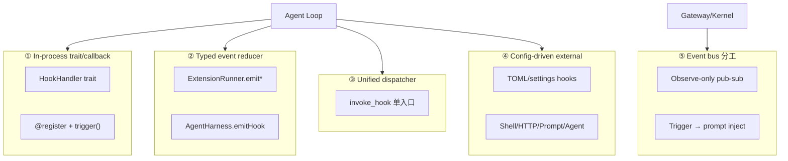
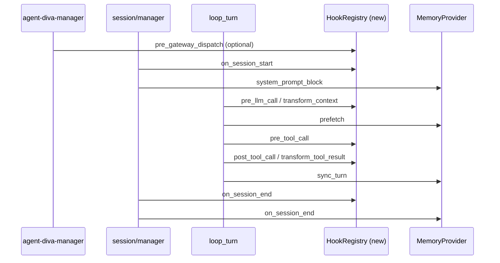

# .workspace Agent Hooks 实现横向对比调研

> **生成时间**: 2026-07-03  
> **调研范围**: `.workspace/` 下 10 个具备 agent lifecycle hooks 的参考项目 + agent-diva 现状  
> **方法**: 只读源码与文档；每条结论附 `filepath:line` 可验证证据  
> **关联研究**: [hermes-harness-overview.md](./hermes-harness-overview.md) §3.2、[harness-engineering-three-way-comparison.md](./harness-engineering-three-way-comparison.md) Plugin hooks 行

---

## 1. Executive Summary

`.workspace` 参考项目中，agent hooks 并非单一模式，而是可归为 **五种架构范式**（见 §3）。横向对比后有三条对 agent-diva 最关键的结论：

1. **agent-diva 尚无统一 agent lifecycle hooks 框架**。域内最完整的 hook 模式在 `agent-diva-files/src/hooks.rs`（文件 I/O 拦截）；agent 生命周期边界由 `MemoryProvider` trait 承担；`planning/hooks.rs` 仅 HOOK-1 已在 agent loop 接线，HOOK-2~5 多为 stub。
2. **Rust 系项目分化为两派**：zeroclaw 的 typed `HookResult<T>` + void/modifying 双通道；openfang/codex 的轻量 registry + 配置驱动 shell hook（codex 兼容 Claude Code TOML）。
3. **Claude Code 系（claude-code / codex / OpenHarness）** 以配置发现 + 外部 handler（command/http/prompt/agent）为主；**动态语言 in-process 系（pi / hermes / GenericAgent）** 以进程内回调为主，hermes 的 `invoke_hook()` 统一分发最值得 diva 借鉴。

本报告补全 [harness-engineering-three-way-comparison.md](./harness-engineering-three-way-comparison.md) 中 Alife/Hermes/Diva 三方对比未覆盖的 **.workspace 全量横向证据**，为后续 ADR 讨论统一 hooks 系统提供选型依据。

---

## 2. 方法论

- **纳入**：与 agent 会话/turn/LLM/工具/gateway 生命周期相关的 in-process 或 config-driven 拦截点。
- **排除**：git hooks、npm lifecycle、HTTP middleware（除非直接挂在 agent 生命周期上）。
- **证据格式**：`相对路径:行号` + 短摘录；路径相对于各项目根或 `.workspace/<project>/`。
- **跳过项目**（附理由，见 §2.1）。

### 2.1 明确跳过的项目

| 项目 | 跳过理由 | 证据 |
|------|----------|------|
| **MaiMBot** | 无 agent lifecycle hook 框架；仅有 git/NoneBot 事件 | 未在 `.workspace/MaiMBot` 发现 `pre_tool_call` / `HookRegistry` 类实现 |
| **memtle** | 仅有 stop-hook 检查点工具（`hook_state/`、`memtle_hook_settings`），非通用拦截框架 | `.workspace/memtle/src/tools/tool_definitions.json:301-313` |
| **analysis** | 分析文档目录，非独立 agent 运行时 | `.workspace/analysis/` 仅含 compact 模式研究文档，无 hooks 子系统 |

---

## 3. 五种架构范式



| 范式 | 代表项目 | 核心特征 |
|------|----------|----------|
| **① In-process trait/callback** | openfang, zeroclaw, GenericAgent, learn-claude-code | Rust/Python trait 或函数注册表；编译期或 import 时绑定 |
| **② Typed event reducer** | pi, oh-my-pi | 事件类型携带 phantom result type；`emit()` 内部分派 reducer 语义 |
| **③ Unified dispatcher + rich return** | hermes-agent | 单一 `invoke_hook()`；Python 插件 + shell hook 双通道汇入 |
| **④ Config-driven external handlers** | claude-code, codex, OpenHarness | settings/TOML 声明；handler 类型含 command/http/prompt/agent |
| **⑤ Event bus 分工** | openfang TriggerEngine；diva MessageBus（仅 observe） | pub-sub 观察 vs hook registry 拦截分离 |

---

## 4. 逐项目深读

### 4.1 pi（TypeScript）

**架构一句话**：双层 hooks——底层 `AgentHarness.emitHook()` 定义 agent-loop 拦截语义；上层 `ExtensionRunner.emit*()` 负责 extension 发现、错误隔离与 TUI 集成。

**主要事件**（文档 + harness 接线）：

| 事件 | 可 block | 可 transform | 语义 |
|------|----------|--------------|------|
| `context` | — | messages | 串行 chain |
| `tool_call` | `{ block, reason }` | input（后续 handler 可见） | 串行，首个 block 短路 |
| `tool_result` | — | content/details/isError | 串行 patch 累积 |
| `before_agent_start` | — | messages + systemPrompt | 注入 + chain |
| `session_before_*` | `{ cancel }` | — | 串行，cancel 短路 |

**注册**：Extension 模块 `pi.on(type, handler)`；loader 写入 extension handlers Map（`runner.ts`）。

**执行顺序**：同 extension 内按注册序；跨 extension 按 `extensions` 数组序；`tool_call` 遇 `block` 立即返回（`runner.ts:862-882`）。

**错误策略**：extension 错误 catch → `emitError()` → 默认 continue（文档 `hooks.md:355-364`）。

**证据摘录 1 — harness 工具拦截接线**（`packages/agent/src/harness/agent-harness.ts:412-419`）：

```typescript
beforeToolCall: async ({ toolCall, args }) => {
  const result = await this.emitHook({
    type: "tool_call",
    toolCallId: toolCall.id,
    toolName: toolCall.name,
    input: args as Record<string, unknown>,
  });
  return result ? { block: result.block, reason: result.reason } : undefined;
},
```

**证据摘录 2 — ExtensionRunner tool_call 短路**（`packages/coding-agent/src/core/extensions/runner.ts:875-876`）：

```typescript
if (result.block) {
  return result;
}
```

**证据摘录 3 — 设计文档 observe vs on 分离**（`packages/agent/docs/hooks.md:83-88`）：

```typescript
// observe() sees all events, read-only, return ignored.
// on(type, handler) participates in that event's semantics.
```

**独特之处**：事件 result type 内嵌于 HookEvent phantom type，无需全局 result map（`hooks.md:14-21`）。

---

### 4.2 oh-my-pi（TypeScript，pi fork）

**架构一句话**：默认运行时走 **ExtensionRunner** 主路径；Legacy Hook 子系统保留类型与 loader，`.omp/hooks/pre|post/` 发现的 TS hook 以 extension 模块加载。

**与 pi 差异**：
- CLI `--hook` 为 `--extension` 别名（`docs/hooks.md:9-12`）
- `ExtensionToolWrapper` 替代 `HookToolWrapper`（`docs/hooks.md:11-12`）
- 多 provider 发现：native `.omp/` + Codex `~/.codex/` 兼容（`discovery/builtin.ts`, `discovery/codex.ts`）

**Hook 发现路径**（`packages/coding-agent/src/discovery/builtin.ts:665-676`）：

```typescript
const hookTypes = ["pre", "post"] as const;
// ...
typeDir: path.join(dir, "hooks", hookType),
```

**工具拦截链**（`packages/coding-agent/src/extensibility/extensions/wrapper.ts:182-198`）：先 approval policy → 再 `emitToolCall` → `block` 则 throw。

**独特之处**：Capability registry 统一 discovery；Codex 格式 hooks 经 `hookCapability` 汇入同一 extension runner（`discovery/codex.ts:16-17`）。

---

### 4.3 hermes-agent（Python）

**架构一句话**：**统一 `invoke_hook()` 分发器** + Python 插件 entry point + shell hook 桥（零 call-site 改动汇入同一管道）。

**VALID_HOOKS（16+ 事件）**（`hermes_cli/plugins.py:127-167`）：

| 类别 | 事件 |
|------|------|
| Tool | `pre_tool_call`, `post_tool_call`, `transform_tool_result`, `transform_terminal_output` |
| LLM | `pre_llm_call`, `post_llm_call`, `transform_llm_output`, `pre_api_request`, `post_api_request` |
| Session | `on_session_start`, `on_session_end`, `on_session_finalize`, `on_session_reset`, `subagent_stop` |
| Gateway | `pre_gateway_dispatch`（skip/rewrite/allow） |
| Approval | `pre_approval_request`, `post_approval_response`（observe-only） |

**注册**：`PluginManager.register_hook()`；shell hooks 经 `shell_hooks.py` 注册到同一 manager（`shell_hooks.py:6-8`）。

**pre_tool_call block**（`model_tools.py:928-943`）：

```python
block_message = get_pre_tool_call_block_message(...)
if block_message is not None:
    return json.dumps({"error": block_message}, ensure_ascii=False)
```

**invoke_hook 语义**（`hermes_cli/plugins.py:1534-1568`）：逐 callback try/except；收集非 None 返回值；misbehaving plugin 不击穿 loop。

**Shell hook 协议**（`agent/shell_hooks.py:30-51`）：stdin JSON 含 `hook_event_name`；stdout JSON 可 `{decision:block}` 或 `{action:block}`。

**独特之处**：双通道（Python + shell）经同一 aggregator；`hermes hooks test` CLI 自省（见 [hermes-harness-overview.md](./hermes-harness-overview.md) §3.2）。

---

### 4.4 openfang（Rust）

**架构一句话**：4 点 `HookRegistry`（`BeforeToolCall` / `AfterToolCall` / `BeforePromptBuild` / `AgentLoopEnd`）+ 独立 EventBus/TriggerEngine（observe + trigger→prompt，本报告聚焦 HookRegistry）。

**事件清单**：

| HookEvent | block | transform | 备注 |
|-----------|-------|-----------|------|
| BeforeToolCall | Err(reason) | — | 首个 Err 短路 |
| AfterToolCall | — | — | observe-only |
| BeforePromptBuild | — | — | observe-only |
| AgentLoopEnd | — | — | observe-only |

**注册 API**（`crates/openfang-runtime/src/hooks.rs:50-53`）：`register(event, Arc<dyn HookHandler>)`。

**agent_loop 集成**（`crates/openfang-runtime/src/agent_loop.rs:898-920`）：

```rust
if let Err(reason) = hook_reg.fire(&ctx) {
    tool_result_blocks.push(ContentBlock::ToolResult {
        content: format!("Hook blocked tool '{}': {}", tool_call.name, reason),
        is_error: true,
    });
    continue;
}
```

**独特之处**：`HookHandler::on_event` 统一签名，非 blocking 事件 Err 仅 warn（`hooks.rs:66-72`）；与 TriggerEngine 分工明确。

---

### 4.5 zeroclaw（Rust）

**架构一句话**：`HookHandler` trait 含 void（并行）与 modifying（串行+Cancel）两族；`HookRunner` 统一调度。

**HookResult**（`crates/zeroclaw-api/src/hook.rs:9-14`）：

```rust
pub enum HookResult<T> {
    Continue(T),
    Cancel(String),
}
```

**Void hooks**（并行 `join_all`）：`on_session_start/end`, `on_llm_input/output`, `on_after_tool_call`, …（`hook.rs:31-40`）

**Modifying hooks**（priority 降序串行）：`before_tool_call`, `before_llm_call`, `before_prompt_build`, `on_message_received`, …（`hook.rs:42-78`）

**before_tool_call 集成**（`crates/zeroclaw-runtime/src/agent/turn/call_prep.rs:94-101`）：

```rust
match hooks.run_before_tool_call(tool_name.clone(), tool_args.clone()).await {
    HookResult::Cancel(reason) => { /* 写入 cancelled outcome */ continue; }
    HookResult::Continue((name, args)) => { tool_name = name; tool_args = args; }
}
```

**错误策略**：modifying hook panic → `catch_unwind` → log → continue 前值（`hooks/runner.rs:236-244`）。

**独特之处**：priority + pipeline 语义最完整；void/modifying 分离清晰。

---

### 4.6 codex（Rust）

**架构一句话**：Claude Code 兼容 TOML hooks 引擎；6 事件 × MatcherGroup × HandlerConfig。

**TOML 事件**（`codex-rs/config/src/hook_config.rs:16-28`）：`PreToolUse`, `PermissionRequest`, `PostToolUse`, `SessionStart`, `UserPromptSubmit`, `Stop`。

**Handler 类型**（`hook_config.rs:92-108`）：`command` | `prompt` | `agent`。

**PreToolUse 集成**（`codex-rs/core/src/hook_runtime.rs:137-164`）：

```rust
pub(crate) async fn run_pre_tool_use_hooks(...) -> Option<String> {
    // ...
    if should_block { block_reason.map(|reason| format!("Tool call blocked by PreToolUse hook: {reason}...")) }
    else { None }
}
```

**独特之处**：Rust 侧完整复刻 Claude hook 协议；matcher_aliases 兼容内部工具名（`hook_runtime.rs:134-136`）。

---

### 4.7 claude-code（TypeScript）

**架构一句话**：**27 事件** settings.json + plugin hooks + session function hooks；`utils/hooks.ts` 负责 shell 执行、trust、managed hooks。

**HOOK_EVENTS 完整列表**（`src/entrypoints/sdk/coreTypes.ts:25-53`）：  
`PreToolUse`, `PostToolUse`, `PostToolUseFailure`, `Notification`, `UserPromptSubmit`, `SessionStart`, `SessionEnd`, `Stop`, `StopFailure`, `SubagentStart`, `SubagentStop`, `PreCompact`, `PostCompact`, `PermissionRequest`, `PermissionDenied`, `Setup`, `TeammateIdle`, `TaskCreated`, `TaskCompleted`, `Elicitation`, `ElicitationResult`, `ConfigChange`, `WorktreeCreate`, `WorktreeRemove`, `InstructionsLoaded`, `CwdChanged`, `FileChanged`（共 27 个）。

**PreToolUse block 语义**（`src/utils/hooks/hooksConfigManager.ts:29-32`）：exit code 2 → stderr 给 model 并 block tool call。

**注册**：settings `hooks` 块 + plugin manifest + `getRegisteredHooks()` session 函数（`utils/hooks.ts:33`）。

**独特之处**：事件面最广；matcher 按 tool_name；async hook 支持 `statusMessage`。

---

### 4.8 OpenHarness（Python）

**架构一句话**：Claude Code 风格 `HookExecutor`；handler 类型 command / http / prompt / agent。

**事件**（`src/openharness/hooks/events.py:8-20`）：10 个 enum 值，对齐 Claude 子集。

**HookExecutor**（`src/openharness/hooks/executor.py:64-78`）：按 event 取 registry → matcher 过滤 → 分类型执行。

**pre_tool_use block**（`src/openharness/engine/query.py:893-902`）：

```python
if pre_hooks.blocked:
    return ToolResultBlock(content=pre_hooks.reason or f"pre_tool_use hook blocked {tool_name}", is_error=True)
```

**独特之处**：`AggregatedHookResult.blocked` 聚合多 hook 结果（`hooks/types.py:28-30`）。

---

### 4.9 GenericAgent（Python）

**架构一句话**：最简 `@register` + `trigger(event, ctx)` 模块级注册表。

**注册**（`plugins/hooks.py:10-14`）：

```python
def register(event):
    def decorator(fn):
        _registry.setdefault(event, []).append(fn)
        return fn
```

**agent_loop 挂载**（`agent_loop.py:22-24, 57-58`）：`tool_before`, `tool_after`, `turn_before/after`, `llm_before/after`, `agent_before/after`。

**独特之处**：`trigger` 传 `locals()` 无类型 ctx；dict 返回值 merge 进 ctx（`hooks.py:17-25`）。

---

### 4.10 learn-claude-code（Python，教学）

**架构一句话**：4 事件 in-process callbacks，演示从 hard-coded permission 迁移到 hooks。

**事件**（`s04_hooks/code.py:159`）：`UserPromptSubmit`, `PreToolUse`, `PostToolUse`, `Stop`。

**trigger_hooks 短路**（`code.py:164-169`）：

```python
for callback in HOOKS[event]:
    result = callback(*args)
    if result is not None:
        return result  # block tool call
```

**agent_loop 对比**（`code.py:258-259`）：`blocked = trigger_hooks("PreToolUse", block)` 替代 s03 内联 `check_permission()`。

**独特之处**：最小可运行 teaching artifact；语义与 Claude `PreToolUse` 对齐。

---

## 5. 横向对比矩阵（11 维度）

| 维度 | pi | oh-my-pi | hermes | openfang | zeroclaw | codex | claude-code | OpenHarness | GenericAgent | learn-claude-code | **agent-diva** |
|------|-----|----------|--------|----------|----------|-------|-------------|-------------|--------------|-------------------|----------------|
| **事件数量** | ~20+ | ~20+ | 16+ | 4 | ~15 | 6 | 27 | 10 | ~8 | 4 | 0 统一 / MemoryProvider 4 点 |
| **Handler 类型** | in-process TS | in-process TS | Python + shell | in-process Rust | in-process Rust | cmd/prompt/agent | cmd + plugin + fn | cmd/http/prompt/agent | in-process Py | in-process Py | 无 / 域内 trait |
| **可 block** | tool_call, session_before_* | 同 pi | pre_tool_call, pre_gateway… | BeforeToolCall | modifying 族 | PreToolUse, Permission… | PreToolUse 等 | pre_tool_use | tool_before（约定） | PreToolUse | files HookAction::Stop |
| **可 transform** | context, tool_result, LLM payload | 同 pi | transform_* 族 | 无（4 点均 observe 除 block） | modifying 族 pipeline | 有限 | PostToolUse 等 | 有限 | ctx dict merge | 无 | files Modify |
| **注册方式** | pi.on / extension load | capability registry | register_hook + shell | register(trait) | register(Box) | TOML | settings + plugin | YAML/TOML registry | @register | register_hook() | HookRegistry.register_* |
| **发现/加载** | ~/.pi, .pi/extensions | .omp + ~/.codex | ~/.hermes/plugins | 代码注册 | 代码注册 | config.toml | settings + marketplace | config file | plugins/*.py import | 单文件 | 无 |
| **执行顺序** | 注册序；block 短路 | 同 pi | 注册序；aggregator | 注册序 | priority 降序 | matcher 序 | matcher 序 | registry 序 | 注册序 | 注册序 | 注册序 |
| **错误策略** | continue + emitError | 同 pi | try/except 吞并 continue | non-block Err→warn | panic→catch 继续 | fail-open 为主 | exit code 语义 | block_on_failure 可配 | stderr 继续 | 无处理 | warn 继续（after_*） |
| **observe vs mutate** | observe() 只读 | 同 pi | approval 族 observe | After* observe | void vs modifying | 分事件 | 分事件 | AggregatedResult | 无显式分离 | 无 | MessageBus observe |
| **CLI introspection** | 无 | 无 | `hermes hooks test` | 无 | 无 | 无 | `/hooks` 相关 | 无 | 无 | 无 | **缺失** `diva hooks list` |
| **与插件关系** | extension=插件 | 同 pi | PluginManager 一体 | 独立 registry | 独立 runner | 配置插件 | plugin hooks | config plugins | plugins/ 目录 | 无 | **缺失** plugin/hook.rs |

### 分组观察

- **Rust 项目**：zeroclaw 类型系统最严；openfang 最简；codex 重互操作；diva 仅有 files 域 HookRegistry。
- **Claude Code 系**：事件名与 TOML 结构高度同源；OpenHarness 扩展 http/agent handler。
- **动态语言 in-process**：pi 的 typed reducer > GenericAgent 的无类型 ctx；hermes 统一 dispatcher 运维性最佳。

---

## 6. agent-diva 现状快照（证据化）

### 6.1 已有能力

**agent-diva-files HookRegistry**（`agent-diva-files/src/hooks.rs:169-182, 623-635`）：

```rust
pub enum HookAction {
    Continue,
    Modify(Vec<u8>),
    Stop,
    Error(String),
}
// HookRegistry: storage_hooks, read_hooks, metadata_hooks, cleanup_hooks
```

串行执行 + Stop/Error 短路 + Modify pipeline（`hooks.rs:715-744`）——**可作为 Rust 内核 API 参考**，但绑定文件 I/O 域，未接入 agent loop。

**MemoryProvider 生命周期边界**（`agent-diva-core/src/memory/provider.rs:384-414`）：

| 方法 | 挂载语义 |
|------|----------|
| `system_prompt_block` | session 启动 / prompt 组装 |
| `prefetch` | turn 前 recall |
| `sync_turn` | turn 后持久化 |
| `on_session_end` | session 结束 |

文档明确要求 memory **不**塞进通用 hook 总线（`provider.rs:411-412`）——应保留为域边界。

**planning hooks 接线状态**（`agent-diva-agent/src/planning/hooks.rs`）：

| Hook | 状态 | 证据 |
|------|------|------|
| HOOK-1 `inject_plan_context` | ✅ 已接线 | `loop_turn.rs:182-184` 调用 |
| HOOK-2 `is_planning_tool_call` | ⚠️ 函数存在，loop 未全面接线 | `hooks.rs:23-25` |
| HOOK-3~5 | ⚠️ stub / no-op | `hooks.rs:31-44` TODO 注释 |

### 6.2 明确缺失（research 已 propose、代码不存在）

| 缺失项 | 来源 | 验证 |
|--------|------|------|
| `agent-diva-core/src/plugin/hook.rs` | [harness-engineering-three-way-detailed-checklist.md](./harness-engineering-three-way-detailed-checklist.md) X-19 | `glob **/plugin/hook.rs` → 0 files |
| `agent-diva-core/src/bus/multicast.rs` | [harness-engineering-three-way-comparison.md](./harness-engineering-three-way-comparison.md):216 | 未实现 |
| `diva hooks list` CLI | [hermes-harness-overview.md](./hermes-harness-overview.md):297 | 未实现 |

### 6.3 与已有研究的关系

- [hermes-harness-overview.md](./hermes-harness-overview.md) §3.2 列出 Hermes 16+ hooks 与 `invoke_hook`——本报告将其扩展为 10 项目全量对比。
- [harness-engineering-three-way-comparison.md](./harness-engineering-three-way-comparison.md) Plugin hooks 行指出 Diva 缺口在 Laputa + EventBus——本报告用 `.workspace` 证据支撑 **zeroclaw/hermes/pi** 作为 Rust MVP 参考，而非一次照搬 claude-code 27 事件。

---

## 7. 对 agent-diva 的设计建议（非实现）

### 7.1 建议挂载流（Mermaid）



**建议挂载点**：

| 事件 | 建议文件 |
|------|----------|
| turn / llm / tool | `agent-diva-agent/src/agent_loop/loop_turn.rs` |
| session 边界 | `agent-diva-core/src/session/manager.rs` |
| gateway dispatch | `agent-diva-manager` gateway 入口 |
| registry 定义 | 新模块 `agent-diva-core/src/hooks/`（或独立 crate，ADR 待定） |

### 7.2 三档借鉴清单

#### 可直接借鉴

1. **事件语义分族**（pi + zeroclaw）：observe-only vs modifying；modifying 再分 chain / first-wins / early-exit-on-block。
2. **工具拦截三点**（pi `tool_call` + hermes pre/post/transform）：`pre_tool_call` block；`post_tool_call` observe；`transform_tool_result` 独立。
3. **统一 dispatcher**（hermes `invoke_hook`）：单入口 + CLI `diva hooks list` / `diva hooks test`。
4. **域边界保留 MemoryProvider**（diva 已有最佳实践）。
5. **复用 files HookRegistry 模式**：trait + registry + typed `HookAction`/`HookResult<T>`。

#### 需 Rust 化改造

- 不用 Python dict 返回值；用 `HookResult<T>` enum（zeroclaw `hook.rs:9-14`）。
- async + `Send + Sync`（openfang `Arc<dyn HookHandler>`）。
- MessageBus / PokeEvent = observe；HookRegistry = intercept——职责不混。

#### 不建议照搬

- claude-code 27 事件一次到位（面过大）。
- openfang 仅 4 点且无 transform 的简化模型（功能不足）。
- GenericAgent `trigger(event, locals())` 无类型 ctx。
- shell hook 作为 P0（hermes 模式作 P2：allowlist + TTY 同意，`shell_hooks.py:19-23`）。

### 7.3 建议 MVP 事件集（8–10 个，供 ADR）

| 族 | 事件 |
|----|------|
| Session | `on_session_start`, `on_session_end` |
| Turn / LLM | `pre_llm_call`, `post_llm_call`, `transform_context` |
| Tool | `pre_tool_call`, `post_tool_call`, `transform_tool_result` |
| Gateway（可选） | `pre_gateway_dispatch` |

与 Hermes VALID_HOOKS 子集对齐，便于术语映射（见附录）。

---

## 8. 附录

### 8.1 文件索引（按项目）

| 项目 | 关键文件 |
|------|----------|
| pi | `packages/agent/docs/hooks.md`, `packages/agent/src/harness/agent-harness.ts`, `packages/coding-agent/src/core/extensions/runner.ts`, `packages/coding-agent/docs/extensions.md` |
| oh-my-pi | `docs/hooks.md`, `packages/coding-agent/src/extensibility/extensions/wrapper.ts`, `packages/coding-agent/src/discovery/builtin.ts`, `packages/coding-agent/src/discovery/codex.ts` |
| hermes-agent | `hermes_cli/plugins.py`, `agent/shell_hooks.py`, `model_tools.py` |
| openfang | `crates/openfang-runtime/src/hooks.rs`, `crates/openfang-runtime/src/agent_loop.rs` |
| zeroclaw | `crates/zeroclaw-api/src/hook.rs`, `crates/zeroclaw-runtime/src/hooks/runner.rs`, `crates/zeroclaw-runtime/src/agent/turn/call_prep.rs` |
| codex | `codex-rs/config/src/hook_config.rs`, `codex-rs/core/src/hook_runtime.rs` |
| claude-code | `src/entrypoints/sdk/coreTypes.ts`, `src/utils/hooks.ts`, `src/utils/hooks/hooksConfigManager.ts` |
| OpenHarness | `src/openharness/hooks/events.py`, `src/openharness/hooks/executor.py`, `src/openharness/engine/query.py` |
| GenericAgent | `plugins/hooks.py`, `agent_loop.py` |
| learn-claude-code | `s04_hooks/code.py` |
| agent-diva | `agent-diva-files/src/hooks.rs`, `agent-diva-core/src/memory/provider.rs`, `agent-diva-agent/src/planning/hooks.rs`, `agent-diva-agent/src/agent_loop/loop_turn.rs` |

### 8.2 术语对照表

| 语义 | pi | hermes | Claude Code / codex / OpenHarness | zeroclaw | agent-diva（建议 MVP） |
|------|-----|--------|-----------------------------------|----------|------------------------|
| 工具执行前拦截 | `tool_call` | `pre_tool_call` | `PreToolUse` / `pre_tool_use` | `before_tool_call` | `pre_tool_call` |
| 工具执行后 | `tool_result` | `post_tool_call` | `PostToolUse` / `post_tool_use` | `on_after_tool_call` | `post_tool_call` |
| 工具结果变换 | `tool_result` patch | `transform_tool_result` | — | —（modifying 可扩展） | `transform_tool_result` |
| 上下文变换 | `context` | `pre_llm_call` context inject | `UserPromptSubmit` | `before_llm_call` | `transform_context` |
| Session 开始 | `session_start` | `on_session_start` | `SessionStart` / `session_start` | `on_session_start` | `on_session_start` |
| Gateway 预分发 | — | `pre_gateway_dispatch` | — | `on_message_received` | `pre_gateway_dispatch` |

---

## 9. 验收对照

- [x] 覆盖 10 个深读项目 + 3 个跳过说明
- [x] 5 种范式 + 2 个 mermaid 图
- [x] 11 维对比矩阵
- [x] agent-diva 现状与 gap（代码证据）
- [x] MVP 事件集 + 挂载点 + 借鉴/避免清单
- [x] 链接 hermes-harness-overview 与 harness-engineering-three-way-comparison
- [x] 零 Rust/TS 代码变更（仅本文档）
