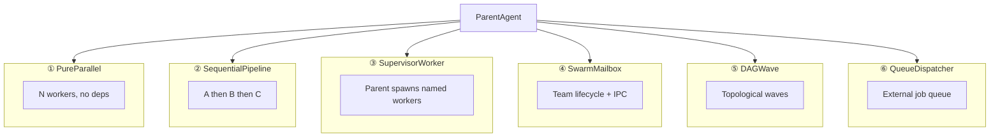
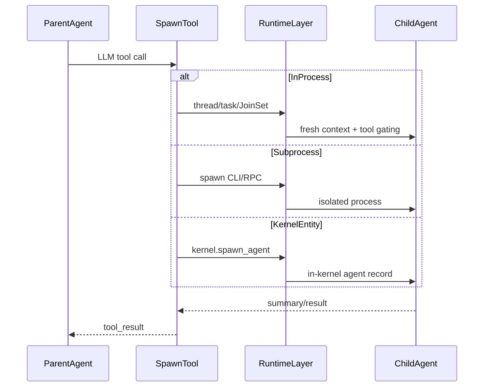
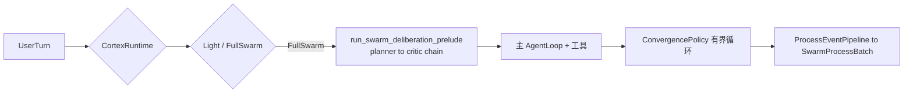

# .workspace Sub-Agent 实现横向对比调研

> **生成时间**: 2026-07-03（§7.1 `feature-swarm-humanlike` 增补同 day）  
> **调研范围**: `.workspace/` 下 13 个子项目 + agent-diva 主仓 baseline + `feature-swarm-humanlike` 分支预览  
> **方法**: 只读源码与文档；每条结论附 `filepath:line` 可验证证据  
> **关联研究**: [workspace-hooks-comparison.md](./workspace-hooks-comparison.md) SubagentStart/Stop hooks、[hermes-harness-overview.md](./hermes-harness-overview.md) §delegate、[harness-engineering-three-way-detailed-checklist.md](./harness-engineering-three-way-detailed-checklist.md) diva `subagent.rs`

---

## 1. Executive Summary

`.workspace` 参考项目中，sub-agent 实现分化程度**高于 hooks 调研时的五范式**。横向对比后有三条对 agent-diva 最关键的结论：

1. **无统一 sub-agent 范式**：从 zeroclaw 的 in-process `delegate`/`spawn_subagent`，到 OpenHarness/claude-code 的 **Swarm + Mailbox**，到 oh-my-pi/openfang 的 **显式 DAG/Wave 引擎**，编排模型差异远大于 spawn 触发面（tool vs SOP vs YAML）的差异。
2. **纯并行 vs DAG/Swarm 是两条正交轴**：多数项目同时支持多种模式——工具参数选 parallel（zeroclaw/pi/hermes）、独立 YAML/engine 做 DAG（oh-my-pi swarm-extension、openfang workflow）、env flag 开 swarm（OpenHarness coordinator、claude-code teammates）。仅 GenericAgent 几乎完全依赖 SOP 文本约定，无运行时编排引擎。
3. **agent-diva 当前定位（pro）**：[`SubagentManager`](../agent-diva-agent/src/subagent.rs) + [`DelegateTool`](../agent-diva-tools/src/delegate.rs) 属于 **③ Supervisor-Worker + ① bounded parallel**（`JoinSet`，`MAX_CONCURRENT_SUBAGENTS=4`），尚无 swarm mailbox 或 declarative DAG engine——与 openfang workflow、oh-my-pi swarm-extension、claude-code Task DAG 形成明确 gap。
4. **`feature-swarm-humanlike` 预览**：远程分支 `origin/feature-swarm-humanlike`（`e67e629`）曾实现独立 `agent-diva-swarm` crate——Cortex 路由、序曲链、ProcessEvent 总线与有界收敛，范式为 **③② + 部分④⑤**；但**缺少** pro 的 `JoinSet` batch 与 `DelegateTool`，且已在 `DECISION.md` §2.9 defer。不宜视为 pro 的直接演进，而是**设计参考分支**（见 §7.1）。

---

## 2. 方法论

### 2.1 纳入标准

- 具备 **sub-agent / multi-agent / delegation / swarm / teammate** 能力的运行时或一等工具。
- 编排逻辑可在源码中定位（tool handler、workflow engine、SOP、extension）。

### 2.2 排除标准

- 单 agent 内的 async 并发（MaiMBot 消息队列）——非 multi-agent。
- 外部记忆/MCP 服务（memtle）——供 agent 调用，非 agent harness。
- 纯研究笔记（analysis）——无运行时。

### 2.3 证据格式

- 路径相对于 `.workspace/<project>/` 或 `agent-diva/`。
- 格式：`相对路径:行号` + 短摘录。

### 2.4 明确跳过的路径

| 路径 | 跳过理由 |
|------|----------|
| `.workspace/agent-diva-nano/` | 目录在本工作区**不存在**（AGENTS.md 声称路径与实际不符）；memtle `example/` 有 nano-style 单 agent demo，无 subagent |
| `.workspace/old-branch-dont-readme/` | 工作区规则禁止遍历 |

---

## 3. 六种编排架构范式

Sub-agent 编排可归为 **六种范式**（项目可同时具备多种，见 §4 矩阵「范式标签」列）：



| 范式 | 代表项目 | 关键特征 |
|------|----------|----------|
| **① 纯并行 fan-out** | zeroclaw, pi extension, hermes batch, oh-my-pi task.batch | 无依赖，bounded concurrency，结果汇总 |
| **② 顺序 pipeline** | pi chain, GenericAgent plan_sop | `{previous}` 或文件 IPC 传递上一步输出 |
| **③ Supervisor-Worker** | codex collab, hermes delegate, OpenHarness coordinator | 父 agent 工具驱动 spawn，depth 限制 |
| **④ Swarm + Mailbox** | claude-code, OpenHarness | team JSON、permission sync、SendMessage |
| **⑤ DAG / Wave** | oh-my-pi swarm-extension, openfang workflow, claude-code tasks, learn-claude-code s12 | `waits_for` / FanOut-Collect / `blockedBy` |
| **⑥ 队列调度器** | hermes Kanban, oh-my-pi robomp, GenericAgent Goal Hive | 持久队列，worker 与 parent 解耦 |

### 3.1 Spawn 数据流总览



---

## 4. 11 维对比矩阵

| 项目 | Spawn 触发 | 隔离模型 | 通信机制 | 并行原语 | 深度限制 | 工具裁剪 | 持久化 | 配置驱动 | Hooks | MCP/A2A | 范式 |
|------|-----------|----------|----------|----------|----------|----------|--------|----------|-------|---------|------|
| **openfang** | LLM `agent_spawn`/`agent_send` | In-kernel entity | KernelHandle send | `join_all` (workflow) | depth=5 | Capability manifest | SQLite session | TOML manifest + workflow JSON | 有 (runtime hooks) | MCP + A2A | ③⑤ |
| **zeroclaw** | LLM `delegate`/`spawn_subagent` | In-process loop | tool return / JSON file | tokio spawn + parallel param | delegate depth + subagent depth=1 | risk profile + blocked tools | bg: `delegate_results/` | TOML `[agents.*]` | 有 | MCP | ①③ |
| **codex** | LLM `spawn_agent` (Collab v1/v2) | Thread-per-child | AgentControl + app-server | 多 spawn + wait | `agent_max_depth` | agent_type + feature flags | session storage | config.toml features | 有 | — | ③ |
| **OpenHarness** | LLM `agent` tool | subprocess / in-process / tmux | mailbox + task tools | asyncio Task pool | coordinator 模式 | YAML agent defs | team JSON disk | env + YAML | SubagentStop | MCP | ③④ |
| **claude-code** | LLM `Agent` tool | in-process / tmux / WT / remote | mailbox + task output | background tasks | fork child guard | agent definition tools | session storage | `.claude/agents/` | SubagentStart/Stop | MCP | ③④⑤ |
| **hermes-agent** | LLM `delegate_task` | in-process thread | summary-only return | ThreadPoolExecutor | max_spawn_depth=2 | DELEGATE_BLOCKED_TOOLS | Kanban SQLite | config.yaml delegation | subagent_stop | MCP | ①③⑥ |
| **oh-my-pi** | LLM `task` tool | in-process (+ git worktree) | AgentRegistry + IRC | Semaphore batch | maxRecursionDepth=2 | bundled agents + spawns | async jobs | settings + YAML swarm | 有 | MCP | ①②③④⑤⑥ |
| **pi** | extension `subagent` | OS subprocess | stdout JSON events | concurrency limit 4 | chain implicit | agent markdown defs | ephemeral | `~/.pi/agent/agents` | extension hooks | — | ①② |
| **GenericAgent** | SOP → shell spawn | OS subprocess | file IPC `temp/` | N processes (Map) | SOP 约定 | SOP 约定 | file temp/ | memory/*.md SOP | plugins/hooks | — | ①②⑥ |
| **learn-claude-code** | LLM `task`/team tools | in-process | MessageBus / file | thread per teammate | safety limit 30 | no recursive task in sub | `.tasks/` `.mailboxes/` | chapter code | PreToolUse/PostToolUse | s20 MCP | ①②③④⑤ |
| **MaiMBot** | — | — | — | — | — | — | — | — | — | — | — |
| **memtle** | — | — | — | — | — | — | — | — | Stop hook only | MCP server | — |
| **analysis** | — | — | — | — | — | — | — | — | — | — | — |

---

## 5. 逐项目深读

### 5.1 openfang — 内核级 spawn + Workflow DAG

**范式**: ③ Supervisor-Worker + ⑤ DAG-like pipeline（FanOut/Collect）

**Spawn 机制**:
- `agent_spawn` / `agent_send` 工具，由 kernel 创建/消息子 agent。
- Workflow engine 将步骤路由到命名 agent，支持 FanOut 并行与 Collect 汇总。

**证据**:

```
openfang/crates/openfang-runtime/src/tool_runner.rs:19
const MAX_AGENT_CALL_DEPTH: u32 = 5;

openfang/crates/openfang-runtime/src/tool_runner.rs:300
"agent_spawn" => tool_agent_spawn(input, kernel, caller_agent_id).await,

openfang/crates/openfang-kernel/src/workflow.rs:117-131
pub enum StepMode {
    Sequential,
    FanOut,    // parallel with subsequent FanOut until Collect
    Collect,
    Conditional { condition: String },
    Loop { max_iterations: u32, until: String },
}
```

**技术栈**: Rust + Tokio；`KernelHandle` trait 打破循环依赖；SQLite session；MCP/A2A；**无 OS 子进程 per agent**——agent 为内核内实体。

**与 hooks 关系**: 见 [workspace-hooks-comparison.md](./workspace-hooks-comparison.md) §4 openfang — typed hook registry。

---

### 5.2 zeroclaw — delegate 三模式 + depth-1 spawn_subagent

**范式**: ① 纯并行（`parallel` 参数）+ ③ Supervisor-Worker

**Spawn 机制**:
- **`delegate`**: sync（阻塞）/ background（tokio  detached）/ parallel（多 agent 并发）。
- **`spawn_subagent`**: 同步 in-process 子 run，`is_subagent: true`，depth-1（子不能再 spawn）。

**证据**:

```
zeroclaw/crates/zeroclaw-runtime/src/tools/delegate.rs:64-77
/// Supports three execution modes:
/// - **Synchronous** (default): blocks until the sub-agent completes.
/// - **Background** (`background: true`): spawns the sub-agent in a tokio task...
/// - **Parallel** (`parallel: [...]`): runs multiple agents concurrently

zeroclaw/crates/zeroclaw-runtime/src/tools/spawn_subagent.rs:103-119
// subagent cannot spawn subagent (depth-1 rule)

zeroclaw/AGENTS.md:47-52
Subagents (via `spawn_subagent` or cron `JobType::Agent`) inherit the parent's identity...
```

**技术栈**: Rust + Tokio + `CancellationToken`；TOML `[agents.*]` 配置 delegates；background 结果写入 `workspace/delegate_results/{task_id}.json`。

**纯并行 vs DAG**: **仅有 parallel 参数**，无 declarative DAG engine；编排由 LLM + config 边界驱动。

---

### 5.3 codex — Collab hub-and-spoke

**范式**: ③ Supervisor-Worker（thread-per-subagent）

**Spawn 机制**:
- Feature-gated `spawn_agent`（Collab / MultiAgentV2）。
- `AgentControl.spawn_agent_with_metadata` 创建独立 thread。
- v2 工具集: `spawn_agent`, `send_message`, `wait`, `close_agent`, `list_agents`, `followup_task`。

**证据**:

```
codex/codex-rs/core/src/tools/handlers/multi_agents_v2/spawn.rs:48-101
let max_depth = turn.config.agent_max_depth;
...
.spawn_agent_with_metadata(config, ...)

codex/codex-rs/core/src/tools/spec.rs
(v1/v2 collab tool registration — spawn_agent, wait, resume_agent, etc.)
```

**技术栈**: Rust + Tokio；App-server 协议（CollabAgentSpawnBegin/End）；sandbox 继承；TUI 路由子 thread。

**纯并行 vs DAG**: **hub-and-spoke**，非 swarm mailbox；无内置 workflow DAG（Task 依赖在 claude-code 侧更完整）。

---

### 5.4 OpenHarness — Swarm + Coordinator

**范式**: ③ Supervisor-Worker + ④ Swarm + Mailbox

**Spawn 机制**:
- `agent` 工具 → `TeammateSpawnConfig` → backend registry（subprocess / in-process / tmux / iTerm2）。
- Coordinator mode (`CLAUDE_CODE_COORDINATOR_MODE=1`): coordinator 仅 `agent`/`send_message`/`task_stop`，workers 全工具集。

**证据**:

```
OpenHarness/src/openharness/tools/agent_tool.py:61-82
registry = get_backend_registry()
executor = registry.get_executor("subprocess")
config = TeammateSpawnConfig(name=agent_name, team=team, prompt=arguments.prompt, ...)
result = await executor.spawn(config)

OpenHarness/src/openharness/swarm/in_process.py:1-21
# asyncio.Task per teammate, contextvars isolation

OpenHarness/src/openharness/hooks/events.py
HookEvent.SUBAGENT_STOP
```

**技术栈**: Python asyncio + subprocess；team JSON 于 `~/.openharness/teams/`；permission sync；YAML agent definitions。

**纯并行 vs Swarm**: **Swarm 为一等公民**；coordinator 显式 supervisor-worker；in-process teammates 可并行。

---

### 5.5 claude-code — Agent 工具 + Swarm + Fork + Task DAG

**范式**: ③④⑤ 全栈（decompiled Bun/TS 运行时，非 docs-only）

**Spawn 机制**:
- **`Agent` tool** → `runAgent()` / `spawnTeammate()`。
- **Fork subagent** (`FORK_SUBAGENT`): 共享 prompt cache 前缀，`buildForkedMessages()`。
- **Swarm backends**: tmux, iTerm, Windows Terminal, in-process（`runWithTeammateContext`）。
- **Background async**: `run_in_background: true` → LocalAgentTask。
- **Task DAG**: TaskCreateTool + dependencies。

**证据**:

```
claude-code/packages/builtin-tools/src/tools/AgentTool/forkSubagent.ts:32-39
export function isForkSubagentEnabled(): boolean {
  if (feature('FORK_SUBAGENT')) { ... }

claude-code/packages/builtin-tools/src/tools/AgentTool/AgentTool.tsx:377-392
const result = await spawnTeammate(..., agent_type: subagent_type, ...)

claude-code/src/utils/swarm/inProcessRunner.ts:1-10
# AsyncLocalStorage-based context isolation via runWithTeammateContext()

claude-code/src/utils/hooks/hooksConfigManager.ts:117-128
SubagentStart, SubagentStop events
```

**技术栈**: Bun + TypeScript + Ink TUI；agent definitions 自 `.claude/agents/` + built-ins；coordinator mode 与 fork 互斥。

**纯并行 vs Swarm/DAG**: **三者兼备**——parallel background agents、swarm teammates、task dependency graph。

---

### 5.6 hermes-agent — delegate_task + Kanban 队列

**范式**: ① parallel batch + ③ orchestrator role + ⑥ Kanban dispatcher

**Spawn 机制**:
- **`delegate_task`**: 单任务或 `tasks[]` batch；`ThreadPoolExecutor`（默认 max 3）；父阻塞至子完成。
- **`role="orchestrator"`**: 保留 delegation toolset，受 `delegation.max_spawn_depth`（默认 2）约束。
- **Kanban**: dispatcher spawn OS subprocess `hermes -p <profile> chat -q ...`。

**证据**:

```
hermes-agent/tools/delegate_tool.py:1-17
"""Delegate Tool -- Subagent Architecture
Spawns child AIAgent instances with isolated context...
Supports single-task and batch (parallel) modes."""

hermes-agent/tools/delegate_tool.py:44-52
DELEGATE_BLOCKED_TOOLS = frozenset(["delegate_task", "clarify", "memory", ...])

hermes-agent/tools/delegate_tool.py:2091-2111
with ThreadPoolExecutor(max_workers=max_children) as executor:
    futures = { executor.submit(_run_single_child, ...) ... }

hermes-agent/hermes_cli/kanban_db.py:6406-6456
def _default_spawn(task, workspace, *, board=None) -> Optional[int]:
    """Fire-and-forget ``hermes -p <profile> chat -q ...`` subprocess."""
```

**技术栈**: Python + ThreadPoolExecutor + subprocess；SQLite Kanban；skills（kanban-worker）；hooks `subagent_stop`。

**与 hooks/skills**: Kanban workers 自动加载 `kanban-worker` skill；leaf 子 agent 禁止 `delegate_task`。

---

### 5.7 oh-my-pi — task 工具 + swarm-extension DAG + robomp

**范式**: ①②③④⑤⑥ 最完整的多模式栈

**Spawn 机制（三层）**:

| 层 | 机制 | 隔离 |
|----|------|------|
| **`task` 工具** | in-process `createAgentSession` | 主线程，可选 git worktree |
| **swarm-extension** | YAML `waits_for`/`reports_to` → topological waves | in-process via `runSubprocess` |
| **robomp** | GitHub webhook → SQLite queue → `omp --mode rpc` | 真 OS 子进程 |

**证据**:

```
oh-my-pi/packages/coding-agent/src/task/executor.ts:1-5
/** In-process execution for subagents.
 * Runs each subagent on the main thread and forwards AgentEvents... */

oh-my-pi/packages/swarm-extension/src/swarm/dag.ts:17-49
export function buildDependencyGraph(def: SwarmDefinition): Map<string, Set<string>> {
  // waits_for, reports_to, declaration-order chain

oh-my-pi/packages/swarm-extension/src/swarm/pipeline.ts:154-194
// Execute all agents in wave in parallel
const waveResults = await Promise.all(wave.map(async agentName => { ... }))

oh-my-pi/python/robomp/src/worker.py:533-552
with RpcClient(executable=settings.omp_command, cwd=..., ...) as client:
```

**技术栈**: Bun/TS in-process；`AgentRegistry` + `IrcBus` agent 间消息；`AsyncJobManager` 后台 jobs；robomp FastAPI + SQLite + HMAC gh-proxy。

**与 pi 对比**: oh-my-pi 的 `task` 是一等公民；pi 的 subagent 仅为 example extension（见 §5.8）。

---

### 5.8 pi — example extension + orchestrator RPC 池

**范式**: ① parallel + ② chain（extension）；orchestrator 为 **RPC 实例管理**，非 agent 编排

**Subagent extension**:
- `subagent` 工具 spawn 独立 `pi` 子进程（`--mode json -p --no-session`）。
- 三模式: Single / Parallel（max 8, concurrency 4）/ Chain（`{previous}` 占位符）。

**Orchestrator 包**:
- 管理多个 `pi --mode rpc` 长驻实例；Unix socket IPC；可选 Radius 云端 presence。
- **与 subagent extension 无代码依赖**——不同层级。

**证据**:

```
pi/packages/coding-agent/examples/extensions/subagent/index.ts:1-13
* Supports three modes:
*   - Single / Parallel / Chain
* Uses JSON mode to capture structured output from subagents.

pi/packages/orchestrator/src/supervisor.ts:270-298
async spawnInstance(options: { cwd: string; label?: string }): Promise<InstanceRecord> {
    const rpcProcess = createRpcProcessInstance({ cwd: options.cwd });

pi/packages/orchestrator/src/rpc-process.ts:50-61
args: ["--mode", "rpc"]
```

**技术栈**: Node `child_process.spawn`；NDJSON RPC over stdio；Extension API `registerTool`。

**内置 subagent**: **无**——`packages/coding-agent/src` 内无内置 task/subagent 工具。

---

### 5.9 GenericAgent — SOP 驱动 subprocess Map-Reduce

**范式**: ① Map 并行 + ② plan_sop pipeline + ⑥ BBS hive

**Spawn 机制**:
- 主 agent 通过 SOP 指示 `python agentmain.py --task {name}` → `subprocess.Popen` 后台进程。
- 文件 IPC: `temp/{task}/input.txt`, `output*.txt`, `reply.txt`。
- Conductor UI: FastAPI 内线程 `GenericAgent()` 实例。
- Goal Hive: BBS 任务板 + reflect workers。

**证据**:

```
GenericAgent/memory/subagent.md:6-8
启动：`python agentmain.py --task {name} [--input "短文本"]`
自动后台启动，print PID then exit

GenericAgent/memory/subagent.md:27-29
## 场景2：Map模式 - 并行处理
将N个独立同构子任务分发给各自的subagent处理

GenericAgent/agentmain.py:184-201
if args.task and not args.nobg:
    p = subprocess.Popen(cmd, cwd=script_dir, ...)
    print(p.pid); sys.exit(0)

GenericAgent/frontends/conductor.py:175-190
def start_subagent(prompt: str) -> dict:
    agent = GenericAgent()
    start_agent_runner(agent, f"subagent-{sid}")
```

**技术栈**: Python subprocess + 文件 IPC；SOP markdown 为**主要编排层**；无专用 delegate tool。

**纯并行 vs DAG**: **无运行时 DAG**——并行/顺序完全靠 SOP 文本与主 agent 遵循度。

---

### 5.10 learn-claude-code — 渐进式教学实现

**范式**: s06 ③ → s12 ⑤ → s15 ④ → s20 综合

**章节演进**:

| 章节 | 机制 | 范式 |
|------|------|------|
| s06 | `task` tool → `spawn_subagent()` | ③ sync supervisor |
| s12 | Task files + `blockedBy` | ⑤ DAG |
| s13 | Background task threads | ① async parallel |
| s15 | `spawn_teammate_thread()` + MessageBus | ④ swarm-like |
| s20 | 综合 harness demo | ①②③④⑤ |

**证据**:

```
learn-claude-code/s06_subagent/code.py:189-192
def spawn_subagent(description: str) -> str:
    """Spawn a subagent with fresh messages[], return summary only."""
    messages = [{"role": "user", "content": description}]  # fresh context

learn-claude-code/s06_subagent/code.py:176
# NO "task" tool — prevent recursive spawning (in SUB_TOOLS)

learn-claude-code/s15_agent_teams/code.py:629-670
def spawn_teammate_thread(name: str, role: str, prompt: str) -> str:
    """Spawn a teammate agent in a background thread."""

learn-claude-code/s20_comprehensive/code.py:1-11
# teams, protocols, autonomous agents, worktrees, and MCP
```

**性质**: 可运行 demo，非生产 harness；README 明确对比与真实 Claude Code 的差异（fork、async、cache sharing）。

---

### 5.11 MaiMBot — 无 sub-agent

**结论**: 单体 QQ ChatBot（NoneBot2 + 单 LLM 回复链），无 delegate/spawn/orchestrate。

**证据**:
- `.workspace/MaiMBot/src/plugins/chat/bot.py` — 核心 `ChatBot` 类
- `.workspace/MaiMBot/docs/doc1.md` — 消息流 `handle_message → ResponseGenerator`
- grep `subagent|multi-agent|delegate` 于 MaiMBot：**零匹配**
- `asyncio.create_task` 为单 bot 后台任务，非 multi-agent

---

### 5.12 memtle — 无 sub-agent

**结论**: Local-first **记忆宫殿** MCP/CLI 服务；为外部 agent 提供记忆，非 agent harness。

**证据**:
- `.workspace/memtle/README.md` — MCP server（26 tools）+ CLI
- `.workspace/memtle/src/mcp/mod.rs` — JSON-RPC MCP server
- `.workspace/memtle/example/src/agent_loop.rs` — 单 `NanoAgentLoop`，无 subagent
- hooks 仅 Stop/PreCompact 记忆保存（`memtle_hook_settings`），非 subagent lifecycle

---

### 5.13 analysis — 无 sub-agent（研究笔记）

**结论**: 单文件 `claude-code-compact-patterns.md`；提及 subagent compact 状态隔离概念，无实现。

**证据**:
- `.workspace/analysis/claude-code-compact-patterns.md` — P2-19: Subagent compact 不清理 main-thread state
- [workspace-hooks-comparison.md](./workspace-hooks-comparison.md) §2.1 标记为「分析文档目录，非独立 agent 运行时」

---

## 6. 纯并行 vs Swarm/DAG 专项对比

### 6.1 仅有 bounded parallel、无 declarative DAG engine

| 项目 | Parallel 入口 | 上限/原语 | 无 DAG 证据 |
|------|----------------|-----------|-------------|
| **zeroclaw** | `delegate.parallel: [...]` | tokio concurrent | 无 workflow 模块 |
| **hermes-agent** | `delegate_task` `tasks[]` | ThreadPool max 3 | Kanban 为队列非 DAG |
| **pi extension** | `subagent` parallel mode | max 8, concurrency 4 | 无 swarm-extension |
| **codex** | 多次 `spawn_agent` + `wait` | depth limit | 无 step graph engine |
| **agent-diva** | `SubagentManager` batch + `DelegateTool` | JoinSet max 4 | 无 workflow crate |

### 6.2 具备 declarative DAG / Wave engine

| 项目 | Engine | 依赖声明 | 执行模型 |
|------|--------|----------|----------|
| **oh-my-pi swarm-extension** | `buildDependencyGraph` + `pipeline.ts` | YAML `waits_for` / `reports_to` | wave 内 `Promise.all`，wave 间顺序 |
| **openfang workflow** | `workflow.rs` | WorkflowStep + StepMode | FanOut → Collect + Conditional/Loop |
| **claude-code** | `tasks.ts` / TaskCreateTool | task dependencies | 与 learn-claude-code s12 同构 |
| **learn-claude-code s12** | task files | `blockedBy` | 教学用 file-backed DAG |

### 6.3 具备 Swarm + Mailbox（超越 parallel）

| 项目 | Team 生命周期 | IPC | Coordinator |
|------|--------------|-----|-------------|
| **claude-code** | swarm backends | SendMessage + permission sync | `isCoordinatorMode()` |
| **OpenHarness** | team JSON disk | mailbox + task tools | `CLAUDE_CODE_COORDINATOR_MODE` |
| **oh-my-pi** | swarm-extension + IRC | `IrcBus` + workspace 文件 | YAML swarm definition |
| **learn-claude-code s15** | teammate threads | MessageBus + file mailboxes | lead agent |

### 6.4 正交轴小结

```
                    有 DAG Engine
                         │
    openfang ────────────┼──────── oh-my-pi
    claude-code tasks ───┼──────── learn-claude-code s12
                         │
  仅 parallel ───────────┼──────── Swarm + DAG
    zeroclaw             │         claude-code swarm
    hermes batch         │         OpenHarness
    pi extension         │         oh-my-pi full stack
    agent-diva           │
                         │
                    无 DAG Engine
```

**关键洞察**: 「纯并行」与「Swarm/DAG」不是互斥分类——oh-my-pi 与 claude-code 在工具层提供 parallel batch，在扩展层提供 YAML DAG，在 swarm 层提供 mailbox 协调。

---

## 7. agent-diva 现状与 gap（baseline，非 .workspace 主体）

主仓 subagent 实现在 `agent-diva-agent` + `agent-diva-tools`，供与 `.workspace` 参考对比。

**架构**: ③ Supervisor-Worker + ① bounded parallel

**证据**:

```
agent-diva/agent-diva-agent/src/subagent.rs:29-35
const MAX_CONCURRENT_SUBAGENTS: usize = 4;
/// Subagent manager for background task execution.

agent-diva/agent-diva-tools/src/delegate.rs:33-39
/// Each call to execute increments current_depth.
/// If the depth exceeds max_depth, the tool returns an error

agent-diva/agent-diva-tools/src/delegate.rs:74
max_depth: 3,

agent-diva/agent-diva-agent/src/tool_assembly.rs:137-139
pub fn build_subagent_registry(mut self) -> ToolRegistry {
    self.builtin_config = self.builtin_config.for_subagent(&SubagentPolicy::default());
```

| 维度 | agent-diva-pro 现状 | 参考 gap |
|------|---------------------|----------|
| Parallel | JoinSet max 4 | hermes ThreadPool、oh-my-pi Semaphore 可配置 |
| DAG | 无 | openfang workflow、oh-my-pi swarm-extension |
| Swarm | 无 mailbox | claude-code/OpenHarness teammate IPC |
| Turn 内序曲 | 无 | oh-my-pi swarm-extension YAML 角色链 |
| 过程事件 | 无 | claude-code SubagentStart/Stop、swarm 分支 ProcessEvent |
| 皮层路由 | 无 | OpenHarness coordinator、swarm 分支 Light/FullSwarm |
| 隔离 | in-process tokio task | pi/GenericAgent subprocess、oh-my-pi worktree |
| 队列 | cron/Laputa 域内 | hermes Kanban、robomp 通用 dispatch |
| Hooks | 无 SubagentStart/Stop | claude-code/hermes 专用 lifecycle hooks |

### 7.1 agent-diva-swarm 分支预览（`feature-swarm-humanlike`）

> **分支**: `remotes/origin/feature-swarm-humanlike` @ `e67e629`  
> **分叉**: 与 `agent-diva-pro` 共同祖先 `491a390`；pro 已 +301 commits，swarm +10 commits（2026-07-03 统计）  
> **状态**: `DECISION.md` §2.9 defer；`agent-diva-swarm` crate 不在 pro HEAD  
> **方法**: `git show origin/feature-swarm-humanlike:<path>` 只读验证  
> **命名说明**: 无名为 `agent-diva-swarm` 的 git 分支；swarm 能力集中在上述远程分支及其 `agent-diva-swarm/` crate

**范式标签**: ③ Supervisor-Worker + ② SequentialPipeline + 部分④ ProcessEvent 总线 + 部分⑤ ExecutionTier/收敛（**非**完整 declarative DAG，**非** ① JoinSet batch）



**与 §7 pro baseline 的关键差异**:

| 维度 | agent-diva-pro | swarm 分支 |
|------|----------------|------------|
| 并行 subagent | `JoinSet` max 4 + `spawn_batch` | 无 JoinSet/batch（旧式单 spawn） |
| 委派工具 | `DelegateTool` `max_depth=3` | 无 `delegate.rs`，仅 `SpawnTool` |
| Turn 内多角色 | 无 | `run_swarm_deliberation_prelude` 序曲链 |
| 编排 crate | 无 | `agent-diva-swarm` 独立 crate（ADR-A 禁依赖 meta） |
| 事件/可观测 | 无 SubagentStart/Stop | `ProcessEventPipeline` → `SwarmProcessBatch` |
| Declarative DAG | 无 | 无（序曲 YAML 为顺序角色，非 `waits_for` 图） |
| Teammate IPC | 无 | 无 SendMessage/mailbox |

**证据**（路径相对于 swarm 分支工作树；验证命令见上）:

```
agent-diva-swarm/src/lib.rs:5-7
Per ADR-A, this crate must not depend on agent-diva-meta

agent-diva-swarm/src/execution_tier.rs:9-31
pub enum ExecutionTier { Light, FullSwarm }
pub fn resolve_execution_tier(...) -> ExecutionTier

agent-diva-swarm/src/prelude_config.rs:7-9
SWARM_PRELUDE_FILE_TOML / YAML / YML

agent-diva-swarm/src/prelude_config.rs:90-92
pub enum PreludeInputSource { OriginalUser, PreviousOutput }

agent-diva-agent/src/agent_loop/loop_turn.rs:130-138
if execution_tier == ExecutionTier::FullSwarm {
    match run_swarm_deliberation_prelude(...)

agent-diva-swarm/src/process_events.rs:37-43
SwarmPhaseChanged | ToolCallStarted | SwarmRunFinished | SwarmRunCapped

agent-diva-agent/src/swarm_process_bus.rs:37-41
AgentEvent::SwarmProcessBatch { events }

agent-diva-swarm/src/convergence.rs:28-31
ConvergencePolicy { max_internal_rounds, wall_clock_timeout }

agent-diva-swarm/src/orchestration_port.rs:34-40
pub trait SwarmOrchestrationPort { fn run_convergence(...) }

agent-diva-pro/agent-diva-agent/src/subagent.rs:29,282 (pro only)
MAX_CONCURRENT_SUBAGENTS = 4; JoinSet batch spawn
```

**架构解读**:

1. **Cortex（大脑皮层）** 是 turn 级 supervisor：`CORTEX_DEFAULT_ENABLED=true`，OFF 时强制 Light 路径（FR3）。
2. **FullSwarm 序曲** 是 in-process **顺序** 多 LLM 角色（默认 planner→critic），结果注入 system message；注释明确 **不** 走 `spawn` 子代理工具。
3. **ProcessEvent** 提供 GUI/遥测分轨（与 chat token 流分离），接近 claude-code/OpenHarness 的**可观测层**，但无 agent 间 SendMessage。
4. **ConvergencePolicy** 提供有界内部轮次（`swarm_run_capped` / `swarm_run_finished`），接近 P5 wave 的**运行时预算**，但无 oh-my-pi 式 `waits_for` DAG engine。
5. **与 pro 合入障碍**: 301 commit 漂移；subagent 并行能力 pro 已超越 swarm 分支；产品层 defer 多开互联。

**推荐处置**: 吸收 cortex / 序曲 / ProcessEvent **设计思想**，在 pro 现有 `SubagentManager` + mask 框架下增量实现，**不直接 merge** 旧分支（详见 `docs/dev/archive` 下 swarm-branch-integration-feasibility 分析）。

---

## 8. 附录

### 8.1 文件索引（按项目）

| 项目 | 关键文件 |
|------|----------|
| openfang | `crates/openfang-runtime/src/tool_runner.rs`, `crates/openfang-kernel/src/workflow.rs`, `agents/orchestrator/agent.toml` |
| zeroclaw | `crates/zeroclaw-runtime/src/tools/delegate.rs`, `crates/zeroclaw-runtime/src/tools/spawn_subagent.rs`, `crates/zeroclaw-runtime/src/subagent/mod.rs` |
| codex | `codex-rs/core/src/tools/handlers/multi_agents_v2/spawn.rs`, `codex-rs/core/src/tools/spec.rs` |
| OpenHarness | `src/openharness/tools/agent_tool.py`, `src/openharness/swarm/registry.py`, `src/openharness/swarm/subprocess_backend.py` |
| claude-code | `packages/builtin-tools/src/tools/AgentTool/AgentTool.tsx`, `packages/builtin-tools/src/tools/AgentTool/forkSubagent.ts`, `src/utils/swarm/inProcessRunner.ts` |
| hermes-agent | `tools/delegate_tool.py`, `hermes_cli/kanban_db.py`, `tools/kanban_tools.py` |
| oh-my-pi | `packages/coding-agent/src/task/index.ts`, `packages/coding-agent/src/task/executor.ts`, `packages/swarm-extension/src/swarm/dag.ts`, `python/robomp/src/worker.py` |
| pi | `packages/coding-agent/examples/extensions/subagent/index.ts`, `packages/orchestrator/src/supervisor.ts`, `packages/orchestrator/src/rpc-process.ts` |
| GenericAgent | `memory/subagent.md`, `agentmain.py`, `frontends/conductor.py`, `reflect/agent_team_worker.py` |
| learn-claude-code | `s06_subagent/code.py`, `s12_task_graph/code.py`, `s15_agent_teams/code.py`, `s20_comprehensive/code.py` |
| agent-diva (pro) | `agent-diva-agent/src/subagent.rs`, `agent-diva-tools/src/delegate.rs`, `agent-diva-agent/src/tool_assembly.rs` |
| agent-diva-swarm 分支 | `agent-diva-swarm/src/cortex.rs`, `agent-diva-swarm/src/prelude_config.rs`, `agent-diva-agent/src/agent_loop/loop_turn.rs`, `agent-diva-agent/src/swarm_process_bus.rs` |

### 8.2 术语对照（spawn 工具名映射）

| 语义 | openfang | zeroclaw | codex | OpenHarness | claude-code | hermes | oh-my-pi | pi | agent-diva |
|------|----------|----------|-------|-------------|-------------|--------|----------|-----|------------|
| 委派工具 | `agent_spawn` | `delegate` | `spawn_agent` | `agent` | `Agent` | `delegate_task` | `task` | `subagent` (ext) | `delegate` / `spawn` |
| 消息子 agent | `agent_send` | — | `send_message` | `SendMessage` | `SendMessage` | — | `irc` | — | — |
| 等待完成 | inline / workflow | sync delegate | `wait` | `task_output` | task notify | 阻塞至完成 | `task` sync / async | stdout JSON | JoinSet await |
| 并行 batch | workflow FanOut | `parallel:[]` | multi spawn | in-process teammates | background tasks | `tasks:[]` | `task.batch` | `tasks:[]` | batch spawn API |
| 深度限制 | depth=5 | subagent depth=1 | `agent_max_depth` | coordinator | fork guard | max_spawn_depth=2 | maxRecursionDepth=2 | — | max_depth=3 |

### 8.3 关联研究文档索引

| 文档 | sub-agent 相关内容 |
|------|-------------------|
| [hermes-harness-overview.md](./hermes-harness-overview.md) | `delegate_tool`、iteration_budget 父子分配、Kanban 剔除项 |
| [harness-engineering-three-way-comparison.md](./harness-engineering-three-way-comparison.md) | `delegate_task` 触发链、Kanban 双池 |
| [harness-engineering-three-way-detailed-checklist.md](./harness-engineering-three-way-detailed-checklist.md) | diva `subagent.rs:JoinSet` max=4 |
| [workspace-hooks-comparison.md](./workspace-hooks-comparison.md) | hermes `subagent_stop`、claude-code SubagentStart/Stop |

---

## 9. 验收对照

- [x] 覆盖 13 个 `.workspace` 子项目 + agent-diva baseline
- [x] 6 种编排范式 + 2 个 mermaid 图
- [x] 11 维对比矩阵（13 行）
- [x] §6 纯并行 vs Swarm/DAG 专项对比
- [x] 每个有 sub-agent 的项目 ≥3 条 `filepath:line` 证据
- [x] 3 个无 sub-agent 项目附跳过理由
- [x] agent-diva-nano 目录缺失说明
- [x] §7.1 `feature-swarm-humanlike` 分支预览（2026-07-03 增补）
- [x] 零代码变更
