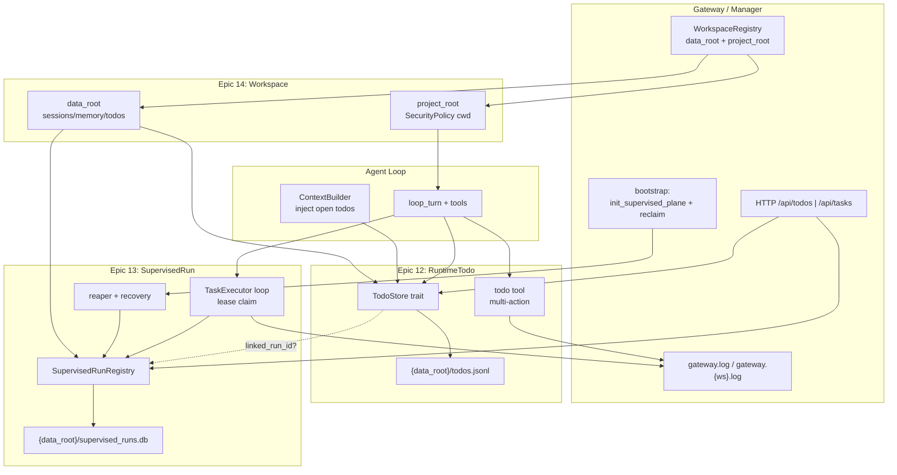

# Agent Diva V1.2 参考设计：方法论 + 精品代码图鉴

**参考项目（只读）：** zeroclaw · codex · openfang  
**目标仓库：** agent-diva-pro  
**关联 Epic：** 12 RuntimeTodo · 13 SupervisedRun · 14 Workspace 双根  
**日期：** 2026-06-27  
**前置调研（避免重复）：**

- [v1.2-ref-zeroclaw-todo-system.md](./v1.2-ref-zeroclaw-todo-system.md) — Epic 12 / control plane
- [v1.2-ref-codex-background-tasks.md](./v1.2-ref-codex-background-tasks.md) — Epic 13 / 队列
- [v1.2-ref-openfang-workspace-isolation.md](./v1.2-ref-openfang-workspace-isolation.md) — Epic 14 / 双根目录
- [prd-harness-v1.2/prd.md](../prds/prd-harness-v1.2/prd.md)
- [harness-engineering-architecture.md](../architecture/harness-engineering-architecture.md)（现有 ADR-001~011）

> 本文档**不是**维度调研复述，而是提炼三项目的**架构设计哲学**、**决策落地路径**与**精品代码图鉴**，并输出 Agent Diva V1.2 的 AD-016~020 草案。

---

## Executive Summary

| 项目 | 设计哲学（一句话） | Diva 最该抄什么 |
|------|-------------------|----------------|
| **zeroclaw** | Control Plane 监督执行单元；trait seam + 可选全局接入 + reaper 补全 flat-file 盲区 | `TaskRegistry` trait、终端态 guard、单工具多 action、双源 reconcile |
| **codex** | 调度与执行分层；SQLite lease claim 做持久队列；Turn 内 SessionTask 与 DB 队列正交 | Memory Jobs 的 `BEGIN IMMEDIATE` claim、`retry_at` 状态机、Trigger/Execution 边界 |
| **openfang** | 双根目录分离私有状态与用户项目；工具层统一 canonicalize 沙箱；Docker 可选 | `data_root`/`project_root`、`resolve_sandbox_path`、`env_clear` 子进程隔离 |

**跨项目共识：** 先定**类型与状态机** → **Store trait** → **Runtime 监督/claim** → **Tool API（多 action）** → **结构化 audit/event**。持久化按 concern 选型：用户意图（Todo）偏 JSONL；执行监督（Run）偏 SQLite；路径隔离靠 canonicalize，不靠 OS chroot。

**Diva V1.2 增量：** 在 ADR-001~011 之上追加 AD-016~020，分别锁定 Epic 12 JSONL RuntimeTodo、Epic 13 SQLite SupervisedRun、Cron 触发边界、Epic 14 双根 Workspace、Gateway 一等公民可观测性。

---

## 一、三项目架构设计哲学

### 1.1 zeroclaw —「监督平面 + 可选接入」

| 维度 | 做法 |
|------|------|
| **Crate 边界** | `zeroclaw-runtime/control_plane/` 独立模块；producer（delegate/spawn）与 consumer（reaper）经 trait 解耦 |
| **Trait seam** | `TaskRegistry` 统一 create/heartbeat/update_status/reconcile_lost；SQLite 为唯一 adapter |
| **可选接入** | `OnceLock<ControlPlaneHandle>`；`control_plane()` 返回 `None` 时 producer no-op（CLI/单测友好） |
| **持久化** | SQLite WAL + flat-file JSON 双写；查询时 registry overlay stale `running` |
| **错误/审计** | 终端态 `update_status` no-op；`Lost`/`TimedOut` 仅 reaper 写入；模块级 `//!` 文档约束 EPIC 扩展方式 |

**核心隐喻：** flat-file 是 Agent 可读快照，control plane 是 daemon 权威索引——二者 reconcile，而非二选一。

### 1.2 codex —「分层队列 + lease 原子 claim」

| 维度 | 做法 |
|------|------|
| **Crate 边界** | `codex-rs/state`（SQLite 领域 + runtime CRUD）与 `core/tasks`（Turn 内 SessionTask）严格分离 |
| **Trait seam** | `SessionTask` 管 Turn 生命周期；DB `jobs` 表管跨 Turn 后台作业；无统一 TaskQueue trait |
| **可选接入** | Memory Jobs 在 Session 启动时 `claim_startup_jobs()`；Agent Jobs 由工具触发 loop |
| **持久化** | `0006_memories.sql` jobs 表：`(kind, job_key)` PK + lease/retry/watermark；Agent Jobs 独立表族 |
| **错误/审计** | claim 失败映射为精确 `Skipped*` outcome；`BackgroundEvent` 侧信道推 UI，不污染 transcript |

**核心隐喻：** Cron/Schedule 是**何时**，Memory Jobs 是**如何跑**——Codex 未把 Turn 内 spawn 持久化，故 Diva Epic 13 应显式补这一层。

### 1.3 openfang —「双根 + 工具层沙箱」

| 维度 | 做法 |
|------|------|
| **Crate 边界** | `openfang-kernel` 脚手架目录；`openfang-runtime` 沙箱与 tool_runner 统一入口 |
| **Trait seam** | 无全局 Workspace trait；`WorkspaceContext` + `SecurityPolicy` 在 spawn 时注入 |
| **可选接入** | Docker `enabled: false` 默认；WASM skill 沙箱与 FS 沙箱正交 |
| **持久化** | Session JSONL 在 `state_dir`；用户项目文件在 `workspace`；`AGENT.json` 记录映射 |
| **错误/审计** | `resolve_sandbox_path` 统一拒绝 `..`；`subprocess_sandbox` 回归测试 #794/#1097 |

**核心隐喻：** `state_dir` = Diva `data_root`；`workspace` = Diva `project_root`——Agent 私有状态永不污染用户 git 仓库。

---

## 二、设计决策落地路径模板

三项目共享的「从想法到可观测」五段式路径：


| 阶段 | 决策内容 | zeroclaw 范例 | codex 范例 | openfang 范例 | Diva V1.2 映射 |
|------|----------|---------------|------------|---------------|----------------|
| **① 类型** | 状态机 + terminal guard | `TaskStatus::is_terminal()` | `Stage1JobClaimOutcome` | N/A（路径 Result） | `TodoStatus` / `RunStatus` |
| **② Store** | async trait + 幂等 create | `TaskRegistry` | `try_claim_stage1_job` SQL | 目录 scaffold | `TodoStore` JSONL / `RunStore` SQLite |
| **③ Runtime** | 启动 recovery + 周期 sweep | `recovery_pass` + `reaper_loop` | `claim_startup_jobs` | `ensure_state_dir` | `SupervisedRunReaper` |
| **④ Tool** | action 枚举减少 schema 膨胀 | `DelegateTool::execute` match action | `spawn_agents_on_csv` | `resolve_file_path` 统一入口 | `todo` / `background_task` 工具 |
| **⑤ 观测** | 结构化 event，GUI 只读 | registry overlay reconcile | `BackgroundEvent` | per-agent logs | `gateway.log` + `/api/*` |

**落地检查清单（每个 Epic 必过）：**

1. 类型是否有 `is_terminal()` 且 store 拒绝覆写？
2. Store 是否可单测 mock（trait object）？
3. Gateway 未启动时是否 degrade（OnceLock None / 跳过 claim）？
4. Tool 描述是否区分「计划跟踪」vs「后台执行」？
5. 状态变迁是否进 `tracing` target + AuditEvent？

---

## 三、精品代码图鉴

> 选取标准：trait seam · 原子写/lease · OnceLock 降级 · canonicalize · 单工具多 action · 结构化 audit · recovery/reaper · **有测试或文档背书**。

### 3.1 zeroclaw（7 处）

#### Z-1 · Control Plane 模块 Facade

**路径：** `C:\Users\Administrator\Desktop\morediva\agent-diva\.workspace\zeroclaw\crates\zeroclaw-runtime\src\control_plane\mod.rs`

```rust
//! * [`task_registry`] — the `TaskRegistry` trait + `TaskRecord`/`TaskKind`/`TaskStatus`.
//! * [`reaper`] — the periodic sweep + one-shot startup crash-recovery pass.
//! * [`global`] — the process-global accessor producers reach the handle through.
```

| 项 | 内容 |
|----|------|
| **模式** | Modular Facade — 监督逻辑与 mega-tool 解耦 |
| **为何值得学** | 模块 `//!` 文档即 ADR；扩展 EPIC 只加字段/trait impl，不重开 supervision |
| **Diva 迁移** | `agent-diva-core/src/supervised/` 目录镜像：`mod.rs` + `registry.rs` + `reaper.rs` + `global.rs` |

#### Z-2 · TaskRegistry trait（稳定 seam）

**路径：** `...\control_plane\task_registry.rs` · **`TaskRegistry`**

```rust
pub fn is_terminal(self) -> bool {
    matches!(self, TaskStatus::Completed | TaskStatus::Failed | ... | TaskStatus::TimedOut)
}
#[async_trait::async_trait]
pub trait TaskRegistry: Send + Sync {
    async fn reconcile_lost(&self, id: &str, now_boot_id: &str) -> anyhow::Result<bool>;
}
```

| 项 | 内容 |
|----|------|
| **模式** | Port–Adapter + 显式终端态 |
| **测试** | `legacy_status_values_still_parse`、`record_loads_without_new_fields` |
| **Diva 迁移** | Epic 13 `SupervisedRunRegistry` trait；Epic 12 `TodoStore` 借鉴 terminal guard |

#### Z-3 · 可选全局接入

**路径：** `...\control_plane\global.rs` · **`control_plane()`**

```rust
static CONTROL_PLANE: OnceLock<ControlPlaneHandle> = OnceLock::new();
pub fn control_plane() -> Option<&'static ControlPlaneHandle> {
    CONTROL_PLANE.get()
}
```

| 项 | 内容 |
|----|------|
| **模式** | Optional Singleton / Fail-Safe Global |
| **测试** | `uninitialized_is_none` |
| **Diva 迁移** | Gateway bootstrap `init_supervised_run_plane()`；CLI 单跑时不初始化 |

#### Z-4 · boot_id 权威判定

**路径：** `...\control_plane\authority.rs` · **`is_authoritative`**

```rust
if !rec.owner_boot_id.is_empty() && rec.owner_boot_id != current_boot_id {
    return true; // prior-boot orphan
}
!pid_is_alive(rec.owner_pid)
```

| 项 | 内容 |
|----|------|
| **模式** | Fail-Closed Authority Guard |
| **测试** | `unstamped_boot_id_with_live_pid_is_not_reclaimed` 等 4 项 |
| **Diva 迁移** | SupervisedRun 记录 `gateway_boot_id`；重启 reclaim stale `running` |

#### Z-5 · 启动 recovery + 周期 reaper

**路径：** `...\control_plane\reaper.rs` · **`recovery_pass` / `sweep`**

```rust
for rec in store.list_running().await? {
    if rec.owner_boot_id != boot_id && store.reconcile_lost(&rec.id, boot_id).await? {
        reclaimed += 1;
    }
}
```

| 项 | 内容 |
|----|------|
| **模式** | Startup Recovery + Periodic Supervisor |
| **测试** | `recovery_reclaims_prior_boot_orphans`、`sweep_times_out_own_stale_task_but_not_fresh` |
| **Diva 迁移** | Epic 13 Gateway 启动 `reclaim_stale_runs()`；Cron **不**承担 reaper |

#### Z-6 · Delegate 单工具多 action + 原子写

**路径：** `...\tools\delegate.rs` · **`DelegateTool::execute` / `write_result_atomic`**

```rust
match action {
    "check_result" => return self.handle_check_result(&args).await,
    "list_results" => return self.handle_list_results().await,
    // ...
}
let tmp_path = result_path.with_extension(format!("json.{}.tmp", uuid::Uuid::new_v4()));
tokio::fs::write(&tmp_path, &bytes).await?;
tokio::fs::rename(&tmp_path, result_path).await?;
```

| 项 | 内容 |
|----|------|
| **模式** | Command Pattern + Write-Rename Atomicity |
| **文档** | `docs/book/src/agents/delegation.md` |
| **Diva 迁移** | Epic 12 `todo` 工具：`create/list/update/complete/cancel/get` 单 schema |

#### Z-7 · 双源 reconcile overlay

**路径：** `...\tools\delegate.rs` · **`handle_check_result`（reconciled 分支）**

Flat-file 仍为 `Running` 时，若 control plane 为 `Lost`/`TimedOut`，返回 registry 真相而非无限轮询。

| 项 | 内容 |
|----|------|
| **模式** | Dual-Store Reconciliation |
| **测试** | `reconciled_loss_label_surfaces_registry_truth` |
| **Diva 迁移** | Epic 12 JSONL 主存 + Epic 13 可选 `linked_run_id` overlay |

---

### 3.2 codex（7 处）

#### C-1 · Memory Jobs lease claim

**路径：** `C:\Users\Administrator\Desktop\morediva\agent-diva\.workspace\codex\codex-rs\state\src\runtime\memories.rs` · **`try_claim_stage1_job`**

```rust
let mut tx = self.pool.begin_with("BEGIN IMMEDIATE").await?;
// INSERT ... ON CONFLICT DO UPDATE ... WHERE (jobs.status != 'running' OR jobs.lease_until <= ...)
```

| 项 | 内容 |
|----|------|
| **模式** | Lease-based Lock + SQL CAS |
| **文档** | L512–527 claim 语义说明 |
| **Diva 迁移** | Epic 13 `SupervisedRunStore::try_claim` 核心模板 |

#### C-2 · 失败重试与 ownership_token

**路径：** `...\memories.rs` · **`mark_stage1_job_failed`**

```rust
UPDATE jobs SET status = 'error', lease_until = NULL,
  retry_at = ?, retry_remaining = retry_remaining - 1
WHERE ... AND ownership_token = ?
```

| 项 | 内容 |
|----|------|
| **模式** | Retry with Backoff + Token Validation |
| **测试** | `stage1_retry_exhaustion_does_not_block_newer_watermark` |
| **Diva 迁移** | `RunRecord.ownership_token`；耗尽 → `failed` + gateway.warn |

#### C-3 · 启动批量 claim

**路径：** `...\memories.rs` · **`claim_stage1_jobs_for_startup`**

扫描候选 → 逐条 `try_claim` → `max_claimed` 封顶，防启动风暴。

| 项 | 内容 |
|----|------|
| **模式** | Work Queue Scanner + Bounded Batch |
| **Diva 迁移** | Gateway `bootstrap_supervised_runs(max_claim=4)` |

#### C-4 · Agent Jobs fan-out loop

**路径：** `...\core\src\tools\handlers\agent_jobs.rs` · **`run_agent_job_loop`**

```rust
if active_items.len() < options.max_concurrency {
    let slots = options.max_concurrency - active_items.len();
    for item in db.list_agent_job_items(..., Some(slots)).await? { ... }
}
```

| 项 | 内容 |
|----|------|
| **模式** | Bounded Worker Pool (Fan-out/Fan-in) |
| **测试** | `core/tests/suite/agent_jobs.rs` |
| **Diva 迁移** | Subagent handler 并发槽位；默认 4，可配置 |

#### C-5 · SessionTask 协作式取消

**路径：** `...\core\src\tasks\mod.rs` · **`SessionTask` + `handle_task_abort`**

```rust
task.cancellation_token.cancel();
select! {
    _ = task.done.notified() => {},
    _ = tokio::time::sleep(Duration::from_millis(100)) => { warn!(...); }
}
task.handle.abort();
```

| 项 | 内容 |
|----|------|
| **模式** | Cooperative Cancellation + Grace Period |
| **测试** | `core/tests/suite/abort_tasks.rs` |
| **Diva 迁移** | Epic 5-B Subagent 取消对齐；与 SupervisedRun cancel API 联动 |

#### C-6 · BackgroundEvent 侧信道

**路径：** `...\core\src\session\mod.rs` · **`notify_background_event`**

```rust
self.send_event(..., EventMsg::BackgroundEvent(BackgroundEventEvent { message })).await;
```

| 项 | 内容 |
|----|------|
| **模式** | Side-channel Observability（不持久化 rollout） |
| **测试** | `background_event_updates_status_header` |
| **Diva 迁移** | `tracing::info!(target="background_task", ...)` + GUI 读 gateway.log |

#### C-7 · Schema 迁移 forward-compatible

**路径：** `...\state\migrations\0006_memories.sql` + `...\migrations.rs` · **`runtime_migrator`**

`jobs` 表复合索引 `(kind, status, retry_at, lease_until)`；`ignore_missing: true` 允许多版本并行。

| 项 | 内容 |
|----|------|
| **模式** | Versioned Migration + Tolerant Migrator |
| **Diva 迁移** | Epic 13 独立 `supervised_runs.db` + 迁移链；与 config migrate 分离 |

---

### 3.3 openfang（7 处）

#### O-1 · resolve_sandbox_path

**路径：** `C:\Users\Administrator\Desktop\morediva\agent-diva\.workspace\openfang\crates\openfang-runtime\src\workspace_sandbox.rs`

```rust
if !canon_candidate.starts_with(&canon_root) {
    return Err(format!("Access denied: path '{}' resolves outside workspace...", user_path));
}
```

| 项 | 内容 |
|----|------|
| **模式** | Chroot-like Canonicalization Boundary |
| **测试** | `test_symlink_escape_blocked`、`test_dotdot_component_blocked` |
| **Diva 迁移** | 增强现有 `SecurityPolicy`；所有 FS 工具经单入口 |

#### O-2 · ensure_state_dir（双根之私有根）

**路径：** `...\openfang-kernel\src\kernel.rs` · **`ensure_state_dir`**

```rust
for subdir in &["sessions", "logs", "memory"] {
    std::fs::create_dir_all(state_dir.join(subdir))?;
}
```

| 项 | 内容 |
|----|------|
| **模式** | Dual Root — Private State Scaffold |
| **测试** | `test_workspace_outside_openfang_stays_clean` (#1097) |
| **Diva 迁移** | `{data_root}/sessions|memory|logs|todos/` |

#### O-3 · ensure_workspace（双根之用户根）

**路径：** `...\kernel.rs` · **`ensure_workspace`**

仅 scaffold `data/`, `output/`, `skills/`；identity 文件不进 user workspace。

| 项 | 内容 |
|----|------|
| **模式** | Dual Root — Minimal User Scaffold |
| **Diva 迁移** | `project_root` 可选指向用户 git 仓库 |

#### O-4 · sandbox_command env 隔离

**路径：** `...\subprocess_sandbox.rs` · **`sandbox_command`**

```rust
cmd.env_clear();
for var in SAFE_ENV_VARS {
    if let Ok(val) = std::env::var(var) { cmd.env(var, val); }
}
```

| 项 | 内容 |
|----|------|
| **模式** | Allowlist / Fail-Safe Defaults |
| **文档** | `docs/security.md` §13 |
| **Diva 迁移** | Epic 11/E14 shell 工具补 `env_clear` + passthrough 白名单 |

#### O-5 · validate_command_allowlist

**路径：** `...\subprocess_sandbox.rs` · **`validate_command_allowlist`**

Shell wrapper 内层命令二次校验，堵 #794 PowerShell bypass。

| 项 | 内容 |
|----|------|
| **模式** | Defense in Depth |
| **测试** | `test_issue_794_powershell_command_bypass_blocked` |
| **Diva 迁移** | `ExecSecurityMode::Allowlist` 可选配置 |

#### O-6 · WorkspaceContext mtime 缓存

**路径：** `...\workspace_context.rs` · **`get_file`**

```rust
if meta.modified() == cached.mtime { return Some(&cached.content); }
// skip files > 32KB
```

| 项 | 内容 |
|----|------|
| **模式** | Cache-Aside + Prompt Stuffing 防护 |
| **Diva 迁移** | Context 注入 open todos 时限制块大小 |

#### O-7 · Docker 可选隔离

**路径：** `...\docker_sandbox.rs` · **`create_sandbox`**

`--cap-drop ALL`、`network=none`、workspace ro-mount；默认 `enabled: false`。

| 项 | 内容 |
|----|------|
| **模式** | Optional Layered Isolation |
| **Diva 迁移** | Epic 14 E14-S8 可选；V1.2 默认目录级即可 |

---

## 四、跨项目对比表

| Concern | zeroclaw | codex | openfang | **Agent Diva V1.2 决策** |
|---------|----------|-------|----------|-------------------------|
| **持久化** | SQLite control_plane + JSON flat-file | SQLite jobs 表（Memory + Agent Jobs） | 目录 + JSONL session | Epic 12 **JSONL**；Epic 13 **SQLite**；Epic 14 按 **data_root** 分目录 |
| **并发** | `parking_lot::Mutex` 包 Connection；锁内无 await | `BEGIN IMMEDIATE` + 全局 running cap | 多 agent 独立 state_dir | TodoStore `tokio::sync::Mutex`；RunStore SQL claim |
| **取消** | `cancel_task` action + status 更新 | `CancellationToken` + 100ms grace + abort handle | Deny/Allowlist exec；无统一 task cancel | Subagent `CancellationToken` + RunStore `cancelled` |
| **沙箱** | 路径靠 workspace 约定 | Turn 内工具策略 | **canonicalize + env_clear + 可选 Docker** | **project_root** 上 SecurityPolicy；可选 Docker E14-S8 |
| **工具注册** | 单工具多 action（delegate） | 专用 agent_job_tool + handlers 模块 | `tool_runner` 统一 `resolve_file_path` | `todo` + `background_task` 多 action；registry 不变 |
| **Recovery** | `recovery_pass` + 60s reaper | 启动 `claim_startup_jobs` | spawn 时 scaffold 目录 | Gateway 启动 reclaim + reaper task |
| **可观测性** | SQLite list + flat-file | `BackgroundEvent`（TUI） | state_dir/logs | **gateway.log 一等公民** + HTTP `/api/todos|tasks` |
| **可选接入** | `OnceLock` None degrade | Session 绑定 | Docker off by default | SupervisedRun plane 仅 Gateway 初始化 |
| **双写/reconcile** | registry overlay flat-file | N/A（单 SQLite 真相） | N/A | Todo JSONL 主存；Run 可选 `linked_run_id` |

---

## 五、Agent Diva V1.2 设计补充（AD-016~020 草案）

> 编号延续 [harness-engineering-architecture.md](../architecture/harness-engineering-architecture.md) ADR-011 之后，正式合入前需架构评审。

### AD-016：RuntimeTodo 采用 JSONL + TodoStore Trait（Epic 12）

**Context：** zeroclaw 无用户 TODO；其 `TaskRegistry` 监督的是执行单元。Diva 需用户/Agent 待办，且 PRD 指定 JSONL。

**Decision：**

- 领域类型：`TodoItem`、`TodoStatus`（pending/active/completed/cancelled）；**禁止**复用 `TaskRecord` 命名。
- `TodoStore` async trait：`create/get/list/update_status`；`update_status` 对 terminal 记录 no-op（借鉴 Z-2）。
- 持久化：`{data_root}/todos.jsonl` append + 内存索引；completed >30d 归档。
- Agent 入口：单工具 `todo` 多 action（借鉴 Z-6）。
- 审计：`AuditEvent::TodoStatusChanged` → `tracing` target `audit`。

**Consequences：** `agent-diva-core/src/todo/`；ContextBuilder turn 前注入 open todos；与 Epic 13 仅通过 `linked_run_id: Option<String>` 弱关联。

---

### AD-017：SupervisedRun 采用 SQLite Control Plane（Epic 13）

**Context：** Codex Memory Jobs 验证了 lease claim；zeroclaw control plane 验证了 reaper + boot_id。

**Decision：**

- 类型：`SupervisedRun`、`RunStatus`（running/completed/failed/cancelled/lost/timed_out）。
- Store：`{data_root}/supervised_runs.db`（WAL）；`try_claim` 用 `BEGIN IMMEDIATE`（借鉴 C-1）。
- 字段：`lease_until`、`ownership_token`、`retry_remaining`、`retry_at`、`gateway_boot_id`。
- Runtime：`TaskExecutor` tokio loop；Gateway 启动 `reclaim_stale_runs` + 60s reaper（借鉴 Z-5）。
- 全局：`OnceLock` 可选（借鉴 Z-3）。

**Consequences：** 新增 `rusqlite` 或 `sqlx`（Epic 13 可接受）；Cron/Heartbeat **不得**阻塞长任务。

---

### AD-018：Trigger 层与 Execution 层硬边界（Epic 13 × Cron）

**Context：** Codex 将 schedule 与 Memory Jobs 分离；Diva Cron 已有 JSON 持久化。

**Decision：**

- **Trigger：** Cron / Heartbeat / 用户消息 → 仅 `enqueue_supervised_run` 或短 agent turn。
- **Execution：** SupervisedRunStore + Executor 负责 fan-out、retry、timeout。
- **硬规则：** Cron callback 阻塞 >5s 视为缺陷；长作业必须 enqueue 后 return。
- Handler 种类：`subagent`、`agent_turn`、`shell`、`cron_bridge`（借鉴 C-4 fan-out）。

**Consequences：** 修改 `CronService` callback 契约；文档明确 Cron schedule ≠ Run `schedule_at`。

---

### AD-019：Workspace 双根 data_root + project_root（Epic 14）

**Context：** openfang #1097；Diva 现有 `Config.workspace` 语义过载。

**Decision：**

- `ActiveWorkspace { id, data_root, project_root }`（借鉴 O-2/O-3）。
- `data_root`：sessions、memory、todos、logs、workspace config。
- `project_root`：filesystem/shell 沙箱根 + cwd（`SecurityPolicy` 绑定）。
- 迁移：config v3；旧 `agents.defaults.workspace` → `default.project_root`。
- 路径：统一 `resolve_sandbox_path` 语义（借鉴 O-1）。

**Consequences：** `WorkspaceRegistry`；Session key 加 `workspace_id` 前缀；附件 index 按 data_root。

---

### AD-020：Gateway 日志一等公民 + GUI 只读（Epic 12/13/14 横切）

**Context：** ADR-003 已锁定 behavioral audit 走 `gateway.log`；Codex BackgroundEvent 证明侧信道价值。

**Decision：**

- 所有 Todo/Run 状态变迁：`tracing::info!(target="audit"|"background_task", ...)`。
- Manager HTTP：`GET /api/todos/*`、`GET /api/tasks/*`、`POST .../cancel`（对齐 Cron API）。
- GUI **只读**消费 log tail + HTTP；**不写** store。
- Debug bundle 含 todo/run 快照（Epic 10 联动）。
- 双源场景：查询 API 返回 JSONL 与 RunStore reconcile 后视图（借鉴 Z-7）。

**Consequences：** 扩展 `agent-diva-manager` state commands；Epic 14 日志文件名 `gateway.{workspace_id}.log.*`。

---

### V1.2 目标架构（Epic 12/13/14 合流）



---

## 六、Epic 12 / 13 / 14 设计要点一页纸

### Epic 12 — RuntimeTodo（5 条）

| # | 要点 | 参考 |
|---|------|------|
| 1 | 命名 **`RuntimeTodo`**，与 `TODOLIST.md` / `SupervisedRun` 三分文档 | zeroclaw 调研 §风险 |
| 2 | JSONL + `TodoStore` trait + terminal guard | Z-2, Z-6 |
| 3 | 单工具 `todo` 六 action；MVP 优先 Context 注入 | Z-6, 已有调研 Story |
| 4 | `{data_root}/todos.jsonl`；归档非 reaper | — |
| 5 | `AuditEvent::TodoStatusChanged` + gateway.log | AD-020 |

**不做：** PRD E12-S5/S6 任务调度器/抢占 → 移至 Epic 13 或 V1.3。

### Epic 13 — SupervisedRun（5 条）

| # | 要点 | 参考 |
|---|------|------|
| 1 | SQLite lease claim + `ownership_token` | C-1, C-2 |
| 2 | Gateway 启动 reclaim + reaper；`OnceLock` 可选 | Z-3, Z-5 |
| 3 | Cron **仅 trigger**；禁止同步长任务 | C-4, AD-018 |
| 4 | Subagent handler 复用 `SubagentManager` + cancel token | C-5 |
| 5 | `/api/tasks` + `background_task` 工具多 action | C-6, AD-020 |

**不做：** 分布式队列；PRD E13-S3 cgroup → V1.2 仅 timeout + concurrency。

### Epic 14 — Workspace 双根（5 条）

| # | 要点 | 参考 |
|---|------|------|
| 1 | **`data_root` + `project_root`** 语义拆分 + config v3 迁移 | O-2, O-3, AD-019 |
| 2 | Session/Memory/Todo @ data_root；工具 @ project_root | openfang 调研 §4 |
| 3 | 统一 `resolve_sandbox_path`；补 shell `env_clear` | O-1, O-4 |
| 4 | CLI `--workspace {id}`；GUI 只读切换 | — |
| 5 | 审计 `gateway.{workspace_id}.log.*` | AD-020 |

**不做：** git worktree 核心机制；Docker 默认关闭（E14-S8 可选）。

---

## 七、与已有 ADR 的关系

| 已有 ADR | V1.2 Epic 扩展 |
|----------|----------------|
| ADR-003 Behavioral Audit | Todo/Run 事件进同一 `gateway.log` |
| ADR-010 Tool Error | `todo`/`background_task` 返回结构化 ToolError |
| ADR-011 Subagent Quality | SupervisedRun subagent handler 继承取消语义 |
| ADR-001 Module trait | `TodoModule` / `SupervisedRunModule` 注册 bootstrap |

---

## 八、结论

三项目**没有**可直接复制的「Agent TODO 系统」；价值在于**设计套路**：trait seam、lease/reaper、双根沙箱、多 action 工具、Gateway 可观测。Agent Diva V1.2 应 **Epic 12 轻（JSONL）+ Epic 13 重（SQLite 监督）+ Epic 14 根（双目录）**，并用 AD-016~020 锁定边界，避免 PRD 中 E12-S5/S6 与 E13 范围膨胀。

**下一步实现顺序（Wave 9→10）：** AD-019 双根（Epic 14 S0）→ AD-016 TodoStore（Epic 12）→ AD-017/018 SupervisedRun（Epic 13）→ AD-020 HTTP/日志贯通。

---

*配套速查表：[v1.2-ref-exemplar-code-index.md](./v1.2-ref-exemplar-code-index.md)*
