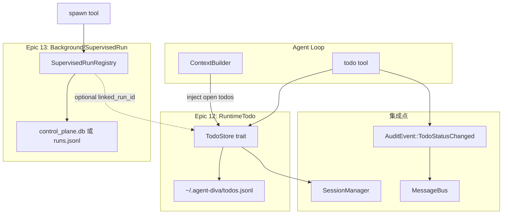

# Agent Diva V1.2 参考调研：zeroclaw TODO/任务系统

**参考项目：** `C:\Users\Administrator\Desktop\morediva\agent-diva\.workspace\zeroclaw`  
**目标系统：** `C:\Users\Administrator\Desktop\morediva\agent-diva-pro`  
**调研维度：** 运行时 TODO / 任务管理（Epic 12）  
**调研日期：** 2026-06-27

---

## Executive Summary

1. **zeroclaw 没有面向 Agent/用户的运行时 TODO 系统**——无 `create_todo`/`list_todos` 等模块；代码中的 `task` 指**后台执行监督**（delegate/subagent），不是用户待办清单。
2. **zeroclaw 的 task 体系 = Control Plane（EPIC A）**：SQLite `control_plane.db` + `TaskRegistry` trait，状态为 `running/completed/failed/cancelled/lost/timed_out`，用于 daemon 级生命周期监督，**不是** GitHub Issues / Todoist 模式。
3. **双写持久化模式可借鉴**：`delegate` 工具将结果写入 `workspace/delegate_results/{uuid}.json`（原子写），同时注册到 SQLite 索引；查询时以 control plane 覆盖 flat file 的 stale `running` 状态。
4. **Agent 可调用的"任务 API"形态**：zeroclaw 用**单工具多 action**（`delegate` / `check_result` / `list_results` / `cancel_task`），而非多个独立工具——适合 Agent Diva Epic 12 的 `todo` 工具设计。
5. **Agent Diva 应严格区分三层命名**：`TODOLIST.md`（项目 backlog 文档）≠ `RuntimeTodo`（Epic 12 用户/Agent 待办）≠ `BackgroundTask`/`SupervisedRun`（Epic 13 执行监督，对标 zeroclaw control plane）。

---

## zeroclaw 发现

### 1. 结论：无运行时 TODO，task = 执行监督

全库搜索 `todo`/`TodoItem`/`create_todo`/`plan_store` 等，**无 Agent 可用的 TODO 模块**。仅有的 "checklist" 是 CLI `quickstart` 交互 UX（`src/main.rs`），与运行时无关。

`docs/dashboard-mcp-per-field-todo.md` 是 Dashboard 迁移 backlog，不是 Agent TODO 系统。

### 2. Control Plane 模块（核心 task 架构）

| 路径 | 职责 |
|------|------|
| `crates/zeroclaw-runtime/src/control_plane/mod.rs` | 模块入口与架构说明 |
| `crates/zeroclaw-runtime/src/control_plane/task_registry.rs` | `TaskRegistry` trait、`TaskRecord`、`TaskKind`、`TaskStatus` |
| `crates/zeroclaw-runtime/src/control_plane/task_store_sqlite.rs` | SQLite 实现（`control_plane.db`） |
| `crates/zeroclaw-runtime/src/control_plane/reaper.rs` | 60s 周期 sweep + 启动 recovery |
| `crates/zeroclaw-runtime/src/control_plane/authority.rs` | `boot_id` + `owner_pid` 权威判定 |
| `crates/zeroclaw-runtime/src/control_plane/boot.rs` | 启动、recovery、spawn reaper |
| `crates/zeroclaw-runtime/src/control_plane/global.rs` | `OnceLock` 全局可选接入 |

**关键类型（`task_registry.rs`）：**

```rust
pub enum TaskKind { Delegate, Subagent, PeerInbox }
pub enum TaskStatus { Running, Completed, Failed, Cancelled, Lost, TimedOut }
pub struct TaskRecord {
    pub id: String,
    pub kind: TaskKind,
    pub agent: String,
    pub status: TaskStatus,
    pub owner_pid: u32,
    pub owner_boot_id: String,
    pub heartbeat_at: Option<String>,
    pub depth: u32,
    pub parent_id: Option<String>,
    // ... delivered, idem_key, principal_id, started_at, finished_at
}
```

**设计要点：**

- **Trait 稳定 seam**：`TaskRegistry` 统一 create/heartbeat/update_status/get/list/reconcile_lost
- **终端态保护**：`update_status` 对已 terminal 记录 no-op，防 reaper TOCTOU
- **Idempotent create**：`ON CONFLICT DO NOTHING`，非 `INSERT OR REPLACE`
- **可选接入**：`control_plane()` 返回 `None` 时 producer 无 op（测试/CLI 兼容）
- **并发**：`parking_lot::Mutex<Connection>`，锁内无 `.await`

**持久化（`task_store_sqlite.rs`）：**

- 路径：`<data_dir>/control_plane.db`
- WAL + `busy_timeout=5000`
- 索引：`idx_tasks_status`、`idx_tasks_agent`

### 3. Delegate 工具：Agent 可见的"任务" API

路径：`crates/zeroclaw-runtime/src/tools/delegate.rs`

**数据流：**

```
Agent 调用 delegate(background=true)
  → 写 delegate_results/{uuid}.json (Running)
  → control_plane.store.create(TaskRecord)
  → tokio::spawn 执行 sub-agent
  → 完成：原子写 JSON + control_plane.update_status
  → Agent 轮询 check_result / list_results / cancel_task
```

**Flat-file 结构：**

```rust
pub struct BackgroundDelegateResult {
    pub task_id: String,
    pub agent: String,
    pub status: BackgroundTaskStatus, // Running|Completed|Failed|Cancelled
    pub output: Option<String>,
    pub error: Option<String>,
    pub started_at: String,
    pub finished_at: Option<String>,
}
```

**原子写（`write_result_atomic`）：** temp 文件 + rename，防半写 JSON。

**多 action 工具 schema：** `delegate` / `check_result` / `list_results` / `cancel_task`。

**Reconciled 查询：** flat file 仍为 `Running` 时，control plane 若为 `Lost`/`TimedOut` 则 overlay 返回，避免 Agent 无限轮询。

### 4. spawn_subagent 集成

路径：`crates/zeroclaw-runtime/src/tools/spawn_subagent.rs`

同步 subagent 也会 `control_plane.store.create/update_status`，主要用于 crash-audit；注释明确**非 orphan recovery**（无 heartbeat 不会被 reaper 误杀）。

### 5. 其他相关但非 TODO 的模式

| 模块 | 说明 |
|------|------|
| `crates/zeroclaw-tools/src/llm_task.rs` | 无工具 LLM 子调用，用于结构化提取，非任务管理 |
| `crates/zeroclaw-runtime/src/identity.rs` | `short_term_goals`/`long_term_goals` 注入 prompt，非结构化 TODO |
| `zeroclaw_infra::acp_session_store` | SQLite session 持久化，被 task store 建模参考 |

### 6. 项目 backlog vs 运行时任务

zeroclaw **未实现**用户/Agent 待办清单。其 "task" 仅指：

- 后台 delegate/subagent **执行单元**
- daemon 级**监督索引**

维护者 backlog 在 GitHub Issues / 内部 docs，与 runtime 完全分离——与 Agent Diva 的 `TODOLIST.md` 定位一致。

---

## 与 Agent Diva 现状差距

| 维度 | zeroclaw | Agent Diva（当前） | Epic 12 目标 |
|------|----------|-------------------|--------------|
| 运行时 TODO | ❌ 无 | ❌ 无 | ✅ `TodoItem` + JSONL |
| 执行监督 | ✅ SQLite control plane | ⚠️ `SubagentManager` 仅内存 `running_tasks` | Epic 13 |
| Agent 工具 API | ✅ delegate 多 action | ⚠️ `spawn` 无持久化/查询 | ✅ `todo` 工具 |
| Session 关联 | subagent session path | ✅ JSONL SessionManager | ✅ `session_id` 关联 |
| 状态审计 | 日志 + store | ✅ `AuditEvent`（无 Todo 变体） | ✅ `TodoStatusChanged` |
| 持久化偏好 | SQLite | JSONL（session/trace） | JSONL `todos.jsonl` |

**Agent Diva 已有可复用基础：**

- `agent-diva-core/src/session/manager.rs` — JSONL + 内存 cache 模式
- `agent-diva-agent/src/context.rs` — system prompt 注入点（可加 RuntimeTodo 块）
- `agent-diva-tools/src/spawn.rs` + `subagent.rs` — Epic 13 后台任务雏形
- `agent-diva-core/src/audit/audit.rs` — 可扩展 `TodoStatusChanged`

**ARCHITECTURE-SPINE.md：** 指定路径不存在；以 `docs/prds/prd-harness-v1.2/prd.md` Epic 12/13 为准。

---

## 方案对比表

| 方案 | 描述 | 优点 | 缺点 | zeroclaw 关联 |
|------|------|------|------|---------------|
| **A. 纯文件 JSONL** | `~/.agent-diva/todos.jsonl`，append + 内存索引 | 零外部依赖；与 Session 一致；易备份/审计 | 并发写需锁；复杂查询需全量扫描 | delegate flat-file 半套；无 SQLite 索引 |
| **B. 轻量 SQLite** | 单库 `todos.db` 或合入现有 DB | 索引查询快；状态原子更新；zeroclaw 已验证 | 新增 `rusqlite`；偏离 JSONL 偏好 | **zeroclaw 生产方案** |
| **C. 外部集成** | GitHub Issues / Notion / Todoist API | 与用户现有工具打通 | 网络依赖、OAuth、延迟、离线差 | zeroclaw 无此路径 |

**推荐：** Epic 12 用 **方案 A（JSONL）**；Epic 13 借鉴 zeroclaw **方案 B（SQLite control plane）** 做执行监督，二者通过 `linked_run_id` 可选关联，**不共用 `TaskRecord` 类型**。

---

## 推荐架构草图



---

## 集成 Agent Loop 的建议 API

### 单工具多 action（借鉴 zeroclaw delegate）

```json
{
  "name": "todo",
  "parameters": {
    "action": { "enum": ["create", "list", "update", "complete", "cancel", "get"] },
    "title": { "type": "string" },
    "description": { "type": "string" },
    "todo_id": { "type": "string" },
    "status": { "enum": ["pending", "active", "completed", "cancelled"] },
    "priority": { "enum": ["low", "normal", "high"] },
    "parent_id": { "type": "string" }
  }
}
```

### 内部 Rust API（`agent-diva-core`）

```rust
pub struct TodoItem { /* 按 E12-S1 */ }
pub enum TodoStatus { Pending, Active, Completed, Cancelled }

#[async_trait]
pub trait TodoStore: Send + Sync {
    async fn create(&self, item: TodoItem) -> Result<()>;
    async fn get(&self, id: &str) -> Result<Option<TodoItem>>;
    async fn list(&self, filter: TodoFilter) -> Result<Vec<TodoItem>>;
    async fn update_status(&self, id: &str, status: TodoStatus) -> Result<()>;
}
```

### Context 注入（`loop_turn.rs` / `context.rs`）

在每 turn 开始前注入当前 session 的 open todos（`pending` + `active`），格式类似 Skills 块：

```
## Open Runtime Todos (session: telegram:12345)
- [pending] Fix login bug (id: todo-abc)
- [active] Write tests (id: todo-def)
```

### CLI / Manager

按 PRD：`agent-diva todo add/list/done/cancel/delete` + `/api/todos/*`。

---

## 风险与命名冲突

| 名称 | 含义 | 风险 |
|------|------|------|
| `TODOLIST.md` | 项目级 backlog（AGENTS.md 协议） | Agent 可能误写用户 runtime todo |
| `RuntimeTodo` / `todo` 工具 | Epic 12 运行时待办 | 与 Epic 13 `Task`/`BackgroundTask` 混淆 |
| zeroclaw `TaskRecord` | 执行监督 | 若直接复用命名，Epic 12/13 边界模糊 |

**缓解措施：**

1. 代码/API 统一用 **`RuntimeTodo`** 或 **`todo`**，禁止 `Task` 指 Epic 12
2. `TODOLIST.md` 在 prompt 中标注为 **"project backlog document, not runtime todos"**
3. Epic 13 用 **`SupervisedRun`** / **`BackgroundRun`**，对标 zeroclaw control plane
4. 工具描述明确：`todo` = 计划跟踪；`spawn` = 后台执行

---

## 建议 Story 拆分（Epic 12 初稿）

| ID | Story | 说明 |
|----|-------|------|
| E12-S1 | `TodoItem` 数据模型 + `TodoStore` trait | 对齐 PRD 字段；terminal 态 guard 借鉴 zeroclaw |
| E12-S2 | JSONL 持久化实现 | `todos.jsonl` + 内存 cache；原子 append/rewrite |
| E12-S3 | `todo` 工具（多 action） | Agent Loop 主入口；参数校验 + UUID |
| E12-S4 | Session 关联 + Context 注入 | `session_id` 写入；`list` filter；turn 前注入 open todos |
| E12-S5 | CLI `agent-diva todo` | add/list/done/cancel/delete |
| E12-S6 | Manager HTTP `/api/todos/*` | GUI/外部集成 |
| E12-S7 | `AuditEvent::TodoStatusChanged` | 状态变更审计 + MessageBus |
| E12-S8 | 归档与轮转 | completed > 30 天 → `todos.archive.YYYY-MM.jsonl` |

**从 Epic 12 移出至 Epic 13（zeroclaw 启示）：** TaskScheduler、任务依赖、抢占、subagent 持久化监督。

---

## 可借鉴 vs 应避免

### 可借鉴

- `TaskRegistry` trait 作为稳定 seam
- 终端态不可覆写（防 reaper/并发 TOCTOU）
- 单工具多 action（减少 tool schema 膨胀）
- 双源 reconcile（JSONL 主存 + 可选监督 overlay，Epic 13）
- `control_plane()` 可选接入（gateway 未启动时 degrade gracefully）
- 原子文件写（temp + rename）

### 应避免

- 将 zeroclaw `TaskRecord` 直接当作用户 TODO
- Epic 12 引入 SQLite（除非 JSONL 性能不足）
- Epic 12 与 Epic 13 合并为一个 `Task` 类型
- 让 Agent 写 `TODOLIST.md` 代替 runtime todo
- 照搬 reaper/Lost/TimedOut 到用户 todo（用户 todo 用 `cancelled` 即可）

---

## 结论

zeroclaw 无 runtime TODO，但其 control plane + delegate 双写模式为 Epic 13 提供了成熟参考。Epic 12 应独立设计 JSONL 驱动的 `RuntimeTodo`，并从 zeroclaw 借鉴 trait 抽象、多 action 工具 API、状态机与审计集成模式；Epic 12 与 Epic 13 必须命名隔离。

### 对 Epic 12 的 3 条最高优先级建议

1. **命名与边界先行**：Epic 12 定义 `RuntimeTodo` + `todo` 工具；Epic 13 定义 `SupervisedRun`，与 `TODOLIST.md` 三者在文档、prompt、API 中明确区分，避免与 zeroclaw 式 execution task 混用。
2. **JSONL + TodoStore trait + 多 action 工具**：持久化用 `todos.jsonl`（对齐 Diva 偏好）；API 形态借鉴 zeroclaw `delegate` 的 create/list/update/complete；trait 设计借鉴 `TaskRegistry` 的 terminal guard 与 idempotent create。
3. **Agent Loop 注入为 MVP 闭环**：S3（工具）+ S4（session 关联 + context 注入）优先于 CLI/HTTP；无注入则 Agent 无法"看见"待办，TODO 系统无法形成闭环。
